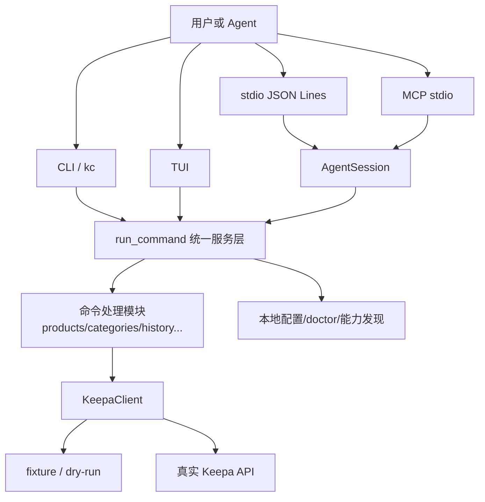

这一页只回答一个入门问题：**Keepa CLI 到底是什么、能做什么、为什么它适合初学者先从这里开始理解**。就仓库当前实现来看，它是一个 **面向 Agent，同时也能给人类开发者直接使用** 的 Keepa API 工具层，提供等价的 `keepa-cli` 与 `kc` 命令入口，并把离线试用、真实请求、TUI、stdio JSON Lines、MCP 等多种使用方式收敛到同一套命令服务之上。对初学者最重要的认识是：你不必先理解全部内部模块，先把它看成“**一个支持离线演练、再逐步接入真实 Keepa 请求的统一命令平台**”即可。 Sources: [README.zh-CN.md](README.zh-CN.md#L14-L23) [pyproject.toml](pyproject.toml#L40-L43) [package.json](package.json#L7-L10)

## 你现在所处的位置

在整套文档目录中，你当前位于“快速开始”的第一个页面 [概览](1-gai-lan)。因此这里不会展开安装细节、配置优先级、具体命令参数、缓存机制、MCP 资源系统或研究图谱实现，而是只给出**全景视角**，帮助你决定下一步该读哪一页。读完本页后，最自然的顺序是先去 [快速上手](2-kuai-su-shang-shou)，再按需要进入安装、配置、离线体验和 Agent 接入相关页面。 Sources: [README.zh-CN.md](README.zh-CN.md#L25-L55) [README.zh-CN.md](README.zh-CN.md#L97-L143) [README.zh-CN.md](README.zh-CN.md#L154-L195)

## 用一句话理解这个项目

**Keepa CLI 把 Keepa API 工作流包装成稳定、可审计、默认离线优先的命令界面。** “默认离线优先”不是宣传语，而是代码和文档里的明确行为：`dry-run` 与 `fixture` 模式不会访问 Keepa，也不会消耗 token；只有显式配置 Keepa token 后，真实请求才会发生。与此同时，CLI、stdio、MCP 与 TUI 不是四套彼此独立的产品，而是围绕同一个 service 层在工作。 Sources: [README.zh-CN.md](README.zh-CN.md#L14-L15) [keepa_cli/service.py](keepa_cli/service.py#L1-L6) [keepa_cli/client.py](keepa_cli/client.py#L62-L118)

## 它最适合哪类初学者

如果你是第一次接触 Keepa API，这个项目最友好的地方在于：你可以先用 fixture 和 dry-run 观察“请求长什么样、返回结构长什么样、预算提示如何表达”，而不必立刻申请 token 或承担真实调用成本；如果你是自动化或 Agent 开发者，则可以直接使用稳定 JSON envelope、`--stdio` 协议或 `--mcp` 服务器，把同一套命令能力接入脚本、代理或长会话系统。 Sources: [README.zh-CN.md](README.zh-CN.md#L97-L115) [keepa_cli/cli.py](keepa_cli/cli.py#L53-L56) [keepa_cli/agent/stdio.py](keepa_cli/agent/stdio.py#L1-L6) [keepa_cli/agent/mcp.py](keepa_cli/agent/mcp.py#L1-L6)

## 这个项目提供了哪些“入口”

从已发布元数据与入口代码看，项目至少提供两层入口。第一层是**安装/执行入口**：Python 包暴露 `keepa-cli` 与 `kc` 两个 console script，npm 包也暴露同名二进制包装器。第二层是**交互协议入口**：常规 CLI 命令、交互式 TUI、stdio JSON Lines、MCP JSON-RPC。对初学者而言，这意味着你可以先把它当普通命令行工具使用，后续再平滑升级到 Agent 集成，而不是重学另一套接口。 Sources: [pyproject.toml](pyproject.toml#L40-L49) [package.json](package.json#L7-L29) [keepa_cli/__main__.py](keepa_cli/__main__.py#L1-L15) [keepa_cli/cli.py](keepa_cli/cli.py#L47-L63)

## 高层架构一图看懂

下面这张图只表达**概览层面的主关系**：不同入口最终都会汇入统一的命令服务，服务再决定是做本地动作、离线返回，还是通过客户端访问 Keepa。阅读这张图时，只需要抓住一个核心模式：**“多入口，单内核”**。 Sources: [keepa_cli/cli.py](keepa_cli/cli.py#L203-L243) [keepa_cli/cli.py](keepa_cli/cli.py#L424-L473) [keepa_cli/service.py](keepa_cli/service.py#L480-L608) [keepa_cli/client.py](keepa_cli/client.py#L62-L146)



## 初学者最该知道的四个产品特征

对刚上手的开发者，项目的价值不在“命令数量很多”，而在于四个设计取向：**统一入口别名、离线优先、Agent 友好、可验证发布**。下面这张表只做入门级比较，不展开参数细节。 Sources: [README.zh-CN.md](README.zh-CN.md#L16-L23) [doctor.py](keepa_cli/doctor.py#L33-L53) [tests/test_cli.py](tests/test_cli.py#L38-L77) [ci.yml](.github/workflows/ci.yml#L1-L36)

| 特征 | 对初学者的意义 | 代码/文档证据 |
|---|---|---|
| `keepa-cli` 与 `kc` 等价 | 可以先记短命令，后续脚本也不需要换心智模型 | Python 与 npm 都暴露双入口 |
| fixture / dry-run 离线优先 | 不必先有 token，也能先学习命令形状 | README 明确说明不访问 Keepa、不消耗 token |
| `--json` / `--stdio` / `--mcp` | 同一能力既能给人用，也能给程序和 Agent 用 | CLI 解析器与协议模块都有独立支持 |
| CI 与 smoke 校验 | 项目不是“只在作者机器上能跑” | GitHub Actions 覆盖单测、fixture sync、npm wrapper smoke |

Sources: [pyproject.toml](pyproject.toml#L40-L43) [package.json](package.json#L7-L29) [README.zh-CN.md](README.zh-CN.md#L14-L23) [.github/workflows/ci.yml](.github/workflows/ci.yml#L12-L36)

## 你会在里面看到哪些核心能力

从 README 与 CLI 定义可以直接验证，Keepa CLI 不只覆盖产品详情，还包含 Finder、Deals、Seller、Best Sellers、Top Sellers、Tracking、Graph Image、本地批处理、报告生成、模板、缓存解释与成本审计等能力。对初学者来说，这说明它不是“某一个 Keepa endpoint 的薄包装”，而是试图把**研究、批量处理、审计与 Agent 接入**组合成一套更完整的工作流表面。 Sources: [README.zh-CN.md](README.zh-CN.md#L16-L23) [keepa_cli/cli.py](keepa_cli/cli.py#L84-L188)

## 为什么说它是“统一服务内核”

这不是抽象口号，而是 `run_command` 的实际职责：它集中接收命令名和参数，然后分发到配置、缓存、工作流、产品、类目、跟踪、Finder、Deals、历史、schema、cassettes、research graph 等处理路径。CLI 层主要做参数解析和模式切换；真正的命令语义由 service 层统一决定。这样的结构对初学者有两个直接好处：一是不同入口行为更一致，二是以后阅读源码时更容易找到“功能真正在哪里执行”。 Sources: [keepa_cli/cli.py](keepa_cli/cli.py#L203-L243) [keepa_cli/service.py](keepa_cli/service.py#L480-L608)

## 项目结构的入门视图

如果你只想先建立“看图识路”的感觉，可以把仓库中的 `keepa_cli` 包粗略理解为下面这几个区块：入口层、协议层、命令层、服务层、本地资源层、界面层。这个表示法不是完整目录镜像，而是给初学者看的**认知地图**。 Sources: [pyproject.toml](pyproject.toml#L44-L49) [keepa_cli/cli.py](keepa_cli/cli.py#L1-L35) [keepa_cli/service.py](keepa_cli/service.py#L1-L6) [keepa_cli/agent/mcp.py](keepa_cli/agent/mcp.py#L1-L6) [keepa_cli/ui/modern_tui.py](keepa_cli/ui/modern_tui.py#L1-L6)

```text
keepa_cli/
├─ cli.py                # 命令行主入口
├─ __main__.py           # python -m keepa_cli 入口
├─ service.py            # 统一命令服务中枢
├─ client.py             # dry-run / fixture / live 请求客户端
├─ commands/             # 具体命令族实现
├─ cli_builders/         # argparse 参数构建
├─ agent/                # stdio、MCP、会话支持
├─ ui/                   # 现代 TUI 与经典 TUI
├─ config.py / doctor.py # 本地配置与环境诊断
└─ fixtures/             # 内置离线样例数据
```

## 对初学者最友好的起点：先离线，再联网

项目文档明确给出了一条低风险学习路径：先执行 fixture 命令观察返回，再用 dry-run 看真实请求规格，最后在配置 token 后执行 live 请求。这个顺序很重要，因为它把“理解命令结构”和“承担调用成本”拆开了。代码里 `KeepaClient.request()` 也确实先处理 dry-run、再处理 fixture、最后才进入真实请求路径，因此这种学习顺序与实现是一致的。 Sources: [README.zh-CN.md](README.zh-CN.md#L97-L115) [keepa_cli/client.py](keepa_cli/client.py#L62-L118)

## TUI 不是另一套系统，而是同一个服务的交互外壳

如果你看到 README 里的 TUI，不要把它理解成与 CLI 平行的全新产品。现代 TUI 模块的文件说明写得很清楚：它负责低噪声 REPL、slash 命令补全，并**复用 Agent-safe command service**；缺少 `prompt_toolkit` 时还能自动回退到标准库界面。因此从概览角度看，TUI 的价值不是“炫技界面”，而是让同一套命令能力更适合持续交互。 Sources: [README.zh-CN.md](README.zh-CN.md#L154-L174) [keepa_cli/ui/modern_tui.py](keepa_cli/ui/modern_tui.py#L1-L6) [keepa_cli/ui/modern_tui.py](keepa_cli/ui/modern_tui.py#L118-L123)

## Agent 支持也不是外挂，而是正式入口

stdio 与 MCP 都有独立实现文件，而且都通过 `AgentSession` 复用命令执行与预算控制能力。stdio 处理单行 JSON 消息并输出事件流；MCP 则实现 `initialize`、`tools/list`、`tools/call`、`resources/list` 等 JSON-RPC 方法。对初学者而言，这意味着该项目不是“先做 CLI，后来临时补了 Agent 接口”，而是从结构上就把 Agent 场景当成一等公民。 Sources: [keepa_cli/agent/stdio.py](keepa_cli/agent/stdio.py#L1-L74) [keepa_cli/agent/mcp.py](keepa_cli/agent/mcp.py#L56-L169) [keepa_cli/agent/session.py](keepa_cli/agent/session.py#L105-L163)

## 配置与健康检查的定位

概览层面只需记住两件事。第一，项目有默认本地配置，至少包含 `default_domain`、`language`、`cache_ttl_seconds`、`max_tokens_per_request` 这些基础项。第二，`doctor` 命令会汇报版本、认证来源、fixture/offline 状态以及双入口约束，帮助你在真正调用前先确认环境是否合理。更具体的优先级、路径和字段细节，建议转到对应的配置页面继续读。 Sources: [keepa_cli/config.py](keepa_cli/config.py#L18-L24) [keepa_cli/config.py](keepa_cli/config.py#L29-L44) [keepa_cli/doctor.py](keepa_cli/doctor.py#L21-L53)

## 一个最小的“能力地图”表

下面这个表适合把项目当成工具箱来看：你不必马上会用每个功能，但可以知道“它大概属于哪一类问题”。 Sources: [README.zh-CN.md](README.zh-CN.md#L16-L23) [keepa_cli/cli.py](keepa_cli/cli.py#L84-L188)

| 能力类别 | 你可以期待什么 | 典型入口形态 |
|---|---|---|
| 产品研究 | 产品详情、比较、摘要、历史 | `products`、`history` |
| 搜索与发现 | 类目、Finder、Deals、Seller、榜单 | `categories`、`finder`、`deals`、`sellers`、`bestsellers` |
| 本地工作流 | 批处理、模板、报告、浏览快照 | `batch`、`templates`、`reports`、`browse` |
| 运维与审计 | 配置、诊断、缓存解释、成本审计 | `config`、`doctor`、`cache`、`audit` |
| Agent 集成 | 机器可读 JSON、stdio、MCP | `--json`、`--stdio`、`--mcp` |

Sources: [README.zh-CN.md](README.zh-CN.md#L116-L143) [keepa_cli/cli.py](keepa_cli/cli.py#L53-L56) [keepa_cli/cli.py](keepa_cli/cli.py#L84-L188)

## 阅读建议：从这里往哪里走

如果你现在的目标是**尽快跑起来**，下一页优先看 [快速上手](2-kuai-su-shang-shou)。如果你还没决定怎么安装，接着看 [双入口安装方式：Python 包与 npm 包装器](3-shuang-ru-kou-an-zhuang-fang-shi-python-bao-yu-npm-bao-zhuang-qi) 与 [模块入口、命令入口与本地开发验证](4-mo-kuai-ru-kou-ming-ling-ru-kou-yu-ben-di-kai-fa-yan-zheng)。如果你最关心“没有 token 能不能先体验”，建议直接去 [fixture 与 dry-run：零成本试用真实工作流形状](8-fixture-yu-dry-run-ling-cheng-ben-shi-yong-zhen-shi-gong-zuo-liu-xing-zhuang)。如果你是做自动化或 Agent 接入，则优先读 [JSON、stdio JSON Lines 与 MCP 三种 Agent 入口](12-json-stdio-json-lines-yu-mcp-san-chong-agent-ru-kou)。 Sources: [README.zh-CN.md](README.zh-CN.md#L25-L55) [README.zh-CN.md](README.zh-CN.md#L97-L143) [README.zh-CN.md](README.zh-CN.md#L176-L195)

## 小结

把这个项目当成一个**以 Keepa API 为核心、以统一服务层为内核、以离线优先和 Agent 友好为使用原则**的工具平台，你就已经掌握了“概览”页最该理解的部分。接下来不需要马上深入源码；先按你的目标选择后续页面，建立可运行体验，再回头看架构，会更容易。 Sources: [README.zh-CN.md](README.zh-CN.md#L14-L23) [keepa_cli/service.py](keepa_cli/service.py#L480-L608) [keepa_cli/agent/session.py](keepa_cli/agent/session.py#L117-L163)