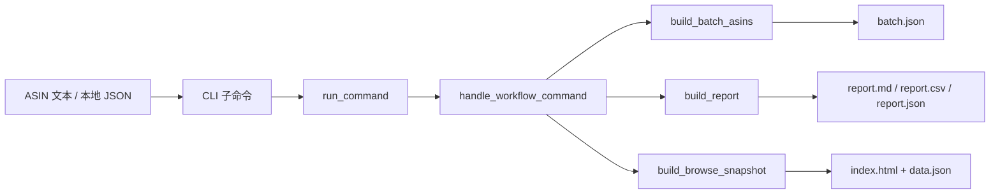
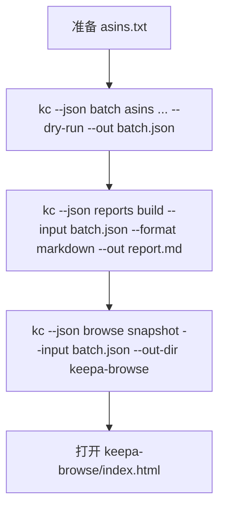

这一页只覆盖 **三个离线优先的本地工作流能力**：`batch asins` 负责把 ASIN 文本清单转换成可审计的批处理计划，`reports build` 负责把批处理或行列表输入转成 Markdown / JSON / CSV 报告，`browse snapshot` 负责把本地 JSON 输入渲染成静态 HTML 浏览快照。它们都通过同一条 CLI → service → workflow handler → 本地文件输出链路执行，并且模块说明明确标注 **不访问真实 Keepa API**，因此适合作为零成本预演、结果归档和本地协作材料生成工具。Sources: [workflows.py](keepa_cli/workflows.py#L1-L6) [workflows.py](keepa_cli/commands/workflows.py#L1-L6) [workflows.py](keepa_cli/cli_builders/workflows.py#L1-L6) [service.py](keepa_cli/service.py#L19-L43)

如果你刚完成 [产品、历史、榜单与 Finder 的最小可运行示例](9-chan-pin-li-shi-bang-dan-yu-finder-de-zui-xiao-ke-yun-xing-shi-li)，这一页告诉你如何把那些单次离线结果，进一步组织成 **批量计划、可读报告和本地浏览页面**；下一步再继续阅读 [命令优先 TUI 的使用方式与经典模式回退](11-ming-ling-you-xian-tui-de-shi-yong-fang-shi-yu-jing-dian-mo-shi-hui-tui) 或 [离线工作流引擎：模板、批处理计划、报告与 HTML 浏览页生成](26-chi-xian-gong-zuo-liu-yin-qing-mo-ban-pi-chu-li-ji-hua-bao-gao-yu-html-liu-lan-ye-sheng-cheng) 会更自然。Sources: [README.zh-CN.md](README.zh-CN.md#L116-L145)

## 先理解这条本地工作流执行链

从第一原则看，这组能力不是“新的远程 API”，而是对 **本地文件输入做结构化变换**。CLI 构建器注册 `browse / batch / templates / reports / audit / workflow` 子命令；命令行解析后，`maybe_run_workflow_command()` 会把参数转换成 `run_command()` 调用；service 层再把 `browse.snapshot`、`batch.asins`、`reports.build` 等命令交给 `handle_workflow_command()`，最后由 `keepa_cli/workflows.py` 中的纯本地函数完成 JSON、Markdown、CSV 或 HTML 输出。Sources: [workflows.py](keepa_cli/cli_builders/workflows.py#L19-L67) [workflows.py](keepa_cli/cli_builders/workflows.py#L69-L137) [workflows.py](keepa_cli/commands/workflows.py#L25-L35) [workflows.py](keepa_cli/commands/workflows.py#L52-L106) [service.py](keepa_cli/service.py#L19-L43) [cli.py](keepa_cli/cli.py#L88-L90)



上图对应的关键事实是：这三类输出都属于 **本地派生物**，而不是远程原始响应；因此它们天然适合被提交到临时目录、交给测试断言、或者作为后续人工/Agent 阅读材料。测试 `test_batch_report_browse_cache_and_cost_workflow()` 也正是按 “ASIN 文件 → batch.json → report.md → browse/index.html” 的顺序验证这条链路。Sources: [tests/test_phase10_workflows.py](tests/test_phase10_workflows.py#L18-L70)

## 相关命令与职责边界

下表只列出与当前页面直接相关的命令。它们都由 `add_workflow_parsers()` 注册，且都属于本地 workflow 命令族。Sources: [workflows.py](keepa_cli/cli_builders/workflows.py#L19-L67)

| 命令 | 输入 | 输出 | 作用 |
|---|---|---|---|
| `batch asins <asin_file>` | 含 ASIN 的文本文件 | 内存结果，或 `--out` 写成 JSON | 生成产品查询批处理计划 |
| `reports build --input <json>` | 批处理 JSON、行列表 JSON、或产品类 JSON | Markdown / JSON / CSV | 生成本地报告 |
| `browse snapshot --input <json>` | JSON envelope、fixture 或报告输入 | `index.html` + `data.json` | 生成静态浏览快照 |
| `templates list` | 无 | 模板清单 | 查看可复用 scaffold |
| `templates show <name>` | 模板名 | 模板 JSON，或 `--out` 写文件 | 快速生成工作流输入样板 |

Sources: [workflows.py](keepa_cli/cli_builders/workflows.py#L20-L49) [workflows.py](keepa_cli/commands/workflows.py#L52-L77) [workflows.py](keepa_cli/workflows.py#L22-L55) [workflows.py](keepa_cli/workflows.py#L226-L242)

## 项目中的实现位置

如果你准备自己扩展这组本地工作流，最值得先看的不是 README，而是下面三个文件：参数注册在 `cli_builders`，命令分发在 `commands`，纯工作流实现集中在 `keepa_cli/workflows.py`。这种分层让你能在不碰 argparse 的情况下新增本地能力，也能在不改 service 核心的情况下增加新的文件型输出。Sources: [workflows.py](keepa_cli/cli_builders/workflows.py#L1-L6) [workflows.py](keepa_cli/commands/workflows.py#L1-L6) [workflows.py](keepa_cli/workflows.py#L1-L6)

```text
keepa_cli/
├── cli_builders/
│   └── workflows.py      # 注册 browse / batch / reports / templates 命令
├── commands/
│   └── workflows.py      # 把 workflow 命令封装为稳定 envelope
└── workflows.py          # 真正执行本地计划、报告、HTML 快照生成
```

这三个层次共同说明：当前页面讲的不是“某个单独脚本”，而是仓库里一个 **正式、可测试、可复用的本地工作流子系统**。Sources: [workflows.py](keepa_cli/cli_builders/workflows.py#L19-L67) [workflows.py](keepa_cli/commands/workflows.py#L25-L35) [workflows.py](keepa_cli/workflows.py#L113-L223) [workflows.py](keepa_cli/workflows.py#L461-L493)

## 典型工作流：从 ASIN 文本到报告和浏览页

最短路径就是 README 给出的三步：先用 `batch asins` 生成计划，再用 `reports build` 生成报告，最后用 `browse snapshot` 生成静态 HTML 页。整个过程可以完全处于 `--dry-run` 或本地 JSON 输入模式，不需要真实 token。Sources: [README.zh-CN.md](README.zh-CN.md#L116-L124) [workflows.py](keepa_cli/workflows.py#L194-L223) [workflows.py](keepa_cli/workflows.py#L461-L493) [workflows.py](keepa_cli/workflows.py#L113-L191)



测试用例验证了一个非常具体的输入形状：`asins.txt` 中允许空行、`#` 注释和重复 ASIN；生成 `batch.json` 后，报告标题可以通过 `--title` 控制，浏览页则会在输出目录中写出 `index.html`。Sources: [tests/test_phase10_workflows.py](tests/test_phase10_workflows.py#L20-L27) [tests/test_phase10_workflows.py](tests/test_phase10_workflows.py#L28-L52)

## 第一步：`batch asins` 如何把文本清单转成计划 JSON

`read_asins()` 的行为很直接：逐行读取 UTF-8 文本，去掉首尾空白，跳过空行和 `#` 开头注释，只取每行逗号前的第一段，转成大写，并按首次出现顺序去重。因此这个命令的真正输入契约不是“任意文本”，而是 **一行一个 ASIN 的列表文件**。Sources: [workflows.py](keepa_cli/workflows.py#L66-L77)

`build_batch_asins()` 会对每个 ASIN 构造一条 `products.get` 任务，并调用 `estimate_request_budget("products.get", {"asin": [asin]})` 计算预算。结果里每条任务都包含 `command`、`params`、`estimated_tokens`、`worst_case_tokens`；总结果还会汇总 `task_count`、`estimated_tokens` 和本地 provenance。若传入 `--out`，整个计划会被写成 JSON 文件。Sources: [workflows.py](keepa_cli/workflows.py#L194-L223)

这意味着 `batch asins` 生成的不是执行结果，而是 **一份可审阅的执行意图清单**。测试中把两个唯一 ASIN 写入文件后，断言 `task_count == 2`，正好证明了去重逻辑和计划生成逻辑是分开的。Sources: [tests/test_phase10_workflows.py](tests/test_phase10_workflows.py#L23-L35)

### `batch asins` 关键参数

| 参数 | 位置 | 含义 | 结果影响 |
|---|---|---|---|
| `asin_file` | 位置参数 | ASIN 文本文件 | 决定任务来源 |
| `--domain` | 可选 | Keepa domain，如 `US` | 写入每个任务的 `params.domain` |
| `--fixture` | 可选 | 指定离线 fixture 名 | 写入每个任务的 `params.fixture` |
| `--dry-run` | 开关 | 只生成计划，不执行 | 写入每个任务的 `params.dry_run` |
| `--out` | 可选 | 输出 JSON 路径 | 将计划落盘 |

Sources: [workflows.py](keepa_cli/cli_builders/workflows.py#L27-L35) [workflows.py](keepa_cli/commands/workflows.py#L59-L66) [workflows.py](keepa_cli/workflows.py#L194-L223)

## 第二步：`reports build` 如何从 JSON 产出 Markdown / JSON / CSV

`build_report()` 先读取输入 JSON，再通过 `_report_rows_from_input()` 提取“可报告行”。它支持三种主要形状：如果顶层有 `tasks`，就把它们当作批处理任务；如果有 `rows`，就直接使用；否则尝试从产品型 payload 中抽取 `asin`、`title`、`brand`、`categoryTree` 等产品行。因此，`reports build` 的定位不是绑定某一种固定 schema，而是对几种常见本地结果做 **统一行视图抽取**。Sources: [workflows.py](keepa_cli/workflows.py#L422-L427) [workflows.py](keepa_cli/workflows.py#L461-L493) [workflows.py](keepa_cli/workflows.py#L94-L110)

Markdown 模式下，报告会生成标题、生成时间、输入来源、行数，以及一个四列表格：`#`、`Command / ASIN`、`Estimate`、`Notes`。行标签优先取 `command`，其次才是 `asin` 或 `title`；备注则优先展示 `domain` 或 `brand`。这解释了为什么用 `batch.json` 作为输入时，Markdown 天然会变成一份“批处理审计表”。Sources: [workflows.py](keepa_cli/workflows.py#L430-L446)

CSV 模式会收集所有行里出现过的字段，排序后作为表头，再逐行输出；JSON 模式则返回一个更显式的对象，包含 `title`、`source`、`generated_at` 与 `rows`。如果指定 `--out`，Markdown / CSV 走文本写入，JSON 走结构化写入；如果不指定 `--out`，则把内容直接放回返回数据中的 `content` 字段。Sources: [workflows.py](keepa_cli/workflows.py#L449-L493)

测试 `test_batch_report_browse_cache_and_cost_workflow()` 里，`reports.build` 从 `batch.json` 生成 `report.md`，并断言文件以 `# Batch Audit` 开头，这说明报告标题确实由 `--title` 控制，而不是固定值。Sources: [tests/test_phase10_workflows.py](tests/test_phase10_workflows.py#L37-L44)

### 三种报告格式对比

| 格式 | 生成函数 | 适合场景 | 输出特点 |
|---|---|---|---|
| `markdown` | `_report_markdown()` | 人工审阅、提交 issue、评审记录 | 带标题与表格，可直接阅读 |
| `csv` | `_report_csv()` | 表格工具导入、二次统计 | 动态字段表头，纯数据导向 |
| `json` | `build_report()` 内联对象 | 程序再消费、后续自动化 | 保留结构和元数据 |

Sources: [workflows.py](keepa_cli/workflows.py#L430-L493)

## 第三步：`browse snapshot` 如何生成静态 HTML 浏览页

`build_browse_snapshot()` 的输入是一个可选 JSON 路径和必填输出目录；如果提供输入文件，它会先加载 JSON，再用 `_product_rows()` 尝试抽取产品行。这里有个重要边界：浏览快照当前面向的是 **产品列表样式的数据**。如果输入里没有可识别的产品行，页面仍会生成，但会显示 `No product rows` 的空态卡片。Sources: [workflows.py](keepa_cli/workflows.py#L113-L121) [workflows.py](keepa_cli/workflows.py#L94-L110) [workflows.py](keepa_cli/workflows.py#L137-L139)

输出目录中会固定写两类文件：`data.json` 保存 `generated_at`、`source` 和抽取后的 `rows`；`index.html` 则内联 CSS，渲染头部信息、产品数量、条形可视区和产品卡片区。卡片展示 `asin`、`brand` 和 `title`，而左侧条形宽度用标题长度相对最大标题长度做比例计算，因此这是一个 **轻量信息浏览页**，不是完整数据分析看板。Sources: [workflows.py](keepa_cli/workflows.py#L119-L179)

返回值里还会包含 `out_dir`、`index`、`data`、`row_count` 以及 local provenance，便于外层调用知道浏览页具体产物在哪里。测试只断言 `(browse_dir / "index.html").is_file()`，说明最核心的交付物就是这个静态入口页。Sources: [workflows.py](keepa_cli/workflows.py#L180-L191) [tests/test_phase10_workflows.py](tests/test_phase10_workflows.py#L45-L52)

### 浏览快照输出结构

| 文件 | 内容 | 作用 |
|---|---|---|
| `index.html` | 内联样式的静态页面 | 本地打开直接浏览 |
| `data.json` | 生成时间、来源、行数据 | 给页面或后续脚本复用 |
| 返回值中的 `provenance` | 本地来源说明 | 标记这是 `local://browse.snapshot` 派生物 |

Sources: [workflows.py](keepa_cli/workflows.py#L119-L121) [workflows.py](keepa_cli/workflows.py#L140-L191)

## 一个最小可运行示例

下面这组命令就是仓库 README 中记录的最短离线工作流。第一条命令只建立批处理计划，不执行远程请求；第二条命令把计划整理成 Markdown；第三条命令把同一个 JSON 输入转换成浏览页面。Sources: [README.zh-CN.md](README.zh-CN.md#L116-L124)

| 之前 | 之后 |
|---|---|
| 只有 `asins.txt` 文本清单 | 得到 `batch.json`、`report.md`、`keepa-browse/index.html` 三类可复用产物 |

Sources: [README.zh-CN.md](README.zh-CN.md#L116-L124) [tests/test_phase10_workflows.py](tests/test_phase10_workflows.py#L20-L52)

```powershell
kc --json batch asins .\asins.txt --domain US --dry-run --out .\batch.json
kc --json reports build --input .\batch.json --format markdown --out .\report.md
kc --json browse snapshot --input .\batch.json --out-dir .\keepa-browse
```

这三步之所以适合作为中级开发者的“本地流水线起点”，是因为它们把 **输入清单、计划结果、阅读材料、浏览页面** 明确拆开了；你可以先审阅计划，再决定是否把其中任务真正交给别的命令执行。Sources: [workflows.py](keepa_cli/workflows.py#L194-L223) [workflows.py](keepa_cli/workflows.py#L461-L493) [workflows.py](keepa_cli/workflows.py#L113-L191)

## 用模板更快地产生输入骨架

虽然本页聚焦批处理、报告和浏览页，但模板命令与它们直接配套，因为 `TEMPLATES` 内置了 `finder-basic`、`deals-basic`、`tracking-add` 和 `batch-report` 等样板。尤其 `batch-report` 模板已经把 “批处理 ASIN → 生成 Markdown 报告” 这两步命令串了出来，适合团队内统一示例。Sources: [workflows.py](keepa_cli/workflows.py#L22-L55)

`templates list` 只返回模板清单；`templates show <name>` 会返回完整模板对象，必要时还能通过 `--out` 直接写成 JSON 文件。测试里验证了 `templates.list` 至少包含 `finder-basic`，并且 `templates.show tracking-add` 返回 `kind == "tracking.batch"`。Sources: [workflows.py](keepa_cli/workflows.py#L226-L242) [tests/test_phase10_workflows.py](tests/test_phase10_workflows.py#L72-L80)

### 内置模板概览

| 模板名 | kind | 描述中的意图 |
|---|---|---|
| `finder-basic` | `finder.selection` | Product Finder 选择脚手架 |
| `deals-basic` | `deals.selection` | Deals 查询脚手架 |
| `tracking-add` | `tracking.batch` | Tracking 批量载荷脚手架 |
| `batch-report` | `batch.report` | ASIN 批处理后生成 Markdown 报告 |

Sources: [workflows.py](keepa_cli/workflows.py#L22-L55) [workflows.py](keepa_cli/workflows.py#L226-L232)

## 常见输入与输出形状

对当前页面最重要的 schema 心智模型只有三个：`batch asins` 产生的是顶层带 `tasks` 的计划 JSON；`reports build` 消费 `tasks`、`rows` 或产品型 payload，并输出文本或结构化内容；`browse snapshot` 更偏向消费可抽取产品行的输入，并产出 `index.html` 与 `data.json`。Sources: [workflows.py](keepa_cli/workflows.py#L194-L223) [workflows.py](keepa_cli/workflows.py#L422-L493) [workflows.py](keepa_cli/workflows.py#L113-L191)

| 阶段 | 主要输入字段 | 主要输出字段 / 文件 |
|---|---|---|
| `batch asins` | `asin_file`, `domain`, `dry_run`, `fixture` | `task_count`, `estimated_tokens`, `tasks[]`, 可选 `output.path` |
| `reports build` | `input`, `format`, `title` | `format`, `row_count`, `content` 或 `output.path` |
| `browse snapshot` | `input`, `out_dir`, `title` | `index`, `data`, `row_count`, `out_dir` |

Sources: [workflows.py](keepa_cli/commands/workflows.py#L52-L77) [workflows.py](keepa_cli/workflows.py#L180-L223) [workflows.py](keepa_cli/workflows.py#L474-L493)

## 排错指南：为什么结果和预期不一样

如果 `batch asins` 的任务数比你想象中少，首先看输入文件是否有重复 ASIN、空行或 `#` 注释，因为这些都会被显式过滤。其次，命令只取每行逗号前的第一段，所以 CSV 风格行里后面的说明文字不会进入 ASIN 列表。Sources: [workflows.py](keepa_cli/workflows.py#L66-L77) [tests/test_phase10_workflows.py](tests/test_phase10_workflows.py#L20-L35)

如果 `reports build` 输出内容为空或行数不对，优先检查输入 JSON 是否包含 `tasks` 或 `rows`；否则它只会退回到产品抽取逻辑，而这个逻辑仅识别 `body.products` 中的产品对象。也就是说，把任意 JSON 丢给 `reports build` 并不保证一定得到有意义的表格。Sources: [workflows.py](keepa_cli/workflows.py#L94-L110) [workflows.py](keepa_cli/workflows.py#L422-L493)

如果 `browse snapshot` 生成了 HTML 但页面是空态，不代表命令失败，更常见的原因是输入 JSON 里没有可抽取的产品行。代码明确会在无产品时写入一张 `No product rows` 卡片，因此“空页面但命令成功”是受支持行为。Sources: [workflows.py](keepa_cli/workflows.py#L123-L139) [workflows.py](keepa_cli/workflows.py#L180-L191)

### 快速排错表

| 现象 | 已验证原因 | 应检查内容 |
|---|---|---|
| `task_count` 偏少 | ASIN 去重、过滤空行/注释 | `asins.txt` 实际内容 |
| 报告行数为 0 或很少 | 只识别 `tasks` / `rows` / `body.products` | 输入 JSON 形状 |
| 浏览页为空态 | 没有产品行时仍会生成页面 | 输入是否真含产品列表 |

Sources: [workflows.py](keepa_cli/workflows.py#L66-L77) [workflows.py](keepa_cli/workflows.py#L94-L110) [workflows.py](keepa_cli/workflows.py#L422-L493)

## 这页之后建议读什么

如果你想把这套本地工作流放进更高层的交互环境，下一页应读 [命令优先 TUI 的使用方式与经典模式回退](11-ming-ling-you-xian-tui-de-shi-yong-fang-shi-yu-jing-dian-mo-shi-hui-tui)。如果你更关心这些本地工作流的实现哲学、模板与引擎抽象，再继续阅读 [离线工作流引擎：模板、批处理计划、报告与 HTML 浏览页生成](26-chi-xian-gong-zuo-liu-yin-qing-mo-ban-pi-chu-li-ji-hua-bao-gao-yu-html-liu-lan-ye-sheng-cheng)。如果你的下一步是把单条命令输出转换成更丰富的数据源，再回看 [产品、历史、榜单与 Finder 的最小可运行示例](9-chan-pin-li-shi-bang-dan-yu-finder-de-zui-xiao-ke-yun-xing-shi-li) 会更合适。Sources: [README.zh-CN.md](README.zh-CN.md#L97-L145)