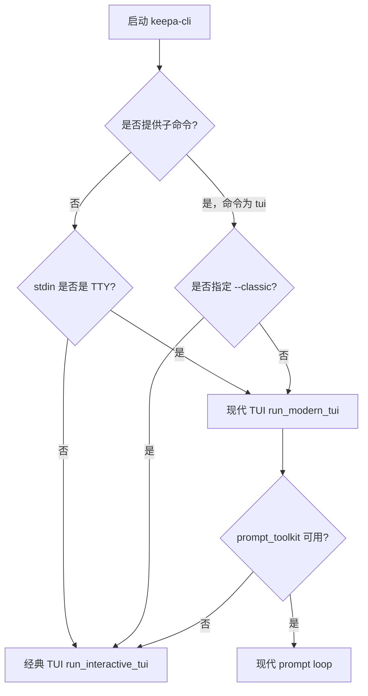
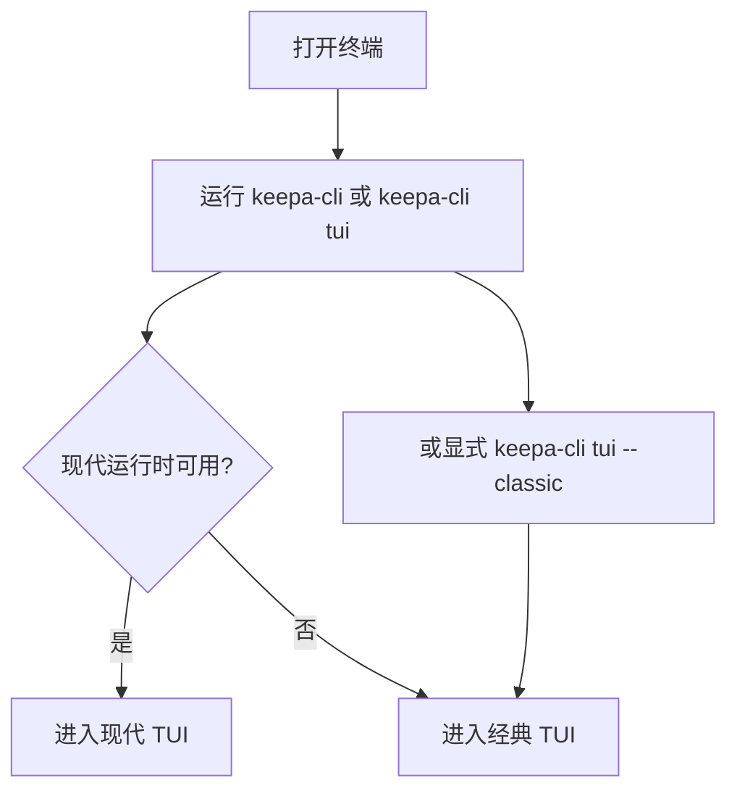

这一页只讲一件事：**如何把 Keepa CLI 当作一个面向人的交互工作台来使用**，以及当现代终端能力不可用时，它如何**自动回退到经典模式**。对初学者而言，最重要的理解是：TUI 不是另一套业务系统，它只是把你输入的 slash 命令翻译成同一个 `run_command(...)` 服务调用，再把结果渲染成适合阅读的摘要。Sources: [keepa_cli/ui/modern_tui.py](keepa_cli/ui/modern_tui.py#L18-L22) [keepa_cli/ui/tui.py](keepa_cli/ui/tui.py#L1-L6)

## 先建立心智模型：TUI 只是“命令外壳”

命令优先 TUI 的核心思想是：**用户先想命令，再通过界面执行命令**，而不是先点菜单再猜系统做了什么。无论你看到的是现代 `prompt_toolkit` 风格界面，还是标准库实现的经典界面，二者都会把 `/doctor`、`/product ...`、`/history ...` 这类 slash 命令解析为内部服务命令，例如 `doctor`、`products.get`、`history.trend`，最终统一交给 `run_command(...)` 执行。Sources: [keepa_cli/ui/tui.py](keepa_cli/ui/tui.py#L210-L285) [keepa_cli/ui/tui.py](keepa_cli/ui/tui.py#L442-L459) [keepa_cli/ui/modern_tui.py](keepa_cli/ui/modern_tui.py#L644-L652)

```mermaid
flowchart TD
    A[用户输入 slash 命令] --> B[现代 TUI 或经典 TUI]
    B --> C[slash 解析器 _slash_to_command]
    C --> D[内部服务命令 + 参数]
    D --> E[run_command]
    E --> F[结构化 payload]
    F --> G[人类摘要渲染]
    F --> H[/json 查看完整响应]
```
Sources: [keepa_cli/ui/tui.py](keepa_cli/ui/tui.py#L210-L285) [keepa_cli/ui/tui.py](keepa_cli/ui/tui.py#L424-L459) [keepa_cli/ui/modern_tui.py](keepa_cli/ui/modern_tui.py#L633-L653)

## 入口规则：默认优先现代 TUI，必要时回退经典模式

CLI 入口的选择规则非常直接。**当你没有显式给出子命令时**，如果当前输入不是交互终端而是管道输入，程序会进入经典交互会话；如果是交互终端，则优先启动现代 TUI。**当你显式执行 `tui` 子命令时**，默认仍然尝试现代 TUI，但你可以用 `--classic` 强制回退到标准库界面。Sources: [keepa_cli/cli.py](keepa_cli/cli.py#L441-L459)

这意味着你可以把它理解成两层策略：第一层是**“有没有命令”**，第二层是**“有没有现代终端能力”**。如果用户在普通终端直接运行 `keepa-cli`，项目倾向于给出更现代的 REPL；如果是在脚本、重定向或最小环境里运行，则更保守地走经典模式。Sources: [keepa_cli/cli.py](keepa_cli/cli.py#L441-L459) [keepa_cli/ui/modern_tui.py](keepa_cli/ui/modern_tui.py#L658-L662) [keepa_cli/ui/tui.py](keepa_cli/ui/tui.py#L462-L491)


Sources: [keepa_cli/cli.py](keepa_cli/cli.py#L441-L459) [keepa_cli/ui/modern_tui.py](keepa_cli/ui/modern_tui.py#L658-L662)

## 你会实际用到的 3 种启动方式

对于初学者，最常用的三种方式如下表。它们的差别不在业务能力，而在**界面运行时和交互体验**。Sources: [keepa_cli/cli.py](keepa_cli/cli.py#L61-L63) [keepa_cli/cli.py](keepa_cli/cli.py#L441-L459) [tests/test_cli.py](tests/test_cli.py#L529-L560)

| 启动方式 | 典型命令 | 运行结果 | 适合什么场景 |
|---|---|---|---|
| 默认启动 | `keepa-cli` | 交互终端下优先现代 TUI | 日常手工使用 |
| 显式启动 TUI | `keepa-cli tui` | 默认优先现代 TUI | 想明确表达“进入工作台” |
| 强制经典模式 | `keepa-cli tui --classic` | 标准库 TUI | 缺少 `prompt_toolkit`、脚本化、兼容性优先 |
Sources: [keepa_cli/cli.py](keepa_cli/cli.py#L61-L63) [keepa_cli/cli.py](keepa_cli/cli.py#L441-L459) [tests/test_cli.py](tests/test_cli.py#L529-L553)

## 现代 TUI 和经典 TUI 的差异，应该怎么看

现代 TUI 由 `prompt_toolkit` 提供能力，重点是**补全、状态栏、清屏、最近 JSON 回看、轻量语义色**。经典 TUI 则只依赖标准库，重点是**稳定、兼容、可在最小环境中工作**。两者都不是“功能多或少”的区别，而是“交互舒适度”的区别。Sources: [keepa_cli/ui/modern_tui.py](keepa_cli/ui/modern_tui.py#L540-L585) [keepa_cli/ui/modern_tui.py](keepa_cli/ui/modern_tui.py#L593-L662) [keepa_cli/ui/tui.py](keepa_cli/ui/tui.py#L442-L491)

| 维度 | 现代 TUI | 经典 TUI |
|---|---|---|
| 依赖 | `prompt_toolkit` | Python 标准库 |
| 启动策略 | 默认优先 | 自动回退或显式 `--classic` |
| 命令输入 | REPL，支持补全 | REPL，纯文本输入 |
| 状态展示 | 底部状态栏 | 顶部欢迎面板 |
| JSON 回看 | `/json` | 无专门会话命令 |
| 清屏 | `/clear` | 无 |
| 输出风格 | 彩色摘要 + 命令回显 | 面板式摘要 |
Sources: [keepa_cli/ui/modern_tui.py](keepa_cli/ui/modern_tui.py#L486-L537) [keepa_cli/ui/modern_tui.py](keepa_cli/ui/modern_tui.py#L593-L662) [keepa_cli/ui/tui.py](keepa_cli/ui/tui.py#L89-L139) [keepa_cli/ui/tui.py](keepa_cli/ui/tui.py#L442-L491)

## 相关代码位置一眼看清

如果你想在仓库里定位这一页讲到的内容，核心文件非常集中，几乎都围绕 CLI 入口、现代 TUI、经典 TUI 和对应测试展开。Sources: [keepa_cli/cli.py](keepa_cli/cli.py#L47-L63) [keepa_cli/ui/modern_tui.py](keepa_cli/ui/modern_tui.py#L1-L6) [keepa_cli/ui/tui.py](keepa_cli/ui/tui.py#L1-L6)

```text
keepa_cli/
├── cli.py                 # 入口选择：默认、tui、--classic、无命令时的行为
└── ui/
    ├── modern_tui.py      # prompt_toolkit 现代 REPL、补全、状态栏、/json
    └── tui.py             # 标准库经典 TUI、slash 解析、面板输出

tests/
├── test_cli.py            # CLI 入口与 tui/classic 路径验证
├── test_modern_tui.py     # 现代 TUI 能力与回退验证
└── test_tui.py            # 经典 TUI 会话与摘要验证
```
Sources: [keepa_cli/cli.py](keepa_cli/cli.py#L47-L63) [tests/test_cli.py](tests/test_cli.py#L529-L560) [tests/test_modern_tui.py](tests/test_modern_tui.py#L41-L199) [tests/test_tui.py](tests/test_tui.py#L15-L118)

## 第一步：直接进入工作台

最简单的上手方式是在终端里直接运行 `keepa-cli`。如果当前环境是正常交互终端，它会优先进入现代 TUI；如果你想明确表达自己的意图，也可以运行 `keepa-cli tui`。如果你知道自己处于兼容性较弱的环境，或者就是想看经典界面，则运行 `keepa-cli tui --classic`。Sources: [keepa_cli/cli.py](keepa_cli/cli.py#L441-L459) [tests/test_cli.py](tests/test_cli.py#L529-L553)


Sources: [keepa_cli/cli.py](keepa_cli/cli.py#L441-L459) [keepa_cli/ui/modern_tui.py](keepa_cli/ui/modern_tui.py#L658-L662)

## 第二步：先跑 `/doctor`，确认当前状态

无论是现代模式还是经典模式，**最适合第一条输入的命令都是 `/doctor`**。经典 TUI 的欢迎面板本身就把 `/doctor` 放在检查路径里；现代 TUI 的命令目录也把它归在 `Inspect` 分组的第一项。它的作用不是请求商品数据，而是帮你确认认证来源、离线 fixture 状态和版本信息。Sources: [keepa_cli/ui/tui.py](keepa_cli/ui/tui.py#L103-L139) [keepa_cli/ui/modern_tui.py](keepa_cli/ui/modern_tui.py#L136-L146) [keepa_cli/ui/tui.py](keepa_cli/ui/tui.py#L292-L299)

在经典 TUI 中，`/doctor` 的结果会被渲染成面板摘要，至少告诉你认证来源和 fixture 是否可用；在现代 TUI 中，它会以简短彩色摘要输出，并保留完整 payload 供 `/json` 继续查看。Sources: [keepa_cli/ui/tui.py](keepa_cli/ui/tui.py#L424-L459) [keepa_cli/ui/modern_tui.py](keepa_cli/ui/modern_tui.py#L314-L338) [keepa_cli/ui/modern_tui.py](keepa_cli/ui/modern_tui.py#L636-L642)

## 第三步：从 slash 命令开始，而不是从子命令语法开始

这套 TUI 的重点是**把 CLI 命令家族压缩成更易记的 slash 命令**。例如 `/product ...` 会映射到 `products.get`，`/history ...` 映射到 `history.trend`，`/bestsellers ...` 映射到 `bestsellers.get`，`/token ...` 与 `/login ...` 都映射到 `config.set-token`。对初学者来说，这比记住多层子命令更轻量。Sources: [keepa_cli/ui/tui.py](keepa_cli/ui/tui.py#L217-L284)

下面这张“输入前后对照表”最适合快速建立感觉：左侧是你在 TUI 里输入的内容，右侧是系统内部真正执行的服务命令。Sources: [keepa_cli/ui/tui.py](keepa_cli/ui/tui.py#L217-L284) [tests/test_modern_tui.py](tests/test_modern_tui.py#L94-L124)

| TUI 输入 | 内部服务命令 | 关键参数形状 |
|---|---|---|
| `/doctor` | `doctor` | 无 |
| `/capabilities` | `capabilities` | 无 |
| `/product B001GZ6QEC --fixture product_B001GZ6QEC.json` | `products.get` | `asin`, `fixture` |
| `/history B001GZ6QEC --series amazon --fixture product_history_B001GZ6QEC.json` | `history.trend` | `asin`, `series`, `fixture` |
| `/token <64-char Keepa key>` | `config.set-token` | `token` |
| `/max-tokens 250` | `config.set-max-tokens` | `max_tokens` |
| `/language zh` | `config.set-language` | `language` |
| `/batch asins.txt --domain US --dry-run` | `batch.asins` | `asin_file`, `dry-run` |
Sources: [keepa_cli/ui/tui.py](keepa_cli/ui/tui.py#L217-L284) [tests/test_modern_tui.py](tests/test_modern_tui.py#L94-L124)

## 第四步：优先使用离线安全示例命令

经典 TUI 的欢迎面板和现代 TUI 的命令目录都在引导你从**低成本、离线优先**的命令开始，例如带 `--fixture` 或 `--dry-run` 的产品、历史、榜单和 Finder 示例。这些命令更适合第一次体验，因为它们不会要求你立刻进入真实 Keepa API 请求流程。Sources: [keepa_cli/ui/tui.py](keepa_cli/ui/tui.py#L103-L139) [keepa_cli/ui/modern_tui.py](keepa_cli/ui/modern_tui.py#L147-L219)

例如，现代 TUI 命令目录中内置了 `/product B001GZ6QEC --fixture product_B001GZ6QEC.json`、`/history B001GZ6QEC --series amazon --fixture product_history_B001GZ6QEC.json`、`/finder --selection-file keepa_cli/fixtures/finder_selection.json --dry-run` 这类命令；测试也验证了这些路径会得到结构化摘要，而不是直接把整块 JSON 倒给你。Sources: [keepa_cli/ui/modern_tui.py](keepa_cli/ui/modern_tui.py#L177-L219) [tests/test_tui.py](tests/test_tui.py#L16-L66)

## 现代 TUI 的使用方式：把它当作“带补全的命令台”

现代 TUI 启动后，会显示简短启动信息，包括当前认证状态、schema 版本，并在缺少 token 或仍使用默认预算时给出醒目的提示。它不是一个满屏幕应用，而是一个**低噪声 REPL**：你输入命令、看摘要、必要时查看上一次 JSON。Sources: [keepa_cli/ui/modern_tui.py](keepa_cli/ui/modern_tui.py#L511-L521) [keepa_cli/ui/modern_tui.py](keepa_cli/ui/modern_tui.py#L611-L653)

它支持三类特别实用的交互能力。第一，**slash 自动补全**，会根据命令前缀、子序列匹配、标签和服务命令名称返回候选项。第二，**底部状态栏**，会显示认证状态、默认域名、最大 token 预算、语言和 `/help /json /quit` 提示。第三，**会话内 JSON 回看**，输入 `/json` 就能查看上一条完整响应。Sources: [keepa_cli/ui/modern_tui.py](keepa_cli/ui/modern_tui.py#L252-L277) [keepa_cli/ui/modern_tui.py](keepa_cli/ui/modern_tui.py#L486-L505) [keepa_cli/ui/modern_tui.py](keepa_cli/ui/modern_tui.py#L633-L642)

## 现代 TUI 中最重要的会话命令

如果你只记几个会话命令，建议先记下面这些。它们都直接由现代 prompt loop 处理，而不是转给业务服务层。Sources: [keepa_cli/ui/modern_tui.py](keepa_cli/ui/modern_tui.py#L623-L642) [keepa_cli/ui/modern_tui.py](keepa_cli/ui/modern_tui.py#L524-L537)

| 会话命令 | 作用 | 说明 |
|---|---|---|
| `/help` | 显示命令帮助 | 展开命令目录和分组 |
| `/json` | 查看上一条完整 JSON | 默认平时只显示摘要 |
| `/clear` | 清屏并重绘启动信息 | 只在现代 TUI 中可用 |
| `/quit` | 退出会话 | `quit`、`exit` 也可 |
Sources: [keepa_cli/ui/modern_tui.py](keepa_cli/ui/modern_tui.py#L524-L537) [keepa_cli/ui/modern_tui.py](keepa_cli/ui/modern_tui.py#L623-L642)

## 经典 TUI 的使用方式：把它当作“面板化命令终端”

经典模式的风格更朴素。它启动时先输出欢迎面板、API Radar 和 Command Palette，然后逐行读取输入。每当你输入一条 slash 命令，系统就调用 `run_command(...)`，再把结果包装成一个“结果”面板输出。Sources: [keepa_cli/ui/tui.py](keepa_cli/ui/tui.py#L89-L139) [keepa_cli/ui/tui.py](keepa_cli/ui/tui.py#L442-L459)

它的优点是依赖极少、行为稳定，而且在非 TTY 输入下也能工作：如果 `stdin` 不是交互终端，它会直接读取输入流中的每一行命令，逐条执行后输出结果。这使经典 TUI 既能服务人工操作，也能作为轻量脚本会话壳使用。Sources: [keepa_cli/ui/tui.py](keepa_cli/ui/tui.py#L462-L466) [tests/test_tui.py](tests/test_tui.py#L95-L106)

## 为什么说它是“命令优先”，不是“菜单优先”

因为无论现代还是经典模式，真正稳定的交互单位都是**slash 命令文本**，而不是 UI 控件。现代 TUI 的命令目录本质上只是补全和提示数据；经典 TUI 的欢迎面板本质上只是命令参考卡片。用户学习成本主要投入在“我要执行什么命令”，而不是“我要在哪里点这个功能”。Sources: [keepa_cli/ui/modern_tui.py](keepa_cli/ui/modern_tui.py#L136-L219) [keepa_cli/ui/modern_tui.py](keepa_cli/ui/modern_tui.py#L524-L537) [keepa_cli/ui/tui.py](keepa_cli/ui/tui.py#L103-L161)

这也是为什么项目在现代 TUI 里仍然保留了命令转录输出，例如执行后会回显类似 `$ kc /doctor` 的内容；测试也明确验证了默认不会直接倾倒完整 JSON，而是显示摘要并附带 `json: /json` 提示。Sources: [keepa_cli/ui/modern_tui.py](keepa_cli/ui/modern_tui.py#L650-L653) [tests/test_modern_tui.py](tests/test_modern_tui.py#L174-L199)

## 经典模式回退：到底在什么时候发生

回退并不神秘，规则很清楚。**第一种回退**：现代 TUI 启动时发现 `prompt_toolkit` 不可用，则直接调用经典 `run_interactive_tui(...)`。**第二种回退**：用户显式传入 `tui --classic`。**第三种偏经典路径**：当没有子命令且输入来自管道时，CLI 直接走经典交互会话，而不是现代 REPL。Sources: [keepa_cli/ui/modern_tui.py](keepa_cli/ui/modern_tui.py#L658-L662) [keepa_cli/cli.py](keepa_cli/cli.py#L451-L458)

测试对这些路径做了明确验证：现代 TUI 缺少依赖时会回退到经典 TUI；`--json tui --classic` 只返回界面元数据而不会真正启动交互；`tui --classic` 配合管道输入会保持经典会话并能正常执行 `/doctor`。Sources: [tests/test_modern_tui.py](tests/test_modern_tui.py#L164-L173) [tests/test_cli.py](tests/test_cli.py#L529-L553)

## `tui --json` 有什么用

一个很容易忽略但很有价值的设计是：`tui` 子命令在 `--json` 模式下**不会进入交互界面**，而是返回一个描述 TUI 能力的 envelope，包括首选运行时、回退运行时、当前选中的运行时、schema 版本以及命令目录。这样做的意义是，其他程序或 Agent 可以先“探测”人类界面的能力，而不用真的启动一个 REPL。Sources: [keepa_cli/cli.py](keepa_cli/cli.py#L212-L220) [keepa_cli/ui/modern_tui.py](keepa_cli/ui/modern_tui.py#L222-L239)

| 命令 | 结果 | 适用场景 |
|---|---|---|
| `keepa-cli --json tui` | 返回 TUI 元数据 | 外部程序探测交互能力 |
| `keepa-cli --json tui --classic` | 返回经典模式被选中的元数据 | 明确要求经典运行时 |
| `keepa-cli tui` | 真正启动交互界面 | 人类直接使用 |
Sources: [keepa_cli/cli.py](keepa_cli/cli.py#L212-L220) [tests/test_cli.py](tests/test_cli.py#L529-L547)

## 配置型 slash 命令为什么特别适合新手

现代 TUI 的命令目录专门内置了 `/login`、`/token`、`/max-tokens`、`/language` 这组配置命令，并且测试验证了它们都会被解析成明确的配置服务调用。对新手来说，这降低了首次配置时切回外部命令行子命令语法的负担。Sources: [keepa_cli/ui/modern_tui.py](keepa_cli/ui/modern_tui.py#L139-L147) [tests/test_modern_tui.py](tests/test_modern_tui.py#L94-L109)

还有一个安全细节值得记住：现代 TUI 在会话转录时会对 `/login` 和 `/token` 的实际值做打码处理，避免把真实 token 直接原样打印在终端记录中。Sources: [keepa_cli/ui/modern_tui.py](keepa_cli/ui/modern_tui.py#L478-L483) [tests/test_modern_tui.py](tests/test_modern_tui.py#L108-L109)

## 一条典型新手路径：从启动到第一次有效结果

对于第一次使用的人，最稳妥的路径是：进入 TUI → 运行 `/doctor` → 如果缺 token 再运行 `/login ...` 或保持离线体验 → 执行一个 fixture 或 dry-run 命令，比如 `/product ... --fixture ...` 或 `/finder ... --dry-run` → 如有需要，用 `/json` 查看完整响应。这个流程与现代 TUI 的启动提示、命令目录和经典 TUI 的欢迎面板是一致的。Sources: [keepa_cli/ui/modern_tui.py](keepa_cli/ui/modern_tui.py#L511-L521) [keepa_cli/ui/modern_tui.py](keepa_cli/ui/modern_tui.py#L136-L219) [keepa_cli/ui/tui.py](keepa_cli/ui/tui.py#L103-L139)

```mermaid
flowchart TD
    A[启动 TUI] --> B[/doctor]
    B --> C{auth 是否 missing?}
    C -- 是 --> D[/login <token> 或继续离线体验]
    C -- 否 --> E[直接执行业务命令]
    D --> E
    E --> F[/product ... --fixture 或 /finder ... --dry-run]
    F --> G[阅读摘要结果]
    G --> H{需要完整响应?}
    H -- 是 --> I[/json]
    H -- 否 --> J[继续下一条命令]
```
Sources: [keepa_cli/ui/modern_tui.py](keepa_cli/ui/modern_tui.py#L511-L521) [keepa_cli/ui/modern_tui.py](keepa_cli/ui/modern_tui.py#L623-L653) [keepa_cli/ui/tui.py](keepa_cli/ui/tui.py#L442-L459)

## 常见问题：看到的不是现代界面，怎么办

如果你运行后看到的是经典面板样式，而不是带状态栏和补全的现代 REPL，最常见原因有三种：一是当前环境没有 `prompt_toolkit`；二是你显式使用了 `tui --classic`；三是你是通过管道把输入喂给程序，此时 CLI 会走经典会话路径。Sources: [keepa_cli/ui/modern_tui.py](keepa_cli/ui/modern_tui.py#L658-L662) [keepa_cli/cli.py](keepa_cli/cli.py#L451-L458)

| 现象 | 可验证原因 | 结果 |
|---|---|---|
| 自动进入经典界面 | `prompt_toolkit` 不可用 | 现代 TUI 自动回退 |
| 执行了 `keepa-cli tui --classic` | 用户显式指定 | 强制经典模式 |
| 用管道输入命令 | `stdin` 非 TTY | 默认走经典会话 |
Sources: [keepa_cli/ui/modern_tui.py](keepa_cli/ui/modern_tui.py#L658-L662) [keepa_cli/cli.py](keepa_cli/cli.py#L441-L459)

## 你应该把这一页之后接着读什么

如果你已经理解了“如何作为人来使用 TUI”，下一步最自然的是去看 [JSON、stdio JSON Lines 与 MCP 三种 Agent 入口](12-json-stdio-json-lines-yu-mcp-san-chong-agent-ru-kou)，因为那一页会解释**面向程序/Agent 的入口**如何与这里的人类 TUI 并列存在。若你更关心现代工作台本身的设计细节，可以继续读 [现代 TUI 设计：slash 命令、状态栏与服务复用](25-xian-dai-tui-she-ji-slash-ming-ling-zhuang-tai-lan-yu-fu-wu-fu-yong)。如果你还没建立基本命令感，可以先回看 [产品、历史、榜单与 Finder 的最小可运行示例](9-chan-pin-li-shi-bang-dan-yu-finder-de-zui-xiao-ke-yun-xing-shi-li)。Sources: [keepa_cli/ui/modern_tui.py](keepa_cli/ui/modern_tui.py#L136-L219) [keepa_cli/ui/tui.py](keepa_cli/ui/tui.py#L103-L161) [keepa_cli/cli.py](keepa_cli/cli.py#L53-L55)