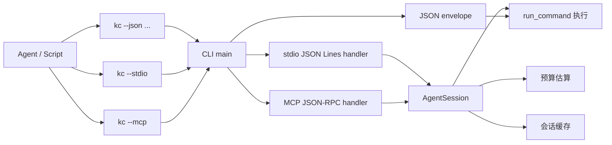
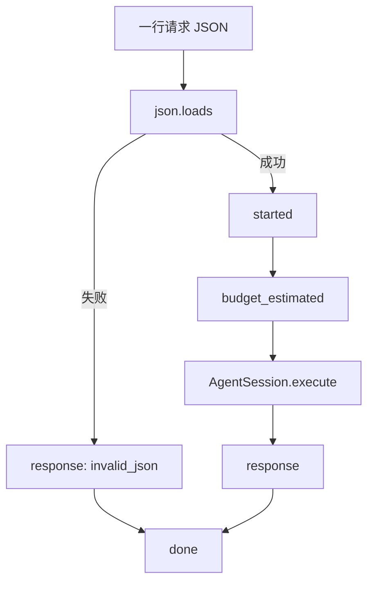

本页只解释 **Keepa CLI 面向 Agent 的三种入口形态**：单次调用的 `--json`、长会话事件流的 `--stdio`，以及面向 MCP 客户端的 `--mcp`。三者都从同一个命令行入口暴露，但它们面向的调用模型、返回协议和上下文管理方式不同；理解这三个入口，能帮助你在脚本自动化、代理编排和 IDE/Agent 集成之间做出正确选择。Sources: [keepa_cli/cli.py](keepa_cli/cli.py#L47-L57), [README.md](README.md#L254-L288), [docs/agent-contract.md](docs/agent-contract.md#L31-L114)

## 先建立心智模型：三种入口不是三套业务系统

从代码的一阶事实看，`keepa-cli` 的 Agent 接入并没有复制三份业务实现，而是在 **同一个 CLI 入口** 上切换三种协议模式：`--json` 输出单个稳定 envelope，`--stdio` 读取多行输入并输出 JSON Lines 事件流，`--mcp` 读取 JSON-RPC 请求并输出 JSON-RPC 响应。也就是说，差异主要发生在 **传输层与协议层**，而不是命令能力本身。Sources: [keepa_cli/cli.py](keepa_cli/cli.py#L424-L473), [README.md](README.md#L266-L282)

在实现上，`main()` 先解析全局参数；若检测到 `args.stdio`，就把整个 stdin 交给 `iter_stdio_output()`；若检测到 `args.mcp`，则交给 `iter_mcp_output()`；否则才进入普通 CLI/JSON 模式。这说明三种入口是 **并列 transport**，共享进程入口，但协议处理函数不同。Sources: [keepa_cli/cli.py](keepa_cli/cli.py#L424-L439)

下面这张图可以把三种入口的关系压缩成一个清晰视图：左侧是三种 Agent 调用方式，右侧是它们最终复用的会话与命令执行核心。Sources: [keepa_cli/cli.py](keepa_cli/cli.py#L429-L439), [keepa_cli/agent/stdio.py](keepa_cli/agent/stdio.py#L25-L73), [keepa_cli/agent/mcp.py](keepa_cli/agent/mcp.py#L68-L168), [keepa_cli/agent/session.py](keepa_cli/agent/session.py#L105-L163)



## 入口对比：什么时候该选哪一种

如果你只需要 **一次请求、一次响应**，`--json` 是最直接的选择；如果你要在一个进程里连续发送多条请求，并希望保留会话级缓存与预算账本，`--stdio` 更适合；如果你的调用方本身是 MCP 客户端，需要工具发现、结构化参数校验、资源读取与 JSON-RPC 语义，那么应使用 `--mcp`。Sources: [README.md](README.md#L254-L288), [docs/agent-contract.md](docs/agent-contract.md#L31-L112), [keepa_cli/agent/mcp.py](keepa_cli/agent/mcp.py#L88-L131)

| 入口 | 启动方式 | 输入模型 | 输出模型 | 长会话 | 工具发现 | 典型场景 |
|---|---|---|---|---|---|---|
| JSON | `kc --json ...` | CLI 参数 | 单个 JSON envelope | 否 | 否 | 脚本、CI、一次性自动化 |
| stdio JSON Lines | `kc --stdio` | stdin 每行一个请求 JSON | stdout 每行一个事件 JSON | 是 | 否 | 自定义 Agent runtime、轻量编排器 |
| MCP | `kc --mcp` | stdin 每行一个 JSON-RPC 请求 | stdout 每行一个 JSON-RPC 响应 | 是 | 是，`tools/list`/`resources/list` | Codex、Claude Code、MCP 宿主 |

Sources: [keepa_cli/cli.py](keepa_cli/cli.py#L53-L56), [docs/agent-contract.md](docs/agent-contract.md#L31-L114), [keepa_cli/agent/mcp.py](keepa_cli/agent/mcp.py#L88-L131)

## 可见代码结构：三种入口各自落在哪些模块

从仓库结构看，三种入口相关代码集中在 `keepa_cli/cli.py`、`keepa_cli/agent/stdio.py`、`keepa_cli/agent/mcp.py` 与 `keepa_cli/agent/session.py`。这四个文件刚好对应 **命令行分流、stdio 协议、MCP 协议、长会话执行核心** 四层。Sources: [keepa_cli/cli.py](keepa_cli/cli.py#L17-L20), [keepa_cli/agent/stdio.py](keepa_cli/agent/stdio.py#L1-L17), [keepa_cli/agent/mcp.py](keepa_cli/agent/mcp.py#L1-L25), [keepa_cli/agent/session.py](keepa_cli/agent/session.py#L1-L22)

```text
keepa_cli/
├─ cli.py               # 入口选择：--json / --stdio / --mcp
└─ agent/
   ├─ stdio.py          # JSON Lines 协议
   ├─ mcp.py            # MCP JSON-RPC 协议
   ├─ session.py        # 会话缓存、预算账本、确认门禁
   ├─ tools.py          # MCP 工具注册与参数 schema
   └─ resources.py      # MCP resources 与模板
```

## 第一种入口：`--json` 适合单次、稳定、可脚本化调用

`--json` 的设计目标是 **让 stdout 只输出一个稳定 JSON envelope**。在契约文档里，成功和失败都被约束为统一顶层结构：`ok` 表示命令级成功与否，`command` 说明执行的命令名，成功时主要读 `data`，失败时主要读 `error.kind` 与 `error.message`。这种形状非常适合 shell、Python 脚本、CI 与其他一次性自动化场景。Sources: [docs/agent-contract.md](docs/agent-contract.md#L31-L69), [README.md](README.md#L256-L264)

代码层面，普通命令最终进入 `_run_command()`，返回 `(exit_code, payload)`；当 `args.json` 为真时，`main()` 会调用 `_write_json()` 把整个 envelope 直接写到 stdout。若没有指定命令但启用了 `--json`，程序不会进入交互界面，而是返回 `missing_command` 错误 envelope，这体现了 JSON 模式的“非交互、可机器解析”定位。Sources: [keepa_cli/cli.py](keepa_cli/cli.py#L203-L421), [keepa_cli/cli.py](keepa_cli/cli.py#L441-L465)

最小示例就是 README 中的能力发现和域名查询：它们都通过 CLI 参数表达命令意图，再以单个 JSON 结果结束，不维护跨请求状态，也不暴露事件流。Sources: [README.md](README.md#L254-L264)

```powershell
kc --json capabilities
kc --json domains list
```

对中级开发者而言，可以把 `--json` 理解成 **“命令行 RPC”**：调用边界清晰、故障处理简单，但不保留会话上下文，因此也不会自动带来多轮交互中的缓存复用优势。Sources: [keepa_cli/cli.py](keepa_cli/cli.py#L460-L473), [docs/agent-contract.md](docs/agent-contract.md#L31-L69)

## 第二种入口：`--stdio` 是轻量长会话协议

`--stdio` 面向的是 **一条 stdin 连接承载多次请求** 的场景。契约文档定义得很直接：stdin 每行一个请求 JSON，stdout 每行一个事件 JSON；请求使用 `id`、`method`、`params`，输出按事件顺序依次给出 `started`、`budget_estimated`、`response`、`done`。Sources: [docs/agent-contract.md](docs/agent-contract.md#L70-L110), [keepa_cli/agent/stdio.py](keepa_cli/agent/stdio.py#L25-L62)

实现上，`handle_stdio_message()` 会先解析单条原始 JSON；如果 JSON 不合法，直接返回一个 `invalid_json` 错误响应事件加 `done`。解析成功后，它会先发出 `started`，再调用 `estimate_request_budget()` 产出 `budget_estimated`，随后通过 `AgentSession.execute()` 真正执行命令，最后发出 `response` 和 `done`。因此，stdio 模式的核心价值不是“换一种输入格式”，而是 **把执行过程拆成可观察的事件流**。Sources: [keepa_cli/agent/stdio.py](keepa_cli/agent/stdio.py#L25-L62)

下图描述了一条 stdio 消息从输入到输出事件的固定路径。Sources: [keepa_cli/agent/stdio.py](keepa_cli/agent/stdio.py#L25-L73)



README 给出的最小使用方式也体现了这一点：把一行 JSON 管道给 `kc --stdio`，程序不会等待交互提示，而是直接按事件行写回。Sources: [README.md](README.md#L266-L270)

```powershell
'{"id":"1","method":"doctor","params":{}}' | kc --stdio
```

测试进一步验证了 stdio 的事件契约：`doctor` 请求会产生 `started` 开头和 `done` 结尾；而高成本命令如 `bestsellers.get`，如果未显式确认，则 `response.payload.ok` 为 `false`，且错误类型是 `confirmation_required`。这说明 stdio **绝不通过阻塞 stdin 的方式要求人工确认**，而是把确认需求编码成结构化错误。Sources: [tests/test_stdio.py](tests/test_stdio.py#L15-L38), [docs/agent-contract.md](docs/agent-contract.md#L89-L110)

## stdio 的关键价值：会话缓存和预算账本

`iter_stdio_output()` 在处理多行输入时，会先创建一个共享的 `AgentSession`，然后把同一个 session 传给每一行消息。这意味着 **同一批 stdin 行共享同一会话缓存和预算账本**，而不是每条请求都从零开始。Sources: [keepa_cli/agent/stdio.py](keepa_cli/agent/stdio.py#L65-L73), [keepa_cli/agent/session.py](keepa_cli/agent/session.py#L105-L163)

`AgentSession.execute()` 的执行顺序非常明确：先检查是否显式通过 `from_cache` 命中缓存；否则根据 `command + params` 生成 cache key；若会话缓存中已有成功结果则直接返回缓存；若没有，则先估算预算，再判断是否需要确认，最后才调用底层 runner 执行命令。执行成功后，响应会附带 `cache_key`、`cache_hit` 和 `budget_ledger`，并在允许时写入会话缓存。Sources: [keepa_cli/agent/session.py](keepa_cli/agent/session.py#L117-L163), [keepa_cli/agent/session.py](keepa_cli/agent/session.py#L165-L198)

测试明确证明了这种行为：同一个 `AgentSession` 上连续两次发送等价的 `categories.search` 请求，第一次 `cache_hit` 为 `false`，第二次为 `true`，并且 `budget_ledger.cache_hits` 变成 `1`。这让 stdio 很适合“一个代理进程内多轮分析”的模式。Sources: [tests/test_stdio.py](tests/test_stdio.py#L117-L136)

## 第三种入口：`--mcp` 是面向 MCP 宿主的 JSON-RPC 服务

`--mcp` 不是简单把 CLI 结果包装成 JSON，而是实现了一个 **最小 MCP JSON-RPC stdio server**。模块注释已经写明，它专门处理 `initialize`、`tools/list`、`tools/call`，并复用 `AgentSession` 执行业务工具。Sources: [keepa_cli/agent/mcp.py](keepa_cli/agent/mcp.py#L1-L6)

在协议层，`handle_mcp_message()` 会先解析 JSON，再检查请求对象合法性与 `params` 类型，然后分发到 `initialize`、`tools/list`、`tools/call`、`resources/list`、`resources/templates/list`、`resources/read` 等方法；未知方法则返回 JSON-RPC 标准错误 `-32601`。这说明 MCP 入口的核心不是“命令执行”，而是 **工具发现 + 工具调用 + 资源发现 + 资源读取** 的完整宿主接口。Sources: [keepa_cli/agent/mcp.py](keepa_cli/agent/mcp.py#L68-L131)

README 中的例子体现了这一使用方式：先 `tools/list` 发现可用工具，再 `resources/list` 或 `resources/templates/list` 发现静态参考资源，而不是直接拼 CLI 字符串。Sources: [README.md](README.md#L272-L282)

```powershell
'{"jsonrpc":"2.0","id":1,"method":"tools/list","params":{}}' | kc --mcp
'{"jsonrpc":"2.0","id":2,"method":"resources/list","params":{}}' | kc --mcp
'{"jsonrpc":"2.0","id":3,"method":"resources/templates/list","params":{}}' | kc --mcp
```

## MCP 初始化、工具集与上下文裁剪

MCP 初始化结果会返回 `protocolVersion`、`serverInfo`、`capabilities` 和 `instructions`。其中 `instructions` 明确告诉客户端：优先使用 fixture 或 dry-run，高成本请求在未传 `yes=true` 时会返回 `confirmation_required`。这相当于把成本治理策略显式暴露给 MCP 宿主。Sources: [keepa_cli/agent/mcp.py](keepa_cli/agent/mcp.py#L56-L65)

`tools/list` 默认返回 `research` 工具集，而不是整个工具全集；同时也支持 `audit`、`reports`、`tracking-readonly` 与 `all`。测试验证了这一点：默认工具集中包含 `keepa.products_get`、`keepa.categories_search`、`keepa.deals_query` 等研究型工具，但不包含 `keepa.audit_cost`；当 `toolset` 为 `audit` 时，则会列出审计相关工具。这个设计的实质是 **通过 toolset 控制上下文体积与权限表面**。Sources: [keepa_cli/agent/mcp.py](keepa_cli/agent/mcp.py#L92-L116), [keepa_cli/agent/tools.py](keepa_cli/agent/tools.py#L16-L27), [tests/test_mcp.py](tests/test_mcp.py#L28-L78)

| MCP 能力 | 方法 | 作用 |
|---|---|---|
| 初始化 | `initialize` | 返回协议版本、服务端信息与能力声明 |
| 工具发现 | `tools/list` | 返回当前 toolset 下的工具定义 |
| 工具调用 | `tools/call` | 用结构化参数执行一个 Keepa 工具 |
| 资源发现 | `resources/list` | 返回稳定静态资源 |
| 资源模板发现 | `resources/templates/list` | 返回可参数化 URI 模板 |
| 资源读取 | `resources/read` | 按 URI 读取 schema、fixture、evidence 或 chunk |

Sources: [keepa_cli/agent/mcp.py](keepa_cli/agent/mcp.py#L88-L131), [tests/test_mcp.py](tests/test_mcp.py#L313-L363)

## MCP 与 stdio 的核心差异：结构化工具面，而不是自由 method 名

stdio 请求直接使用 `method`，例如 `doctor`、`products.get`、`history.trend`；而 MCP 不暴露任意 method 执行，而是要求先通过 `tools/list` 获取工具，再在 `tools/call` 中使用工具名，例如 `keepa.categories_search` 或 `keepa.products_compare`。这种区别意味着 MCP 更强调 **强类型、可发现、可校验** 的工具契约。Sources: [keepa_cli/agent/stdio.py](keepa_cli/agent/stdio.py#L47-L61), [keepa_cli/agent/mcp.py](keepa_cli/agent/mcp.py#L117-L156), [docs/agent-contract.md](docs/agent-contract.md#L122-L180)

这一点在 `keepa_cli/agent/tools.py` 中表现得很明显：每个 `ToolDefinition` 都带有 `inputSchema`、`outputSchema`、只读/破坏性注解，以及 `x-keepa.service_command` 元数据。`tools/call` 会先校验 arguments，再通过 `tool_params_to_command_params()` 转换为底层命令参数，最后调用 `AgentSession.execute()`。因此，MCP 的工具调用路径是 **schema-first**，不是字符串命令重放。Sources: [keepa_cli/agent/tools.py](keepa_cli/agent/tools.py#L30-L58), [keepa_cli/agent/mcp.py](keepa_cli/agent/mcp.py#L134-L156)

测试也验证了这种严格性：未知工具会返回 `-32602`；缺失必需参数或带有不支持参数时，同样返回 `-32602`，并在 `error.data.errors` 中列出具体校验问题。Sources: [tests/test_mcp.py](tests/test_mcp.py#L196-L237)

## MCP 返回为什么同时有 `structuredContent` 和 `content`

MCP 的 `_tool_result()` 会把完整 payload 放进 `structuredContent`，同时生成一个经过压缩的文本 JSON，写入 `content[0].text`，并用 `isError` 标识工具级失败与否。换句话说，MCP 返回不是单一 JSON 物体，而是 **结构化结果 + 文本后备表示** 的双通道格式。Sources: [keepa_cli/agent/mcp.py](keepa_cli/agent/mcp.py#L47-L54)

这样做的直接好处是：支持结构化消费的客户端可以优先读 `structuredContent`；而只能消费文本内容的客户端，也能从 `content[0].text` 拿到 JSON 形式的摘要结果。契约文档也把这一点写成了显式承诺。Sources: [docs/agent-contract.md](docs/agent-contract.md#L159-L180)

## 高成本请求在三种入口中的共同规则

无论是 stdio 还是 MCP，真正执行前都会经过 `AgentSession.execute()` 的预算与确认门禁。其规则是：先调用 `estimate_request_budget()` 得到预算；如果 `requires_confirmation` 为真，且参数中没有 `yes`、`dry_run`、`fixture` 等绕过条件，就返回 `confirmation_required` 错误，而不是继续执行。Sources: [keepa_cli/agent/session.py](keepa_cli/agent/session.py#L54-L71), [keepa_cli/agent/session.py](keepa_cli/agent/session.py#L134-L152)

对 stdio 而言，这个错误会出现在 `response` 事件的 `payload.error.kind` 中；对 MCP 而言，它不会变成 JSON-RPC 协议错误，而是一个 **工具级错误结果**：`result.isError` 为真，但 `result.structuredContent.error.kind` 仍然是 `confirmation_required`。测试分别验证了这两种表现。Sources: [tests/test_stdio.py](tests/test_stdio.py#L25-L38), [tests/test_mcp.py](tests/test_mcp.py#L239-L261)

| 入口 | 高成本未确认时的表现 |
|---|---|
| JSON | 返回单个失败 envelope |
| stdio | `response` 事件中的 `payload.error.kind = confirmation_required` |
| MCP | `result.isError = true`，且 `structuredContent.error.kind = confirmation_required` |

Sources: [docs/agent-contract.md](docs/agent-contract.md#L49-L110), [tests/test_mcp.py](tests/test_mcp.py#L239-L261)

## 长会话行为：stdio 和 MCP 共享同一个会话抽象

stdio 与 MCP 虽然协议完全不同，但它们都通过 `iter_*_output()` 在批量处理输入时创建一个共享 `AgentSession`。这意味着两种模式都拥有 **同源的会话内缓存、预算累计与阻断记录** 能力。Sources: [keepa_cli/agent/stdio.py](keepa_cli/agent/stdio.py#L65-L73), [keepa_cli/agent/mcp.py](keepa_cli/agent/mcp.py#L159-L168)

MCP 测试说明得更完整：同一批输入中的两个等价 `tools/call` 请求，会得到相同的 `cache_key`；第二次调用 `cache_hit` 为真，`budget_ledger.cache_hits` 增加，同时 `data.provenance.mcp.cache_hit` 也会被标出来。这说明 MCP 不只是“有缓存”，还把缓存命中作为可审计 provenance 暴露给客户端。Sources: [tests/test_mcp.py](tests/test_mcp.py#L262-L291), [keepa_cli/agent/session.py](keepa_cli/agent/session.py#L200-L221)

需要特别区分的是：这里说的缓存是 **进程内 Agent session cache**，它服务于一次长会话内的去重；契约文档同时指出，live GET JSON 响应还存在另一个 SQLite 持久缓存层，但那属于更底层的运行时能力，不是这三个入口协议本身的差异点。Sources: [docs/agent-contract.md](docs/agent-contract.md#L183-L187)

## MCP 额外提供的能力：resources

`--json` 和 `--stdio` 只负责命令结果传输，而 `--mcp` 还额外支持 `resources/list`、`resources/templates/list` 与 `resources/read`。`keepa_cli/agent/resources.py` 中定义了四类静态资源：产品 Agent 视图 schema、fixture/evidence manifest、cassette promotion guide，以及 recent evidence 摘要。Sources: [keepa_cli/agent/mcp.py](keepa_cli/agent/mcp.py#L119-L129), [keepa_cli/agent/resources.py](keepa_cli/agent/resources.py#L27-L52)

此外，模板资源还支持按名字读取 schema、按文件名读取 fixture，以及按编码路径读取 chunk/output 文件。这说明 MCP 入口不只提供“工具”，还提供 **按需引用本地知识与输出工件** 的能力。Sources: [keepa_cli/agent/resources.py](keepa_cli/agent/resources.py#L55-L109)

测试同样覆盖了这些资源能力：`resources/list` 中必须包含 `keepa://schema/products-agent-view`、`keepa://fixtures/manifest`、`keepa://guides/cassette-promotion` 和 `keepa://evidence/recent`；而 `resources/templates/list` 则必须暴露 `keepa://schema/{name}` 与 `keepa://fixtures/{name}`。Sources: [tests/test_mcp.py](tests/test_mcp.py#L313-L363)

## 选择建议：从调用者能力反推入口，而不是从“高级程度”选择

对于大多数自动化脚本，**先选 `--json`** 是合理的，因为它最容易集成、错误模型最直接；只有当你明确需要“一进程多轮请求、事件流观察、会话内缓存”时，再切换到 `--stdio`。如果你的宿主已经是 MCP 生态，或者你需要 schema 驱动的工具发现与资源系统，那么才进入 `--mcp`。Sources: [README.md](README.md#L254-L282), [keepa_cli/cli.py](keepa_cli/cli.py#L429-L439), [docs/agent-contract.md](docs/agent-contract.md#L70-L200)

一个实用判断法是：**脚本思维选 JSON，管道思维选 stdio，宿主协议思维选 MCP**。这不是功能强弱排序，而是协议抽象层级不同：JSON 最薄，stdio 增加事件与会话，MCP 再增加工具注册表与资源系统。Sources: [keepa_cli/agent/stdio.py](keepa_cli/agent/stdio.py#L25-L73), [keepa_cli/agent/mcp.py](keepa_cli/agent/mcp.py#L56-L168), [keepa_cli/agent/tools.py](keepa_cli/agent/tools.py#L30-L58)

## 最小上手路径

如果你现在是第一次接入，建议按下面顺序验证三种入口：先用 `kc --json doctor` 确认单次 envelope；再把一条 `doctor` 请求管道给 `kc --stdio`，观察事件序列；最后对 `kc --mcp` 发送 `initialize` 和 `tools/list`，确认你的宿主能正确理解 JSON-RPC。这个顺序符合三种协议的复杂度梯度，也最容易定位集成问题。Sources: [README.md](README.md#L256-L277), [docs/agent-contract.md](docs/agent-contract.md#L31-L140)

```powershell
kc --json doctor
'{"id":"1","method":"doctor","params":{}}' | kc --stdio
'{"jsonrpc":"2.0","id":1,"method":"initialize","params":{}}' | kc --mcp
'{"jsonrpc":"2.0","id":2,"method":"tools/list","params":{}}' | kc --mcp
```

## 下一步阅读建议

如果你想继续理解这三种入口背后 **为何能够共用同一条执行主线**，下一页最合适的是 [高层架构总览：CLI、TUI、stdio、MCP 共用同一命令服务](14-gao-ceng-jia-gou-zong-lan-cli-tui-stdio-mcp-gong-yong-tong-ming-ling-fu-wu)。如果你更关心 JSON 输出的稳定结构与错误模型，请继续阅读 [JSON Envelope 规范：稳定输出、错误模型与 Agent 友好响应](18-json-envelope-gui-fan-wen-ding-shu-chu-cuo-wu-mo-xing-yu-agent-you-hao-xiang-ying)。如果你已经决定采用 MCP 接入，并想深入工具注册与资源设计，则应转到 [MCP 工具注册表：强类型工具面、toolset 分组与命令映射](22-mcp-gong-ju-zhu-ce-biao-qiang-lei-xing-gong-ju-mian-toolset-fen-zu-yu-ming-ling-ying-she)、[MCP 资源系统：Schema、fixture、evidence 与大响应资源引用](23-mcp-zi-yuan-xi-tong-schema-fixture-evidence-yu-da-xiang-ying-zi-yuan-yin-yong) 和 [长会话能力：stdio/MCP 会话、资源分块与上下文控制](24-chang-hui-hua-neng-li-stdio-mcp-hui-hua-zi-yuan-fen-kuai-yu-shang-xia-wen-kong-zhi)。Sources: [README.md](README.md#L254-L288), [keepa_cli/agent/mcp.py](keepa_cli/agent/mcp.py#L15-L25), [keepa_cli/agent/session.py](keepa_cli/agent/session.py#L105-L163)