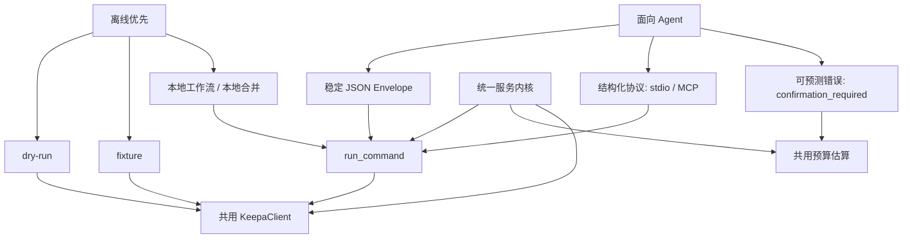
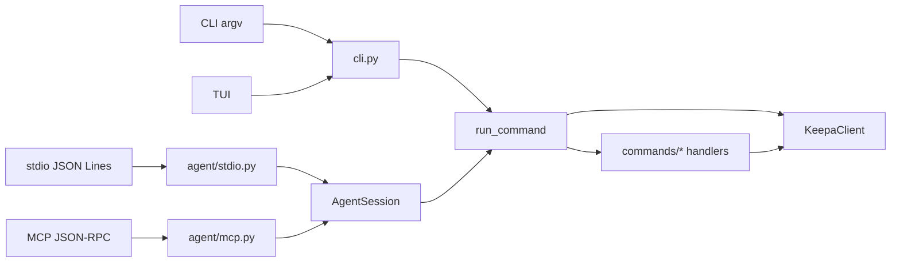

这页不讨论具体某个命令族的参数细节，而是解释 **Keepa CLI 为什么会长成现在这样**：它首先把自己定义为一个可被 Agent 稳定调用的工具，其次把离线与低成本验证放到默认路径，最后再通过一个统一的 command service 把 CLI、stdio、MCP 与 TUI 收束到同一执行内核中。对于中级开发者，理解这三条设计轴，比先记住命令名更能快速读懂仓库。
Sources: [README.zh-CN.md](README.zh-CN.md#L14-L23) [README.md](README.md#L21-L33) [keepa_cli/service.py](keepa_cli/service.py#L1-L6)

## 先从第一原则看：这个项目不是“给人包一层 CLI”，而是“给人和 Agent 提供同一能力表面”

README 直接把项目定位为 **Agent-first Keepa API CLI**，并把 JSON、stdio、MCP、fixture、token budgeting、command-first TUI 并列列为核心能力；中文说明进一步明确，三种 Agent 入口共享同一 command service。这说明项目的第一原则不是“终端命令是否易记”，而是“不同调用方是否能拿到同一份稳定能力、同一类返回结构、同一套安全边界”。
Sources: [README.md](README.md#L21-L33) [README.zh-CN.md](README.zh-CN.md#L14-L23)

从代码结构看，这个原则被落实得很直接：`cli.py` 的职责是解析参数与选择交互通道，而 `service.py` 的职责是把高层命令转换成统一业务执行结果；`agent/stdio.py` 与 `agent/mcp.py` 都没有直接访问 Keepa API，而是把业务执行委托给会话层或 service runner。这意味着 **“协议层只是入口差异，业务层才是事实来源”**。
Sources: [keepa_cli/cli.py](keepa_cli/cli.py#L1-L6) [keepa_cli/service.py](keepa_cli/service.py#L1-L6) [keepa_cli/agent/stdio.py](keepa_cli/agent/stdio.py#L1-L6) [keepa_cli/agent/mcp.py](keepa_cli/agent/mcp.py#L1-L6)

## 三条核心设计轴

下表可以把这页的主题压缩成三条最重要的设计哲学。
Sources: [README.zh-CN.md](README.zh-CN.md#L14-L23) [keepa_cli/service.py](keepa_cli/service.py#L480-L519) [keepa_cli/agent/session.py](keepa_cli/agent/session.py#L117-L163)

| 设计轴 | 核心问题 | 项目给出的答案 | 直接结果 |
|---|---|---|---|
| 面向 Agent | 如何让自动化调用稳定、可组合、可判定错误分支 | 提供 `--json`、`--stdio`、`--mcp`，统一 envelope、结构化参数与错误模型 | Agent 不需要解析人类终端文本 |
| 离线优先 | 如何在没有 token、没有网络、没有确认输入时仍可验证流程 | 默认支持 `dry-run`、fixture、本地工作流、本地 graph merge | 调试和演示先走零成本路径 |
| 统一服务内核 | 如何避免 CLI、MCP、TUI 各写一套业务逻辑 | 所有入口最终汇聚到 `run_command` 与 `KeepaClient` 路径 | 行为一致、测试集中、扩展边界清晰 |

Sources: [docs/agent-contract.md](docs/agent-contract.md#L31-L68) [README.zh-CN.md](README.zh-CN.md#L14-L23) [keepa_cli/service.py](keepa_cli/service.py#L480-L519)

## 设计关系图：三条原则如何互相支撑

先看这张关系图：它不是运行时调用图，而是概念图，用来说明为什么这三个词经常同时出现。
Sources: [README.md](README.md#L21-L33) [docs/agent-contract.md](docs/agent-contract.md#L70-L110) [keepa_cli/agent/session.py](keepa_cli/agent/session.py#L54-L71)



这张图背后的含义是：**面向 Agent** 需要稳定协议与结构化错误；**离线优先** 需要把“请求构造”和“真实网络调用”拆开；而要同时满足这两点，就必须有一个 **统一服务内核**，把所有入口对齐到同一套命令执行与预算判定逻辑。
Sources: [keepa_cli/agent/stdio.py](keepa_cli/agent/stdio.py#L25-L62) [keepa_cli/agent/mcp.py](keepa_cli/agent/mcp.py#L88-L129) [keepa_cli/client.py](keepa_cli/client.py#L62-L107)

## 面向 Agent：稳定输出比交互体验更优先

Agent 契约文档明确规定，`--json` 模式下 stdout 只能输出一个 JSON envelope，不能混入 ANSI、日志或明文凭据；错误时 `ok=false` 与 `error.kind` 是主要分支信号，`token_bucket` 同时承载执行前预算和真实返回中的 token 字段。这种约束的重点不是“格式漂亮”，而是 **让上游程序能稳定分支、重试、审计与拼装后续动作**。
Sources: [docs/agent-contract.md](docs/agent-contract.md#L31-L68)

CLI 入口也贯彻了同样取向：全局开关直接暴露 `--json`、`--stdio`、`--mcp`，而 `main()` 在检测到这些模式时，会优先走协议输出路径，而不是人类交互路径。换言之，项目把“协议正确性”放在“终端友好性”之前；TUI 是能力消费端之一，不是业务真相来源。
Sources: [keepa_cli/cli.py](keepa_cli/cli.py#L47-L61) [keepa_cli/cli.py](keepa_cli/cli.py#L424-L465)

stdio 协议进一步证明了这一点。每一行输入都是结构化请求，每一行输出都是事件：`started`、`budget_estimated`、`response`、`done`。这样设计后，Agent 不必等待不可预期的终端文本流，而是能按事件阶段消费状态；测试也验证了高成本请求会以 `confirmation_required` 的结构化错误返回，而不是阻塞等待人工输入。
Sources: [keepa_cli/agent/stdio.py](keepa_cli/agent/stdio.py#L19-L62) [tests/test_stdio.py](tests/test_stdio.py#L15-L38)

MCP 层同样坚持结构化。它只接受 JSON-RPC 请求，`tools/call` 只接收工具定义允许的 JSON 参数，不解析 CLI 字符串；返回同时包含 `structuredContent` 与文本 fallback。这里的哲学很明确：**命令行只是人类入口，结构化工具面才是 Agent 的正式接口**。
Sources: [keepa_cli/agent/mcp.py](keepa_cli/agent/mcp.py#L68-L157) [docs/agent-contract.md](docs/agent-contract.md#L112-L181)

## 离线优先：默认先验证“形状”和“成本”，再决定是否访问 Keepa

README 把“默认离线优先”写得很明确：`dry-run` 和 fixture 不访问 Keepa，也不消耗 token，真实请求必须显式配置 Keepa token。这个默认值改变了典型 API CLI 的使用顺序：不是“先联机，再想办法控制成本”，而是“先在本地验证请求形状、响应形状和工作流形状，再决定是否联机”。
Sources: [README.md](README.md#L21-L22) [README.zh-CN.md](README.zh-CN.md#L14-L15)

`KeepaClient.request()` 是这条原则最核心的代码证据。它总是先构造 request spec 和预算估算，然后按顺序分流到 `dry_run`、fixture、live request 三条路径。也就是说，请求描述与预算模型先于真实网络存在；网络只是其中一种执行后端，而不是命令系统的出发点。
Sources: [keepa_cli/client.py](keepa_cli/client.py#L62-L107)

在 `dry_run` 路径里，返回的是成功 envelope、redacted request、cache provenance 和预算信息；在 fixture 路径里，返回的是离线 body 与 fixture 来源说明；只有进入 live 路径时，才会去解析配置、读取环境变量中的 token，并继续处理缓存与网络请求。这里体现的不是简单的 mock 支持，而是 **离线路径被当成一等公民**。
Sources: [keepa_cli/client.py](keepa_cli/client.py#L90-L118) [keepa_cli/client.py](keepa_cli/client.py#L148-L189)

连研究图谱相关能力也遵循相同思想。`research_graph.merge` 在 service 中完全本地执行：从输入 JSON 提取 research graph、合并、生成 summary、diagnostics、evidence_index，并明确标记 `provenance.source=local` 与 `network=false`。这说明项目希望“分析、审计、报告拼装”尽量留在本地，而不是把所有价值都绑定在在线 API 调用上。
Sources: [keepa_cli/service.py](keepa_cli/service.py#L430-L477)

## 成本意识不是附加功能，而是协议的一部分

如果说离线优先解决的是“先别花钱”，那么预算模型解决的是“什么时候必须显式同意花钱”。`token_budget.py` 不是 UI 辅助函数，而是独立模块，直接输出 `estimated_tokens`、`worst_case_tokens`、`requires_confirmation` 与 component 级别说明；例如 product 基础成本、offers 页成本、`rating=1` 额外成本、`update=0` 的潜在刷新成本都被拆开表达。
Sources: [keepa_cli/token_budget.py](keepa_cli/token_budget.py#L1-L37) [keepa_cli/token_budget.py](keepa_cli/token_budget.py#L61-L143)

这套预算不会停留在文档层。stdio 协议在执行前就发送 `budget_estimated` 事件；会话层在真正执行前也会调用同一个估算器，并在需要确认且没有 `yes/dry_run/fixture` 的情况下，直接返回 `confirmation_required`。因此“预算”在这里不是提示文本，而是 **控制流门禁**。
Sources: [keepa_cli/agent/stdio.py](keepa_cli/agent/stdio.py#L53-L61) [keepa_cli/agent/session.py](keepa_cli/agent/session.py#L54-L71) [keepa_cli/agent/session.py](keepa_cli/agent/session.py#L134-L151)

下表概括了项目里几种常见执行方式的哲学差异。
Sources: [keepa_cli/client.py](keepa_cli/client.py#L62-L146) [keepa_cli/agent/session.py](keepa_cli/agent/session.py#L117-L163)

| 执行方式 | 是否联网 | 是否需要 token | 是否返回预算信息 | 典型用途 |
|---|---|---:|---:|---|
| `dry-run` | 否 | 否 | 是 | 验证请求规格与成本 |
| fixture | 否 | 否 | 是 | 验证响应形状与 Agent 流程 |
| live JSON | 是 | 是 | 是 | 获取真实 Keepa 数据 |
| 本地 research graph merge | 否 | 否 | 否/零成本 | 聚合离线研究结果 |

Sources: [README.zh-CN.md](README.zh-CN.md#L14-L23) [keepa_cli/client.py](keepa_cli/client.py#L90-L146) [keepa_cli/service.py](keepa_cli/service.py#L430-L477)

## 统一服务内核：所有入口都应指向同一个命令真相源

`service.py` 文件头直接把自己定义为 **CLI、stdio 与 TUI 共用的 Agent-safe command service**，并说明它负责把高层命令转换为官方 Keepa endpoint、参数、预算和 envelope。这个定义很关键：它不是“CLI 的内部 helper”，而是整个系统的业务中枢。
Sources: [keepa_cli/service.py](keepa_cli/service.py#L1-L6)

`run_command()` 的结构也说明了这一点。它先处理 `doctor`、`capabilities`、`domains.list` 之类的公共命令，再把各命令族分发给 `commands/` 下的 handler，最后统一落到剩余命令和错误出口。这里的重点不是 if/else 多少，而是 **只有一个公共调度入口**；拆分计划文档也明确要求后续重构时保持 `run_command` 作为唯一公共调度入口，避免调用方改动。
Sources: [keepa_cli/service.py](keepa_cli/service.py#L480-L608) [docs/architecture/service-cli-split-plan.md](docs/architecture/service-cli-split-plan.md#L35-L41)

CLI 层正是围绕这个前提设计的。`_run_command()` 的模式是：参数解析器负责把 argparse 结果翻译为命令名与参数字典，然后调用 `run_command()`；命令族 builder 负责扩展子命令，但不改变 service 的公共入口。这保证了“新增入口形式”和“新增业务能力”是两类不同变化。
Sources: [keepa_cli/cli.py](keepa_cli/cli.py#L203-L421) [docs/architecture/service-cli-split-plan.md](docs/architecture/service-cli-split-plan.md#L15-L18)

下面这张图展示的是运行时交互，而不是概念关系。阅读它时，可以把 `run_command` 看成“所有入口共享的业务窄腰层”。
Sources: [keepa_cli/cli.py](keepa_cli/cli.py#L424-L465) [keepa_cli/agent/stdio.py](keepa_cli/agent/stdio.py#L25-L62) [keepa_cli/agent/mcp.py](keepa_cli/agent/mcp.py#L117-L157) [keepa_cli/service.py](keepa_cli/service.py#L480-L608)



这套结构的价值在于，CLI、MCP、stdio 的差异主要留在入口层：一个解析 argv，一个解析 JSON Lines，一个解析 JSON-RPC；而业务命令、预算判定、离线路径、错误 envelope 则尽量保持一致。对维护者而言，这是一种 **把协议复杂度与业务复杂度解耦** 的做法。
Sources: [keepa_cli/cli.py](keepa_cli/cli.py#L424-L465) [keepa_cli/agent/session.py](keepa_cli/agent/session.py#L106-L163) [keepa_cli/service.py](keepa_cli/service.py#L480-L608)

## 长会话视角：统一内核之上，再叠加 Agent Session 语义

`AgentSession` 不是另一个业务服务层，而是叠加在 `run_command` 之上的长会话协调层。它维护会话内缓存、预算账本、阻断动作列表，并且把真正执行委托给 `run_command`。因此它解决的是 **“一次长会话中如何去重、如何累计成本、如何保留上下文”**，而不是“如何实现 products.get”。
Sources: [keepa_cli/agent/session.py](keepa_cli/agent/session.py#L1-L6) [keepa_cli/agent/session.py](keepa_cli/agent/session.py#L106-L163)

这里最有代表性的设计是双层缓存：一层是 `AgentSession` 的进程内缓存，按 command+params 生成 `cache_key`，用于同一次 stdio/MCP 会话内去重；另一层是 `KeepaClient` 的 SQLite 持久缓存，用于 live GET JSON 响应的跨进程复用。两层缓存服务的不是同一个目标：前者关注会话去重与上下文效率，后者关注真实响应的持久化与 provenance。
Sources: [keepa_cli/agent/session.py](keepa_cli/agent/session.py#L47-L52) [keepa_cli/agent/session.py](keepa_cli/agent/session.py#L130-L184) [keepa_cli/client.py](keepa_cli/client.py#L121-L146) [keepa_cli/client.py](keepa_cli/client.py#L204-L241)

测试也验证了这种哲学：同一个 stdio 会话中重复执行同一请求，第二次返回 `cache_hit=true`，并在 `budget_ledger` 中记录 `cache_hits`；MCP 契约文档也明确说明同一会话内可自动缓存成功响应，并允许通过 `from_cache` 显式复用 `cache_key`。这说明长会话协议并不是“反复调用 CLI”，而是一个具备状态与审计能力的执行环境。
Sources: [tests/test_stdio.py](tests/test_stdio.py#L117-L136) [docs/agent-contract.md](docs/agent-contract.md#L183-L187)

## 项目结构如何反映这种哲学

仅看下面这部分目录，就能看出仓库不是围绕“单一命令文件”组织，而是围绕“入口层 / 服务层 / 协议层 / 领域命令层”组织。
Sources: [keepa_cli/cli.py](keepa_cli/cli.py#L47-L61) [keepa_cli/service.py](keepa_cli/service.py#L1-L6) [keepa_cli/agent/mcp.py](keepa_cli/agent/mcp.py#L1-L6)

```text
keepa_cli/
├─ cli.py                # 参数入口与输出分流
├─ service.py            # 统一 command service
├─ client.py             # dry-run / fixture / live 请求客户端
├─ token_budget.py       # 本地预算估算
├─ agent/
│  ├─ stdio.py           # JSON Lines 协议
│  ├─ mcp.py             # MCP JSON-RPC 协议
│  └─ session.py         # 长会话缓存与账本
├─ commands/             # 领域命令实现
└─ cli_builders/         # argparse 子命令构建
```

`pyproject.toml` 里的两个脚本入口 `keepa-cli` 和 `kc` 都指向同一个 `keepa_cli.cli:main`，而 agent 契约文档也重复强调这两个入口完全等价。这个细节看起来很小，但它恰好说明项目偏好的是 **同一实现对外暴露多个消费方式**，而不是为不同用户群体维护多套行为略有漂移的入口。
Sources: [pyproject.toml](pyproject.toml#L40-L42) [docs/agent-contract.md](docs/agent-contract.md#L5-L29)

## 不是所有东西都被放进统一内核：边界同样是设计哲学的一部分

这个项目虽然强调统一，但并没有把所有职责揉成一团。`cli.py` 明确只负责参数解析、协议切换和输出；`service.py` 不处理终端输入输出，也不保存凭据；`mcp.py` 不直接访问 Keepa API，也不解析 CLI 字符串；`stdio.py` 不直接访问网络。这些文件头的“依赖边界”说明，项目追求的不是“大一统文件”，而是 **统一执行语义 + 清晰模块边界**。
Sources: [keepa_cli/cli.py](keepa_cli/cli.py#L1-L6) [keepa_cli/service.py](keepa_cli/service.py#L1-L6) [keepa_cli/agent/mcp.py](keepa_cli/agent/mcp.py#L1-L6) [keepa_cli/agent/stdio.py](keepa_cli/agent/stdio.py#L1-L6)

因此，“统一服务内核”真正统一的是三件事：命令名与参数语义、预算与确认策略、输出 envelope 与 provenance；而协议格式、人类交互体验、具体子命令构建则被留在外围模块中演化。这种分层让系统既能增长功能面，又不必让每个入口自己重新发明一遍业务规则。
Sources: [keepa_cli/service.py](keepa_cli/service.py#L480-L608) [keepa_cli/cli.py](keepa_cli/cli.py#L203-L465) [docs/architecture/service-cli-split-plan.md](docs/architecture/service-cli-split-plan.md#L35-L41)

## 对阅读源码的人，这页最重要的结论

如果你把 Keepa CLI 当成“一个带 TUI 的 API 命令行工具”，你会看到很多分散功能；如果你把它当成“一个以 `run_command` 为核心、以离线路径和预算门禁为默认、再向 CLI/stdio/MCP 暴露不同协议表面的 Agent-safe service”，代码就会突然变得连贯。项目的主线不是 UI，也不是某个 endpoint，而是 **稳定执行语义在不同入口之间的复用**。
Sources: [README.zh-CN.md](README.zh-CN.md#L18-L23) [keepa_cli/service.py](keepa_cli/service.py#L480-L608) [keepa_cli/client.py](keepa_cli/client.py#L62-L146)

## 建议的下一步阅读

读完这一页，最自然的下一站是先看 [高层架构总览：CLI、TUI、stdio、MCP 共用同一命令服务](14-gao-ceng-jia-gou-zong-lan-cli-tui-stdio-mcp-gong-yong-tong-ming-ling-fu-wu)，把这里的设计哲学映射到实际模块关系；然后继续读 [命令解析层：参数构建器与命令分发表的职责分离](15-ming-ling-jie-xi-ceng-can-shu-gou-jian-qi-yu-ming-ling-fen-fa-biao-de-zhi-ze-fen-chi) 与 [服务层中枢：run_command 如何统一业务命令、配置命令与本地工具命令](16-fu-wu-ceng-zhong-shu-run_command-ru-he-tong-ye-wu-ming-ling-pei-zhi-ming-ling-yu-ben-di-gong-ju-ming-ling)，如果你更关心 Agent 协议，则可跳到 [JSON、stdio、JSON Lines 与 MCP 三种 Agent 入口](12-json-stdio-json-lines-yu-mcp-san-chong-agent-ru-kou) 和 [长会话能力：stdio/MCP 会话、资源分块与上下文控制](24-chang-hui-hua-neng-li-stdio-mcp-hui-hua-zi-yuan-fen-kuai-yu-shang-xia-wen-kong-zhi)。