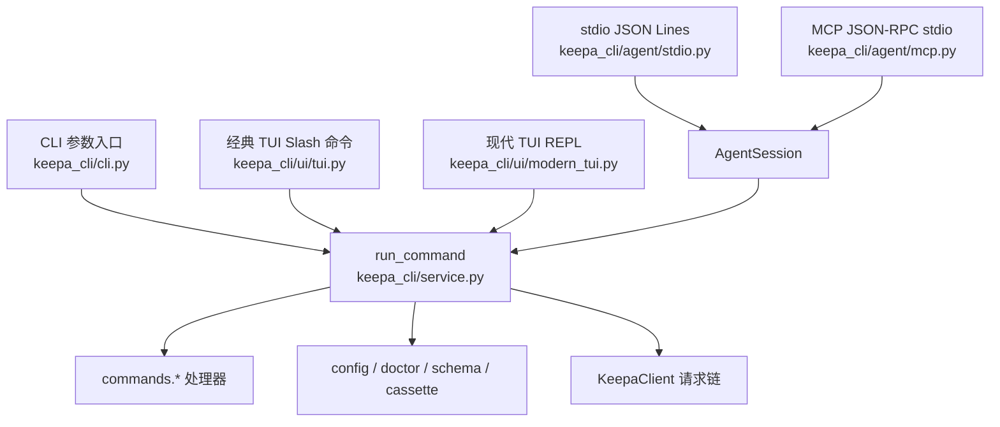

这一页只解释一个核心事实：**Keepa CLI 并不是四套入口各写一遍业务逻辑，而是让 CLI、现代 TUI、经典 TUI、stdio Agent 协议、MCP 协议都汇聚到同一个 `run_command` 服务内核**。这意味着输入形态可以不同，但命令名、参数语义、预算门禁、错误 envelope 与大部分业务分发路径保持统一。对中级开发者来说，理解这一点，就等于抓住了整个仓库的主梁。
Sources: [README.zh-CN.md](README.zh-CN.md#L14-L23), [service.py](keepa_cli/service.py#L1-L5), [cli.py](keepa_cli/cli.py#L1-L5)

## 先从第一性原理看：四种入口，单一执行中枢

从第一性原理出发，这个项目把“**如何进入系统**”和“**系统执行什么命令**”刻意分离。`keepa_cli/cli.py` 负责解析命令行、切换 `--stdio` / `--mcp` / TUI 模式；`keepa_cli/ui/tui.py` 与 `keepa_cli/ui/modern_tui.py` 负责人类交互；`keepa_cli/agent/stdio.py` 与 `keepa_cli/agent/mcp.py` 负责协议层适配；而真正的业务执行统一落到 `keepa_cli/service.py` 的 `run_command()`。模块入口 `python -m keepa_cli` 也只是转发到同一个 CLI 主入口，没有额外分支逻辑。
Sources: [cli.py](keepa_cli/cli.py#L47-L55), [cli.py](keepa_cli/cli.py#L424-L473), [stdio.py](keepa_cli/agent/stdio.py#L25-L73), [mcp.py](keepa_cli/agent/mcp.py#L68-L169), [__main__.py](keepa_cli/__main__.py#L1-L14), [service.py](keepa_cli/service.py#L480-L608)



上图阅读方法很简单：左侧是不同入口，中央是共享服务核，右侧是被服务层分发到的命令处理器与本地工具能力。这里最关键的不是“有多少入口”，而是**入口只负责适配，不负责重写业务**。
Sources: [service.py](keepa_cli/service.py#L480-L608), [tui.py](keepa_cli/ui/tui.py#L210-L285), [modern_tui.py](keepa_cli/ui/modern_tui.py#L136-L239), [session.py](keepa_cli/agent/session.py#L105-L163)

## 入口职责对比：谁做适配，谁做执行

从代码边界声明可以直接看出作者的架构意图：CLI 不保存凭据、只做参数解析与输出；stdio/MCP 不直接访问网络、统一委托 service；TUI 不构造 Keepa API 请求、只做 slash 命令解释与结果渲染；service 则承担“把高层命令转换为 endpoint、参数、预算和 envelope”的职责。这是一种非常清晰的**适配器 + 服务核**设计。
Sources: [cli.py](keepa_cli/cli.py#L1-L5), [stdio.py](keepa_cli/agent/stdio.py#L1-L5), [mcp.py](keepa_cli/agent/mcp.py#L1-L6), [tui.py](keepa_cli/ui/tui.py#L1-L6), [modern_tui.py](keepa_cli/ui/modern_tui.py#L1-L5), [service.py](keepa_cli/service.py#L1-L5)

| 入口/模块 | 面向对象 | 主要输入形式 | 主要职责 | 是否直接执行业务 |
|---|---|---|---|---|
| `keepa_cli/cli.py` | 命令行用户/脚本 | argv | 建 parser、切换模式、调用 `run_command`、控制 JSON 输出 | 否 |
| `keepa_cli/ui/tui.py` | 人类终端用户 | slash 命令 | 解析 `/product` 等简写、渲染文本摘要 | 否 |
| `keepa_cli/ui/modern_tui.py` | 人类终端用户 | REPL + 补全 | 命令目录、补全、状态栏、回退到经典 TUI | 否 |
| `keepa_cli/agent/stdio.py` | Agent | JSON Lines | 事件流包装、预算事件、复用 `AgentSession` | 否 |
| `keepa_cli/agent/mcp.py` | MCP Client/Agent | JSON-RPC | `initialize` / `tools/list` / `tools/call` / resources | 否 |
| `keepa_cli/service.py` | 全部入口共享 | 规范化命令名 + 参数字典 | 统一命令分发与 envelope 生成 | 是 |

这个表说明了一个重要判断标准：**如果你要改业务语义，优先看 service 与 `commands/*`；如果你要改使用姿势，优先看 CLI/TUI/stdio/MCP 适配层。**
Sources: [cli.py](keepa_cli/cli.py#L203-L473), [tui.py](keepa_cli/ui/tui.py#L210-L299), [modern_tui.py](keepa_cli/ui/modern_tui.py#L136-L239), [stdio.py](keepa_cli/agent/stdio.py#L25-L73), [mcp.py](keepa_cli/agent/mcp.py#L88-L156), [service.py](keepa_cli/service.py#L480-L608)

## 共享服务核 `run_command()`：高层架构的真正中心

`run_command()` 的实现方式非常直接：先把 `params` 归一成字典，再根据命令名逐段分流。它既处理 `doctor`、`capabilities`、`domains.list` 这类本地命令，也把产品、类目、Finder、Deals、Tracking、History、Raw Request 等业务命令转发给各自的 `commands.*` 处理器，还覆盖 config、schema、cassette、research graph merge 等本地工具命令。最后，所有异常被统一转换为 `error_envelope`，未知命令则返回 `unsupported_command`。因此，**共享并不只是“复用函数”，而是复用完整的命令语义与错误模型**。
Sources: [service.py](keepa_cli/service.py#L480-L608)

```mermaid
flowchart TD
    RC[run_command(command, params)] --> A{命令类别}
    A --> B[doctor / capabilities / domains]
    A --> C[cache / workflows / raw]
    A --> D[products / categories / finder / deals / tracking / history]
    A --> E[config / schema / cassettes / research_graph]
    B --> ENV1[success_envelope]
    C --> H1[对应处理器]
    D --> H2[对应处理器]
    E --> H3[本地函数]
    H1 --> OUT[统一 envelope]
    H2 --> OUT
    H3 --> OUT
    RC --> ERR[异常捕获]
    ERR --> OUT
```

这张图的重点不是分支数量，而是**所有分支最终都回到统一 envelope 输出**。这也是为什么 CLI 的 `--json`、stdio 的 `response` 事件、MCP 的 `structuredContent`、TUI 的摘要视图都能建立在同一份结果之上。
Sources: [service.py](keepa_cli/service.py#L490-L607), [cli.py](keepa_cli/cli.py#L460-L473), [stdio.py](keepa_cli/agent/stdio.py#L53-L62), [mcp.py](keepa_cli/agent/mcp.py#L47-L54)

## CLI 是总入口开关，不是业务中心

`keepa_cli/cli.py` 的 `main()` 明确表现出一种“**先选通道，再走统一命令**”的控制流。若传入 `--stdio`，它读取标准输入并交给 `iter_stdio_output()`；若传入 `--mcp`，则交给 `iter_mcp_output()`；若没有显式命令，且当前不是交互终端，则进入经典 TUI，否则进入现代 TUI。只有在显式子命令模式下，它才调用 `_run_command()`，而 `_run_command()` 又持续把绝大多数命令转换为 `run_command("...", {...})`。所以 CLI 更像一个**入口路由器**。
Sources: [cli.py](keepa_cli/cli.py#L424-L473), [cli.py](keepa_cli/cli.py#L203-L421)

还有一个容易忽略但很重要的细节：CLI 只在最外层控制“如何输出”，而不控制“业务返回什么”。`args.json` 打开时，它写出完整 JSON envelope；非 JSON 模式时，成功只打印 `payload["data"]`，失败只写错误消息。这说明**展示层裁剪发生在 CLI 末端，业务结构定义发生在 service 内核**。
Sources: [cli.py](keepa_cli/cli.py#L460-L473)

## TUI 复用的是同一套命令，而不是模拟另一套界面逻辑

经典 TUI 的核心转换器 `_slash_to_command()` 会把 `/doctor`、`/product`、`/history`、`/graph`、`/cache`、`/report` 等 slash 命令，映射成与 CLI/Agent 共用的服务命令名，例如 `doctor`、`products.get`、`history.trend`、`graphs.image`、`cache.explain`、`reports.build`。执行时它调用的仍然是 `run_command()`，只是后续通过 `_summarize_success()` 把 envelope 提炼成人类更容易浏览的摘要。换句话说，**TUI 不是第二个业务后端，而是共享后端上的一个人类界面壳。**
Sources: [tui.py](keepa_cli/ui/tui.py#L210-L285), [tui.py](keepa_cli/ui/tui.py#L287-L320), [tui.py](keepa_cli/ui/tui.py#L74-L86), [tui.py](keepa_cli/ui/tui.py#L16-L17)

现代 TUI 进一步证明了这种复用关系。它维护的是一个 `CommandItem` 目录，每个可补全 slash 项都带着 `service_command` 字段，例如 `/doctor -> doctor`、`/product ... -> products.get`、`/batch ... -> batch.asins`、`/report ... -> reports.build`。也就是说，现代 TUI 的“命令目录”和经典 TUI 的“slash 解析器”都把自己定位为**共享服务命令空间的前端映射表**。
Sources: [modern_tui.py](keepa_cli/ui/modern_tui.py#L98-L116), [modern_tui.py](keepa_cli/ui/modern_tui.py#L136-L219), [modern_tui.py](keepa_cli/ui/modern_tui.py#L222-L239)

测试也直接验证了这一点：TUI 测试检查 `/doctor`、`/product`、`/history`、`/tokens`、`/graph`、`/lightningdeals`、`/tracking-list` 都走到对应的共享服务命令，并输出统一语义的结果摘要，而不是专门为 TUI 重新实现各条命令。
Sources: [tests/test_tui.py](tests/test_tui.py#L16-L40), [tests/test_tui.py](tests/test_tui.py#L49-L84), [tests/test_modern_tui.py](tests/test_modern_tui.py#L42-L60), [tests/test_modern_tui.py](tests/test_modern_tui.py#L110-L124)

## stdio：把共享服务包装成事件流

stdio 协议层的思路最清晰：单行 JSON 输入先被解析成 `{id, method, params}`，然后先发 `started` 事件，再发 `budget_estimated` 事件，接着通过 `AgentSession.execute(method, params)` 执行，最后产出 `response` 与 `done`。因此 stdio 并没有引入新的业务命令体系，它只是把**同一命令调用过程**包装成适合 Agent 消费的事件流。
Sources: [stdio.py](keepa_cli/agent/stdio.py#L25-L62)

这里真正起作用的是 `AgentSession`。它会构造基于命令与参数的缓存键、累积 session 预算、在高成本请求上返回 `confirmation_required`，并在允许时调用 `run_command()`。所以 stdio 共享的不只是服务结果，还共享了**会话级缓存与预算治理**。
Sources: [session.py](keepa_cli/agent/session.py#L47-L52), [session.py](keepa_cli/agent/session.py#L105-L163)

测试覆盖也验证了这个协议层定位：`doctor` 会返回标准事件流，高成本 `bestsellers.get` 会被转换为 `confirmation_required`，fixture 请求会走共享 service 路径，同一会话下重复请求会命中 session cache 并回写 budget ledger。
Sources: [tests/test_stdio.py](tests/test_stdio.py#L15-L37), [tests/test_stdio.py](tests/test_stdio.py#L39-L76), [tests/test_stdio.py](tests/test_stdio.py#L117-L136)

## MCP：协议更重，但业务复用方式与 stdio 相同

MCP 的差异不在业务执行，而在**协议语义更完整**。`handle_mcp_message()` 负责处理 `initialize`、`tools/list`、`tools/call`、`resources/list`、`resources/templates/list` 与 `resources/read`。其中真正触发业务的是 `tools/call`：先根据工具名找到 `ToolDefinition`，校验 JSON schema 参数，再把 tool arguments 归一化为 command params，最后仍然通过 `AgentSession.execute(tool.command, command_params, tool=tool.name)` 执行。
Sources: [mcp.py](keepa_cli/agent/mcp.py#L88-L156), [tools.py](keepa_cli/agent/tools.py#L30-L58)

这说明 MCP 的“工具”本质上不是独立业务实现，而是**共享命令服务的一层强类型包装**。工具注册表里显式保存了 `command` 字段，并在 `to_mcp_tool()` 的 `x-keepa.service_command` 中暴露出来，等于把“这个工具最终调用哪个共享命令”公开成协议元数据。
Sources: [tools.py](keepa_cli/agent/tools.py#L30-L58)

测试同样印证了这条链路：`tools/list` 会返回带 `inputSchema`、`outputSchema` 与 `x-keepa.service_command` 的工具定义；`tools/call` 执行后的 `structuredContent.command` 仍然是 `categories.search`、`products.compare`、`deals.query` 这类共享服务命令名，而不是 MCP 特有的第二套命令语义。
Sources: [tests/test_mcp.py](tests/test_mcp.py#L28-L46), [tests/test_mcp.py](tests/test_mcp.py#L79-L110), [tests/test_mcp.py](tests/test_mcp.py#L139-L194)

## 一个架构图景：目录结构如何体现“入口层薄、服务层厚”

如果只看与当前页面相关的目录，可以把项目主干压缩成下面这样。它不是完整仓库图，而是专门展示“**多入口共享单服务核**”的最小结构。
Sources: [cli.py](keepa_cli/cli.py#L17-L35), [service.py](keepa_cli/service.py#L16-L59), [stdio.py](keepa_cli/agent/stdio.py#L14-L16), [mcp.py](keepa_cli/agent/mcp.py#L15-L25), [tui.py](keepa_cli/ui/tui.py#L16-L17), [modern_tui.py](keepa_cli/ui/modern_tui.py#L18-L22)

```text
keepa_cli/
├─ cli.py                 # 总入口：argv / --stdio / --mcp / TUI 切换
├─ __main__.py            # python -m keepa_cli 转发到 cli.main
├─ service.py             # 共享命令服务核 run_command()
├─ commands/              # 业务命令处理器
│  ├─ products.py
│  ├─ categories.py
│  ├─ finder.py
│  ├─ deals.py
│  ├─ history.py
│  └─ tracking.py
├─ agent/
│  ├─ stdio.py            # JSON Lines 协议适配
│  ├─ mcp.py              # MCP JSON-RPC 协议适配
│  ├─ session.py          # 会话缓存与预算账本
│  └─ tools.py            # MCP 工具注册表 -> service command
└─ ui/
   ├─ tui.py              # 经典 slash TUI
   └─ modern_tui.py       # prompt_toolkit 现代 TUI
```

这个结构最值得注意的模式是：**入口文件分散，执行内核集中；协议适配分散，命令命名空间集中。** 这种布局让新增入口不需要复制业务，也让新增命令不需要同时修改四套前端实现。
Sources: [cli.py](keepa_cli/cli.py#L203-L473), [service.py](keepa_cli/service.py#L480-L608), [session.py](keepa_cli/agent/session.py#L113-L163)

## 为什么这种共享架构重要

对维护者而言，这种设计带来三个直接收益。第一，**一致性**：同一命令在 CLI、TUI、stdio、MCP 下共享同一业务结果与错误语义。第二，**可控性**：预算门禁、缓存键与会话账本集中在 `AgentSession` 与 service 周边，而不是散落在入口层。第三，**可测试性**：测试可以在不启动真实子进程、不接入真实网络的情况下，分别验证 service、stdio、MCP、TUI 是否都正确复用同一业务路径。
Sources: [tests/test_service_commands.py](tests/test_service_commands.py#L18-L40), [tests/test_stdio.py](tests/test_stdio.py#L15-L37), [tests/test_mcp.py](tests/test_mcp.py#L18-L46), [tests/test_tui.py](tests/test_tui.py#L16-L40), [session.py](keepa_cli/agent/session.py#L117-L163)

换句话说，这个项目的高层架构不是“一个 CLI 顺便加了几个模式”，而是**一个统一命令服务，被四类不同交互层重复消费**。这正是“面向 Agent、离线优先、统一服务内核”在代码层最可验证的落点。
Sources: [README.zh-CN.md](README.zh-CN.md#L14-L23), [service.py](keepa_cli/service.py#L1-L5), [cli.py](keepa_cli/cli.py#L1-L5)

## 你接下来应该读哪里

如果你已经理解了“多入口共享单服务核”的大图，下一步最合理的阅读顺序是先看命令如何进入共享命名空间，再看服务层如何做统一分发：先读 [命令解析层：参数构建器与命令分发表的职责分离](15-ming-ling-jie-xi-ceng-can-shu-gou-jian-qi-yu-ming-ling-fen-fa-biao-de-zhi-ze-fen-chi)，再读 [服务层中枢：run_command 如何统一业务命令、配置命令与本地工具命令](16-fu-wu-ceng-zhong-shu-run_command-ru-he-tong-ye-wu-ming-ling-pei-zhi-ming-ling-yu-ben-di-gong-ju-ming-ling)。如果你更关心 Agent 接入，则可继续到 [MCP 工具注册表：强类型工具面、toolset 分组与命令映射](22-mcp-gong-ju-zhu-ce-biao-qiang-lei-xing-gong-ju-mian-toolset-fen-zu-yu-ming-ling-ying-she) 与 [长会话能力：stdio/MCP 会话、资源分块与上下文控制](24-chang-hui-hua-neng-li-stdio-mcp-hui-hua-zi-yuan-fen-kuai-yu-shang-xia-wen-kong-zhi)。