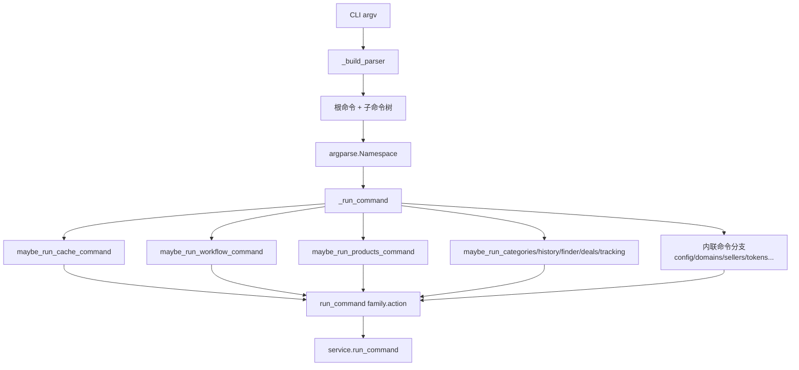
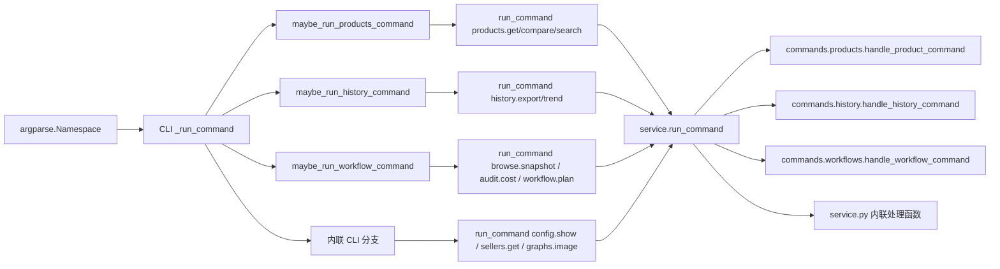

这一页只解释 **CLI 命令解析层本身**：也就是 `argparse` 参数是如何被组织起来的、不同命令族为什么被拆到 `cli_builders/*`、以及 `keepa_cli/cli.py` 如何把解析结果转成统一的 `run_command("family.action", params)` 调用。它不展开服务层内部业务逻辑，也不讨论 HTTP 请求执行细节；那属于后续页面 [服务层中枢：run_command 如何统一业务命令、配置命令与本地工具命令](16-fu-wu-ceng-zhong-shu-run_command-ru-he-tong-ye-wu-ming-ling-pei-zhi-ming-ling-yu-ben-di-gong-ju-ming-ling) 的范围。 Sources: [cli.py](keepa_cli/cli.py#L47-L190), [service.py](keepa_cli/service.py#L480-L607)

## 核心结论：解析层被拆成“语法构建”与“命令分发”两类职责

这个仓库没有把 CLI 写成一个巨大的单文件 `if/elif` 参数地狱，而是明确分成两部分：第一部分是 **参数构建器**，负责注册子命令、定义选项、声明帮助信息；第二部分是 **命令分发表**，负责读取 `argparse.Namespace`，拼出规范化的 `command` 字符串和参数字典，再交给统一服务入口。`cli_builders/__init__.py` 明确把自己标记为“argparse 命令族构造器包入口”，而 `commands/__init__.py` 则标记为“service handler 包入口”，这两个命名空间本身就是职责隔离的证据。 Sources: [cli_builders __init__.py](keepa_cli/cli_builders/__init__.py#L1-L8), [commands __init__.py](keepa_cli/commands/__init__.py#L1-L8)

这种拆分的意义在于：**CLI 层只负责把人类输入翻译成稳定的内部命令协议**，而不是直接承载领域逻辑。比如 `products get`、`finder query`、`history export` 这些命令，在解析层中都只做“参数 → 规范化字典”的转换；真正决定如何构造 `/product` 或 `/search` 请求、何时生成 Agent 视图、如何处理缓存与预算的，是服务层与命令处理器，而不是 `argparse` 本身。 Sources: [products builder](keepa_cli/cli_builders/products.py#L100-L207), [products command handler](keepa_cli/commands/products.py#L28-L153), [commands common](keepa_cli/commands/common.py#L44-L115)

## 结构总览

先看解析层的关系图。阅读这个图时，可以把它理解成三段流水线：**定义语法**、**选择分发表分支**、**提交统一命令名**。其中 `cli_builders/*` 决定“用户能输入什么”，`_run_command` 决定“这些输入映射成什么内部命令”，而 `service.run_command` 决定“这个内部命令由谁处理”。 Sources: [cli.py](keepa_cli/cli.py#L47-L190), [cli.py](keepa_cli/cli.py#L203-L421), [service.py](keepa_cli/service.py#L480-L607)

## 参数构建器的职责：声明命令语法，而不是执行业务

`keepa_cli/cli.py` 中的 `_build_parser()` 先定义全局标志，例如 `--json`、`--stdio`、`--mcp`、`--yes`，然后只保留少量顶层命令定义；更大规模的命令族则通过 `add_cache_parser`、`add_workflow_parsers`、`add_products_parser`、`add_categories_parser` 等函数挂接进来。这说明顶层文件的职责是 **组合 parser**，不是亲自维护每个命令族的所有参数细节。 Sources: [cli.py](keepa_cli/cli.py#L47-L190)

在各个 builder 模块里，模式非常一致：`add_xxx_parser(...)` 只向 `subparsers` 注册子命令和参数，不发请求、不读取 fixture、不直接操作 KeepaClient。例如 `add_products_parser()` 只是定义 `products get/compare/search/by-code/summary` 的参数集合，包括 `--full`、`--history`、`--offers`、`--agent-view`、`--view`、`--history-limit` 等选项。文件头注释也明确写着“只处理 CLI 参数，不访问真实 Keepa API”。 Sources: [products builder](keepa_cli/cli_builders/products.py#L1-L99)

同样的模式也出现在其他命令族中。`deals` builder 只注册 `query` 所需的 `--selection-file`、`--domain`、`--fixture` 等参数；`finder` builder 只注册 `query` 参数；`history` builder 只注册 `export` 与 `trend` 的命令语法；`workflows` builder 只注册本地工具链如 `browse`、`batch`、`templates`、`reports`、`audit`、`workflow`。这些文件共同形成了“按命令族拆分语法定义”的模块边界。 Sources: [deals builder](keepa_cli/cli_builders/deals.py#L17-L46), [finder builder](keepa_cli/cli_builders/finder.py#L17-L48), [history builder](keepa_cli/cli_builders/history.py#L17-L78), [workflows builder](keepa_cli/cli_builders/workflows.py#L19-L136)

## 共享参数抽取：重复选项不在每个命令族里手工复制

解析层不仅拆分了命令族，还把横切参数抽到了 `cli_builders/common.py`。其中 `add_live_cache_options(parser)` 统一注册 `--cache-ttl` 与 `--no-cache`，`live_cache_params(args)` 统一从 `Namespace` 中提取它们。这意味着多个命令族可以共享完全一致的缓存控制语义，而不需要在每个 builder 里各自抄一遍参数定义和取值逻辑。 Sources: [cli_builders common](keepa_cli/cli_builders/common.py#L13-L22)

这个共享抽取非常关键，因为解析层真正追求的不是“少几行代码”，而是 **同名选项在所有命令中的含义保持一致**。例如 `products get`、`deals query`、`finder query`、`history export` 都会调用 `add_live_cache_options(...)`，并在分发时用 `**live_cache_params(args)` 注入统一参数键。这种做法减少了命令之间的漂移风险。 Sources: [products builder](keepa_cli/cli_builders/products.py#L53-L54), [deals builder](keepa_cli/cli_builders/deals.py#L20-L26), [finder builder](keepa_cli/cli_builders/finder.py#L20-L27), [history builder](keepa_cli/cli_builders/history.py#L21-L40)

## 命令分发表的职责：把 Namespace 归一化为内部命令协议

参数解析完成后，真正的“分发表”位于 `keepa_cli/cli.py::_run_command()`。它先处理少量顶层命令如 `doctor`、`capabilities`、`tui`、`domains list`，然后按顺序调用 `maybe_run_cache_command`、`maybe_run_workflow_command`、`maybe_run_products_command`、`maybe_run_categories_command`、`maybe_run_history_command`、`maybe_run_finder_command`、`maybe_run_deals_command`、`maybe_run_tracking_command`。每个 `maybe_run_*` 只做一件事：如果当前 `args` 属于自己，就构造 `run_command("family.action", params)` 并返回；否则返回 `None`，让下一个分支继续尝试。 Sources: [cli.py](keepa_cli/cli.py#L203-L255)

这个设计本质上是一个 **可扩展的链式分发器**。与其把所有命令写成单个文件中的数百个 `if args.command == ...`，仓库把“某个命令族的 CLI 参数映射”封装在对应 builder 模块里的 `maybe_run_*` 函数中。这样，新增一个命令族时，只要在 `_build_parser()` 中注册 `add_xxx_parser(...)`，并在 `_run_command()` 中插入一次 `maybe_run_xxx_command(args)` 调用，就能把新族接入整个 CLI。 Sources: [cli.py](keepa_cli/cli.py#L88-L95), [cli.py](keepa_cli/cli.py#L225-L255), [products builder](keepa_cli/cli_builders/products.py#L100-L207)

`products` 命令族很好地展示了这种映射方式。比如 `products summary` 并没有调用一个新的 CLI 专属服务，而是被规范化成 `run_command("products.get", {..., "agent_view": True, "view": args.view, ...})`；`products by-code` 也被归并到 `products.get`，只是传入 `code` 和 `code_limit`。这说明分发表的价值不只是“转发”，还包括 **把多个 CLI 表达方式归一到更少的内部命令语义**。 Sources: [products builder](keepa_cli/cli_builders/products.py#L172-L207)

## 分发表不是服务层：它做“翻译”，不做“解释”

虽然 `_run_command()` 和各个 `maybe_run_*` 都会组装字典，但它们并不决定 Keepa API 的最终请求形状。以 `products.get` 为例，CLI 层只把 `args.full`、`args.history`、`args.offers`、`args.temporal_window_days` 等字段原样整理到参数字典里；真正将 `full` 扩展为 `history=1, stats=0, videos=1, aplus=1` 的逻辑，发生在服务处理器共享工具 `product_query_options(params)` 中。换句话说，**解析层传递意图，服务层解释意图**。 Sources: [products builder](keepa_cli/cli_builders/products.py#L101-L133), [commands common](keepa_cli/commands/common.py#L56-L80), [products command handler](keepa_cli/commands/products.py#L48-L63)

这种边界使 CLI 表达和服务实现彼此解耦。`service.run_command()` 会根据内部命令字符串继续分发到 `handle_product_command`、`handle_cache_command`、`handle_workflow_command` 等 service handler，或处理若干内联命令如 `tokens.status`、`graphs.image`、`sellers.get`。因此，CLI 层并不知道 `/product`、`/search`、`/seller` 这些 HTTP endpoint 的全部细节，它只知道自己要发出哪个内部命令名。 Sources: [service.py](keepa_cli/service.py#L490-L599), [products command handler](keepa_cli/commands/products.py#L24-L35)

## 两级分发图：CLI 分发表与 Service 分发表如何衔接

下面这个图有助于区分“解析层分发”和“服务层分发”的边界。阅读时请注意：左半边决定的是 **命令语法属于哪个 family**，右半边决定的是 **内部命令交给哪个 handler**。这两级都叫“分发”，但不是同一个层次。 Sources: [cli.py](keepa_cli/cli.py#L203-L421), [service.py](keepa_cli/service.py#L512-L599)

## 特殊参数解析：局部复杂性被隔离在小函数里

解析层并非完全“无逻辑”。当某些参数需要轻量校验时，仓库倾向于把这类复杂性压缩进小型辅助函数，而不是污染整个分发表。`cli.py` 里的 `_parse_params(raw_params)` 就是例子：它把可重复的 `--param KEY=VALUE` 转成字典，并在格式错误时抛出 `ValueError`。`graphs image` 和 `workflows audit cost` 都复用了这套思路，从而把“参数串解析”与“命令路由”分开。 Sources: [cli.py](keepa_cli/cli.py#L193-L200), [cli.py](keepa_cli/cli.py#L344-L363), [workflows builder](keepa_cli/cli_builders/workflows.py#L109-L120)

`cache` builder 展示了同一种模式的另一种实现。它没有复用 `_parse_params`，而是在自己模块里维护 `_parse_key_value_params(...)`，并在 `cache explain-key` 分支内对 `--json-body` 做 `json.loads`。这说明仓库允许 **命令族内自包含的小型参数预处理**，但仍把这些处理局限在 builder 模块，而不是渗入服务逻辑。 Sources: [cache builder](keepa_cli/cli_builders/cache.py#L42-L89)

## 现状不是“完全抽离”：解析层仍保留一部分内联命令

值得注意的是，这个仓库并没有把所有命令都完全迁移进 `cli_builders/*`。`config`、`domains`、`sellers`、`bestsellers`、`topsellers`、`tokens`、`graphs`、`lightningdeals`、`schema`、`cassettes` 这些命令的 parser 定义仍然在 `cli.py::_build_parser()` 中，而对应的 `_run_command()` 分支也保留在同一文件里。也就是说，当前实现是 **“部分模块化 + 渐进拆分”**，而不是绝对纯粹的全量插件式架构。 Sources: [cli.py](keepa_cli/cli.py#L64-L87), [cli.py](keepa_cli/cli.py#L96-L188), [cli.py](keepa_cli/cli.py#L257-L417)

这与 `cli_builders/__init__.py` 的描述是吻合的：它写的是“为逐步拆分 CLI 子命令提供命名空间”。因此，这里的架构意图不是一次性重写，而是通过 builder 包为命令族拆分提供稳定落点。读代码时应把它理解为 **正在进行中的结构收敛**。 Sources: [cli_builders __init__.py](keepa_cli/cli_builders/__init__.py#L1-L8), [cli.py](keepa_cli/cli.py#L88-L95)

## 模式对照表：参数构建器、CLI 分发表、服务处理器分别负责什么

下表可以把三个容易混淆的层次压缩到一张图里。它的重点不是抽象名词，而是帮助你在读文件时迅速判断“这段代码该出现在哪里”。 Sources: [cli.py](keepa_cli/cli.py#L47-L190), [cli.py](keepa_cli/cli.py#L203-L421), [service.py](keepa_cli/service.py#L480-L607), [products command handler](keepa_cli/commands/products.py#L28-L153)

| 层次 | 主要文件 | 输入 | 输出 | 允许做的事 | 不该做的事 |
|---|---|---|---|---|---|
| 参数构建器 | `keepa_cli/cli_builders/*.py` | `subparsers` / `argparse.ArgumentParser` | 命令语法树 | 注册子命令、选项、帮助文本、局部参数预处理 | 直接访问 Keepa API、直接执行业务逻辑 |
| CLI 分发表 | `keepa_cli/cli.py::_run_command`、`maybe_run_*` | `argparse.Namespace` | `run_command("family.action", params)` | 判断命令归属、整理参数字典、返回统一 exit code/payload | 解释 Keepa endpoint 细节、构造最终业务对象 |
| 服务处理器 | `keepa_cli/service.py`、`keepa_cli/commands/*.py` | 内部命令字符串 + 参数字典 | JSON envelope / 请求执行结果 | 解释语义、选择 handler、转换请求参数、调用 client | 处理终端交互式输入语法 |

## 一个命令族是怎样接入解析层的

从现有模式看，新增命令族的最小接入路径非常清晰：先在 `cli_builders/xxx.py` 中实现 `add_xxx_parser(...)` 和 `maybe_run_xxx_command(...)`；再在 `cli.py::_build_parser()` 调用 `add_xxx_parser(subparsers)`；最后在 `_run_command()` 链中插入 `maybe_run_xxx_command(args)`。这一接入过程只涉及“语法注册”和“Namespace 到内部命令的翻译”，不要求你同时理解全部服务实现。 Sources: [products builder](keepa_cli/cli_builders/products.py#L17-L20), [products builder](keepa_cli/cli_builders/products.py#L100-L207), [cli.py](keepa_cli/cli.py#L88-L95), [cli.py](keepa_cli/cli.py#L225-L255)

这也解释了为什么 `maybe_run_*` 返回类型统一为 `tuple[int, dict[str, Any] | str] | None`：`None` 表示“不是我的命令”，而 `(exit_code, payload)` 表示“我已经完成翻译并调用服务”。这种三态协议让 `_run_command()` 可以像命令分发表一样按顺序短路，而不需要复杂注册表结构。 Sources: [products builder](keepa_cli/cli_builders/products.py#L100-L135), [deals builder](keepa_cli/cli_builders/deals.py#L29-L45), [history builder](keepa_cli/cli_builders/history.py#L43-L77), [cli.py](keepa_cli/cli.py#L225-L255)

## 测试给出的证据：解析层确实在验证“参数暴露”和“稳定翻译”

`tests/test_cli.py` 并不只测“命令能不能跑”，还在验证解析层最重要的契约：一是 `--json` 输出可机器读取；二是 CLI 标志会被正确翻译进请求规格。例如 `test_products_get_cli_exposes_complete_product_flags` 调用 `products get ... --full --days 365 --rating 1 --buybox 1 ... --dry-run`，然后断言 `payload["request"]["params_redacted"]` 中出现了 `history=1`、`stats=0`、`videos=1`、`aplus=1`、`days=365` 等结果。这里测试的核心不是网络，而是 **“这套解析与翻译链是否把语义正确传递下去”**。 Sources: [test_cli.py](tests/test_cli.py#L38-L61), [test_cli.py](tests/test_cli.py#L128-L165)

同一组测试还验证了 `products get` 支持显式缓存控制、`config show` 与 `domains list` 能输出稳定 envelope、以及 fixture 场景下 CLI 命令的可用性。这些都是解析层价值的外部体现：用户看到的是命令行接口一致、自动化系统看到的是命令翻译结果稳定。 Sources: [test_cli.py](tests/test_cli.py#L46-L61), [test_cli.py](tests/test_cli.py#L107-L126), [test_cli.py](tests/test_cli.py#L166-L184)

## 为什么这种职责分离对中级开发者有价值

对于中级开发者，这种设计最直接的收益是 **改动范围可预测**。如果你只是要加一个新选项，通常先看对应 `cli_builders/*.py`；如果你要改 CLI 到内部命令名的映射，看 `maybe_run_*` 或 `_run_command()`；如果你要改实际业务含义，再进入 `service.py` 或 `commands/*.py`。这让“我该改哪里”从猜测变成了明确的分层规则。 Sources: [products builder](keepa_cli/cli_builders/products.py#L17-L99), [cli.py](keepa_cli/cli.py#L203-L421), [service.py](keepa_cli/service.py#L512-L599)

更重要的是，这种分离让 CLI 成为一个 **稳定的翻译边界**。无论调用源头是普通命令行、`--json` 模式，还是后续的 stdio/MCP 入口，仓库都倾向于把高层意图收敛成相同的内部命令名和参数字典，再送进统一服务层。这也是你继续阅读 [高层架构总览：CLI、TUI、stdio、MCP 共用同一命令服务](14-gao-ceng-jia-gou-zong-lan-cli-tui-stdio-mcp-gong-yong-tong-ming-ling-fu-wu) 与 [服务层中枢：run_command 如何统一业务命令、配置命令与本地工具命令](16-fu-wu-ceng-zhong-shu-run_command-ru-he-tong-ye-wu-ming-ling-pei-zhi-ming-ling-yu-ben-di-gong-ju-ming-ling) 时最应该带着的前提。 Sources: [cli.py](keepa_cli/cli.py#L424-L473), [service.py](keepa_cli/service.py#L480-L607)