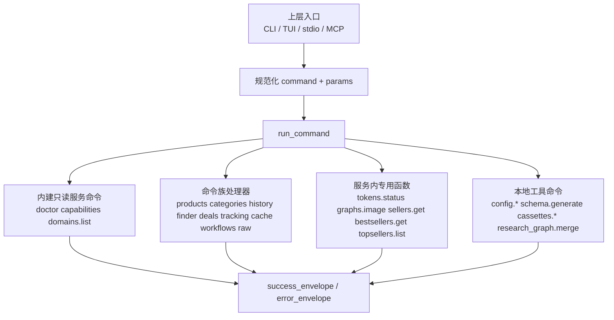
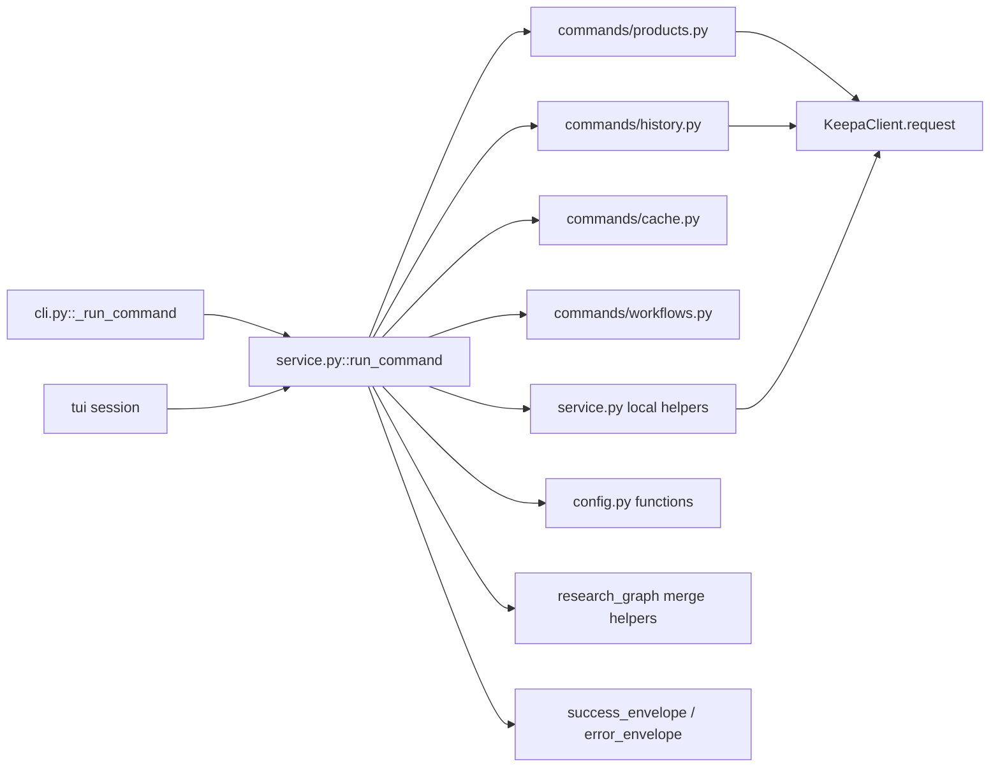

本页位于“深入解析 → 核心执行主线”中的第二站，关注 `keepa_cli.service.run_command()` 这一**服务层中枢**：它不负责参数解析，也不负责终端呈现，而是把上层入口送来的标准化命令名与参数，路由到业务命令族、配置命令和本地工具命令，并统一返回稳定的 JSON envelope。这个页面只解释这一层如何做“统一调度”，不展开 CLI 参数构建细节，也不深入 HTTP 请求执行链本身。Sources: [keepa_cli/service.py](keepa_cli/service.py#L1-L6) [keepa_cli/service.py](keepa_cli/service.py#L480-L608) [keepa_cli/cli.py](keepa_cli/cli.py#L1-L6)

## 先从第一原则理解：run_command 统一的不是“接口形式”，而是“命令语义”

`run_command(command, params, fixture_dir, env)` 的签名很克制：一个命令名、一个参数映射、一个 fixture 根目录和一个环境变量映射。这说明服务层的抽象核心不是 CLI 子命令树，而是**规范化命令字符串**加**纯数据参数**。函数内部首先把 `params` 复制为普通字典，把 `env` 缺省绑定到 `os.environ`，然后进入单个 `try` 块中按命令类别顺序分派；任何 `OSError`、`JSONDecodeError`、`ValueError` 都会被收敛为 `invalid_argument` 错误 envelope，而未命中的命令统一返回 `unsupported_command`。换言之，这一层把多入口世界压平为一个“字符串命令总线”。Sources: [keepa_cli/service.py](keepa_cli/service.py#L480-L608)

上图对应的关键事实是：`run_command` 先处理几个最基础的内建命令，再调用多个 `can_handle_*` / `handle_*` 命令族处理器，然后处理若干直接写在 `service.py` 内部的专用服务函数，最后处理若干本地工具型命令；所有路径都收敛到 envelope 返回值，而不是直接打印或操作终端。Sources: [keepa_cli/service.py](keepa_cli/service.py#L491-L599) [keepa_cli/commands/products.py](keepa_cli/commands/products.py#L21-L35) [keepa_cli/commands/cache.py](keepa_cli/commands/cache.py#L18-L45) [keepa_cli/commands/workflows.py](keepa_cli/commands/workflows.py#L25-L52) [keepa_cli/commands/history.py](keepa_cli/commands/history.py#L21-L33)

## 它在架构上扮演“协议边界”而不是“实现中心”

`service.py` 文件头已经明确其定位：它是 CLI、stdio 与 TUI 共用的 **Agent-safe command service**，职责是把高层命令转换为官方 Keepa endpoint、参数、预算和 envelope，且“不处理终端输入输出，不保存凭据，真实请求统一委托 KeepaClient”。这意味着 `run_command` 的价值不在于自己实现全部业务，而在于**为不同入口提供相同协议语义**：相同命令名，得到相同 envelope、相同错误模型、相同预算信息。Sources: [keepa_cli/service.py](keepa_cli/service.py#L1-L6)

这一边界在 CLI 里也被严格遵守。`keepa_cli/cli.py` 负责 `argparse` 子命令树与参数收集，但在 `_run_command()` 里，绝大多数实际行为都被转换成对 `run_command(...)` 的调用，例如 `doctor`、`domains.list`、`config.*`、`sellers.get`、`bestsellers.get`、`tokens.status`、`graphs.image`、`schema.generate`、`cassettes.*`。CLI 只决定“如何把人类输入规范化”，服务层才决定“这个命令到底意味着什么”。Sources: [keepa_cli/cli.py](keepa_cli/cli.py#L203-L399)

同样的分层也体现在 TUI 测试里。标准库 TUI 的测试并不验证它直接访问底层实现，而是验证它通过命令服务执行 `/doctor`、`/product`、`/history`、`/tokens`、`/graph`、`/lightningdeals` 等操作，并且连未知命令也能得到结构化 `unsupported_command` 错误摘要。这从侧面证明：**服务层是人机界面与业务能力之间的唯一稳定契约点**。Sources: [tests/test_tui.py](tests/test_tui.py#L15-L84)

## 路由机制不是注册表，而是“有序判定链”

`run_command` 当前采用的是**显式 if/elif 有序判定链**，而不是字典注册表。顺序非常重要：先处理 `doctor`、`capabilities`、`domains.list` 这类零依赖基础命令；然后依次判断 cache、workflow、products、categories、tracking、config、raw、tokens、graphs、lightningdeals、finder、deals、sellers、bestsellers、topsellers、history、schema、cassettes、research_graph；任何一步命中后立即返回。Sources: [keepa_cli/service.py](keepa_cli/service.py#L491-L599)

这种设计的直接效果是：**命令家族的边界是可见的、静态的、源码可审计的**。例如 `products.*` 不由 `service.py` 手写分支细节，而是通过 `can_handle_product_command()` 和 `handle_product_command()` 转发；`cache.*`、`workflows.*`、`history.*` 也是同样模式。反过来，像 `config.show` 或 `research_graph.merge` 这样更接近本地工具的命令，则直接在 `service.py` 中完成组装。统一入口之下，内部仍允许不同复杂度的实现策略并存。Sources: [keepa_cli/service.py](keepa_cli/service.py#L512-L599) [keepa_cli/commands/products.py](keepa_cli/commands/products.py#L24-L35) [keepa_cli/commands/cache.py](keepa_cli/commands/cache.py#L42-L55) [keepa_cli/commands/workflows.py](keepa_cli/commands/workflows.py#L48-L52) [keepa_cli/commands/history.py](keepa_cli/commands/history.py#L24-L33)

## 三类统一对象：业务命令、配置命令、本地工具命令

从 `run_command` 的分派代码可以清楚看出，它统一的对象至少有三类：第一类是**业务命令**，即需要构造 Keepa 请求或对 Keepa 响应做领域变换的命令，如 `products.get`、`categories.search`、`history.export`、`deals.*`、`finder.*`、`tracking.*`、`sellers.get`、`bestsellers.get`；第二类是**配置命令**，即 `config.show/init/set-token/set-language/set-max-tokens`；第三类是**本地工具命令**，如 `cache.*`、`schema.generate`、`cassettes.sanitize/promote`、`research_graph.merge`、`workflow.plan`、`reports.build` 等，它们不一定访问网络，但仍通过同一服务接口返回结果。Sources: [keepa_cli/service.py](keepa_cli/service.py#L512-L599) [keepa_cli/commands/cache.py](keepa_cli/commands/cache.py#L18-L27) [keepa_cli/commands/workflows.py](keepa_cli/commands/workflows.py#L25-L33)

| 类别 | 典型命令 | 主要实现位置 | 是否可能访问 Keepa API | 返回形式 |
|---|---|---|---|---|
| 业务命令 | `products.get`、`categories.get`、`history.trend`、`sellers.get` | `keepa_cli/commands/*.py` 与 `service.py` 局部函数 | 可能，会透传到 `KeepaClient` | envelope |
| 配置命令 | `config.show`、`config.init`、`config.set-token` | `keepa_cli/service.py` + `keepa_cli/config.py` | 否 | envelope |
| 本地工具命令 | `cache.stats`、`schema.generate`、`cassettes.promote`、`research_graph.merge` | `keepa_cli/commands/cache.py`、`keepa_cli/commands/workflows.py`、`keepa_cli/service.py` | 否 | envelope |

这个分类的重要性在于：上层入口不需要知道命令背后是网络请求、配置写入还是本地 JSON 处理；它只需要把命令交给 `run_command`。这正是“统一服务中枢”成立的条件。Sources: [keepa_cli/service.py](keepa_cli/service.py#L491-L599) [keepa_cli/commands/cache.py](keepa_cli/commands/cache.py#L55-L95) [keepa_cli/commands/workflows.py](keepa_cli/commands/workflows.py#L52-L106)

## 业务命令的统一方式：命令族处理器负责领域实现，run_command 负责总线转发

以 `products` 命令族为例，`run_command` 不直接拼装 `/product` 请求，而是判断 `can_handle_product_command(command)`，再调用 `handle_product_command(command, params, fixture_dir=...)`。在 `products.py` 内部，`products.get`、`products.compare`、`products.search` 各自负责参数校验、域名解析、请求参数构造、调用 `client(fixture_dir).request(...)` 以及可选的 Agent 视图转换。也就是说，**服务中枢统一的是路由协议，业务细节下沉到命令族模块**。Sources: [keepa_cli/service.py](keepa_cli/service.py#L516-L519) [keepa_cli/commands/products.py](keepa_cli/commands/products.py#L28-L88) [keepa_cli/commands/products.py](keepa_cli/commands/products.py#L91-L152)

这种模式在 `history` 命令族里更明显。`run_command` 只负责把 `history.export` 或 `history.trend` 转交 `handle_history_command(...)`；后者先复用 `_history_product_payload()` 统一生成 `/product` + `history=1` 请求，再基于返回 payload 提取产品、抽取历史行、构造导出或分析结果，并把原始请求与 token bucket 信息保留到新的 envelope 中。统一入口之下，命令族内部可以继续形成自己的小型执行流水线。Sources: [keepa_cli/service.py](keepa_cli/service.py#L590-L591) [keepa_cli/commands/history.py](keepa_cli/commands/history.py#L28-L33) [keepa_cli/commands/history.py](keepa_cli/commands/history.py#L59-L189)

## 配置命令的统一方式：run_command 直接包裹本地配置 API

配置命令与业务命令不同，它们不需要命令族中间层，而是在 `run_command` 中直接转发到 `build_config_report()`、`init_config()`、`set_api_token()`、`set_language()`、`set_max_tokens_per_request()`。每个结果都被 `success_envelope(...)` 包装，并把 `request.transport` 固定为 `"service"`；对于会写文件的命令，还把 `dry_run` 状态放进 `request` 字段。Sources: [keepa_cli/service.py](keepa_cli/service.py#L522-L571)

这种写法说明配置命令被视为**服务层内建控制面能力**。它们与业务命令共享调用形式和 envelope，但不共享网络客户端。测试也证明这些配置 API 本身关注的是本地配置有效性、默认值、redaction 与 dry-run 行为，例如默认配置报告不暴露密钥、写入 token 后报告中仍显示 `[REDACTED]`、非法语言或非法 token 会抛出 `ValueError`。当这些异常沿 `run_command` 传播时，会被统一转换为 `invalid_argument` 错误 envelope。Sources: [keepa_cli/service.py](keepa_cli/service.py#L600-L601) [tests/test_config.py](tests/test_config.py#L24-L120)

## 本地工具命令的统一方式：让“非 Keepa API 能力”也服从同一服务契约

`cache.*` 是最典型的本地工具命令族。`run_command` 一旦命中 `can_handle_cache_command(command)`，就调用 `handle_cache_command(command, params, env=env)`；后者再分派到 `explain_cache`、`explain_cache_key`、`cache_stats`、`inspect_cache`、`prune_expired_cache`、`clear_cache`，最后统一用 `success_envelope` 返回。这类命令既不碰 `fixture_dir`，也不走 `KeepaClient`，但从调用者视角看，它们与 `products.get` 没有协议差异。Sources: [keepa_cli/service.py](keepa_cli/service.py#L512-L513) [keepa_cli/commands/cache.py](keepa_cli/commands/cache.py#L55-L95)

测试进一步表明，这种统一不是表面包装，而是实际可替换的服务体验：调用者可以对 `run_command("cache.stats", {"cache_path": ...})`、`run_command("cache.clear", ...)`、`run_command("cache.inspect", ...)` 进行断言，就像对产品查询命令做断言一样；环境变量 `KEEPA_CLI_CACHE_PATH` 也通过 `env` 参数显式注入，而不是偷偷读取真实运行环境。服务中枢因此同时承担了**命令统一**与**可测试性隔离**。Sources: [tests/test_cache.py](tests/test_cache.py#L180-L253) [keepa_cli/commands/cache.py](keepa_cli/commands/cache.py#L46-L52)

类似地，`schema.generate`、`cassettes.sanitize`、`cassettes.promote`、`research_graph.merge` 都在 `service.py` 内部直接完成本地文件处理或 JSON 合并，然后返回 envelope。特别是 `research_graph.merge` 完全不依赖网络，它从 `graph/graphs` 内联参数或输入文件中提取研究图谱，执行合并、生成 summary/diagnostics/source 列表，并可选写出到本地文件；但对上层入口来说，它仍只是一个普通的 `run_command("research_graph.merge", ...)`。Sources: [keepa_cli/service.py](keepa_cli/service.py#L354-L408) [keepa_cli/service.py](keepa_cli/service.py#L411-L477) [keepa_cli/service.py](keepa_cli/service.py#L592-L599)

## 为什么有些命令在命令族模块里，有些命令直接写在 service.py

从代码分布可以验证一个清晰模式：当一组命令共享稳定前缀与较多领域逻辑时，会被提取到 `keepa_cli/commands/*.py` 命令族模块中，如 `products`、`history`、`cache`、`workflows`；当命令数量较少、语义孤立，或更像服务层拼装器时，则直接保留在 `service.py` 的局部函数中，例如 `_tokens_status()`、`_graph_image()`、`_seller_get()`、`_bestsellers_get()`、`_topsellers_list()`、`_schema_generate()`、`_research_graph_merge()`。这不是风格不一致，而是按复用密度和复杂度分层。Sources: [keepa_cli/service.py](keepa_cli/service.py#L64-L155) [keepa_cli/service.py](keepa_cli/service.py#L171-L351) [keepa_cli/service.py](keepa_cli/service.py#L354-L477) [keepa_cli/commands/products.py](keepa_cli/commands/products.py#L21-L35) [keepa_cli/commands/history.py](keepa_cli/commands/history.py#L21-L33) [keepa_cli/commands/cache.py](keepa_cli/commands/cache.py#L18-L27)

| 放置位置 | 命令形态 | 代码特征 | 示例 |
|---|---|---|---|
| `keepa_cli/commands/*.py` | 成族命令 | 有 `COMMANDS` 集合、`can_handle()`、`handle_*()` | `products.*`、`history.*`、`cache.*`、`workflow.*` |
| `keepa_cli/service.py` 局部函数 | 单点或小簇命令 | 直接在服务层内拼装 envelope 或少量请求 | `tokens.status`、`graphs.image`、`sellers.get`、`schema.generate` |

这个划分对理解 `run_command` 很关键：它不是“所有实现都在一个大函数里”，而是“所有能力都在一个统一入口里”。Sources: [keepa_cli/service.py](keepa_cli/service.py#L480-L599) [keepa_cli/commands/workflows.py](keepa_cli/commands/workflows.py#L25-L52)

## 参数统一策略：服务层接受“多别名映射”，而不是入口特定对象

`run_command` 自身只要求 `params` 是一个映射，但其下游处理器普遍通过 `param()`、`bool_option()`、`as_list()` 等工具读取多种命名形式，例如 `stats_window` 与 `stats-window`、`chunks_dir` 与 `chunks-dir`、`dry_run` 与 `dry-run`。`service.py` 自己也接受别名命令，如 `config.set_token` 与 `config.set-token`、`topseller.list` 与 `topsellers.list`、`graph.image` 与 `graphs.image`。这使得不同入口可以按各自习惯生成参数键与命令别名，而服务层仍能把它们规范到同一语义。Sources: [keepa_cli/service.py](keepa_cli/service.py#L536-L599) [keepa_cli/commands/common.py](keepa_cli/commands/common.py#L22-L54) [keepa_cli/commands/common.py](keepa_cli/commands/common.py#L56-L95)

这种统一并非抽象概念，而是直接服务于多入口接入。CLI 在 `_run_command()` 中构造的是 Python 友好的 snake_case 参数，如 `dry_run`、`max_tokens`、`tests_dir`；而命令处理器内部又能识别 kebab-case 等替代命名。服务层因此不把任何单一入口的命名约束泄漏到整体系统。Sources: [keepa_cli/cli.py](keepa_cli/cli.py#L257-L399) [keepa_cli/commands/common.py](keepa_cli/commands/common.py#L44-L95)

## 返回值统一策略：不论命令类型，最终都回到 envelope

配置命令和本地工具命令几乎都显式用 `success_envelope(...)` 包装返回；业务命令如果走 `KeepaClient.request(...)`，也会返回同样结构的 payload，并在上层继续附加输出文件信息、研究图谱或 Agent 视图。`run_command` 对成功与失败路径都采用 envelope 模式，因此调用方可以只依据 `payload["ok"]`、`payload["command"]`、`payload["data"]`、`payload["error"]`、`payload["request"]`、`payload["token_bucket"]` 来消费结果，而不必关心它来自网络、本地文件还是配置系统。Sources: [keepa_cli/service.py](keepa_cli/service.py#L491-L599) [keepa_cli/commands/products.py](keepa_cli/commands/products.py#L55-L88) [keepa_cli/commands/cache.py](keepa_cli/commands/cache.py#L89-L95) [keepa_cli/commands/history.py](keepa_cli/commands/history.py#L158-L189)

测试中的断言也都围绕这一统一结构展开。例如 `products.get` 测试检查 `payload["command"]`、`payload["request"]["endpoint"]`、`payload["token_bucket"]["estimated"]` 和 `payload["data"]["body"]`；`cache.explain-key` 测试检查 `payload["data"]["cache_key"]`；TUI 对未知命令则只读取 envelope 中的 `unsupported_command` 信息进行摘要展示。这说明 envelope 不是附属格式，而是 `run_command` 统一能力的真正输出契约。Sources: [tests/test_service_commands.py](tests/test_service_commands.py#L19-L57) [tests/test_cache.py](tests/test_cache.py#L180-L218) [tests/test_tui.py](tests/test_tui.py#L42-L48)

## 预算与确认逻辑也被纳入统一服务层语义

虽然预算估算的具体算法不在本页展开，但就服务层边界而言，`run_command` 统一了“命令执行前的可拒绝语义”。例如 `_graph_image()` 在非 dry-run、非 fixture 且未提供 `out` 时，直接根据 `estimate_request_budget("graphs.image", request_params)` 返回 `binary_output_path_required` 错误 envelope；`_bestsellers_get()` 与 `_topsellers_list()` 则在真正请求前调用 `_confirmation_required(...)`，必要时返回 `confirmation_required` 错误，而不是把高成本决策丢给上层入口。Sources: [keepa_cli/service.py](keepa_cli/service.py#L76-L136) [keepa_cli/service.py](keepa_cli/service.py#L225-L250) [keepa_cli/service.py](keepa_cli/service.py#L297-L317) [keepa_cli/commands/common.py](keepa_cli/commands/common.py#L98-L115)

这说明 `run_command` 统一的不只是成功路径，还统一了**命令前置门禁**。TUI 测试里，`/bestsellers ... --dry-run` 能显示 `estimated=50 worst=50 confirm=True` 的预算提示，正是因为服务层已经把预算语义嵌入返回结果，而界面层只是负责呈现。Sources: [tests/test_tui.py](tests/test_tui.py#L60-L66) [keepa_cli/service.py](keepa_cli/service.py#L238-L240)

## env 与 fixture_dir 注入让同一命令既能在线，也能离线，还能稳定测试

`run_command` 的两个关键依赖注入口是 `fixture_dir` 与 `env`。前者向业务命令透传离线 fixture 根目录，使 `client(fixture_dir).request(...)` 能稳定复用测试夹具；后者则供配置与缓存等本地命令读取环境配置，而不依赖进程真实环境。`products.get`、`history.export` 等测试都显式传入 `fixture_dir=tests/fixtures`，`cache.stats` 测试则显式传入 `env={}` 或定制 `KEEPA_CLI_CACHE_PATH`。Sources: [keepa_cli/service.py](keepa_cli/service.py#L480-L489) [keepa_cli/commands/common.py](keepa_cli/commands/common.py#L83-L85) [tests/test_service_commands.py](tests/test_service_commands.py#L19-L39) [tests/test_cache.py](tests/test_cache.py#L37-L62) [tests/test_cache.py](tests/test_cache.py#L247-L253)

从统一服务的角度看，这种设计非常关键：**调用协议固定，执行环境可替换**。同一个 `run_command("products.get", ...)` 可以在 dry-run、fixture、真实环境之间切换，而不改变调用方式；同一个 `run_command("cache.stats", ...)` 也可以在测试临时 SQLite 路径与真实用户路径之间切换，而不改变命令语义。Sources: [keepa_cli/commands/products.py](keepa_cli/commands/products.py#L54-L63) [keepa_cli/commands/cache.py](keepa_cli/commands/cache.py#L46-L52) [tests/test_cache.py](tests/test_cache.py#L194-L253)

## 类/模块交互图：谁决定“调用”，谁决定“实现”

这张图反映出一个稳定分工：入口层只负责把外部输入转成命令调用；`run_command` 负责统一调度；命令族或局部 helper 负责实现；最后由 envelope 模块统一输出。这也是为什么 CLI、TUI、以及其他 Agent 接入面都能复用同一服务内核。Sources: [keepa_cli/cli.py](keepa_cli/cli.py#L203-L399) [keepa_cli/service.py](keepa_cli/service.py#L480-L608) [keepa_cli/commands/products.py](keepa_cli/commands/products.py#L28-L88) [keepa_cli/commands/history.py](keepa_cli/commands/history.py#L139-L189)

## 失败模型：把实现差异收敛成少量稳定错误语义

`run_command` 末尾有两道统一失败出口。第一道是 `except (OSError, json.JSONDecodeError, ValueError) as exc`，无论异常来自配置写入、JSON 读取、参数转换还是本地文件操作，都会被包装成 `kind="invalid_argument"` 的错误 envelope。第二道是在所有分支都未命中时，返回 `kind="unsupported_command"`。这让调用方不需要理解每个内部模块的异常类型体系。Sources: [keepa_cli/service.py](keepa_cli/service.py#L600-L607)

这种收敛对多入口尤其重要。TUI 的未知命令测试正是依赖 `unsupported_command` 这一统一语义，而配置模块中的 `ValueError` 也能被服务层吸收，不会把 Python 异常栈暴露给调用方。`run_command` 在这里扮演的是**错误语义压缩器**。Sources: [tests/test_tui.py](tests/test_tui.py#L42-L48) [tests/test_config.py](tests/test_config.py#L78-L120) [keepa_cli/service.py](keepa_cli/service.py#L600-L607)

## 通过测试反推其设计目标：服务层是“可脚本化、可断言、可复用”的中间平面

`tests/test_service_commands.py` 大量直接调用 `run_command(...)`，覆盖产品、分类、历史导出、趋势分析、Agent 视图、大响应输出等场景；`tests/test_cache.py` 直接覆盖缓存工具命令；`tests/test_tui.py` 间接验证 TUI 会话仍经由服务层得到一致结果。测试组织方式本身就是架构证据：项目把 `run_command` 当作**高价值、稳定、跨入口的测试目标**，而不是某个仅供 CLI 内部使用的帮助函数。Sources: [tests/test_service_commands.py](tests/test_service_commands.py#L18-L359) [tests/test_cache.py](tests/test_cache.py#L21-L253) [tests/test_tui.py](tests/test_tui.py#L15-L84)

换句话说，如果要理解 Keepa CLI 的“统一服务内核”究竟落在什么地方，答案不是命令行 parser，也不是 HTTP client，而是这一层：它把业务命令、配置命令、本地工具命令都变成统一的、可程序消费的命令服务。上层入口越多，这一层的价值越高。Sources: [keepa_cli/service.py](keepa_cli/service.py#L1-L6) [keepa_cli/service.py](keepa_cli/service.py#L480-L608)

## 你在这里之后，下一步最适合阅读什么

如果你已经理解 `run_command` 如何做统一分派，下一页最自然的延伸是看它下游真正如何执行 Keepa 请求与封装响应，即 [HTTP 客户端执行链：鉴权、预算估算、脱敏、网络请求与错误封装](17-http-ke-hu-duan-zhi-xing-lian-jian-quan-yu-suan-gu-suan-tuo-min-wang-luo-qing-qiu-yu-cuo-wu-feng-zhuang)。如果你想回看它的上游输入如何被标准化，则应返回 [命令解析层：参数构建器与命令分发表的职责分离](15-ming-ling-jie-xi-ceng-can-shu-gou-jian-qi-yu-ming-ling-fen-fa-biao-de-zhi-ze-fen-chi)。如果你更关心统一返回结构为何适合 Agent 消费，则继续阅读 [JSON Envelope 规范：稳定输出、错误模型与 Agent 友好响应](18-json-envelope-gui-fan-wen-ding-shu-chu-cuo-wu-mo-xing-yu-agent-you-hao-xiang-ying)。Sources: [keepa_cli/cli.py](keepa_cli/cli.py#L203-L399) [keepa_cli/service.py](keepa_cli/service.py#L480-L608)