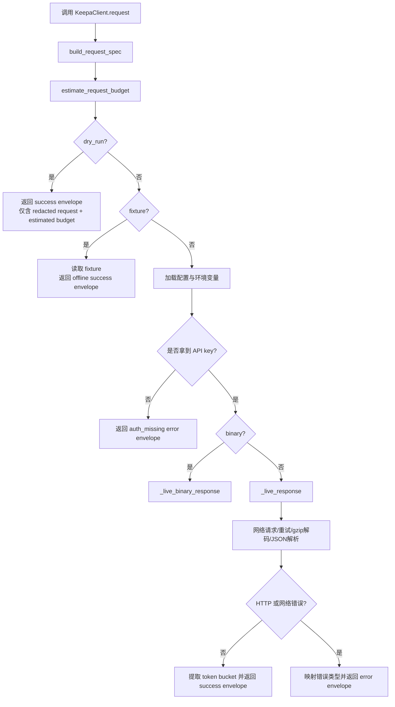
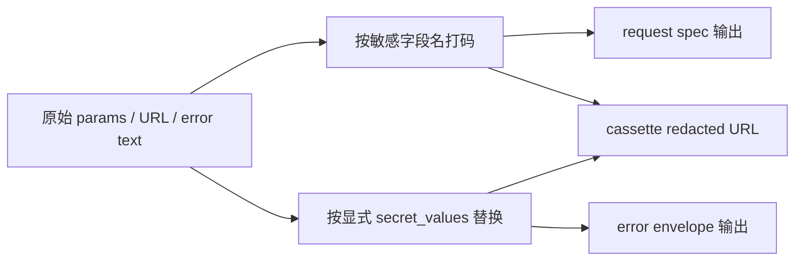

这一页只解释 **`KeepaClient.request()` 驱动的 HTTP 客户端执行链**：请求规格如何先被标准化，何时进行 token 预算估算，live 请求如何解析鉴权来源，哪些位置会执行脱敏，真实网络调用如何处理 gzip、重试与二进制响应，以及最终怎样被封装成稳定的 success/error envelope。这里不展开 CLI 命令分发、缓存持久化策略或更高层成本治理，只聚焦客户端内部这一条执行主线。Sources: [client.py](keepa_cli/client.py#L44-L146) [request_spec.py](keepa_cli/request_spec.py#L16-L52) [token_budget.py](keepa_cli/token_budget.py#L176-L231) [envelope.py](keepa_cli/envelope.py#L15-L55)

## 从第一原则看这条执行链

`KeepaClient` 的设计目标不是“尽快发一个 HTTP 请求”，而是先把一次调用拆成几个可验证阶段：**构建可审计的请求规格**、**给出本地预算估算**、**根据执行模式选择 dry-run / fixture / live 分支**、**在 live 分支上解析凭据并发起网络请求**、**将响应或错误统一折叠为 Agent 稳定 envelope**。因此，`request()` 的返回值不是原始响应对象，而是已经带有 `request`、`token_bucket` 与 `data`/`error` 的 JSON 结构。Sources: [client.py](keepa_cli/client.py#L62-L146) [envelope.py](keepa_cli/envelope.py#L15-L55)

上图体现的关键点是：**预算估算发生在任何真实请求之前**，而 **脱敏既发生在请求规格阶段，也发生在错误输出阶段**。这使 dry-run、fixture 与 live 三条路径虽然执行成本不同，但都能产出同一类外部契约。Sources: [client.py](keepa_cli/client.py#L80-L118) [request_spec.py](keepa_cli/request_spec.py#L24-L52) [redaction.py](keepa_cli/redaction.py#L13-L40) [tests/test_client.py](tests/test_client.py#L52-L68)

## 执行阶段总览

下表概括了 `request()` 内部各阶段的职责边界，便于把“鉴权、预算、脱敏、网络与错误封装”看成一条连续流水线，而不是若干分散工具函数。Sources: [client.py](keepa_cli/client.py#L62-L146)

| 阶段 | 入口/函数 | 输入重点 | 输出重点 | 是否触网 |
|---|---|---|---|---|
| 请求规格构建 | `build_request_spec()` | `method`、`path`、`params`、`json_body` | `endpoint`、`params_redacted`、`json_body_redacted` | 否 |
| 预算估算 | `estimate_request_budget()` | `command`、`params` | `estimated_tokens`、`worst_case_tokens`、`requires_confirmation` | 否 |
| 模式分流 | `KeepaClient.request()` | `dry_run`、`fixture`、`binary` | 决定走 dry-run / fixture / live / live-binary | 否 |
| 鉴权解析 | `KeepaClient.request()` | `params`、环境变量、配置文件 | 写回 `params["key"]` 或返回 `auth_missing` | 否 |
| live 网络调用 | `_live_response()` / `_live_binary_response()` | URL、headers、可选 JSON body | JSON body 或二进制文件输出 | 是 |
| 错误封装 | `_http_error_envelope()` / `error_envelope()` | `HTTPError` / `URLError` / 解析异常 | 稳定 `error.kind/message/details` | 否 |

## 阶段一：请求规格先行，先产生可审计对象

在真正考虑 API key 之前，`request()` 先调用 `build_request_spec()`，把 `method` 统一大写，把 `path` 规范成以 `/` 开头的 `endpoint`，并将原始 `params`、`json_body` 保存在 `RequestSpec` 中。真正用于外部返回的是 `to_dict()` 结果，其中 `params_redacted` 与 `json_body_redacted` 会经过 `redact_value()` 处理，因此规范输出从一开始就是“可展示的请求形状”，而不是“可直接重放的明文请求”。Sources: [client.py](keepa_cli/client.py#L78-L88) [request_spec.py](keepa_cli/request_spec.py#L16-L52) [redaction.py](keepa_cli/redaction.py#L24-L40)

`redact_value()` 的策略非常直接：如果键名命中 `key`、`api_key`、`apikey`、`token`、`authorization` 之一，则整项值替换为 `[REDACTED]`；如果是字符串，还会把传入的显式 secret 值逐个替换掉。这意味着脱敏既支持 **按字段名打码**，也支持 **按具体 secret 文本做全量替换**，后者主要用于错误消息和 URL 之类的字符串上下文。Sources: [redaction.py](keepa_cli/redaction.py#L13-L40) [envelope.py](keepa_cli/envelope.py#L31-L55)

测试也验证了这个前置阶段的契约：当 dry-run 请求里显式传入 `key=SECRET123` 时，最终 JSON 编码后的 payload 中不应出现该明文，而且 `params_redacted["key"]` 必须是 `[REDACTED]`。这说明请求规格并不是“调试便利输出”，而是被测试锁定的稳定接口。Sources: [tests/test_request_spec.py](tests/test_request_spec.py#L13-L28) [tests/test_client.py](tests/test_client.py#L52-L68)

## 阶段二：预算估算先于鉴权与网络

`request()` 在拿到 `RequestSpec` 之后，立刻执行 `estimate_request_budget(command, params)`，并把结果转成字典。这个顺序很重要：即使后续因为没有 API key 而无法发 live 请求，调用者仍能得到一份 **估算成本**，因此“鉴权失败”不会破坏“成本可见性”。Sources: [client.py](keepa_cli/client.py#L80-L118) [token_budget.py](keepa_cli/token_budget.py#L176-L231)

对 `products.get`、`product.get`、`products.compare` 这类产品请求，预算器先按 `asin/asins` 或 `code/codes` 计算产品数，基础成本按每个产品 1 token 估算；若显式请求 `offers`，则按照 Keepa 的分页模型计算额外成本，每页最多 10 个 offers、每页 6 tokens；若显式开启 `rating` 或 `buybox`，则分别按产品数叠加额外成本；若 `update=0`，则不会增加 estimated 值，但会提高 worst-case，因为这可能触发强制刷新。Sources: [token_budget.py](keepa_cli/token_budget.py#L61-L143)

预算对象本身不是一个单数字段，而是由 `estimated_tokens`、`worst_case_tokens`、`requires_confirmation`、`components`、`notes` 组成。它试图回答的不是“这次一定花多少”，而是“**基础成本是多少、最坏上界是多少、哪些参数在抬高风险**”。其中 `requires_confirmation` 会在 offers 或 `update=0` 等情形下置为真。Sources: [token_budget.py](keepa_cli/token_budget.py#L14-L37) [token_budget.py](keepa_cli/token_budget.py#L123-L143)

下表总结了当前页最相关的预算触发模式。Sources: [token_budget.py](keepa_cli/token_budget.py#L61-L143) [tests/test_token_budget.py](tests/test_token_budget.py#L13-L84)

| 请求特征 | estimated | worst-case | requires_confirmation | 说明 |
|---|---:|---:|---|---|
| 单个产品 | 1 | 1 | 否 | 基础产品成本 |
| 两个 ASIN | 2 | 2 | 否 | 按返回产品数线性增长 |
| `offers=20` | 13 | 13 | 是 | 1 个产品基础 1 + 2 页 offers × 6 |
| `rating=1,buybox=1` 且 2 个 ASIN | 6 | 6 | 否 | 基础 2 + rating 2 + buybox 2 |
| `update=0` 且 2 个 ASIN | 2 | 4 | 是 | estimated 不变，但 worst-case 增加刷新成本 |

## 阶段三：模式分流决定是否进入鉴权

`request()` 的第一个分叉是 `dry_run`。如果为真，客户端不会读取环境变量、不会加载配置、不会查找 API key，也不会进入网络层；它只返回一个 success envelope，里面包含 `dry_run: True`、脱敏后的 `request`，以及 `token_bucket.estimated`。因此 dry-run 的意义不是“模拟服务器响应”，而是“**以零成本暴露一次请求的形状与预算**”。Sources: [client.py](keepa_cli/client.py#L88-L104)

第二个分叉是 `fixture`。如果指定 fixture 文件名，客户端会从 `fixture_dir` 读取 JSON，生成 `offline=True` 的 success envelope，并同样附带请求规格与 token bucket 信息。这里的 token bucket 不是固定的估算值，而是优先从 fixture body 中提取 `tokensLeft`、`tokensConsumed` 等字段，再退回 estimated budget。Sources: [client.py](keepa_cli/client.py#L105-L107) [client.py](keepa_cli/client.py#L148-L189) [client.py](keepa_cli/client.py#L379-L385)

这两条分支共同说明：**真正需要鉴权的只有 live 分支**。也就是说，当前客户端把“可审计调用形状”和“是否拥有线上权限”明确解耦了。测试中 fixture 路径返回 `offline=True`，并携带 fixture 名与 body 内容，正是这一设计的直接体现。Sources: [client.py](keepa_cli/client.py#L105-L118) [tests/test_client.py](tests/test_client.py#L69-L84)

## 阶段四：鉴权解析的优先级与失败模型

只有进入 live 分支后，客户端才会解析凭据来源。优先级写得很明确：先看 `params.get("key")`，再看环境变量 `KEEPA_API_KEY`，最后看 `load_config()` 读取到的本地配置 `api_key`。一旦成功拿到 key，就会写回 `params["key"]`，供后续 URL 编码使用。Sources: [client.py](keepa_cli/client.py#L108-L121) [config.py](keepa_cli/config.py#L60-L83)

如果三处都没有拿到 API key，客户端不会抛异常，而是返回 `kind="auth_missing"` 的 error envelope，消息为 `KEEPA_API_KEY is required for live Keepa requests`，并在 `details` 中明确给出离线替代方案：`pass fixture=... or use --dry-run`。更关键的是，这个错误仍附带 `token_bucket={"estimated": budget}`，因此调用方在鉴权失败时也能继续执行预算判断。Sources: [client.py](keepa_cli/client.py#L110-L118) [envelope.py](keepa_cli/envelope.py#L31-L55)

`load_config()` 自身也遵守“不把秘密直接外泄”的边界。它负责从默认路径或显式路径读取 TOML，而配置报告函数 `build_config_report()` 会对返回配置调用 `redact_value()`。虽然这页不展开配置系统细节，但对客户端执行链而言，这意味着来自配置文件的 `api_key` 会被使用，却不会在后续公共报告结构中明文暴露。Sources: [config.py](keepa_cli/config.py#L29-L43) [config.py](keepa_cli/config.py#L60-L100) [redaction.py](keepa_cli/redaction.py#L24-L40)

## 阶段五：live JSON 请求的组装、重试与解析

在 `_live_response()` 中，客户端会先从 `params` 里剔除 `key` 生成 `public_params`，这一步一方面用于后续公共元数据，另一方面避免把密钥带入与公开形态相关的结构。随后，它把完整 `params` 编码进查询串，构造 `url`，并设置默认请求头：`Accept: application/json`、`Accept-Encoding: gzip`、`User-Agent: keepa-cli/0.1`；如果存在 `json_body`，还会序列化为 UTF-8 字节并补上 `Content-Type: application/json`。Sources: [client.py](keepa_cli/client.py#L204-L251)

真实网络调用通过注入式 `opener` 完成，默认是 `urllib.request.urlopen`，因此 `KeepaClient` 本身不依赖第三方 HTTP 库。调用时，它先准备 `secret_values=[params["key"]]`，这样无论后续是 HTTP 错误、URL 错误还是解析异常，都可以在 envelope 构造阶段进行字符串级打码。Sources: [client.py](keepa_cli/client.py#L51-L59) [client.py](keepa_cli/client.py#L251-L257) [envelope.py](keepa_cli/envelope.py#L31-L55)

重试逻辑采取了非常保守的一次重试策略：如果遇到 `HTTPError` 且状态码 `>=500`，第一次失败后 sleep 2 秒再试一次；如果遇到 `URLError` 或 `TimeoutError`，同样只允许一次重试。这个策略没有引入指数退避，也没有把 4xx 当作可恢复错误，说明该层更强调 **稳定、可预测、最小惊讶**，而不是复杂的弹性调度。Sources: [client.py](keepa_cli/client.py#L253-L277)

拿到响应后，`_decode_response_body()` 会读取原始字节，检查 `Content-Encoding`；若为 `gzip`，先解压，再按 UTF-8 解码并交给 `json.loads()`。测试中使用 gzip 压缩的假响应，最终依然能正确提取 `tokensLeft`、`tokensConsumed` 和空产品列表，证明 gzip 解码属于 live 请求主线的一部分，而不是外围适配。Sources: [client.py](keepa_cli/client.py#L387-L395) [tests/test_client.py](tests/test_client.py#L85-L103)

## 阶段六：二进制响应是独立分支，不走 JSON 解码链

当 `binary=True` 时，`request()` 不再进入 `_live_response()`，而是切换到 `_live_binary_response()`。进入这个分支前，客户端强制要求提供 `out` 路径；如果没有，则直接返回 `binary_output_path_required` 错误，并在 `details.resume_with` 中提示 `--out <path>`。这说明二进制请求被建模为“**必须落盘**”的操作，而不是“返回一段 bytes 给上层”。Sources: [client.py](keepa_cli/client.py#L126-L136)

二进制分支的请求头改为 `Accept: image/png`，仍保留相同的 URL 组装与可选 JSON body 逻辑。成功后，客户端会创建父目录、将内容写入目标路径，并在 success envelope 中返回 `out`、`bytes_written`、`content_type` 与 `cache_provenance`。这个分支依旧保留请求规格和 estimated budget，但不尝试从二进制 body 里抽取 token bucket 实时字段。Sources: [client.py](keepa_cli/client.py#L322-L377)

## 阶段七：错误封装不是附属功能，而是执行链终点

所有客户端错误最终都被折叠进 `error_envelope()`。这个结构固定包含 `ok=False`、`command`、`error`、`token_bucket`，其中 `error` 至少有 `kind` 与 `message`，并可选带上 `status_code` 与 `details`。重要的是，`message` 会经过 `redact_text()`，`details` 会经过 `redact_value()`，所以不论秘密出现在完整 URL、嵌套字典还是拼接字符串中，输出层都会做二次清洗。Sources: [envelope.py](keepa_cli/envelope.py#L31-L55) [redaction.py](keepa_cli/redaction.py#L16-L40)

`_http_error_envelope()` 负责把 `HTTPError` 变成领域化错误。它先尝试从错误响应体中读取 JSON，再用 `_token_bucket_from_body()` 尽可能抽取 `tokensLeft`、`tokensConsumed`、`refillIn` 等字段。随后根据状态码映射错误种类：`400 -> bad_request`、`402 -> payment_required`、`405 -> invalid_parameter`、`429 -> not_enough_token`、`500 -> server_error`，其它情况统一回落为 `api_error`。Sources: [client.py](keepa_cli/client.py#L397-L451)

对 `429` 这一类 token 不足错误，客户端还有一个细节增强：如果错误体里含有 `refillIn`，它会把该值写入 `details.retry_after_ms`。这使错误 envelope 不只是“告诉你失败了”，还附带一个可以驱动上层调度器的等待提示。Sources: [client.py](keepa_cli/client.py#L405-L419)

对于非 HTTP 的 `URLError`、`TimeoutError` 和 `JSONDecodeError`，客户端统一使用 `kind="network_or_parse_error"`。这类错误不会伪装成 Keepa API 领域错误，但仍保留 `details={"endpoint": endpoint}` 和 estimated budget，从而把“网络失败”和“请求原计划成本”这两个维度清晰分离。Sources: [client.py](keepa_cli/client.py#L264-L286)

下表总结了客户端当前可观察到的错误封装模式。Sources: [client.py](keepa_cli/client.py#L259-L286) [client.py](keepa_cli/client.py#L397-L451) [envelope.py](keepa_cli/envelope.py#L31-L55)

| 场景 | error.kind | 附加信息 | 脱敏来源 |
|---|---|---|---|
| 缺少 API key | `auth_missing` | `offline_alternative` | 普通 details，无明文 key |
| binary 未给 `out` | `binary_output_path_required` | `resume_with` | 不涉及密钥 |
| 400 | `bad_request` | `status_code=400` | `message/details` 经 envelope 打码 |
| 402 | `payment_required` | `status_code=402` | 同上 |
| 405 | `invalid_parameter` | `status_code=405` | 同上 |
| 429 | `not_enough_token` | 可含 `retry_after_ms` | 同上 |
| 500+ | `server_error` 或 `api_error` | 可能在一次重试后返回 | 同上 |
| URL/超时/JSON 解析失败 | `network_or_parse_error` | `endpoint` | 同上 |

## 脱敏在这条链中的三个落点

第一处脱敏发生在 **请求规格输出**。`RequestSpec.to_dict()` 会把参数和 JSON body 变成 redacted 版本，因此只要请求需要对外展示，它展示的一定是安全版本。Sources: [request_spec.py](keepa_cli/request_spec.py#L24-L33) [redaction.py](keepa_cli/redaction.py#L24-L40)

第二处脱敏发生在 **错误封装**。live 请求准备 `secret_values` 后，所有错误 message 与 details 都会经由 `error_envelope()` 进行文本替换和结构递归清洗，测试也验证了 `failed with key=SECRET123` 与 URL 查询串中的 `SECRET123` 都不会出现在最终 JSON 中。Sources: [client.py](keepa_cli/client.py#L252-L277) [envelope.py](keepa_cli/envelope.py#L31-L55) [tests/test_envelope.py](tests/test_envelope.py#L14-L44)

第三处脱敏发生在 **record/replay transport**。`RecordingOpener` 在写 cassette 前不会保存原始 URL，而是调用 `_redacted_url()`，把查询串里 `key/api_key/apikey/token` 的值统一替换为 `[REDACTED]`；`ReplayOpener` 比对的也是这一份 redacted request key，因此即使重放时传入的是不同 secret，只要方法与非敏感 URL 形状一致，仍可成功匹配。Sources: [transport.py](keepa_cli/transport.py#L36-L60) [transport.py](keepa_cli/transport.py#L72-L110) [tests/test_transport.py](tests/test_transport.py#L37-L75)

这个三落点结构的意义在于：**不是只在最终打印前做一次“总清洗”**，而是在“请求描述、错误报告、录制介质”三个独立出口分别执行脱敏，因此每个出口都能单独成立，不依赖下游调用者再补做安全处理。Sources: [request_spec.py](keepa_cli/request_spec.py#L24-L33) [envelope.py](keepa_cli/envelope.py#L31-L55) [transport.py](keepa_cli/transport.py#L40-L60)

## token bucket 的双重语义：估算值与真实值

客户端中的 `token_bucket` 不是单一来源。请求开始前，它一定至少包含 `estimated`，即来自 `estimate_request_budget()` 的本地预算；如果返回 body 里存在 `refillRate`、`refillIn`、`tokensLeft`、`tokensConsumed`、`tokenFlowReduction`，则 `_token_bucket_from_body()` 会把它们映射成 `refill_rate`、`refill_in_ms`、`tokens_left`、`tokens_consumed`、`token_flow_reduction` 加入结果。Sources: [client.py](keepa_cli/client.py#L35-L41) [client.py](keepa_cli/client.py#L379-L385)

因此，同一个 `token_bucket` 结构同时承担两种职责：**在请求前提供预测**，在请求后提供 **服务器返回的实际桶状态**。这一点从 gzip live 测试也能看到：成功响应里既保留 estimated，又暴露真实 `tokens_left=9` 与 `tokens_consumed=1`。Sources: [client.py](keepa_cli/client.py#L88-L103) [client.py](keepa_cli/client.py#L288-L320) [tests/test_client.py](tests/test_client.py#L85-L103)

## 这一链路对高级开发者最关键的工程结论

如果把这一实现抽象成一个工程模式，它的核心不是“HTTP 包装器”，而是 **一个可审计、可离线、可安全展示的请求执行器**：任何请求先产生 redacted spec，任何 live 尝试先有预算估算，任何错误都保持稳定 envelope，任何秘密都不依赖调用方自觉处理。这使得同一个客户端既适合 CLI，也适合 Agent、TUI、record/replay 测试场景。Sources: [client.py](keepa_cli/client.py#L62-L146) [transport.py](keepa_cli/transport.py#L72-L110) [tests/test_client.py](tests/test_client.py#L52-L103)

如果你接下来想继续沿着执行结果与安全边界往下读，最自然的下一页是 [JSON Envelope 规范：稳定输出、错误模型与 Agent 友好响应](18-json-envelope-gui-fan-wen-ding-shu-chu-cuo-wu-mo-xing-yu-agent-you-hao-xiang-ying)；如果你更关心预算估算如何升级为策略门禁，则继续阅读 [成本治理：Token 预算、确认门禁与高成本请求保护](20-cheng-ben-zhi-li-token-yu-suan-que-ren-men-jin-yu-gao-cheng-ben-qing-qiu-bao-hu)；如果你关注脱敏如何延伸到证据与录制产物，则跳转到 [脱敏与证据链：配置打码、cassette 清洗与 evidence 清单](21-tuo-min-yu-zheng-ju-lian-pei-zhi-da-ma-cassette-qing-xi-yu-evidence-qing-dan)。Sources: [envelope.py](keepa_cli/envelope.py#L15-L55) [token_budget.py](keepa_cli/token_budget.py#L14-L37) [transport.py](keepa_cli/transport.py#L72-L110)