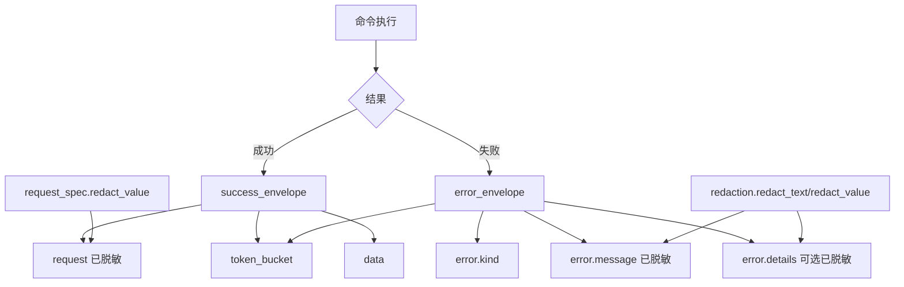
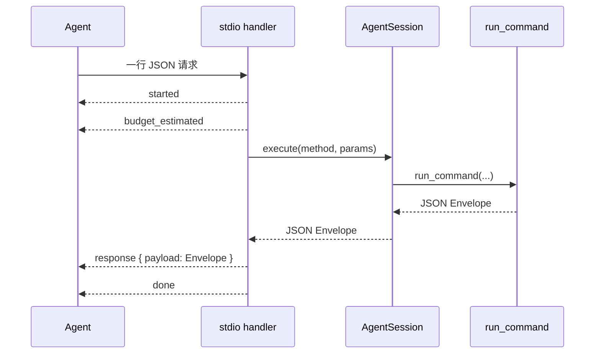

这一页只解释 **Keepa CLI 在机器可读模式下的 JSON Envelope 约定**：它如何保证成功/失败输出形状稳定、如何把错误压缩成可分支处理的结构、以及为什么这套格式适合 CLI、stdio 长会话与 MCP 会话复用。这里不展开缓存实现细节、Token 成本治理策略或 MCP 资源系统本身；那些属于后续页面。Sources: [envelope.py](keepa_cli/envelope.py#L1-L56), [agent-contract.md](docs/agent-contract.md#L31-L69), [cli.py](keepa_cli/cli.py#L37-L39)

## 先看核心：Envelope 为什么是“稳定输出”

仓库把 Envelope 收敛成两个纯函数：`success_envelope()` 和 `error_envelope()`。成功响应固定返回 `ok`、`command`、`request`、`token_bucket`、`data` 五个顶层字段；失败响应固定返回 `ok`、`command`、`error`、`token_bucket` 四个顶层字段。这意味着调用方无需根据命令类型猜测顶层结构，只需先判断 `ok`，再读取 `data` 或 `error`。Sources: [envelope.py](keepa_cli/envelope.py#L15-L55), [tests/test_envelope.py](tests/test_envelope.py#L14-L28)

`--json` 模式的设计目标也与此一致：协议文档明确要求 stdout 只输出 **一个 JSON envelope**，不混入 ANSI、日志或明文凭据。因此，Envelope 不是“某些命令的附加包装”，而是 CLI 机器模式的输出基线。Sources: [agent-contract.md](docs/agent-contract.md#L31-L69), [cli.py](keepa_cli/cli.py#L37-L39)

从测试可以看到，这个“稳定形状”不是口头约定，而是显式校验：成功响应至少必须含有 `data`、`request`、`token_bucket`，并且整体可直接 `json.dumps()`。这说明项目把 Envelope 视为 **序列化稳定接口**，而不是仅供人读的调试对象。Sources: [tests/test_envelope.py](tests/test_envelope.py#L15-L28)

## 顶层字段语义：Agent 应该如何读取

对于成功响应，`command` 是命令级语义标签，`data` 承载实际业务结果，`request` 提供已脱敏的请求规格，`token_bucket` 则承载预算估算与实际 Token 相关元信息。协议文档明确指出：即使结果为空，只要命令执行成功，`ok=true` 仍成立；因此“空数据”与“错误”在协议层是严格区分的。Sources: [envelope.py](keepa_cli/envelope.py#L15-L28), [agent-contract.md](docs/agent-contract.md#L63-L69)

对于失败响应，Agent 的主分支键不是 HTTP 状态码，而是 `error.kind`。协议文档直接把 `error.kind` 定义为 Agent 的主要分支字段；实现上 `error_envelope()` 也把 `kind` 与 `message` 作为错误对象的最小核心，并按需附加 `status_code` 与 `details`。Sources: [agent-contract.md](docs/agent-contract.md#L63-L69), [envelope.py](keepa_cli/envelope.py#L31-L55)

下面这张表可以直接作为消费方的读取约定。Sources: [envelope.py](keepa_cli/envelope.py#L15-L55), [agent-contract.md](docs/agent-contract.md#L31-L69)

| 顶层字段 | 成功响应 | 失败响应 | 作用 |
|---|---|---|---|
| `ok` | `true` | `false` | 最先判断的分支位 |
| `command` | 必有 | 必有 | 标识命令语义，如 `doctor`、`products.get` |
| `request` | 必有 | 不保证存在 | 暴露已脱敏请求规格，便于审计与回放 |
| `data` | 必有 | 无 | 业务结果载体 |
| `error` | 无 | 必有 | 结构化错误对象 |
| `token_bucket` | 必有 | 必有 | 预算估算、实际消耗或令牌桶状态 |

## 结构关系图：Envelope、请求描述与错误模型

下面的 Mermaid 图展示了这一页关心的最小关系：所有入口最终都围绕同一套 Envelope 组织输出，而请求说明与脱敏逻辑是 Envelope 可安全暴露给 Agent 的前提。Sources: [cli.py](keepa_cli/cli.py#L203-L384), [request_spec.py](keepa_cli/request_spec.py#L16-L52), [redaction.py](keepa_cli/redaction.py#L13-L40), [envelope.py](keepa_cli/envelope.py#L15-L55)

## `request` 字段：为什么它存在且必须脱敏

Envelope 中的 `request` 并不是原始请求对象，而是 `RequestSpec.to_dict()` 生成的 **脱敏请求描述**。该对象固定包含 `method`、`endpoint`、`params_redacted`、`dry_run`，如果存在 JSON body，则附加 `json_body_redacted`。也就是说，系统刻意公开“请求形状”，同时避免公开密钥。Sources: [request_spec.py](keepa_cli/request_spec.py#L16-L52)

脱敏发生在 `redact_value()`：只要键名命中 `key`、`api_key`、`apikey`、`token`、`authorization` 这些敏感名，值就会被替换为 `[REDACTED]`；而字符串中的显式 secret 值则通过 `redact_text()` 做替换。因此，Envelope 暴露 `request` 不是泄露风险，而是建立在递归打码基础上的可审计输出。Sources: [redaction.py](keepa_cli/redaction.py#L13-L40), [request_spec.py](keepa_cli/request_spec.py#L24-L33)

测试也直接验证了这件事：`params_redacted["key"]` 应为 `[REDACTED]`，而 CLI 与 service 相关测试大量依赖 `request.params_redacted` 来断言命令参数是否正确构造。这说明 `request` 字段不是边缘元数据，而是协议中可被程序稳定消费的一部分。Sources: [request_spec.py](keepa_cli/request_spec.py#L24-L33), [tests/test_request_spec.py](tests/test_request_spec.py#L1-L27), [tests/test_cli.py](tests/test_cli.py#L152-L165)

## `token_bucket` 字段：把“成本信息”变成协议一等公民

无论成功还是失败，Envelope 都保留 `token_bucket`。在最基础的实现里，成功和失败函数都允许调用方显式传入该对象，默认则为空字典。这种设计意味着 Token 元信息不附着在某个命令专属字段里，而是进入统一协议层。Sources: [envelope.py](keepa_cli/envelope.py#L15-L28), [envelope.py](keepa_cli/envelope.py#L31-L55)

在客户端路径中，`KeepaClient.request()` 会先估算预算；`dry_run` 成功响应会把 `token_bucket.estimated` 一并返回；缺失 API key、找不到 fixture、网络失败或 HTTP 失败时，也会把估算预算放入错误 Envelope。这样，Agent 即使在失败分支中，仍能读取一次请求“原本可能消耗多少 Token”的信息。Sources: [client.py](keepa_cli/client.py#L62-L118), [client.py](keepa_cli/client.py#L148-L189), [client.py](keepa_cli/client.py#L191-L320)

当真实或 fixture 响应体包含 Keepa 令牌桶字段时，客户端还会把 `refillRate`、`refillIn`、`tokensLeft`、`tokensConsumed`、`tokenFlowReduction` 映射为 snake_case，统一并入 `token_bucket`。协议文档同样把 `estimated`、`tokens_left`、`tokens_consumed`、`refill_rate`、`refill_in_ms` 列为该层可公开的标准信息。Sources: [client.py](keepa_cli/client.py#L35-L41), [client.py](keepa_cli/client.py#L379-L385), [agent-contract.md](docs/agent-contract.md#L63-L69)

## 错误模型：不是抛异常文本，而是可分支的结构化错误

`error_envelope()` 的结构非常克制：核心只有 `kind` 与 `message`，可选扩展是 `status_code` 与 `details`。这让上层消费者可以用 `kind` 做流程分支，用 `message` 做展示或日志，用 `details` 读取补充动作建议，而不必解析自然语言句子。Sources: [envelope.py](keepa_cli/envelope.py#L31-L55)

项目中已经形成了一组可验证的错误类型模式，例如：参数缺失时返回 `invalid_argument`，缺少认证时返回 `auth_missing`，fixture 目录未配置时返回 `fixture_unavailable`，fixture 文件不存在时返回 `fixture_not_found`，二进制 live 响应没有输出路径时返回 `binary_output_path_required`，网络或解析问题则返回 `network_or_parse_error`。这些值不是文档猜测，而是实现中直接写出的 `kind`。Sources: [service.py](keepa_cli/service.py#L76-L84), [service.py](keepa_cli/service.py#L116-L125), [client.py](keepa_cli/client.py#L112-L118), [client.py](keepa_cli/client.py#L156-L171), [client.py](keepa_cli/client.py#L128-L135), [client.py](keepa_cli/client.py#L270-L286)

更重要的是，错误响应不会因为场景不同而变成另一种包装。例如 JSON 解析失败、会话缓存未命中、高成本请求需要确认，最终都仍落回同一个 `ok=false` Envelope 语义，只是 `error.kind` 与 `details` 内容不同。这种“单一失败语法”正是 Agent 友好的关键。Sources: [agent/stdio.py](keepa_cli/agent/stdio.py#L31-L45), [agent/session.py](keepa_cli/agent/session.py#L165-L184), [commands/common.py](keepa_cli/commands/common.py#L98-L115)

下面这张表总结了当前代码中可直接验证的错误模式。Sources: [envelope.py](keepa_cli/envelope.py#L31-L55), [client.py](keepa_cli/client.py#L112-L146), [client.py](keepa_cli/client.py#L156-L171), [client.py](keepa_cli/client.py#L259-L286), [commands/common.py](keepa_cli/commands/common.py#L98-L115), [agent/stdio.py](keepa_cli/agent/stdio.py#L31-L45), [agent/session.py](keepa_cli/agent/session.py#L165-L184)

| `error.kind` | 触发位置 | 典型含义 | `details` 特征 |
|---|---|---|---|
| `invalid_argument` | service / CLI 参数校验 | 缺少必填参数或参数格式非法 | 可能为空 |
| `auth_missing` | live 请求前 | 没有可用 API key | `offline_alternative` |
| `fixture_unavailable` | fixture 路径未配置 | 无法读取离线样本 | `request` |
| `fixture_not_found` | fixture 路径存在但文件缺失 | 指定 fixture 不存在 | `fixture_dir` |
| `binary_output_path_required` | graph/binary 响应 | live 二进制输出缺少 `--out` | `resume_with` |
| `network_or_parse_error` | 网络或 JSON 解析失败 | 请求或响应处理失败 | `endpoint` |
| `confirmation_required` | 高成本请求门禁 | 必须显式确认 | `resume_with`、预算数值 |
| `invalid_json` | stdio 输入层 | 输入消息不是合法 JSON | 通常无 |
| `cache_miss` | 会话缓存显式复用失败 | 指定 `from_cache` 键不存在 | `cache_key` |

## `confirmation_required`：把“需要人工确认”也做成协议，而不是交互阻塞

高成本请求不会在 Agent 通道里阻塞等待人工输入。共享工具函数 `confirmation_required()` 会先估算预算；如果请求被标记为需要确认，且同时没有 `dry_run`、`fixture` 或 `yes`，它就返回一个错误 Envelope，`error.kind` 固定为 `confirmation_required`，并在 `details` 中附带 `resume_with`、`estimated_tokens`、`worst_case_tokens`。Sources: [commands/common.py](keepa_cli/commands/common.py#L98-L115)

协议文档对这一点给出了明确示例：在 stdio 场景里，高成本命令必须返回结构化确认错误，而不是等待用户在终端继续输入。这说明 Envelope 在这里不仅承担“错误报告”职责，还承担 **非阻塞控制流信号** 的职责。Sources: [agent-contract.md](docs/agent-contract.md#L89-L110), [commands/common.py](keepa_cli/commands/common.py#L98-L115)

会话层 `AgentSession` 进一步强化了这种模式：如果预算需要确认且未绕过，它同样构造 `confirmation_required` Envelope，并补充 `cache_key`、`cache_hit`、`budget_ledger`，同时把阻断动作记入 `ledger.blocked_actions`。因此，同一个错误类型在不同 Agent 通道里仍保持一致语义，只是会话层多了审计上下文。Sources: [agent/session.py](keepa_cli/agent/session.py#L54-L72), [agent/session.py](keepa_cli/agent/session.py#L130-L163), [tests/test_agent_session.py](tests/test_agent_session.py#L64-L72)

## Agent 友好性之一：Envelope 让 stdio 事件流保持简单

stdio 长会话并没有重新发明一套业务响应格式。`handle_stdio_message()` 只是把一条输入消息转成事件流：`started`、`budget_estimated`、`response`、`done`，其中真正的命令结果仍放在 `response.payload`，而这个 `payload` 依然是标准 Envelope。Sources: [agent/stdio.py](keepa_cli/agent/stdio.py#L19-L62), [agent-contract.md](docs/agent-contract.md#L70-L110)

这带来一个直接收益：消费方可以把 **事件协议** 与 **结果协议** 分开理解。事件层只负责声明执行阶段；结果层仍只看 `payload.ok`、`payload.error.kind`、`payload.data`。测试对高成本请求的断言也正是这样写的：先找 `event=="response"`，再检查 `payload["error"]["kind"]=="confirmation_required"`。Sources: [agent/stdio.py](keepa_cli/agent/stdio.py#L53-L62), [tests/test_stdio.py](tests/test_stdio.py#L25-L38)

下面的 Mermaid 图展示了 stdio 场景下 Envelope 所在的位置。Sources: [agent/stdio.py](keepa_cli/agent/stdio.py#L25-L74), [agent-contract.md](docs/agent-contract.md#L70-L110)

## Agent 友好性之二：会话层在 Envelope 外补充缓存与账本，但不破坏 Envelope

`AgentSession.execute()` 会对 service 返回的 Envelope 做浅层增强：补充 `cache_key`、`cache_hit`、`budget_ledger`，并在 MCP 工具上下文存在时，把 `data.provenance.mcp` 追加到 `data` 内部。重要的是，它**没有修改 `ok / command / request / token_bucket / data / error` 的核心语义**，只是加上会话级审计字段。Sources: [agent/session.py](keepa_cli/agent/session.py#L117-L163), [agent/session.py](keepa_cli/agent/session.py#L200-L221)

测试表明，这种增强后的对象仍然以 Envelope 为中心：首次调用 `cache_hit=false`，二次复用变成 `cache_hit=true`，而 `budget_ledger` 会记录 `session_estimated`、`session_consumed`、`cache_hits`。也就是说，项目采取的是“Envelope 为核、会话信息外挂”的做法，而不是为长会话再造一套独立结果格式。Sources: [tests/test_agent_session.py](tests/test_agent_session.py#L21-L45), [tests/test_stdio.py](tests/test_stdio.py#L117-L136)

## CLI 机器模式：返回码与 Envelope 的关系

在 CLI 入口中，`_write_json()` 始终把 payload 压成单行 JSON 输出；而 `_run_command()` 的通用策略是：若 payload 的 `ok` 为真，则返回码为 0，否则为 1，只有个别解析级错误会返回 2。换句话说，**shell 级返回码只做粗粒度成功/失败区分，精细语义全部放在 Envelope 内**。Sources: [cli.py](keepa_cli/cli.py#L37-L39), [cli.py](keepa_cli/cli.py#L203-L384)

这也是 Agent 友好的另一层原因：自动化调用方不必依赖平台相关的退出码语义来判断业务分支，而可以统一解析 JSON。CLI 测试正是通过 `json.loads(stdout)` 断言 `payload["ok"]`、`payload["command"]` 与 `payload["request"]`，而不是依赖文本输出。Sources: [tests/test_cli.py](tests/test_cli.py#L38-L61), [tests/test_cli.py](tests/test_cli.py#L107-L126)

## 这套规范真正解决了什么问题

从实现可以归纳出三个已被代码验证的目标。第一，**输出形状稳定**：无论是 `doctor`、`products.get` 还是错误场景，顶层判断逻辑一致。第二，**敏感信息可安全暴露上下文**：通过 `request` 和 `details` 的递归打码，调用方能看到足够的请求与错误上下文而不泄露密钥。第三，**控制流可结构化处理**：像 `confirmation_required`、`cache_miss`、`invalid_json` 这类情况不再需要解析自然语言提示。Sources: [envelope.py](keepa_cli/envelope.py#L15-L55), [redaction.py](keepa_cli/redaction.py#L13-L40), [commands/common.py](keepa_cli/commands/common.py#L98-L115), [agent/stdio.py](keepa_cli/agent/stdio.py#L31-L45), [agent/session.py](keepa_cli/agent/session.py#L165-L184)

如果你接下来想沿着这条主线继续阅读，最自然的顺序是先看 [SQLite 响应缓存：键设计、缓存来源说明与持久化策略](19-sqlite-xiang-ying-huan-cun-jian-she-ji-huan-cun-lai-yuan-shuo-ming-yu-chi-jiu-hua-ce-lue)，理解 `data.cache_provenance` 与缓存命中场景；再看 [成本治理：Token 预算、确认门禁与高成本请求保护](20-cheng-ben-zhi-li-token-yu-suan-que-ren-men-jin-yu-gao-cheng-ben-qing-qiu-bao-hu)，理解 `token_bucket` 与 `confirmation_required` 背后的预算规则；如果你的重点是长会话消费，则继续看 [长会话能力：stdio/MCP 会话、资源分块与上下文控制](24-chang-hui-hua-neng-li-stdio-mcp-hui-hua-zi-yuan-fen-kuai-yu-shang-xia-wen-kong-zhi)。Sources: [client.py](keepa_cli/client.py#L203-L320), [commands/common.py](keepa_cli/commands/common.py#L98-L115), [agent/session.py](keepa_cli/agent/session.py#L85-L163)