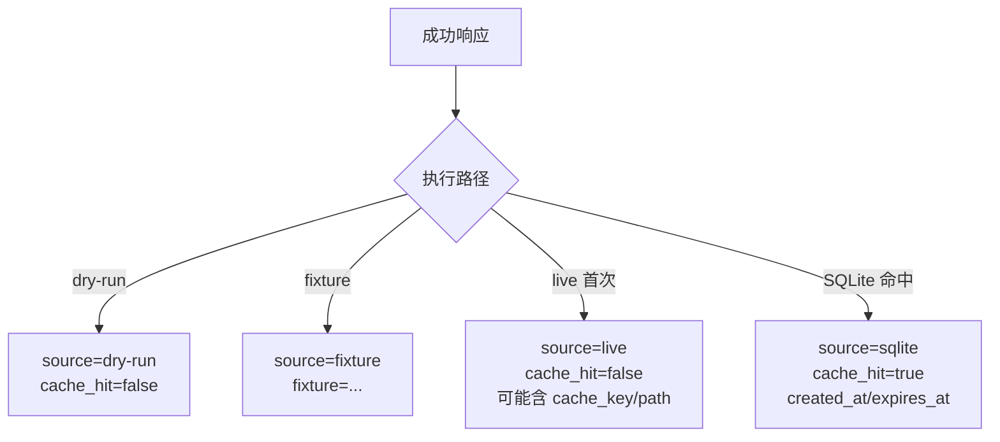

这一页只解释 **Keepa-cli 的 SQLite 响应缓存子系统**：它如何为 live JSON 响应生成稳定键、如何在输出中说明数据来源，以及缓存文件如何落盘、过期、审计与清理。这里不展开 token 成本治理本身，也不讨论 MCP 资源或会话级缓存；若你接下来要看成本控制，可转到 [成本治理：Token 预算、确认门禁与高成本请求保护](20-cheng-ben-zhi-li-token-yu-suan-que-ren-men-jin-yu-gao-cheng-ben-qing-qiu-bao-hu)。Sources: [cache.py](keepa_cli/cache.py#L1-L6) [client.py](keepa_cli/client.py#L1-L6) [workflows.py](keepa_cli/workflows.py#L496-L566)

## 设计目标：把“可复用的 live 结果”变成“可审计的持久对象”

这个缓存层不是通用对象缓存，而是一个非常收敛的 **响应缓存后端**：它只缓存“成功的只读 live JSON 响应”，并且同时输出 `cache_provenance` 让调用方知道当前数据来自 `dry-run`、`fixture`、`live` 还是 `sqlite` 命中。源码头注释已经把职责限定为“生成可审计 provenance，并提供 SQLite 响应缓存后端”，而 `cache_stats()` 又进一步明确：持久缓存仅覆盖 successful live GET JSON responses，`dry-run`、`fixture`、`binary`、`POST`、以及被禁用缓存的请求都不会持久化。Sources: [cache.py](keepa_cli/cache.py#L1-L6) [workflows.py](keepa_cli/workflows.py#L529-L536)

下面这张关系图可以帮助你先建立模型：**请求键设计** 决定命中粒度，**provenance** 决定可解释性，**SQLite 表** 决定持久化与维护成本；三者组合后，CLI、TUI、stdio 与 service 侧都能共享同一套缓存事实。Sources: [cache.py](keepa_cli/cache.py#L98-L176) [client.py](keepa_cli/client.py#L191-L320) [service.py](keepa_cli/service.py#L480-L515)

```mermaid
flowchart LR
    A[请求输入<br/>method endpoint params json_body] --> B[脱敏规范化]
    B --> C[stable hash]
    C --> D[cache_key = sqlite:sha256(...)]

    D --> E{SQLite 命中?}
    E -- 是 --> F[返回 cached body]
    F --> G[cache_provenance.source = sqlite<br/>cache_hit = true]

    E -- 否 --> H[live Keepa 请求]
    H --> I[成功 JSON 响应]
    I --> J[写入 SQLite responses]
    J --> K[cache_provenance.source = live<br/>cache_hit = false]

    L[dry-run / fixture] --> M[不写 SQLite]
    M --> N[仅输出 provenance]
```

## 键设计：method + endpoint + 脱敏后的 params/json_body 共同决定缓存身份

`build_response_cache_key()` 的实现非常直接：它把 `method.upper()`、`endpoint`、经过 `_cache_safe_value()` 处理后的 `params`、以及同样脱敏后的 `json_body` 组成 payload，再用 `_stable_json_hash()` 生成 SHA-256，最后加上 `"sqlite:"` 前缀。这意味着缓存键不是按命令名生成，而是按 **HTTP 方法、端点、请求参数、JSON body 的稳定表示** 生成。Sources: [cache.py](keepa_cli/cache.py#L98-L112)

这里最关键的不是哈希算法本身，而是 **先脱敏再哈希**。`_cache_safe_value()` 会递归处理字典、列表、元组；如果参数名命中 `key`、`api_key`、`apikey`、`token`、`authorization` 这些“secret-like” 名称，就把值替换成 `[REDACTED]`。因此，秘密字段既不会以明文进入审计输出，也不会影响最终 key 的稳定表示。这个性质由 `explain_response_cache_key()` 与相应测试共同验证：测试显式断言 `params["key"] == "[REDACTED]"`，并确保序列化结果中不出现原始 secret。Sources: [cache.py](keepa_cli/cache.py#L20-L58) [cache.py](keepa_cli/cache.py#L114-L142) [tests/test_cache.py](tests/test_cache.py#L164-L179)

从行为上看，这套规则带来三个可验证后果。第一，**方法不同，键不同**，因为 `method` 进入了 payload。第二，**同一 endpoint 但参数不同，键不同**，因为脱敏后的 `params` 参与哈希。第三，**secret-like 参数名的明文值不会改变键的可审计输出形状**，因为哈希前已被统一替换。这也是为什么 client 在 live 请求中会先把公开参数 `public_params = {key: value for key, value in params.items() if key != "key"}` 提出来，再用于生成 cache key 与 provenance。Sources: [cache.py](keepa_cli/cache.py#L105-L112) [client.py](keepa_cli/client.py#L204-L213)

下表概括了缓存键的组成规则与安全处理方式。Sources: [cache.py](keepa_cli/cache.py#L27-L58) [cache.py](keepa_cli/cache.py#L98-L142)

| 组成部分 | 是否参与 key | 处理方式 | 目的 |
|---|---:|---|---|
| `method` | 是 | `upper()` | 区分 GET/POST 等请求形态 |
| `endpoint` | 是 | 原样写入 payload | 区分 `/product`、`/seller` 等端点 |
| `params` | 是 | 递归脱敏、排序后 JSON 序列化 | 保证稳定、可比较、无密钥泄漏 |
| `json_body` | 是 | 递归脱敏后参与哈希 | 为带 body 的请求提供审计一致性 |
| API key / token 类字段 | 仅以 `[REDACTED]` 形式间接参与 | 不保留明文 | 避免凭据泄漏 |

## `explain-key`：把不可读哈希还原为可审计说明

如果说 `build_response_cache_key()` 负责“生成键”，那么 `explain_response_cache_key()` 负责“解释键”。它返回的不只是 `cache_key`，还包括 `backend`、`method`、`endpoint`、脱敏后的 `params`、`params_hash`、`json_body`、`request_hash`，以及两条说明性 notes。这样做的结果是：当调用者手里只有一个 `cache_key`，仍然可以通过同一套算法复原出“这个 key 是由什么请求形状计算出来的”。Sources: [cache.py](keepa_cli/cache.py#L114-L142)

这套解释能力被暴露成独立命令族。`cli_builders/cache.py` 注册了 `cache explain-key` 子命令，支持 `--method`、`--endpoint`、重复出现的 `--param KEY=VALUE`、以及可选 `--json-body`；随后 `commands/cache.py` 把它映射到 `workflows.explain_cache_key()`，后者最终只是一层对 `explain_response_cache_key()` 的薄封装。`tests/test_cache.py` 又验证了 service 路径返回的 `cache_key` 与 builder 直接生成的 key 一致。Sources: [cli_builders/cache.py](keepa_cli/cli_builders/cache.py#L24-L59) [commands/cache.py](keepa_cli/commands/cache.py#L55-L94) [workflows.py](keepa_cli/workflows.py#L525-L527) [tests/test_cache.py](tests/test_cache.py#L180-L193)

## 缓存来源说明：`cache_provenance` 把“数据从哪来”显式写进响应

系统并不把“是否命中缓存”藏在日志里，而是放进每次成功响应的结构化数据中。`build_cache_provenance()` 至少会输出 `source`、`endpoint`、`params_hash` 和 `cache_hit`，在有条件时再补充 `cache_key`、`cache_path`、`created_at`、`expires_at`、`fixture`、`out`。因此 provenance 的角色不是内部实现细节，而是 API 级审计元数据。Sources: [cache.py](keepa_cli/cache.py#L145-L176)

`KeepaClient.request()` 在三条路径上都会构造 provenance，但语义不同。`dry_run` 路径返回 `source="dry-run"` 且 `cache_hit=False`；`fixture` 路径返回 `source="fixture"` 并附带 fixture 文件名；live 请求首次成功返回 `source="live"`、`cache_hit=False`，如果后续从 SQLite 取回，则变成 `source="sqlite"`、`cache_hit=True`，同时带上 `cache_key`、`cache_path`、`created_at`、`expires_at`。测试也分别覆盖了 dry-run、fixture、首次 live、二次命中几种情形。Sources: [client.py](keepa_cli/client.py#L90-L106) [client.py](keepa_cli/client.py#L148-L189) [client.py](keepa_cli/client.py#L204-L241) [client.py](keepa_cli/client.py#L288-L320) [tests/test_cache.py](tests/test_cache.py#L21-L62) [tests/test_client.py](tests/test_client.py#L104-L137)

下面这张图展示了 provenance 在不同来源上的分化，而不是所有响应都绑定 SQLite。Sources: [cache.py](keepa_cli/cache.py#L145-L176) [client.py](keepa_cli/client.py#L90-L106) [client.py](keepa_cli/client.py#L174-L189) [client.py](keepa_cli/client.py#L223-L241) [client.py](keepa_cli/client.py#L302-L320)



`workflows.explain_cache()` 进一步把 provenance 转换成面向审计的摘要：它会从 envelope 或直接 payload 中提取 `cache_provenance`，输出 `source`、`cache_hit`、`params_hash`、`fixture`、`out`，并基于命令预算估算 `estimated_tokens_saved`。这里有一个清晰的设计边界：**只有 provenance 表示命中过缓存时，节省 token 才会显示为非零**。Sources: [workflows.py](keepa_cli/workflows.py#L496-L523)

## 持久化策略：只缓存 live GET 且无 JSON body 的成功响应

是否启用 SQLite 持久缓存，并不是全局硬编码，而是在 `KeepaClient.request()` 中按请求类型即时判定。客户端先解析配置与环境变量，得到有效 TTL；然后将 `no_cache`、环境变量 `KEEPA_CLI_NO_CACHE`、以及 `effective_cache_ttl_seconds <= 0` 归并成 `cache_disabled`。只有在 **缓存未禁用、方法为 GET、且 `json_body is None`** 的条件下，才会构造 `SQLiteResponseCache`。这就把缓存范围限制在“可重放且语义清晰”的只读 JSON 请求上。Sources: [client.py](keepa_cli/client.py#L108-L126)

这一定义也被外围工具再次明示。`cache_stats()` 的 notes 写明：SQLite response cache stores successful live GET JSON responses only；`dry-run`、`fixture`、`binary`、`POST` 和 disabled-cache 请求不落盘。也就是说，系统没有把“所有成功响应”混进同一个持久层，而是主动放弃二进制输出和非 GET 请求的缓存复用。Sources: [workflows.py](keepa_cli/workflows.py#L529-L536)

TTL 的解析顺序也很明确：如果请求显式传入 `explicit_ttl`，优先使用它；否则读环境变量 `KEEPA_CLI_CACHE_TTL_SECONDS`；再否则读配置项 `cache_ttl_seconds`；最后回退到默认值 `3600` 秒。实现上还统一做了 `max(0, int(...))`，因此负值不会形成“负 TTL”，而是被钳制到 0，进而等价于禁用缓存。测试也验证了“按请求显式设置 TTL 会影响 `expires_at - created_at` 的差值”。Sources: [cache.py](keepa_cli/cache.py#L21-L25) [cache.py](keepa_cli/cache.py#L82-L96) [tests/test_client.py](tests/test_client.py#L191-L210)

## SQLite 模式：最小但足够审计的 `responses` 表

`SQLiteResponseCache._connect()` 在首次连接时创建单表 `responses`，列包括 `cache_key`、`method`、`endpoint`、`params_hash`、`request_json`、`body_json`、`token_bucket_json`、`created_at`、`expires_at`、`size_bytes`，并为 `expires_at` 建立索引 `idx_responses_expires_at`。这个模式说明缓存不仅存 body，还把 **请求镜像、token bucket 元数据、生命周期时间戳、体积** 一并持久化了。Sources: [cache.py](keepa_cli/cache.py#L183-L203)

这里特别值得注意的是表结构里没有任何“原始 API key 列”。结合前面的脱敏哈希规则与 client 中 `public_params` 的用法，可以确认持久层保存的是 **不含明文凭据的请求表示**。这与模块头注释“不缓存 API key、authorization 或其他明文凭据”的边界完全一致。Sources: [cache.py](keepa_cli/cache.py#L1-L6) [cache.py](keepa_cli/cache.py#L31-L41) [client.py](keepa_cli/client.py#L204-L213)

下表整理了 `responses` 表各列的用途。Sources: [cache.py](keepa_cli/cache.py#L187-L199) [cache.py](keepa_cli/cache.py#L210-L233) [cache.py](keepa_cli/cache.py#L253-L286)

| 列名 | 类型/角色 | 含义 |
|---|---|---|
| `cache_key` | 主键 | 基于 method/endpoint/脱敏参数/body 计算出的稳定键 |
| `method` | 元数据 | 大写 HTTP 方法 |
| `endpoint` | 元数据 | Keepa API 路径，如 `/product` |
| `params_hash` | 审计摘要 | 参数级稳定哈希，便于 provenance 与 inspect 对齐 |
| `request_json` | 请求镜像 | 持久保存的请求表示 |
| `body_json` | 响应体 | 缓存的 JSON 响应正文 |
| `token_bucket_json` | 成本元数据 | 当次 live 响应提取出的 token bucket 信息 |
| `created_at` | 生命周期 | 写入时间 |
| `expires_at` | 生命周期 | 过期时间 |
| `size_bytes` | 运维指标 | body 的 UTF-8 字节大小 |

## 读写语义：命中时零 token 消耗，过期时惰性删除

`get()` 的行为并不是“只读检查”。它先查表，再比较 `expires_at` 与当前时间；如果条目已过期，会立即执行 `DELETE FROM responses WHERE cache_key = ?` 并提交事务，然后返回 `None`。因此，**读取本身也承担了惰性清理职责**，这解释了为什么测试在读取过期 key 后，再看 `stats()` 时条目数已经减少。Sources: [cache.py](keepa_cli/cache.py#L205-L233) [tests/test_cache.py](tests/test_cache.py#L98-L117)

命中缓存时，client 不会伪造一次 live token 消耗，而是构造新的 `cache_token_bucket`：`estimated` 来自缓存内原值或当前预算，`cache_hit=True`，`tokens_consumed=0`；如果缓存记录里原本有 `tokens_consumed`，还会额外放入 `cached_tokens_consumed`，表示这条响应首次 live 获取时曾经消耗过多少 token。测试明确断言：二次请求命中缓存后 `tokens_consumed == 0`，同时保留 `cached_tokens_consumed == 1`。Sources: [client.py](keepa_cli/client.py#L213-L241) [tests/test_client.py](tests/test_client.py#L129-L137)

写入路径使用 `INSERT ... ON CONFLICT(cache_key) DO UPDATE`，所以相同 key 的新响应会覆盖旧记录，并刷新 `method`、`endpoint`、`params_hash`、请求与响应 JSON、token bucket、时间戳与 `size_bytes`。换句话说，这不是 append-only 历史库，而是 **按 cache key 维度保存当前有效版本**。Sources: [cache.py](keepa_cli/cache.py#L235-L286)

## 路径与环境变量：缓存文件位置可配置，且优先适配 Windows

默认缓存路径由 `default_cache_path()` 决定，优先级依次是：环境变量 `KEEPA_CLI_CACHE_PATH`、Windows `APPDATA` 下的 `keepa-cli/response-cache.sqlite`、`XDG_CACHE_HOME` 下的同名文件，最后才退回到 `~/.cache/keepa-cli/response-cache.sqlite`。在当前仓库的 Windows 环境里，最优先的系统型默认位置是 `APPDATA`。Sources: [cache.py](keepa_cli/cache.py#L61-L76)

与路径并列的还有三个缓存控制环境变量：`KEEPA_CLI_CACHE_PATH` 用来覆盖 SQLite 文件路径，`KEEPA_CLI_CACHE_TTL_SECONDS` 用来覆盖 TTL，`KEEPA_CLI_NO_CACHE` 用来整体禁用持久缓存。测试分别覆盖了环境路径生效、环境禁用缓存生效，以及带缓存路径时仍可通过 `no_cache=True` 在单请求级别关闭缓存。Sources: [cache.py](keepa_cli/cache.py#L21-L25) [client.py](keepa_cli/client.py#L121-L126) [tests/test_cache.py](tests/test_cache.py#L247-L253) [tests/test_client.py](tests/test_client.py#L138-L189)

`commands/common.py` 还提供了 service 层共享的 `live_cache_options()`，把 `cache_ttl` / `cache-ttl` / `cache_ttl_seconds` / `cache-ttl-seconds` 统一映射为 `cache_ttl_seconds`，并把 `no_cache` / `no-cache` 统一映射为 `no_cache=True`。这使得上层命令族不需要重复实现缓存透传规则。Sources: [commands/common.py](keepa_cli/commands/common.py#L88-L95)

## 审计与维护命令：stats、inspect、prune-expired、clear

缓存系统并不要求你直接打开 SQLite 文件做运维。`cli_builders/cache.py` 注册了 `cache stats`、`cache inspect`、`cache prune-expired`、`cache clear`，而 `service.run_command()` 会优先把 `cache.*` 命令路由到 `handle_cache_command()`，再调用 `workflows.py` 中的具体实现。因此，这一组缓存命令是 **一等 service API**，而不是临时脚本。Sources: [cli_builders/cache.py](keepa_cli/cli_builders/cache.py#L17-L39) [service.py](keepa_cli/service.py#L480-L515) [commands/cache.py](keepa_cli/commands/cache.py#L18-L94)

`stats()` 返回的是全局状态摘要：是否启用持久缓存、文件路径、总条目数、过期条目数、总字节数，以及最早写入时间、最新写入时间、下一个过期时间。若缓存文件尚不存在，它也会返回一个结构完整、但计数全为 0 的结果，而不是抛错。Sources: [cache.py](keepa_cli/cache.py#L288-L314)

`inspect()` 刻意只返回元数据，不返回缓存 body。它会报告 `found`、`method`、`endpoint`、`params_hash`、`created_at`、`expires_at`、`expired` 与 `size_bytes`；`workflows.inspect_cache()` 还补了两条 notes，明确说明 inspect 永远不包含缓存响应体，单条审计应使用 `data.cache_provenance.cache_key`。测试也专门断言 inspect 结果中不存在 `body` 字段。Sources: [cache.py](keepa_cli/cache.py#L315-L356) [workflows.py](keepa_cli/workflows.py#L539-L546) [tests/test_cache.py](tests/test_cache.py#L146-L162)

`prune_expired()` 与 `clear()` 都支持 `dry_run`。前者只针对 `expires_at <= now` 的条目，返回将删除的过期条目数与字节数；后者针对整张表，返回将移除的全部条目数与字节数。两者在 dry-run 模式下都不会真正改表，测试分别验证了 dry-run 统计与真实删除的差异。`clear_cache()` 的 notes 还特别说明：清理 SQLite response cache **不会影响 tests/fixtures，也不会影响进程内 Agent session cache**。Sources: [cache.py](keepa_cli/cache.py#L358-L403) [workflows.py](keepa_cli/workflows.py#L549-L566) [tests/test_cache.py](tests/test_cache.py#L63-L97) [tests/test_cache.py](tests/test_cache.py#L118-L162)

下表可以直接作为运维视角的命令对照。Sources: [cli_builders/cache.py](keepa_cli/cli_builders/cache.py#L24-L39) [workflows.py](keepa_cli/workflows.py#L529-L566)

| 命令 | 作用 | 是否改动数据 | 典型用途 |
|---|---|---:|---|
| `cache explain-key` | 解释某请求形状对应的 key | 否 | 反查 key 组成 |
| `cache stats` | 查看整体缓存状态 | 否 | 盘点条目规模与过期情况 |
| `cache inspect` | 查看单 key 元数据 | 否 | 精确审计某次响应是否已过期 |
| `cache prune-expired` | 删除已过期条目 | 可选 | 周期性清理过期垃圾 |
| `cache clear` | 清空全部 SQLite 缓存 | 可选 | 重置本地持久缓存 |

## 测试覆盖告诉我们的边界：这是“可靠的持久响应缓存”，不是“万能缓存层”

测试集合把缓存边界定义得很清楚。`tests/test_client.py` 验证了：gzip live 响应可被正常处理；live GET 会命中 SQLite 且避免第二次网络调用；环境变量和显式请求参数都可以禁用缓存；显式 TTL 会覆盖环境 TTL；从配置文件读取 API key 时不会把 secret 泄漏到输出中。与之配套，`tests/test_cache.py` 又验证了 provenance 字段稳定性、过期即失效、inspect 只暴露元数据、以及 service 层 cache 命令都能通过指定 `cache_path` 或环境变量工作。Sources: [tests/test_client.py](tests/test_client.py#L85-L137) [tests/test_client.py](tests/test_client.py#L138-L230) [tests/test_cache.py](tests/test_cache.py#L21-L97) [tests/test_cache.py](tests/test_cache.py#L118-L253)

从这些测试能够严格推出一个结论：这个模块的核心价值不是“尽可能多地缓存”，而是 **只缓存那些可以稳定解释、不会泄露凭据、且适合通过 service API 审计的 live JSON GET 结果**。如果你下一步想继续理解“缓存命中为什么会被解释为 token 节省”，应转读 [成本治理：Token 预算、确认门禁与高成本请求保护](20-cheng-ben-zhi-li-token-yu-suan-que-ren-men-jin-yu-gao-cheng-ben-qing-qiu-bao-hu)；如果你更关心统一响应结构中 provenance 放在什么位置，则应转读 [JSON Envelope 规范：稳定输出、错误模型与 Agent 友好响应](18-json-envelope-gui-fan-wen-ding-shu-chu-cuo-wu-mo-xing-yu-agent-you-hao-xiang-ying)。Sources: [tests/test_client.py](tests/test_client.py#L104-L137) [tests/test_cache.py](tests/test_cache.py#L180-L253) [workflows.py](keepa_cli/workflows.py#L496-L523)