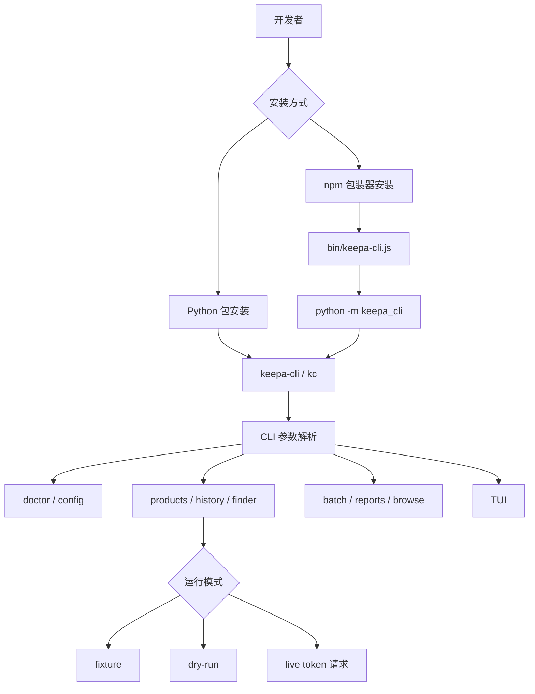
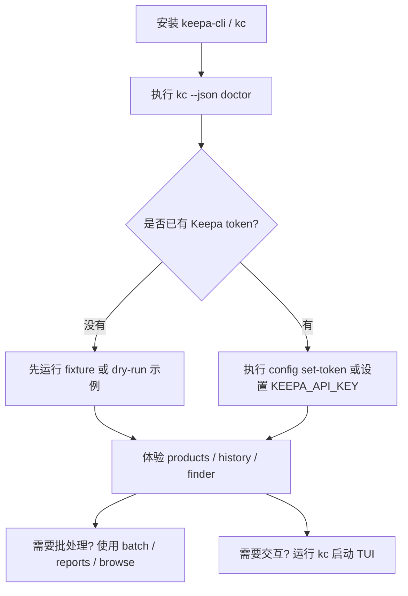

这一页是 **Keepa CLI 的入门落地页**：目标不是解释全部架构，而是让第一次接触项目的开发者在最短路径内完成安装、确认入口可用、建立本地配置、跑通零成本离线示例，并知道下一步该读哪一页。项目明确提供 `keepa-cli` 与 `kc` 两个等价入口，且默认强调 **offline-first**：`dry-run` 与 `fixture` 不访问 Keepa，也不消耗真实 token。Sources: [README.zh-CN.md](README.zh-CN.md#L14-L23) [pyproject.toml](pyproject.toml#L40-L43) [package.json](package.json#L7-L10)

从代码入口看，初学者可以把它理解成一个“**同一内核，多种入口**”的命令工具：Python 包安装后直接暴露 `keepa-cli`/`kc` console script；如果通过 npm 安装，则 Node 包装器会寻找本机 Python 解释器并转发到 `python -m keepa_cli`；如果你不想先安装脚本，也可以直接用模块方式运行。这个理解足够支持本页的快速上手，不需要先进入更深入的服务层与协议层细节。Sources: [pyproject.toml](pyproject.toml#L40-L43) [bin/keepa-cli.js](bin/keepa-cli.js#L12-L26) [keepa_cli/__main__.py](keepa_cli/__main__.py#L1-L15)

## 你现在站在哪一层

如果你只想先“跑起来”，本页建议按这个阅读顺序前进：先读完当前页，再进入 [双入口安装方式：Python 包与 npm 包装器](3-shuang-ru-kou-an-zhuang-fang-shi-python-bao-yu-npm-bao-zhuang-qi)、[模块入口、命令入口与本地开发验证](4-mo-kuai-ru-kou-ming-ling-ru-kou-yu-ben-di-kai-fa-yan-zheng)、[Keepa Token 配置、环境变量优先级与本地配置文件位置](5-keepa-token-pei-zhi-huan-jing-bian-liang-you-xian-ji-yu-ben-di-pei-zhi-wen-jian-wei-zhi)，然后根据你是否已有 token，选择 [fixture 与 dry-run：零成本试用真实工作流形状](8-fixture-yu-dry-run-ling-cheng-ben-shi-yong-zhen-shi-gong-zuo-liu-xing-zhuang) 或 [使用 doctor 命令检查认证、离线能力与运行环境](7-shi-yong-doctor-ming-ling-jian-cha-ren-zheng-chi-xian-neng-li-yu-yun-xing-huan-jing)。Sources: [README.zh-CN.md](README.zh-CN.md#L25-L45) [README.zh-CN.md](README.zh-CN.md#L48-L81) [README.zh-CN.md](README.zh-CN.md#L97-L145)

## 快速理解：安装后你得到什么

下图是本页需要掌握的最小心智模型：**无论从 Python 还是 npm 进入，最后都会落到同一个 CLI 主入口；主入口统一解析命令，再执行 doctor、config、products、history、finder、batch、browse、reports 等子命令；其中 fixture 与 dry-run 构成零成本体验路径。** Sources: [keepa_cli/cli.py](keepa_cli/cli.py#L47-L61) [keepa_cli/cli.py](keepa_cli/cli.py#L84-L190) [README.zh-CN.md](README.zh-CN.md#L97-L145)



## 最小项目结构图

对初学者来说，仓库里最值得先认识的是这几个位置：`bin/` 是 npm 包装器入口，`keepa_cli/` 是 Python 主体实现，`keepa_cli/fixtures/` 提供离线示例数据，`tests/fixtures/` 提供测试侧镜像数据，`README.zh-CN.md` 则已经给出一套可直接复制的起步命令。Sources: [package.json](package.json#L7-L20) [bin/keepa-cli.js](bin/keepa-cli.js#L1-L26) [README.zh-CN.md](README.zh-CN.md#L25-L45) [README.zh-CN.md](README.zh-CN.md#L97-L145)

```text
Keepa-cli
├─ README.zh-CN.md          # 中文起步命令
├─ pyproject.toml           # Python 包与 console scripts
├─ package.json             # npm 包与 bin 映射
├─ bin/
│  ├─ keepa-cli.js          # npm -> Python 转发器
│  └─ kc.js                 # 短命令别名
└─ keepa_cli/
   ├─ __main__.py           # python -m keepa_cli
   ├─ cli.py                # 主命令入口
   ├─ config.py             # 本地配置与 token 写入
   ├─ doctor.py             # 环境健康检查
   ├─ fixtures/             # 离线 fixture 数据
   └─ ui/                   # TUI 入口
```

Sources: [pyproject.toml](pyproject.toml#L40-L50) [package.json](package.json#L7-L20) [keepa_cli/__main__.py](keepa_cli/__main__.py#L1-L15) [keepa_cli/cli.py](keepa_cli/cli.py#L47-L61) [keepa_cli/config.py](keepa_cli/config.py#L29-L57) [keepa_cli/doctor.py](keepa_cli/doctor.py#L18-L53)

## 三种起步路径怎么选

如果你已经有 Python 3.11+ 环境，并且想直接开发或调试仓库，优先用 **Python 可编辑安装**；如果你是把它当成一个分发好的命令工具使用，优先用 **npm 包装器**；如果你只是临时验证当前仓库，不想先安装 console script，那么用 **`python -m keepa_cli` 模块入口** 即可。这个判断来自项目真实入口设计，而不是文档惯例。Sources: [pyproject.toml](pyproject.toml#L10-L13) [pyproject.toml](pyproject.toml#L40-L43) [package.json](package.json#L21-L28) [keepa_cli/__main__.py](keepa_cli/__main__.py#L1-L15) [bin/keepa-cli.js](bin/keepa-cli.js#L12-L26)

| 路径 | 适合谁 | 你实际得到的入口 | 关键前提 |
|---|---|---|---|
| Python 包安装 | 本地开发者、调试者 | `keepa-cli` / `kc` | Python `>=3.11` |
| npm 包装器安装 | 想全局命令使用的人 | `keepa-cli` / `kc` | Node `>=18`，且机器上要能找到 Python |
| 模块入口运行 | 临时验证仓库的人 | `python -m keepa_cli` | 当前仓库可访问 |

Sources: [pyproject.toml](pyproject.toml#L10-L13) [pyproject.toml](pyproject.toml#L40-L43) [package.json](package.json#L7-L10) [package.json](package.json#L21-L23) [bin/keepa-cli.js](bin/keepa-cli.js#L13-L17) [keepa_cli/__main__.py](keepa_cli/__main__.py#L10-L15)

## 5 分钟上手流程

下面这张流程图对应本页推荐的最短实践路径：**先安装，再跑 doctor，再决定是否配置 token，然后先走 fixture/dry-run，最后再进入本地批处理或 TUI。** 这条路径与仓库提供的命令顺序是一致的。Sources: [README.zh-CN.md](README.zh-CN.md#L25-L45) [README.zh-CN.md](README.zh-CN.md#L48-L81) [README.zh-CN.md](README.zh-CN.md#L97-L168)



## 第一步：安装并验证入口

Python 路径下，仓库 README 给出的最短验证方式是先用可编辑安装，然后立刻执行 `doctor`。这一步的目标不是发起真实 Keepa 请求，而是验证 CLI 已安装、命令入口能执行、JSON 输出链路正常。Sources: [README.zh-CN.md](README.zh-CN.md#L25-L33)

```powershell
.\.venv\Scripts\python.exe -m pip install -e .
.\.venv\Scripts\kc.exe --json doctor
```

如果你走 npm 路线，则 `@cunuo/keepa-cli` 会暴露同名双入口；其内部不是重新实现业务，而是由 `bin/keepa-cli.js` 负责查找 Python，并转发到 `python -m keepa_cli`。因此 npm 安装成功并不意味着“纯 Node 运行”，而是“Node 负责分发，Python 负责执行”。Sources: [README.zh-CN.md](README.zh-CN.md#L34-L45) [package.json](package.json#L7-L10) [bin/keepa-cli.js](bin/keepa-cli.js#L12-L26)

```powershell
npm install -g @cunuo/keepa-cli
kc --json doctor
```

如果你的机器上有多个 Python 解释器，可以显式设置 `KEEPA_CLI_PYTHON`，让 npm 包装器按指定解释器执行。这是项目包装器代码直接支持的行为。Sources: [README.zh-CN.md](README.zh-CN.md#L41-L46) [bin/keepa-cli.js](bin/keepa-cli.js#L13-L17)

```powershell
$env:KEEPA_CLI_PYTHON="D:\github\Keepa-cli\.venv\Scripts\python.exe"
kc --json doctor
```

## 第二步：用 doctor 判断你处于什么状态

`doctor` 是最适合新手的第一条命令，因为它不要求你先懂业务命令。代码里它会报告版本号、认证来源、离线 fixture 是否可用，以及 `keepa-cli` 与 `kc` 是否要求入口等价。也就是说，它本质上是一个“我现在能不能安全开始”的状态页。Sources: [keepa_cli/doctor.py](keepa_cli/doctor.py#L20-L53) [keepa_cli/cli.py](keepa_cli/cli.py#L203-L210)

| 检查项 | 作用 | 对新手的意义 |
|---|---|---|
| `version` | 当前 CLI 版本 | 确认你运行的是哪一版 |
| `auth.source` | `env` / `config` / `missing` / `config_error` | 判断 token 从哪来，或为什么不可用 |
| `offline.fixture_available` | 是否有 fixture 数据 | 决定你能否零成本体验 |
| `commands.primary/alias` | `keepa-cli` 与 `kc` | 确认双入口设计 |

Sources: [keepa_cli/doctor.py](keepa_cli/doctor.py#L20-L53)

## 第三步：决定要不要现在配置 token

项目默认配置包含 `default_domain = "US"`、`language = "en"`、`cache_ttl_seconds = 3600`、`max_tokens_per_request = 20`。这说明即使你暂时没有 token，也不是“什么都做不了”：你仍然可以使用离线 fixture 与 dry-run 熟悉命令形状。Sources: [keepa_cli/config.py](keepa_cli/config.py#L18-L24) [README.zh-CN.md](README.zh-CN.md#L14-L15)

如果你已经有 Keepa token，推荐直接通过 `config set-token` 写入本地配置文件。实现里会先做本地校验：token 必须是 **64 个可见 ASCII 字符且不能含空白**；写回配置报告时还会进行脱敏，不向 stdout 输出明文密钥。Sources: [README.zh-CN.md](README.zh-CN.md#L48-L55) [keepa_cli/config.py](keepa_cli/config.py#L122-L155)

```powershell
kc --json config set-token YOUR_KEEPA_64_CHARACTER_ACCESS_KEY
kc --json doctor
```

如果你不想写入默认位置，可以用 `--path` 指定配置文件，并通过 `KEEPA_CLI_CONFIG` 切换当前会话使用的配置。这是代码中 `default_config_path()` 的第一优先级逻辑。Sources: [README.zh-CN.md](README.zh-CN.md#L62-L68) [keepa_cli/config.py](keepa_cli/config.py#L29-L44)

```powershell
kc --json config set-token YOUR_KEEPA_TOKEN --path .\config.local.toml
$env:KEEPA_CLI_CONFIG=(Resolve-Path .\config.local.toml)
kc --json doctor
```

如果你已经在环境中设置了 `KEEPA_API_KEY`，那么 `doctor` 会把认证来源识别为 `env`，而不是 `config`。这意味着环境变量优先于本地配置文件。Sources: [README.zh-CN.md](README.zh-CN.md#L70-L75) [keepa_cli/doctor.py](keepa_cli/doctor.py#L20-L30) [keepa_cli/config.py](keepa_cli/config.py#L29-L37)

```powershell
$env:KEEPA_API_KEY="YOUR_KEEPA_TOKEN"
kc --json doctor
```

## 第四步：先学会“零成本试跑”

对新手最重要的不是立刻打 live API，而是先理解 **fixture** 和 **dry-run** 这两种模式。README 明确说明：fixture 命令不会消耗真实 token；高成本请求建议先 dry-run。CLI 参数层也把 `--fixture`、`--dry-run` 广泛注册到了 products、history、finder、bestsellers、tokens 等命令上。Sources: [README.zh-CN.md](README.zh-CN.md#L97-L114) [keepa_cli/cli_builders/products.py](keepa_cli/cli_builders/products.py#L20-L53) [keepa_cli/cli_builders/history.py](keepa_cli/cli_builders/history.py#L21-L40) [keepa_cli/cli_builders/finder.py](keepa_cli/cli_builders/finder.py#L20-L27)

| 模式 | 是否访问 Keepa | 是否消耗 token | 适合什么时候用 |
|---|---|---|---|
| `--fixture` | 否 | 否 | 学命令输出形状、写脚本、离线演示 |
| `--dry-run` | 否 | 否 | 预览请求规格、预估高成本操作前确认参数 |
| live 请求 | 是 | 通常是 | 你确认参数与预算后再执行 |

Sources: [README.zh-CN.md](README.zh-CN.md#L14-L15) [README.zh-CN.md](README.zh-CN.md#L97-L114) [keepa_cli/cli_builders/products.py](keepa_cli/cli_builders/products.py#L50-L53) [keepa_cli/cli_builders/history.py](keepa_cli/cli_builders/history.py#L28-L30) [keepa_cli/cli_builders/finder.py](keepa_cli/cli_builders/finder.py#L23-L27)

## 第五步：复制这几条最小可运行命令

如果你只准备试一次产品详情，最稳妥的第一条命令是 fixture 版 `products get`。它会走 `products` 命令族，但不需要真实凭据。Sources: [README.zh-CN.md](README.zh-CN.md#L97-L107) [keepa_cli/cli_builders/products.py](keepa_cli/cli_builders/products.py#L17-L53)

```powershell
kc --json products get B001GZ6QEC --domain US --history 0 --fixture product_B001GZ6QEC.json
```

如果你想看“代码查商品”的形状，可以先用 `products by-code ... --dry-run`，它会把参数组装到 `products.get` 路径中，但不会真实访问 API。Sources: [README.zh-CN.md](README.zh-CN.md#L101-L104) [keepa_cli/cli_builders/products.py](keepa_cli/cli_builders/products.py#L78-L85) [keepa_cli/cli_builders/products.py](keepa_cli/cli_builders/products.py#L172-L185)

```powershell
kc --json products by-code 9780786222728 --domain US --code-limit 5 --dry-run
```

如果你想直接看更适合自动化消费的摘要视图，可以使用 `products summary`。这个子命令在参数分发层会强制走 `agent_view=True`，因此更适合作为“先看稳定摘要”的入门入口。Sources: [README.zh-CN.md](README.zh-CN.md#L103-L105) [keepa_cli/cli_builders/products.py](keepa_cli/cli_builders/products.py#L87-L97) [keepa_cli/cli_builders/products.py](keepa_cli/cli_builders/products.py#L187-L200)

```powershell
kc --json products summary B0D8W1YVBX --domain US --fixture product_agent_view_B0TEST.json
```

如果你关心历史趋势，可以直接使用 `history trend`，默认支持 `series` 参数，并且同样支持 fixture 模式。Sources: [README.zh-CN.md](README.zh-CN.md#L104-L106) [keepa_cli/cli_builders/history.py](keepa_cli/cli_builders/history.py#L32-L40) [keepa_cli/cli_builders/history.py](keepa_cli/cli_builders/history.py#L61-L75)

```powershell
kc --json history trend B001GZ6QEC --series amazon --fixture product_history_B001GZ6QEC.json
```

如果你只是想验证 token bucket 相关输出格式，也可以用内置 fixture 跑 `tokens status`。Sources: [README.zh-CN.md](README.zh-CN.md#L105-L107) [keepa_cli/cli.py](keepa_cli/cli.py#L333-L342)

```powershell
kc --json tokens status --fixture token_status.json
```

## 第六步：高成本命令先 dry-run

README 明确把 `bestsellers get` 和 `finder query` 当作“先 dry-run 再决定是否执行”的典型案例。代码侧也能看到 Finder 命令额外接受 `--max-tokens` 与 `--yes` 这类预算/确认相关参数，这说明它是刻意为“先看、再确认”设计的，而不是鼓励盲打 live 请求。Sources: [README.zh-CN.md](README.zh-CN.md#L109-L114) [keepa_cli/cli_builders/finder.py](keepa_cli/cli_builders/finder.py#L17-L27) [keepa_cli/cli_builders/finder.py](keepa_cli/cli_builders/finder.py#L30-L45)

```powershell
kc --json bestsellers get 172282 --domain US --dry-run
kc --json finder query --selection-file keepa_cli/fixtures/finder_selection.json --domain US --dry-run --max-tokens 25
```

## 配置前后怎么变化

下面这张对照表适合第一次接触项目的人：你不需要一开始就完成所有配置，只要知道“未配置时能做什么，配置后又多了什么”。Sources: [README.zh-CN.md](README.zh-CN.md#L14-L15) [README.zh-CN.md](README.zh-CN.md#L48-L81) [README.zh-CN.md](README.zh-CN.md#L97-L145) [keepa_cli/doctor.py](keepa_cli/doctor.py#L20-L53)

| 场景 | 之前命令 | 之后命令 | 结果差异 |
|---|---|---|---|
| 未配置 token | `kc --json doctor` | `kc --json config set-token ...` 后再 `kc --json doctor` | `auth.source` 从 `missing` 变为 `config` 或 `env` |
| 先学命令结构 | `kc --json products get ... --fixture ...` | `kc --json products get ...` | 前者离线，后者可能发真实请求 |
| 高成本前确认 | `kc --json finder query ... --dry-run` | `kc --json finder query ... --yes` | 前者只预览，后者才进入真实执行意图 |
| 默认英文 | `kc --json config set-language en` | `kc --json config set-language zh` | TUI 与相关文案切到中文 |

Sources: [README.zh-CN.md](README.zh-CN.md#L48-L55) [README.zh-CN.md](README.zh-CN.md#L83-L95) [README.zh-CN.md](README.zh-CN.md#L97-L114) [keepa_cli/config.py](keepa_cli/config.py#L158-L184) [keepa_cli/doctor.py](keepa_cli/doctor.py#L20-L30)

## 第七步：把离线结果串成一个本地工作流

当你已经能跑通单条命令，就可以进入“批处理计划 → 报告 → HTML 浏览快照”的本地链路。这条链路完全由 CLI 注册的本地 workflow 命令构成，不要求你先理解远端 Keepa API 的所有业务细节。Sources: [README.zh-CN.md](README.zh-CN.md#L116-L131) [keepa_cli/cli_builders/workflows.py](keepa_cli/cli_builders/workflows.py#L19-L67) [keepa_cli/cli_builders/workflows.py](keepa_cli/cli_builders/workflows.py#L74-L107)

```powershell
kc --json batch asins .\asins.txt --domain US --dry-run --out .\batch.json
kc --json reports build --input .\batch.json --format markdown --out .\report.md
kc --json browse snapshot --input .\batch.json --out-dir .\keepa-browse
```

如果你还不知道批处理长什么样，可以先列出并导出内置模板。这个动作同样是纯本地的。Sources: [README.zh-CN.md](README.zh-CN.md#L126-L131) [keepa_cli/cli_builders/workflows.py](keepa_cli/cli_builders/workflows.py#L36-L42) [keepa_cli/cli_builders/workflows.py](keepa_cli/cli_builders/workflows.py#L94-L100)

```powershell
kc --json templates list
kc --json templates show finder-basic --out .\finder-basic.json
```

## 第八步：需要交互时，直接进 TUI

如果你不想一直复制长命令，可以直接执行 `kc` 进入 TUI。CLI 里单独注册了 `tui` 子命令，而 README 说明默认体验是“命令优先”的终端界面：底部有 `kc ›` composer，输入 `/` 可触发 slash 补全，状态栏持续显示认证、domain、语言、预算和 schema。Sources: [README.zh-CN.md](README.zh-CN.md#L154-L174) [keepa_cli/cli.py](keepa_cli/cli.py#L59-L63)

```powershell
kc
```

从 TUI 元数据与命令目录可以确认，它并不是一个独立产品，而是把 `/doctor`、`/config`、`/browse`、`/batch`、`/product`、`/history`、`/finder` 等动作重新组织为可交互界面。因此对新手而言，**先会 CLI，再进 TUI** 是最自然的路径。Sources: [keepa_cli/ui/modern_tui.py](keepa_cli/ui/modern_tui.py#L136-L198) [keepa_cli/ui/tui.py](keepa_cli/ui/tui.py#L103-L139)

如果你的环境里没有 `prompt_toolkit`，项目会回退到标准库 TUI；如果你想显式使用旧版界面，也可以运行 `kc tui --classic`。Sources: [README.zh-CN.md](README.zh-CN.md#L170-L174) [keepa_cli/ui/modern_tui.py](keepa_cli/ui/modern_tui.py#L118-L120) [keepa_cli/ui/modern_tui.py](keepa_cli/ui/modern_tui.py#L1-L5)

## 常见起步问题

下面这张表只覆盖本页范围内最常见的入门问题：安装、doctor、token、语言、dry-run/fixture 和 TUI。更深层的缓存、成本治理和 Agent 协议，请转到后续专页。Sources: [README.zh-CN.md](README.zh-CN.md#L25-L45) [README.zh-CN.md](README.zh-CN.md#L48-L95) [README.zh-CN.md](README.zh-CN.md#L97-L174) [keepa_cli/doctor.py](keepa_cli/doctor.py#L20-L53)

| 问题 | 现象 | 最快处理方式 |
|---|---|---|
| npm 安装后 `kc` 不能运行 | 包装器找不到 Python | 设置 `KEEPA_CLI_PYTHON` 指向 Python 3.11+ |
| `doctor` 显示 `auth.source=missing` | 还未配置真实凭据 | 先继续用 `--fixture` / `--dry-run`，或配置 `KEEPA_API_KEY` / `config set-token` |
| `config set-token` 失败 | token 格式不合法 | 检查是否为 64 个可见 ASCII 字符且无空白 |
| 界面不是中文 | 默认配置是 `language = "en"` | 执行 `kc --json config set-language zh` |
| 害怕误耗 token | 不确定命令成本 | 优先使用 `--dry-run`，尤其是榜单与 Finder |
| `kc` 进入的不是现代 TUI | 缺少 prompt_toolkit 或主动回退 | 安装依赖，或先接受 classic 回退 |

Sources: [bin/keepa-cli.js](bin/keepa-cli.js#L13-L17) [bin/keepa-cli.js](bin/keepa-cli.js#L42-L44) [keepa_cli/doctor.py](keepa_cli/doctor.py#L20-L30) [keepa_cli/config.py](keepa_cli/config.py#L149-L155) [keepa_cli/config.py](keepa_cli/config.py#L158-L167) [README.zh-CN.md](README.zh-CN.md#L109-L114) [keepa_cli/ui/modern_tui.py](keepa_cli/ui/modern_tui.py#L118-L120)

## 本页后的推荐阅读

当你已经完成本页步骤，下一步最合理的顺序是：先读 [双入口安装方式：Python 包与 npm 包装器](3-shuang-ru-kou-an-zhuang-fang-shi-python-bao-yu-npm-bao-zhuang-qi) 彻底弄清安装差异，再读 [模块入口、命令入口与本地开发验证](4-mo-kuai-ru-kou-ming-ling-ru-kou-yu-ben-di-kai-fa-yan-zheng) 确认入口验证方法，然后进入 [Keepa Token 配置、环境变量优先级与本地配置文件位置](5-keepa-token-pei-zhi-huan-jing-bian-liang-you-xian-ji-yu-ben-di-pei-zhi-wen-jian-wei-zhi) 与 [使用 doctor 命令检查认证、离线能力与运行环境](7-shi-yong-doctor-ming-ling-jian-cha-ren-zheng-chi-xian-neng-li-yu-yun-xing-huan-jing)。如果你今天的目标是零成本试运行，则优先跳到 [fixture 与 dry-run：零成本试用真实工作流形状](8-fixture-yu-dry-run-ling-cheng-ben-shi-yong-zhen-shi-gong-zuo-liu-xing-zhuang) 与 [产品、历史、榜单与 Finder 的最小可运行示例](9-chan-pin-li-shi-bang-dan-yu-finder-de-zui-xiao-ke-yun-xing-shi-li)。Sources: [README.zh-CN.md](README.zh-CN.md#L25-L45) [README.zh-CN.md](README.zh-CN.md#L48-L145) [README.zh-CN.md](README.zh-CN.md#L154-L174)