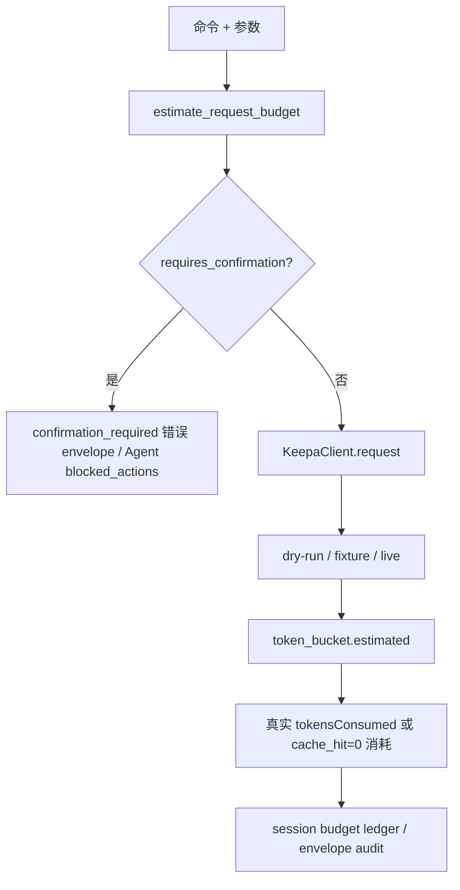
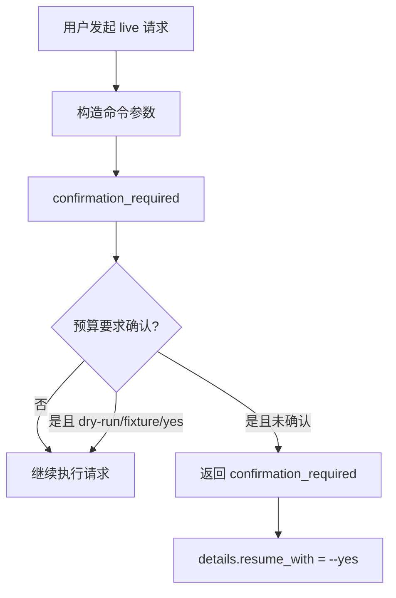
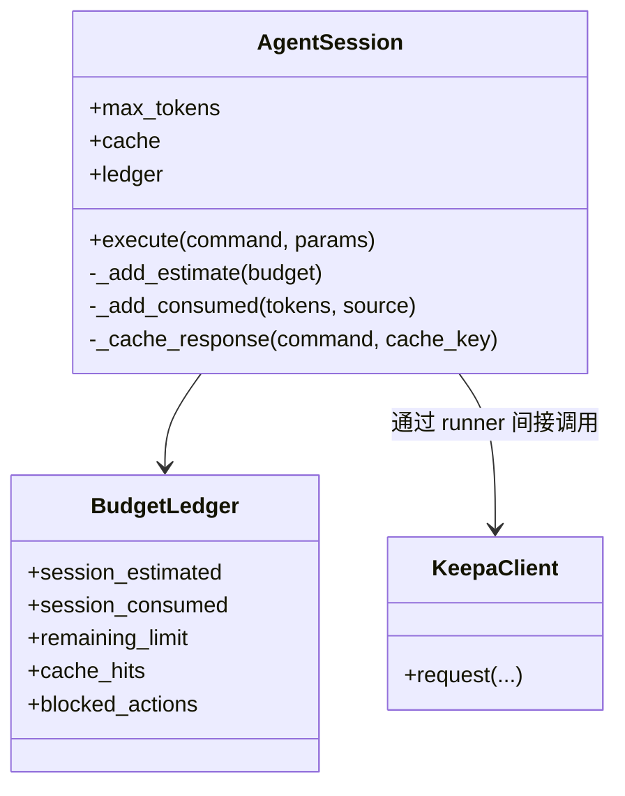

这一页解释 keepa-cli 如何在**真实请求发生之前**估算成本、在**高风险请求入口处**强制确认、并在**会话与缓存路径中**保留可审计的 token 证据。范围只覆盖本地预算估算、确认门禁、会话账本与高成本命令保护，不展开缓存键设计、脱敏机制或 MCP 工具注册等相邻主题。Sources: [token_budget.py](keepa_cli/token_budget.py#L14-L37) [client.py](keepa_cli/client.py#L62-L146) [commands/common.py](keepa_cli/commands/common.py#L98-L115) [agent/session.py](keepa_cli/agent/session.py#L117-L163)

从第一性原理看，这套成本治理不是“读真实余额再决定能否执行”，而是先用 `estimate_request_budget()` 做**纯本地静态预算**，再把结果注入 dry-run、fixture、live、session 四条路径：请求前用于提示与拦截，请求后用于与真实 `tokensConsumed` 对照，请求缓存命中时则显式记录“这次没有再消耗 token”。这意味着它优先解决的是**预防性治理**与**可审计性**，而不是实时配额调度。Sources: [token_budget.py](keepa_cli/token_budget.py#L1-L6) [token_budget.py](keepa_cli/token_budget.py#L176-L231) [client.py](keepa_cli/client.py#L88-L103) [client.py](keepa_cli/client.py#L213-L241) [client.py](keepa_cli/client.py#L379-L385)

## 成本治理的三层结构

keepa-cli 的成本治理可以拆成三层：**预算层**负责按命令和参数推导 `estimated_tokens`、`worst_case_tokens`、`requires_confirmation`；**门禁层**负责在 service/command 入口拦截需要显式确认的 live 请求；**执行证据层**负责把预算和真实消耗一起写入 envelope、session ledger 或 cache 命中记录。这样设计的结果是：即使没有联网、没有 API key、甚至只做 dry-run，也能看到成本轮廓。Sources: [token_budget.py](keepa_cli/token_budget.py#L25-L37) [commands/common.py](keepa_cli/commands/common.py#L98-L115) [client.py](keepa_cli/client.py#L90-L118) [agent/session.py](keepa_cli/agent/session.py#L134-L160)

Sources: [token_budget.py](keepa_cli/token_budget.py#L176-L231) [commands/common.py](keepa_cli/commands/common.py#L98-L115) [client.py](keepa_cli/client.py#L90-L146) [agent/session.py](keepa_cli/agent/session.py#L134-L183)

## 预算模型：不是统一常数，而是按命令族分型

预算器定义了两个核心数据结构：`BudgetComponent` 表示单个成本分量，例如基础产品成本、offers 分页成本、rating 增量成本；`BudgetEstimate` 则聚合为最终预算结果，并可序列化成字典，供 CLI、Agent、capabilities、workflow 计划复用。这里最关键的不是单个数字，而是**组件化来源说明**，因为它让高成本判断可被解释，而不是黑盒结论。Sources: [token_budget.py](keepa_cli/token_budget.py#L14-L37) [tests/test_token_budget.py](tests/test_token_budget.py#L72-L84)

下表总结了当前预算器中与成本治理最相关的命令族规则。表内只列出代码中可直接验证的分支，不引入仓库外推断。Sources: [token_budget.py](keepa_cli/token_budget.py#L176-L231)

| 命令 | estimated_tokens | worst_case_tokens | requires_confirmation | 说明 |
|---|---:|---:|---|---|
| `products.get` / `products.compare` | 按产品数起算 | 可因 `update=0` 增加 | 条件触发 | 支持 offers、rating、buybox、update_refresh 分量 |
| `products.search` | 10 | 10 | 否 | 固定预算 |
| `categories.get/search` | 1 | `parents` 时为 2 | `parents` 时为真 | 类目父链会提高最坏成本 |
| `history.export/trend/analyze` | 按 ASIN 数 | 同估算 | 否 | 线性成本 |
| `finder.query` | 10 | `max_tokens` 或默认 10 | 是 | 选择型高成本请求 |
| `deals.query` | 5 | 5 | 否 | 固定预算 |
| `categories.products` | 50 + `hydrate_top` | 同估算 | 是 | 榜单拉取默认高成本 |
| `bestsellers.get` / `topsellers.list` | 50 | 50 | 是 | 统一高成本保护 |
| `tracking.get/list/notifications` | 1 | `max_tokens` 或 1 | 否/部分为是 | `tracking.*` 写操作分支更严格 |
| `graphs.image` | 1 | 1 | 否 | 但 live 二进制下载要求 `--out` |
Sources: [token_budget.py](keepa_cli/token_budget.py#L180-L230)

## 产品请求预算：基础成本、增量成本与最坏情况拆分

产品类请求的预算从 `base_product` 开始，基础规则是“每个返回产品 1 token”。预算器会同时检查 `asin/asins` 与 `code/codes`，最终按最大项数计费，并至少按 1 个产品估算。这种处理把“调用者给了多少标识符”直接映射为基础成本。Sources: [token_budget.py](keepa_cli/token_budget.py#L61-L77) [tests/test_token_budget.py](tests/test_token_budget.py#L14-L21)

`offers` 是最明确的高成本放大器。代码会把请求值规范到 Keepa 文档允许的 `20..100` 区间，再按“每 10 个 offers 一页、每页 6 token、乘以产品数”计费。因此单个产品 `offers=20` 时，总预算从基础 1 直接升到 13，并触发确认门禁。测试也明确验证了这一点。Sources: [token_budget.py](keepa_cli/token_budget.py#L79-L96) [tests/test_token_budget.py](tests/test_token_budget.py#L30-L37)

`rating=1` 和 `buybox=1` 被视为**显式额外成本**，每个产品各增加 1 token。预算器特别注明它们是“显式请求才计费”，并且 `rating` 不因 `--full` 自动合并为免费附带项。对应测试中，两个产品同时启用 `rating` 与 `buybox` 时，预算从 2 增长到 6。Sources: [token_budget.py](keepa_cli/token_budget.py#L97-L121) [tests/test_token_budget.py](tests/test_token_budget.py#L22-L29)

`update=0` 的处理体现了**估算值与最坏值分离**的设计。它不会提高 `estimated_tokens`，但会把 `worst_case_tokens` 增加到“每产品最多再加 1 token”，并添加 `update_refresh` 组件，同时触发确认。这说明 keepa-cli 认为 `update=0` 是一种**潜在强制刷新风险**，即便实际不一定发生，也要在执行前告知上界。Sources: [token_budget.py](keepa_cli/token_budget.py#L123-L143) [tests/test_token_budget.py](tests/test_token_budget.py#L38-L45)

预算器还附带注释说明：`stats`、`history`、`days`、`videos`、`aplus` 会改变返回 payload 形状，但**不在本地预算器里追加 token 成本**。这不是说它们在外部 API 语义中永远无成本，而是说当前仓库中的本地预算模型没有为这些字段引入额外计费分量。Sources: [token_budget.py](keepa_cli/token_budget.py#L75-L77)

## 高成本榜单与聚合命令：为什么默认更严格

`bestsellers.get` 与 `topsellers.list` 被直接标记为 50 token 且 `requires_confirmation=True`，没有参数条件分支。这表明仓库将这两类榜单请求视为**固定高成本操作**，因此在所有 live 执行路径上都必须显式确认，除非走 dry-run、fixture 或明确传入同意义的绕过标志。Sources: [token_budget.py](keepa_cli/token_budget.py#L221-L222) [tests/test_token_budget.py](tests/test_token_budget.py#L46-L50) [tests/test_phase8_high_value_commands.py](tests/test_phase8_high_value_commands.py#L92-L107)

`categories.products` 更有代表性，因为它把类目候选发现和榜单抓取绑定到了同一命令中。其基础预算固定为 50，对应 Best Sellers 拉取；若显式设置 `hydrate_top`，则每个被补水的 ASIN 再加 1 token。代码和测试都强调 `hydrate_top` **默认是 0，且绝不会隐式加上**，因此高成本只来自调用者明确要求的产品级补充信息。Sources: [token_budget.py](keepa_cli/token_budget.py#L146-L173) [tests/test_token_budget.py](tests/test_token_budget.py#L52-L64) [tests/test_phase8_high_value_commands.py](tests/test_phase8_high_value_commands.py#L170-L180)

## 选择型请求：用 max_tokens 把开放式查询约束成可控风险

`finder.query` 采用了不同于产品类请求的预算方式：估算值固定为 10，但最坏值取 `max_tokens` 参数，未提供时默认也是 10，并且始终要求确认。这种建模反映出 Product Finder 查询的成本不是由单个实体数线性决定，而是由调用者允许的**最大查询代价窗口**决定。Sources: [token_budget.py](keepa_cli/token_budget.py#L205-L210) [commands/selection.py](keepa_cli/commands/selection.py#L66-L76)

选择型请求处理器 `selection_query()` 会先读取 selection JSON，再把 `domain` 和序列化后的 `selection` 组装为请求参数；如果用户给了 `max_tokens`，它会被直接传入请求参数，并参与本地预算估算。随后在真正调用 `KeepaClient` 前先经过 `confirmation_required()`。因此，`max_tokens` 在这里同时承担**远端 API 参数**与**本地风控上界**两种角色。Sources: [commands/selection.py](keepa_cli/commands/selection.py#L62-L85)

测试也验证了这一点：`finder.query` 在 dry-run、`max_tokens=25` 的场景下，返回的预算是 `estimated_tokens=10`、`worst_case_tokens=25`、`requires_confirmation=True`。即便没有发生真实调用，调用方依然可以在 envelope 中看到最坏消耗上界。Sources: [tests/test_phase8_high_value_commands.py](tests/test_phase8_high_value_commands.py#L20-L43)

## 确认门禁：在命令入口而不是网络层阻断

确认门禁由 `commands/common.py` 中的 `confirmation_required()` 统一实现。它先用 `estimate_request_budget()` 生成预算；如果预算不要求确认，则直接放行；如果是 dry-run、fixture，或显式带了 `yes`，同样放行；其他情况则返回 `confirmation_required` 错误 envelope，并在 `details` 中包含 `resume_with="--yes"`、`estimated_tokens`、`worst_case_tokens`。这说明门禁设计的目标不是隐藏风险，而是**把恢复执行的动作和成本数据一起返回**。Sources: [commands/common.py](keepa_cli/commands/common.py#L98-L115)

从 CLI 入口看，根级参数解析器显式提供了 `--yes`，帮助用户确认“可能消耗较高 token 的请求”。也就是说，CLI 用户的确认语义最终会透传到各命令的 `params`，再由统一门禁函数消费，而不是每个子命令各自维护一套确认逻辑。Sources: [cli.py](keepa_cli/cli.py#L47-L57)

Sources: [commands/common.py](keepa_cli/commands/common.py#L98-L115) [cli.py](keepa_cli/cli.py#L47-L57)

下表概括了确认门禁的触发与绕过条件。Sources: [commands/common.py](keepa_cli/commands/common.py#L98-L115) [token_budget.py](keepa_cli/token_budget.py#L176-L231)

| 条件 | 结果 |
|---|---|
| `requires_confirmation=False` | 直接放行 |
| `requires_confirmation=True` 且 `dry_run=True` | 放行，因无真实成本 |
| `requires_confirmation=True` 且提供 `fixture` | 放行，因离线路径 |
| `requires_confirmation=True` 且 `yes=True` | 放行，视为显式确认 |
| `requires_confirmation=True` 且以上条件均不满足 | 返回 `confirmation_required` 错误 envelope |
Sources: [commands/common.py](keepa_cli/commands/common.py#L98-L115)

## KeepaClient：预算先入 envelope，真实 token 后补充

`KeepaClient.request()` 的顺序非常重要：先构造 `RequestSpec`，再生成预算字典，然后才判断是 dry-run、fixture 还是 live。这样做保证了所有路径都有统一的 `token_bucket.estimated`。在 dry-run 下，返回值包含 `request` 规格和 `cache_provenance=source:"dry-run"`，但不会访问网络。Sources: [client.py](keepa_cli/client.py#L78-L103) [request_spec.py](keepa_cli/request_spec.py#L16-L33)

如果缺少 API key，live 路径不会尝试请求，而是返回 `auth_missing` 错误，同时依然附带 `token_bucket={"estimated": budget}`。这意味着“无认证失败”和“高成本风险”不会相互覆盖；调用方即使尚未配置凭据，也能先看到成本估算。Sources: [client.py](keepa_cli/client.py#L108-L118)

在 fixture 路径中，客户端会把 fixture 文件解析为 `body`，并调用 `_token_bucket_from_body()`：它先写入 `estimated`，再从响应体中抽取 `refillRate`、`tokensLeft`、`tokensConsumed` 等真实 token bucket 字段。换句话说，如果 fixture 自带这些字段，返回 envelope 就会同时拥有**本地估算**和**样本中的真实 bucket 信息**。Sources: [client.py](keepa_cli/client.py#L148-L189) [client.py](keepa_cli/client.py#L379-L385)

在 live 路径中，成功响应同样会调用 `_token_bucket_from_body()`，所以最终 envelope 的 `token_bucket` 至少包含 `estimated`，并在远端响应提供字段时再补入 `tokens_left`、`tokens_consumed` 等值。这里的职责分界很清晰：预算器给出**前验成本**，客户端再用 API 响应补上**后验消耗**。Sources: [client.py](keepa_cli/client.py#L288-L320) [client.py](keepa_cli/client.py#L379-L385)

## 缓存命中如何影响成本审计

当 GET 请求命中 SQLite 响应缓存时，客户端不会再次访问网络，而是直接返回缓存体，并构造特殊的 `token_bucket`：`cache_hit=True`、`tokens_consumed=0`，如果缓存项里保留了上次真实消耗，还会额外给出 `cached_tokens_consumed`。这使得调用方能够区分“本次没有消耗 token”和“历史上首次填充缓存时消耗过 token”这两个事实。Sources: [client.py](keepa_cli/client.py#L204-L241) [tests/test_client.py](tests/test_client.py#L104-L137)

测试明确证明了这一点：同一 `products.get` 发起两次，网络 opener 只被调用一次；第二次命中缓存后，`tokens_consumed=0`，同时保留 `cached_tokens_consumed=1`。因此在成本治理语义里，缓存不是“删除成本证据”，而是把成本证据转换成“历史已付费、本次复用”。Sources: [tests/test_client.py](tests/test_client.py#L104-L137)

## AgentSession：把单次预算扩展成会话账本

在 stdio/MCP 长会话场景中，`AgentSession.execute()` 会先按命令和参数计算预算，并立即把估算值累计到 `ledger.session_estimated`。如果该动作需要确认而调用方未绕过，它不会执行真实命令，而是返回确认错误，并把该动作记录进 `blocked_actions`，其中包含 `command`、`tool`、`cache_key`、`estimated_tokens`、`worst_case_tokens` 与阻断原因。Sources: [agent/session.py](keepa_cli/agent/session.py#L117-L163)

只有在通过门禁后，会话才真正调用底层 runner，并从 payload 中抽取 `tokens_consumed` 累加到 `session_consumed`。这意味着 session ledger 同时保留了**预估轨迹**与**实际消耗轨迹**，并且两者是分开计数的。对于需要事后分析“为什么本轮会话很贵”的 Agent 系统，这比只记录最终余额更有解释力。Sources: [agent/session.py](keepa_cli/agent/session.py#L153-L163) [agent/session.py](keepa_cli/agent/session.py#L186-L197)

如果启用了 `max_tokens` 会话上限，`AgentSession` 还会维护 `remaining_limit = max_tokens - session_estimated`。注意这里扣减的是**累计估算值**，不是实际消耗值；测试中 `max_tokens=5` 且一次估算为 1 时，剩余额度变为 4。这说明该字段是会话侧的**规划预算提示**，而不是账户真实 token bucket。Sources: [agent/session.py](keepa_cli/agent/session.py#L113-L116) [agent/session.py](keepa_cli/agent/session.py#L186-L197) [tests/test_agent_session.py](tests/test_agent_session.py#L73-L88)

Sources: [agent/session.py](keepa_cli/agent/session.py#L105-L221)

## 本地配置中的 max_tokens_per_request：提示阈值，而非自动熔断器

配置系统的默认值中包含 `max_tokens_per_request = 20`，并提供 `config set-max-tokens` 写入入口，且要求是正整数。这个配置项确实属于成本治理的一部分，但从当前代码证据看，它本身只是**可持久化的预算偏好**，并不直接在 `KeepaClient.request()` 或 `confirmation_required()` 中形成统一自动拦截。Sources: [config.py](keepa_cli/config.py#L18-L23) [config.py](keepa_cli/config.py#L187-L217) [cli.py](keepa_cli/cli.py#L79-L82)

在当前仓库中，真正与请求预算强绑定的 `max_tokens` 主要出现在选择型命令参数透传与 Agent/TUI 提示层，而不是通用 HTTP 客户端的硬限制。因此，阅读这项配置时应把它理解为**面向用户与 Agent 的预算提示基线**，而不是全局强制停止开关。Sources: [commands/selection.py](keepa_cli/commands/selection.py#L66-L76) [token_budget.py](keepa_cli/token_budget.py#L205-L210) [run_bash result](keepa_cli/cli.py#L80-L82)

## audit.cost 与 capabilities：把预算能力显式暴露给外部系统

成本治理不仅在执行前生效，也被显式暴露为可查询能力。`capabilities.build_capabilities()` 会遍历命令清单，为每个命令预填 `estimated_tokens`、`worst_case_tokens`、`requires_confirmation`，让 Agent 在真正调用前就知道某个工具是否高成本。Sources: [capabilities.py](keepa_cli/capabilities.py#L74-L101)

此外，`audit.cost` 作为本地工作流命令，可以接收一个或多个命令规格并返回总预算；测试显示对 `products.get` 单 ASIN 的成本审计会得到 `estimated_tokens=1`。这使得成本治理不仅是运行时防线，也是一种**可编排的前置分析工具**。Sources: [commands/workflows.py](keepa_cli/commands/workflows.py#L78-L105) [tests/test_phase10_workflows.py](tests/test_phase10_workflows.py#L68-L71)

## 成本治理的实际边界

当前实现有几个清晰边界。第一，预算器是**纯本地估算**，文件头已明确“不读取账户真实 token bucket”；真实 bucket 信息只在响应体存在时由客户端补录。第二，确认门禁主要由命令层和会话层执行，而不是 HTTP 层统一拒绝所有高成本请求。第三，缓存命中会改变本次消耗记录，但不会抹去首次消耗的证据。Sources: [token_budget.py](keepa_cli/token_budget.py#L1-L6) [client.py](keepa_cli/client.py#L379-L385) [commands/common.py](keepa_cli/commands/common.py#L98-L115) [agent/session.py](keepa_cli/agent/session.py#L134-L151) [client.py](keepa_cli/client.py#L213-L241)

也正因为这些边界，这一页讨论的是“**如何在仓库内部治理单次请求和会话级成本风险**”，而不是 Keepa 账户余额管理、缓存策略细节或脱敏证据链。如果你接下来要理解“缓存如何让高成本请求变成低边际成本复用”，应继续阅读 [SQLite 响应缓存：键设计、缓存来源说明与持久化策略](19-sqlite-xiang-ying-huan-cun-jian-she-ji-huan-cun-lai-yuan-shuo-ming-yu-chi-jiu-hua-ce-lue)；如果你要理解“这些预算与确认信息如何进入 Agent 长会话上下文”，应继续阅读 [长会话能力：stdio/MCP 会话、资源分块与上下文控制](24-chang-hui-hua-neng-li-stdio-mcp-hui-hua-zi-yuan-fen-kuai-yu-shang-xia-wen-kong-zhi)。Sources: [client.py](keepa_cli/client.py#L213-L241) [agent/session.py](keepa_cli/agent/session.py#L117-L163) [token_budget.py](keepa_cli/token_budget.py#L1-L6)