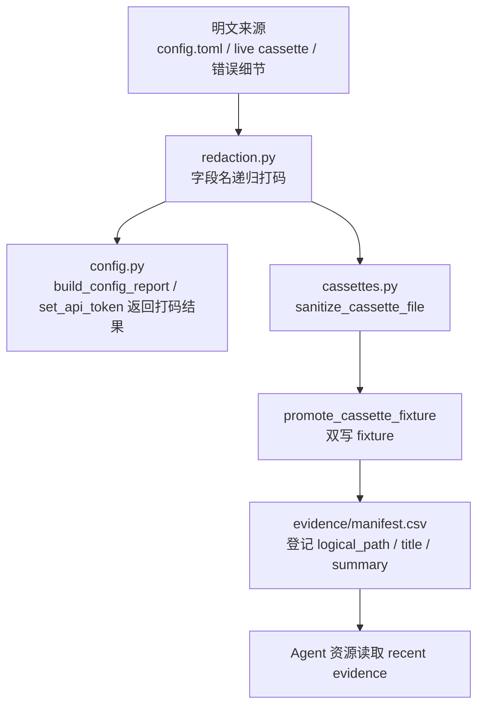
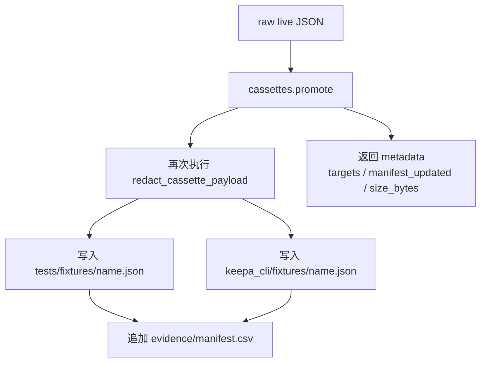

这一页只解释 keepa-cli 如何把**敏感信息隐藏**与**可追溯证据保留**组合成一条本地化、可审计的安全链路：配置报告不会泄露明文 token，cassette 在进入 fixture 之前会再次脱敏，而 evidence 清单则为这些长期保存的样本或任务记录提供可检索索引。它关注的是“**能不能安全地看、存、复用真实响应**”，不展开缓存、预算控制或 MCP 工具注册等相邻主题。Sources: [redaction.py](keepa_cli/redaction.py#L1-L41) [config.py](keepa_cli/config.py#L1-L100) [cassettes.py](keepa_cli/cassettes.py#L1-L127) [evidence/README.md](evidence/README.md#L1-L27)

## 核心关系：从明文输入到可提交证据

从实现上看，这条链路分成三层：第一层是**通用打码函数**，负责按敏感字段名和显式 secret 值递归替换；第二层是**配置与 cassette 工作流**，把这套打码规则应用到配置报告、请求描述和本地 JSON 清洗；第三层是**evidence 索引**，把产物路径与摘要登记到 `manifest.csv`，让后续 Agent 或开发者能够检索到“有哪些已清洗证据可用”。Sources: [redaction.py](keepa_cli/redaction.py#L13-L40) [request_spec.py](keepa_cli/request_spec.py#L1-L33) [service.py](keepa_cli/service.py#L367-L408) [keepa_cli/agent/resources.py](keepa_cli/agent/resources.py#L293-L328)

上图的关键点不是“有没有一个统一安全网”，而是**所有外显路径都优先经过 redaction，再进入可被提交或被读取的存储位置**。配置报告调用 `redact_value()`；错误 envelope 会对 message 与 details 进一步打码；cassette promotion 则在写入 fixture 前重新执行一次脱敏，因此即使输入已经是“看起来处理过”的文件，系统仍按同一规则重跑清洗。Sources: [config.py](keepa_cli/config.py#L86-L146) [envelope.py](keepa_cli/envelope.py#L31-L55) [cassettes.py](keepa_cli/cassettes.py#L37-L84) [keepa_cli/agent/resources.py](keepa_cli/agent/resources.py#L315-L328)

## 通用脱敏规则：按字段名递归，而不是按命令分支硬编码

底层规则非常直接：`SECRET_PARAM_NAMES` 与 `SECRET_NAMES` 都把 `key`、`api_key`、`apikey`、`token`、`authorization` 视为敏感字段；当值是映射对象时，命中这些键名会被直接替换成 `[REDACTED]`；当值是字符串时，则按显式传入的 `secret_values` 做全文替换；列表与元组会递归处理。这个设计的意义是**规则跟数据结构走，而不是跟 CLI 子命令走**，所以同一套打码逻辑可以复用在配置、请求规格、错误详情和 cassette JSON 中。Sources: [redaction.py](keepa_cli/redaction.py#L13-L40) [cassettes.py](keepa_cli/cassettes.py#L17-L34)

| 规则维度 | 实现位置 | 触发条件 | 输出结果 |
|---|---|---|---|
| 敏感键名打码 | `redact_value()` / `redact_cassette_payload()` | 键名命中 `key/api_key/apikey/token/authorization` | 值替换为 `[REDACTED]` |
| 明文字符串替换 | `redact_text()` | 调用方显式传入 `secret_values` | 字符串中对应片段替换为 `[REDACTED]` |
| URL query 打码 | `_redact_url()` | 键名为 `url` 且值为字符串 | 仅替换 query 中敏感参数值 |
| 递归容器处理 | `Mapping` / `list` / `tuple` 分支 | 嵌套 JSON / Python 结构 | 深层字段也会被继续清洗 |

这个表说明 keepa-cli 的脱敏不是单一“字符串查找替换”，而是同时覆盖**结构化字段**与**URL 参数**两类常见泄漏面。其中 cassette 逻辑比通用 `redaction.py` 多一步 `_redact_url()`，因为 live 请求记录里敏感信息可能出现在请求地址的 query string 中。Sources: [redaction.py](keepa_cli/redaction.py#L16-L40) [cassettes.py](keepa_cli/cassettes.py#L20-L34) [cassettes.py](keepa_cli/cassettes.py#L118-L126)

## 配置打码：允许落盘，禁止在报告里回显明文

配置模块的安全边界写得很明确：它负责本地配置路径、默认值和 token 写入，但**不会把明文 API key 直接返回到 stdout 报告**。`build_config_report()` 先读取配置，再把内部错误键 `_config_error` 抽离成 `valid/error` 元数据，最后对 `config` 调用 `redact_value()`；`set_api_token()` 虽然会把 token 写进 `config.toml`，但它返回给调用方的 `config` 同样已经脱敏。Sources: [config.py](keepa_cli/config.py#L1-L6) [config.py](keepa_cli/config.py#L86-L146)

这里要区分两个对象：**配置文件内容**与**配置报告内容**。`render_config_toml()` 在有 `api_key` 时会把它写入 TOML 文本，这是本地持久化行为；而 `build_config_report()` 和 `set_api_token()` 返回的 JSON 数据则经过打码，适合 CLI `--json`、Agent 或 TUI 状态栏读取。换句话说，系统并不禁止本地保存凭据，但它禁止把凭据重新暴露进面向机器消费的输出面。Sources: [config.py](keepa_cli/config.py#L46-L57) [config.py](keepa_cli/config.py#L86-L100) [config.py](keepa_cli/config.py#L122-L146)

测试把这个边界钉得很死。`test_set_api_token_writes_local_config_and_report_redacts_it` 明确验证：文件里确实写入 token，但 `build_config_report()` 中的 `api_key` 必须是 `[REDACTED]`，而且 token 不得出现在整个 report 字符串里；CLI 级测试又进一步确认 `config set-token` 的标准输出中不包含明文 token。Sources: [tests/test_config.py](tests/test_config.py#L63-L77) [tests/test_cli.py](tests/test_cli.py#L63-L78)

## 错误与请求描述也遵守同一打码契约

脱敏并不只发生在“成功路径”。`RequestSpec.to_dict()` 会把请求参数和 JSON body 变成 `params_redacted` 与 `json_body_redacted`；`error_envelope()` 则对错误消息中的显式 secret 值和 `details` 结构再次执行打码。这样做的结果是：即使命令失败，**错误回包也尽量不变成泄漏通道**。Sources: [request_spec.py](keepa_cli/request_spec.py#L16-L33) [envelope.py](keepa_cli/envelope.py#L31-L55)

这也是为什么仓库在安全说明里直接宣告“输出会打码 `key`、`api_key`、`apikey`、`token`、`authorization`”——这不是 README 层面的口号，而是由 `redaction.py`、`request_spec.py` 与 `envelope.py` 共同落实到 JSON 输出结构中的运行时行为。Sources: [README.zh-CN.md](README.zh-CN.md#L208-L214) [redaction.py](keepa_cli/redaction.py#L13-L40) [request_spec.py](keepa_cli/request_spec.py#L24-L33) [envelope.py](keepa_cli/envelope.py#L41-L55)

## cassette 清洗：先把 live JSON 变成可检查的脱敏副本

`cassettes.sanitize` 对应的是**最小清洗动作**：读取一个本地 JSON 文件，递归清理敏感字段和 URL query，然后把结果按稳定格式写到目标路径，并返回 `input`、`output`、`size_bytes`、`redacted_secret_names` 等元数据。它不访问网络，也不涉及 fixture 同步与 evidence 索引，因此适合在“先检查一下原始 live 响应是否已可安全浏览”这个阶段单独使用。Sources: [cassettes.py](keepa_cli/cassettes.py#L37-L50) [service.py](keepa_cli/service.py#L367-L382) [scripts/redact_cassette.py](scripts/redact_cassette.py#L16-L30)

在实现细节上，cassette 清洗比通用对象脱敏更贴近 HTTP 记录格式：如果某个字段名是 `url` 且值是字符串，就会调用 `_redact_url()` 只清理 query 中的敏感键值，保留域名、路径和非敏感参数；如果敏感值出现在 headers 或 body 的 JSON 键里，则继续用递归方式替换。这保证了**证据仍可读**，而不是一刀切地破坏整个请求上下文。Sources: [cassettes.py](keepa_cli/cassettes.py#L20-L34) [cassettes.py](keepa_cli/cassettes.py#L118-L126)

测试覆盖了这个预期：带有 `key` 与 `token` 的 URL query 会变成 `%5BREDACTED%5D` 编码值，`Authorization` header 会变成 `[REDACTED]`，嵌套 body 中的 `api_key` 与 `token` 也会被替换，而普通字段 `safe` 保持不变。这说明目标不是把整份 JSON 变成不可用黑盒，而是**尽量只擦除秘密，不擦除结构与业务语义**。Sources: [tests/test_project_tools.py](tests/test_project_tools.py#L44-L64)

## cassette promote：从一次 live 响应生成可复用 fixture

`cassettes.promote` 是完整的证据提升工作流。它会读取输入 JSON，再次执行 `redact_cassette_payload()`，把同一份清洗后内容同步写入 `tests/fixtures/<name>.json` 与 `keepa_cli/fixtures/<name>.json`，并在未开启 `dry_run` 且未禁用 manifest 时向 `evidence/manifest.csv` 追加登记。返回结果里会给出目标路径、文件大小、manifest 是否更新等元数据。Sources: [cassettes.py](keepa_cli/cassettes.py#L53-L84) [service.py](keepa_cli/service.py#L385-L408) [cli.py](keepa_cli/cli.py#L172-L185)

这个设计把“**清洗**”和“**进入长期离线资产**”明确区分开来：`sanitize` 只生成一个脱敏副本，而 `promote` 则把它正式转成工程资产。双写到 `tests/fixtures` 与 `keepa_cli/fixtures` 的原因也写死在实现里，不依赖调用者手工复制，因此测试用例与包内默认 fixture 可以保持同步来源。Sources: [cassettes.py](keepa_cli/cassettes.py#L67-L74) [tests/test_project_tools.py](tests/test_project_tools.py#L82-L116)

`_fixture_name()` 还给 promotion 过程加了一个很工程化的护栏：fixture 名不能为空，且不能包含 `..`、`/`、`\` 等路径分隔符；如果调用者没写 `.json` 后缀，系统会自动补齐。这不是脱敏逻辑本身，但它是证据链安全的一部分，因为它避免了通过文件名把写入范围扩散到目标目录之外。Sources: [cassettes.py](keepa_cli/cassettes.py#L87-L94)

从命令暴露面来看，CLI、service、capabilities 和 MCP 周边都把 `cassettes.promote` 视为一个正式能力，而不是仓库维护脚本。这意味着“把 live 响应提炼成可提交离线样本”不是临时运维动作，而是产品化的工程流程。Sources: [cli.py](keepa_cli/cli.py#L172-L185) [capabilities.py](keepa_cli/capabilities.py#L66-L69) [tests/test_capabilities.py](tests/test_capabilities.py#L36-L49) [docs/agent-contract.md](docs/agent-contract.md#L333-L341)

## evidence 清单：把证据变成可检索索引

`evidence/README.md` 把 evidence 目录定义成两类内容：`tasks/` 存任务日志，`manifest.csv` 作为清单，便于 Agent 快速检索最近证据；它还要求新增或更新任务日志后同步维护 `manifest.csv`。这说明 evidence 的目标不是单纯“归档文件”，而是建立**面向机器与人都可浏览的索引层**。Sources: [evidence/README.md](evidence/README.md#L3-L20)

实现上，`cassettes.promote` 会向 `manifest.csv` 追加一行包含 `logical_path`、`title`、`status`、`updated_at`、`summary` 的记录；如果该 `logical_path` 已存在于文件文本中，则直接跳过，不重复登记。也就是说，manifest 在当前代码里不仅承载任务日志索引，也承载**被提升 fixture 的登记入口**，并通过简单的文本存在性检查实现幂等追加。Sources: [cassettes.py](keepa_cli/cassettes.py#L96-L115)

| 清单字段 | 来源实现 | 当前用途 |
|---|---|---|
| `logical_path` | `_append_manifest_entry()` | 记录证据或 fixture 的逻辑路径 |
| `title` | `promote` 参数或默认文件名 | 给索引项提供人类可读标题 |
| `status` | 固定写入 `active` | 标记条目状态 |
| `updated_at` | 固定写入 `2026-05-10` | 记录登记日期 |
| `summary` | 固定摘要模板 | 说明该条目是 promotion 生成的脱敏 fixture |

当前仓库中的 `manifest.csv` 也确实使用了这组列名，并包含大量 `evidence/tasks/...` 记录；与此同时，Agent 资源层会读取这个 CSV，提取最近 8 条 `logical_path/title/status/updated_at/summary` 作为 recent evidence 资源返回。因此 evidence 清单不是只给 Git 历史看的附属文件，而是**运行时可被消费的数据源**。Sources: [evidence/manifest.csv](evidence/manifest.csv#L1-L23) [keepa_cli/agent/resources.py](keepa_cli/agent/resources.py#L293-L312)

## 对外可见的安全约束

仓库根文档在安全章节给出三条与本页直接相关的规则：不要提交 Keepa API key、`.env`、本地缓存或未脱敏 cassette；输出会自动打码一组固定敏感字段；真实响应应先通过 `kc --json cassettes promote live.json --name fixture_name` 脱敏并同步写入双份 fixture，同时更新 `evidence/manifest.csv`。这三条恰好对应了代码里的三个环节：**不提交原件、所有输出先打码、长期样本通过 promote 进入仓库**。Sources: [README.zh-CN.md](README.zh-CN.md#L208-L214)

MCP 资源层还把这套流程写成了操作指南：先把小规模 live 响应写到 `evidence/runtime-logs/`，再执行 promote，最后只提交脱敏后的 fixture 与 manifest，永远不要提交带 token 的原始 runtime logs 或请求元数据。这里值得注意的是，`runtime-logs/` 在证据目录中存在，但指导文本明确把它定位为**原始过渡产物**，而不是最终可提交资产。Sources: [keepa_cli/agent/resources.py](keepa_cli/agent/resources.py#L315-L328) [evidence/README.md](evidence/README.md#L3-L20)

## 验证面：这套证据链如何被测试锁定

从测试分布看，这一主题至少有三层保障。第一层是配置层：验证默认报告不含凭据、坏 TOML 仍回退默认值并输出错误元数据、写入 token 后报告必须脱敏。第二层是 cassette 层：验证 URL、header、body 和嵌套结构都会被清洗，`cassettes.sanitize` 实际写出的文件中不应再含有原始 secret。第三层是 promotion 层：验证 fixture 被同步写到两个目录，且 manifest 会被创建并含有期望表头与条目。Sources: [tests/test_config.py](tests/test_config.py#L25-L77) [tests/test_project_tools.py](tests/test_project_tools.py#L44-L116)

这套测试组合的价值，在于它同时覆盖了**内容正确性**与**流程正确性**。仅验证 `redact_cassette_payload()` 会替换字符串还不够，因为真实风险来自“有没有落到不该落的地方”；而 `run_command("cassettes.promote", ...)` 级别的测试正是在确认 service 封装、文件写入和 manifest 更新这一整段证据链都可工作。Sources: [tests/test_project_tools.py](tests/test_project_tools.py#L65-L116) [service.py](keepa_cli/service.py#L367-L408)

## 适合怎样理解这页内容

如果你是中级开发者，最值得记住的不是某个具体命令，而是 keepa-cli 采用了一个非常一致的原则：**允许本地保存必要秘密，但禁止把秘密重新暴露到面向自动化消费的输出里；允许保留真实响应，但必须先把它转成脱敏、可索引、可复用的证据资产。** 这使得配置、测试 fixture、Agent 资源与证据目录可以共存，而不会把“方便调试”变成“方便泄漏”。Sources: [config.py](keepa_cli/config.py#L122-L146) [envelope.py](keepa_cli/envelope.py#L31-L55) [cassettes.py](keepa_cli/cassettes.py#L53-L84) [keepa_cli/agent/resources.py](keepa_cli/agent/resources.py#L293-L328)

如果你接下来要继续阅读，最自然的相邻页面有两个：想看这些脱敏后数据如何进入稳定机器输出，可读 [JSON Envelope 规范：稳定输出、错误模型与 Agent 友好响应](18-json-envelope-gui-fan-wen-ding-shu-chu-cuo-wu-mo-xing-yu-agent-you-hao-xiang-ying)；想看 evidence 与 fixture 如何进一步暴露给 Agent 资源系统，可读 [MCP 资源系统：Schema、fixture、evidence 与大响应资源引用](23-mcp-zi-yuan-xi-tong-schema-fixture-evidence-yu-da-xiang-ying-zi-yuan-yin-yong)。Sources: [envelope.py](keepa_cli/envelope.py#L1-L56) [keepa_cli/agent/resources.py](keepa_cli/agent/resources.py#L293-L328)