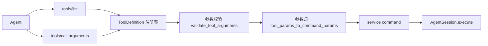
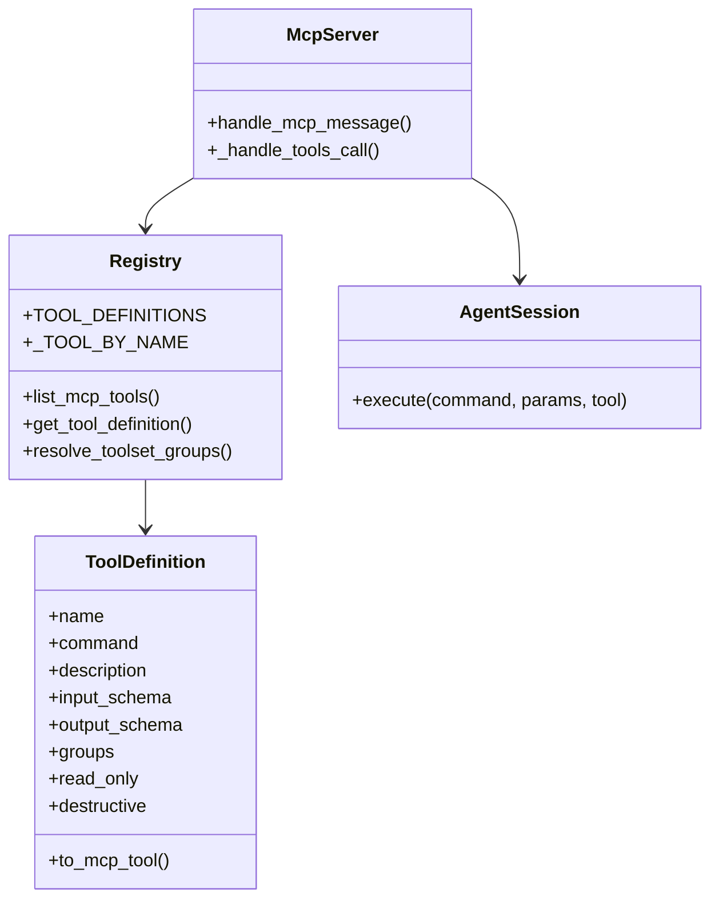

本页位于“深入解析 → Agent 协议层”中的 **[MCP 工具注册表：强类型工具面、toolset 分组与命令映射](22-mcp-gong-ju-zhu-ce-biao-qiang-lei-xing-gong-ju-mian-toolset-fen-zu-yu-ming-ling-ying-she)**，只讨论 MCP 工具注册表本身：它如何把少量、任务导向、强类型的工具暴露给 Agent，如何按 toolset 控制可见工具面，以及如何把结构化参数映射到统一的 service command；资源系统、会话缓存与分块读取会留给后续页面。
Sources: [mcp.py](keepa_cli/agent/mcp.py#L15-L25), [mcp-agent-tools.md](docs/architecture/mcp-agent-tools.md#L44-L52)

注册表层的核心设计原则很明确：**MCP 不暴露 CLI 字符串，也不直接实现 Keepa HTTP 请求，而是定义 ToolDefinition 并最终复用 `run_command` 所代表的服务命令体系**。这让 MCP 成为一个薄协议适配层：Agent 看到的是稳定 schema，业务执行看到的仍是既有命令名与参数结构。
Sources: [mcp-agent-tools.md](docs/architecture/mcp-agent-tools.md#L17-L21), [mcp-agent-tools.md](docs/architecture/mcp-agent-tools.md#L23-L29), [tools.py](keepa_cli/agent/tools.py#L1-L6)

## 从第一性原理看：为什么这里需要“注册表”

如果把 MCP 直接做成“转发任意 CLI 参数”的壳，Agent 需要理解 argparse 风格别名、命令拼写、确认门禁和本地/远程命令边界，协议层会立刻退化成弱类型文本接口。当前实现反过来做：先在 `tools.py` 中显式列出工具名、服务命令、输入/输出 schema、分组和只读提示，再由 `mcp.py` 在 `tools/list` 与 `tools/call` 阶段消费这些定义。
Sources: [tools.py](keepa_cli/agent/tools.py#L30-L58), [mcp.py](keepa_cli/agent/mcp.py#L92-L118), [mcp-agent-tools.md](docs/architecture/mcp-agent-tools.md#L82-L101)

这种做法的直接结果是，**工具面被压缩成少量高价值任务接口，而不是完整 CLI 或 REST 的镜像**。架构设计文档列出的初始工具面集中在产品研究、类目发现、Deals、Seller、工作流规划、研究图谱合并，以及少量审计和本地报告类工具；测试也验证默认 `research` toolset 并不会把审计工具一并暴露出来。
Sources: [mcp-agent-tools.md](docs/architecture/mcp-agent-tools.md#L53-L80), [test_mcp.py](tests/test_mcp.py#L28-L46)

Sources: [mcp.py](keepa_cli/agent/mcp.py#L92-L118), [mcp.py](keepa_cli/agent/mcp.py#L134-L156), [tools.py](keepa_cli/agent/tools.py#L703-L766)

## ToolDefinition：强类型工具面的最小核心

注册表的基本单位是 `ToolDefinition`。它包含 `name`、`command`、`description`、`input_schema`、`output_schema`、`groups`、`read_only` 和 `destructive`。其中 `name` 是 MCP 工具名，`command` 是内部服务命令名，`groups` 决定它属于哪些逻辑分组，而只读/破坏性标记则会进入 MCP annotations。
Sources: [tools.py](keepa_cli/agent/tools.py#L30-L40)

`ToolDefinition.to_mcp_tool()` 会把内部定义转换成 MCP 侧可发现的工具对象。除了标准的 `name`、`description`、`inputSchema`、`outputSchema`，它还稳定输出 `annotations`，并用 `x-keepa.service_command` 与 `x-keepa.groups` 把内部映射元数据显式暴露出去。测试对 `keepa.products_get` 和 `keepa.products_compare` 都验证了这条映射链。
Sources: [tools.py](keepa_cli/agent/tools.py#L41-L58), [test_mcp.py](tests/test_mcp.py#L39-L46)

从文档设计目标看，这种“标准字段 + `x-keepa` 扩展字段”的方式有两个边界收益：一是 Agent 客户端能直接消费 schema；二是调试者仍能看见背后的服务命令归属，而无需猜测某个 MCP 名称最终会执行哪个业务入口。
Sources: [mcp-agent-tools.md](docs/architecture/mcp-agent-tools.md#L17-L21), [tools.py](keepa_cli/agent/tools.py#L53-L57)

## 工具命名模式：MCP 名称与内部命令分离

当前工具命名模式是 **`keepa.<resource>_<action>`**，例如 `keepa.products_get`、`keepa.products_compare`、`keepa.categories_search`。与之对应的内部服务命令仍保留项目既有的点号风格，如 `products.get`、`products.compare`、`categories.search`。这意味着 MCP 名称是对外协议名，service command 是对内执行名，二者不是简单重复，而是一个稳定的双层命名体系。
Sources: [tools.py](keepa_cli/agent/tools.py#L494-L659), [mcp-agent-tools.md](docs/architecture/mcp-agent-tools.md#L82-L85)

这种分离让注册表可以在不触碰业务命令体系的情况下优化外部可用性。`keepa.products_get` 对 Agent 来说更像一个“可发现的工具项”，而 `products.get` 对服务层来说仍是原有分发表中的命令键。`mcp.py` 在处理 `tools/call` 时，先通过工具名查到 `ToolDefinition`，再把调用转到 `tool.command`。
Sources: [mcp.py](keepa_cli/agent/mcp.py#L141-L156), [tools.py](keepa_cli/agent/tools.py#L699-L700)

## toolset 分组：默认最小暴露，而不是一次性全量开放

toolset 机制由两个层次组成。第一层是 `TOOLSET_GROUPS` 常量，定义 `research`、`audit`、`reports`、`tracking-readonly` 和 `all`；第二层是每个工具自己的 `groups` 元组，表示该工具同时归属于哪些逻辑主题。`DEFAULT_TOOLSET` 被固定为 `research`。
Sources: [tools.py](keepa_cli/agent/tools.py#L16-L23), [tools.py](keepa_cli/agent/tools.py#L37-L40)

`resolve_toolset_groups()` 负责把 `toolset` 或 `toolsets` 参数解析为一组 group 名。如果请求的是 `all`，函数直接返回 `None`，表示不过滤；如果传入未知 toolset，则抛出 `ValueError`。`mcp.py` 在 `tools/list` 中捕获这个异常，并按 JSON-RPC `-32602` 返回 `Invalid toolset` 与 `available_toolsets`。测试覆盖了这一行为。
Sources: [tools.py](keepa_cli/agent/tools.py#L669-L688), [mcp.py](keepa_cli/agent/mcp.py#L92-L116), [test_mcp.py](tests/test_mcp.py#L212-L220)

这意味着 **默认发现面是受控的**。当客户端不带任何过滤参数调用 `tools/list` 时，返回的是 `research` toolset；只有显式指定 `audit`、`reports`、`tracking-readonly` 或 `all`，才会看到对应工具。这不是 UI 级分页，而是协议层的能力收敛。
Sources: [mcp.py](keepa_cli/agent/mcp.py#L92-L116), [test_mcp.py](tests/test_mcp.py#L28-L38), [mcp-agent-tools.md](docs/architecture/mcp-agent-tools.md#L72-L80)

| toolset | 解析结果 | 典型工具 | 设计意图 |
| --- | --- | --- | --- |
| `research` | `{"research"}` | `keepa.products_get`、`keepa.deals_query`、`keepa.research_graph_merge` | 默认暴露高价值研究工具 |
| `audit` | `{"audit"}` | `keepa.audit_cost`、`keepa.cassettes_sanitize`、`keepa.cassettes_promote` | 显式进入审计/脱敏工具面 |
| `reports` | `{"reports"}` | `keepa.reports_build`、`keepa.browse_snapshot` | 仅暴露本地报告与浏览输出 |
| `tracking-readonly` | `{"tracking-readonly"}` | `keepa.tracking_list`、`keepa.tracking_get` | 只读追踪工具，不含写操作 |
| `all` | `None` | 全量工具定义 | 调试、schema 生成、全发现 |
Sources: [tools.py](keepa_cli/agent/tools.py#L16-L23), [tools.py](keepa_cli/agent/tools.py#L669-L696), [test_mcp.py](tests/test_mcp.py#L47-L78)

## 工具面本身：按任务而非按底层 API 组织

`TOOL_DEFINITIONS` 中当前注册了研究类、审计类、报告类和 tracking 只读类工具。研究类包括产品获取、产品比较、类目搜索、类目候选商品、类目生成 Finder scaffold、Finder 查询、Deals 查询、Seller 查询、榜单查询、工作流规划和研究图谱合并。审计类包含成本估算与 cassette 处理；报告类包含报告构建与本地快照；tracking 只开放读取能力。
Sources: [tools.py](keepa_cli/agent/tools.py#L494-L663), [mcp-agent-tools.md](docs/architecture/mcp-agent-tools.md#L53-L80)

这里最值得注意的不是“工具数量”，而是“工具粒度”。例如 `keepa.categories_finder_selection` 明确是一个**本地 scaffold 生成工具**，`keepa.research_graph_merge` 明确是一个**本地 graph 合并工具**；它们都不是网络查询包装器。测试分别验证了前者返回 `finder_selection_scaffold` 本地视图，后者被纳入默认研究工具面。
Sources: [tools.py](keepa_cli/agent/tools.py#L527-L533), [tools.py](keepa_cli/agent/tools.py#L583-L589), [test_mcp.py](tests/test_mcp.py#L111-L138), [test_mcp.py](tests/test_mcp.py#L33-L38)

另一方面，tracking 工具被刻意限制为只读。架构文档明确写出“tracking 写操作仍不暴露给 MCP”，测试也验证 `tracking-readonly` toolset 中只出现读取相关工具，而不会出现写命令。
Sources: [mcp-agent-tools.md](docs/architecture/mcp-agent-tools.md#L77-L80), [tools.py](keepa_cli/agent/tools.py#L631-L661), [test_mcp.py](tests/test_mcp.py#L64-L72)

Sources: [tools.py](keepa_cli/agent/tools.py#L30-L58), [tools.py](keepa_cli/agent/tools.py#L494-L700), [mcp.py](keepa_cli/agent/mcp.py#L68-L118), [mcp.py](keepa_cli/agent/mcp.py#L134-L156)

## 输入 schema：强类型不是“有参数说明”，而是“受约束的 JSON 形状”

每个工具都绑定一个独立的 `input_schema`。这些 schema 普遍设置了 `type: object` 与 `additionalProperties: False`，因此注册表不只是“描述参数”，而是在协议入口限制非白名单字段。例如 `PRODUCTS_GET_SCHEMA` 支持 `asin`、`code`、`domain`、`view`、`history_limit`、`temporal_window_days`、`fixture`、`dry_run`、`yes`、`from_cache` 等字段，但不会接受未声明的新键。
Sources: [tools.py](keepa_cli/agent/tools.py#L84-L126)

同一模式也用于更复杂工具。`FINDER_QUERY_SCHEMA` 和 `DEALS_QUERY_SCHEMA` 允许使用内联 `selection` 或文件路径 `selection_file` 二选一；`WORKFLOW_PLAN_SCHEMA` 则把 `name` 限定为 `category-research` 或 `product-research`；`AUDIT_COST_SCHEMA` 则允许单命令估算或多命令估算。可见 schema 的职责既包括类型描述，也包括任务形状约束。
Sources: [tools.py](keepa_cli/agent/tools.py#L197-L234), [tools.py](keepa_cli/agent/tools.py#L237-L275), [tools.py](keepa_cli/agent/tools.py#L294-L307)

输出侧并不是“每个工具各写一套专用 schema”，而是统一复用 `MCP_ENVELOPE_OUTPUT_SCHEMA`。该 schema 要求最外层至少具有 `ok`、`command`、`cache_key`、`cache_hit` 和 `budget_ledger`，并为 `data` 与 `error` 预留稳定位置。这说明注册表把“工具差异”放在输入， 把“响应骨架”收敛到统一 envelope。
Sources: [tools.py](keepa_cli/agent/tools.py#L467-L491), [tools.py](keepa_cli/agent/tools.py#L494-L663)

| 维度 | 输入 schema 的作用 | 统一输出 schema 的作用 |
| --- | --- | --- |
| 参数白名单 | 限制只接受已声明字段 | 不负责 |
| 必填约束 | 通过 `required` 与补充校验实现 | 不负责 |
| 类型提示 | `string` / `integer` / `boolean` / `array` | 约束 envelope 基本字段 |
| 默认值暴露 | 通过 schema `default` 向客户端声明 | 统一响应骨架 |
| 工具间一致性 | 每个工具独立建模 | 所有工具共享 envelope |
Sources: [tools.py](keepa_cli/agent/tools.py#L60-L82), [tools.py](keepa_cli/agent/tools.py#L84-L126), [tools.py](keepa_cli/agent/tools.py#L467-L491)

## 参数校验：schema 之外的业务型门禁

`validate_tool_arguments()` 是注册表层的第二道防线。它先做通用校验：检查是否传入未声明字段，以及是否缺失 schema 标注的 `required` 参数；然后再做按工具名分支的补充规则。
Sources: [tools.py](keepa_cli/agent/tools.py#L740-L752)

这些补充规则是明显的“业务型约束”而非纯 JSON Schema 约束：`keepa.products_get` 禁止同时给 `asin` 和 `code`；`keepa.products_compare` 要求 `asin` 至少两个；`keepa.workflow_plan` 会根据 plan 名称进一步要求 `term` 或 `asin`；`keepa.research_graph_merge`、`keepa.finder_query`、`keepa.deals_query` 都要求成对入口里至少给一个。
Sources: [tools.py](keepa_cli/agent/tools.py#L752-L766)

`mcp.py` 在 `tools/call` 中调用这套校验逻辑，一旦有错误，就直接返回 JSON-RPC `-32602` 的 `Invalid tool arguments`。测试验证了当 `keepa.categories_search` 缺失 `term` 且带入额外 `extra` 时，错误列表会同时包含“missing required argument”和“unsupported argument”。
Sources: [mcp.py](keepa_cli/agent/mcp.py#L146-L156), [test_mcp.py](tests/test_mcp.py#L222-L237)

## 命令映射：把 MCP 的 snake_case 归一到内部服务参数

注册表并不要求内部服务层接受一份全新的参数命名风格。`tool_params_to_command_params()` 的职责就是把 MCP 参数转换成服务命令实际使用的参数键。最通用的一层是批量重命名，例如 `per_page → per-page`、`sales_rank_max → sales-rank-max`、`min_reviews → min-reviews`、`hydrate_top → hydrate-top`、`out_dir → out-dir`、`asins_only → asins-only`、`no_manifest → no-manifest`。
Sources: [tools.py](keepa_cli/agent/tools.py#L703-L719)

随后函数会按具体命令做少量定制映射。`products.get`、`products.compare`、`categories.products` 都会把 `temporal_window_days` 转成内部参数 `temporal_windows`；其中 `products.get` 还有一个关键行为：只要 `view` 存在且不等于 `raw`，就会自动补上 `agent_view=True`。这说明 MCP 侧“视图选择”会主动归一到服务层既有的 Agent 视图开关。
Sources: [tools.py](keepa_cli/agent/tools.py#L719-L732)

`audit.cost` 也有专门逻辑：如果调用者既没给 `commands`，也没给 `target_command` 或 `command`，注册表会默认把目标命令设为 `products.get`。因此命令映射不仅是改键名，还可能填入执行默认值。
Sources: [tools.py](keepa_cli/agent/tools.py#L733-L737)

| MCP 参数 | 目标 service 参数 | 适用命令 | 映射类型 |
| --- | --- | --- | --- |
| `per_page` | `per-page` | `categories.finder-selection` 等 | 命名风格归一 |
| `sales_rank_max` | `sales-rank-max` | `categories.finder-selection` | 命名风格归一 |
| `min_reviews` | `min-reviews` | `categories.finder-selection` | 命名风格归一 |
| `hydrate_top` | `hydrate-top` | `categories.products`、workflow 相关 | 命名风格归一 |
| `out_dir` | `out-dir` | `browse.snapshot` | 命名风格归一 |
| `temporal_window_days` | `temporal_windows` | `products.get` / `products.compare` / `categories.products` | 语义参数归一 |
| `view != raw` | 自动补 `agent_view=True` | `products.get` | 行为性归一 |
Sources: [tools.py](keepa_cli/agent/tools.py#L703-L737)

## `tools/list` 与 `tools/call`：注册表如何被协议层消费

在 `handle_mcp_message()` 中，`tools/list` 是一个纯注册表查询动作。它读取 `groups`、`toolset`、`toolsets` 三类过滤输入：如果直接给 `groups`，优先按显式 group 过滤；否则交给 `resolve_toolset_groups()` 把 toolset 名称解析为分组集合，再调用 `list_mcp_tools()` 输出最终工具列表。
Sources: [mcp.py](keepa_cli/agent/mcp.py#L92-L116), [tools.py](keepa_cli/agent/tools.py#L690-L696)

相比之下，`tools/call` 是一个“注册表 → 执行入口”的两步跳转。它先根据工具名查 `get_tool_definition()`，再执行参数校验，再做参数映射，最后把 `tool.command` 与转换后的参数传给 `AgentSession.execute()`。这条调用链证明 MCP server 自己并不内嵌业务逻辑。
Sources: [mcp.py](keepa_cli/agent/mcp.py#L134-L156), [tools.py](keepa_cli/agent/tools.py#L699-L766)

测试对这条链路有直接覆盖：一方面，注入自定义 `AgentSession` runner 后，用 `keepa.audit_cost` 调用会记录到底层命令 `audit.cost`；另一方面，未知工具名会直接返回 `Unknown tool` 的 `-32602`。
Sources: [test_mcp.py](tests/test_mcp.py#L196-L210), [test_mcp.py](tests/test_mcp.py#L292-L311)

## 错误模型：注册表负责“发现错误”和“参数错误”，高成本阻断则作为工具执行结果返回

从协议边界看，注册表相关错误主要有三类：未知 toolset、未知工具、无效工具参数。前两者和第三者都在 `mcp.py` 中被编码为 JSON-RPC `-32602` 错误，只是错误消息分别是 `Invalid toolset`、`Unknown tool`、`Invalid tool arguments`。
Sources: [mcp.py](keepa_cli/agent/mcp.py#L100-L108), [mcp.py](keepa_cli/agent/mcp.py#L141-L151), [test_mcp.py](tests/test_mcp.py#L196-L237)

而像高成本确认门禁这样的情况，并不被当作“注册表解析失败”。测试显示，当调用 `keepa.categories_products` 且未显式确认时，返回的是正常的 `result` 包裹体，但其中 `structuredContent.ok` 为 `false`，`error.kind` 为 `confirmation_required`，并且 `isError` 为 `true`。这表明注册表保证了工具名和参数形状有效，但执行结果仍可能因业务门禁而失败。
Sources: [test_mcp.py](tests/test_mcp.py#L239-L260), [mcp.py](keepa_cli/agent/mcp.py#L47-L53), [mcp.py](keepa_cli/agent/mcp.py#L153-L156)

## 这个注册表真正稳定了什么

从实现和测试一起看，当前 MCP 工具注册表稳定了四件事。第一，**可发现性**：`tools/list` 默认只给研究工具，避免 schema 泛滥。第二，**类型边界**：每个工具都有独立输入 schema 和统一输出 schema。第三，**命令映射**：外部 snake_case 参数与内部 service command 参数可以脱钩演进。第四，**错误边界**：发现阶段错误、参数阶段错误、执行阶段确认阻断被清晰分层。
Sources: [tools.py](keepa_cli/agent/tools.py#L16-L23), [tools.py](keepa_cli/agent/tools.py#L467-L491), [tools.py](keepa_cli/agent/tools.py#L703-L766), [mcp.py](keepa_cli/agent/mcp.py#L92-L156), [test_mcp.py](tests/test_mcp.py#L28-L78)

因此，本页最应记住的不是某一个工具名，而是这个模式：**MCP 注册表是“协议可发现面”和“服务执行面”之间的窄腰层**。Agent 只需理解强类型工具面，服务层则继续围绕既有命令体系演进，两者通过 `ToolDefinition + toolset + 参数归一` 粘合在一起。
Sources: [tools.py](keepa_cli/agent/tools.py#L30-L58), [tools.py](keepa_cli/agent/tools.py#L494-L700), [mcp.py](keepa_cli/agent/mcp.py#L134-L156)

如果你接下来想继续看 **MCP 如何暴露 schema、fixture、evidence 和大响应引用**，应阅读 [MCP 资源系统：Schema、fixture、evidence 与大响应资源引用](23-mcp-zi-yuan-xi-tong-schema-fixture-evidence-yu-da-xiang-ying-zi-yuan-yin-yong)；如果你更关心 **长会话中 session cache、分块与上下文控制如何与 MCP 协议协同**，应继续到 [长会话能力：stdio/MCP 会话、资源分块与上下文控制](24-chang-hui-hua-neng-li-stdio-mcp-hui-hua-zi-yuan-fen-kuai-yu-shang-xia-wen-kong-zhi)。