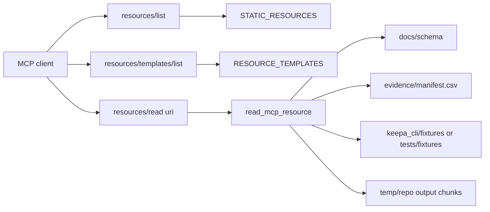
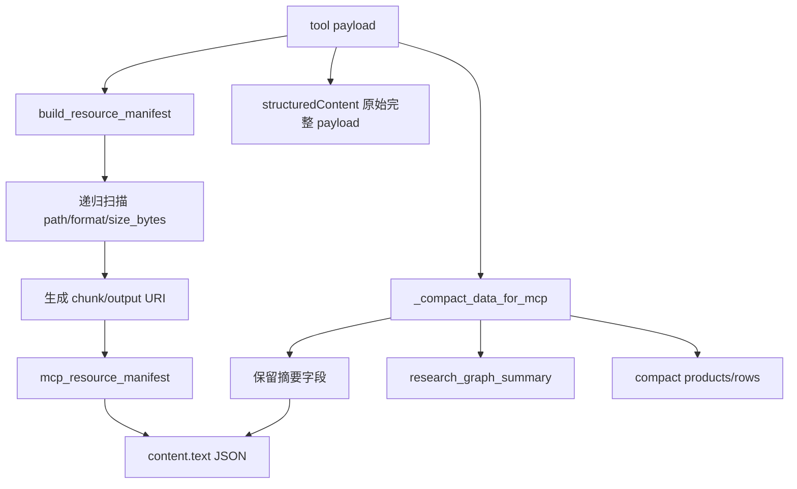
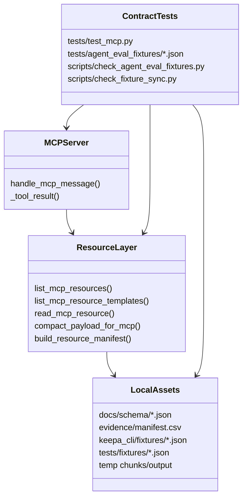

这一页只解释 **Keepa MCP 的资源层**：它如何把本地的 schema、fixture、evidence 清单，以及运行时生成的大响应 chunk/output 文件，统一暴露成可按 URI 读取的 MCP resource；同时也解释为什么 `tools/call` 的文本内容会被压缩成“摘要 + 资源引用”，而完整数据仍保留在 `structuredContent` 中。这个页面不展开工具注册、会话缓存或长会话上下文治理，那些分别属于 [MCP 工具注册表：强类型工具面、toolset 分组与命令映射](22-mcp-gong-ju-zhu-ce-biao-qiang-lei-xing-gong-ju-mian-toolset-fen-zu-yu-ming-ling-ying-she) 与 [长会话能力：stdio/MCP 会话、资源分块与上下文控制](24-chang-hui-hua-neng-li-stdio-mcp-hui-hua-zi-yuan-fen-kuai-yu-shang-xia-wen-kong-zhi)。
Sources: [resources.py](keepa_cli/agent/resources.py#L1-L25), [mcp.py](keepa_cli/agent/mcp.py#L47-L55)

## 先看核心结论：MCP 资源层不是“附件系统”，而是“可验证的只读本地知识面”

资源层的第一原则很明确：**只读本地文本文件，不访问 Keepa API，不读取明文凭据**。这意味着它不是二次执行入口，而是把已经存在于仓库或临时输出目录中的可审计材料，封装成 MCP `resources/list`、`resources/templates/list`、`resources/read` 三个面向 Agent 的稳定接口。对应实现中，`handle_mcp_message()` 直接把 `resources/*` 方法路由到 `list_mcp_resources()`、`list_mcp_resource_templates()` 和 `read_mcp_resource()`，没有穿透到业务请求链。
Sources: [resources.py](keepa_cli/agent/resources.py#L1-L6), [mcp.py](keepa_cli/agent/mcp.py#L119-L131)

上图表达的是这个页面最重要的结构关系：资源列表暴露“已知入口”，资源模板暴露“按名/按路径读取规则”，而真实读取只发生在本地 schema、fixture、evidence 文件与受限 chunk/output 路径上。
Sources: [resources.py](keepa_cli/agent/resources.py#L27-L80), [mcp.py](keepa_cli/agent/mcp.py#L119-L129)

## 静态资源：先暴露最稳定、最常被引用的四类资产

`STATIC_RESOURCES` 当前固定暴露四个 URI：`keepa://schema/products-agent-view`、`keepa://fixtures/manifest`、`keepa://guides/cassette-promotion`、`keepa://evidence/recent`。它们分别对应产品 Agent 视图 schema、evidence 总清单、cassette 提升指南，以及从 `evidence/manifest.csv` 提炼出的最近证据摘要。`tests/agent_eval_fixtures/mcp_resources_contract.json` 与 `tests/test_mcp.py` 共同把这四个入口冻结成契约，确保 `resources/list` 的最小知识面不会漂移。
Sources: [resources.py](keepa_cli/agent/resources.py#L27-L52), [mcp_resources_contract.json](tests/agent_eval_fixtures/mcp_resources_contract.json#L1-L14), [test_mcp.py](tests/test_mcp.py#L313-L338)

| 静态 URI | 名称 | 实际来源 | MIME |
|---|---|---|---|
| `keepa://schema/products-agent-view` | `products.agent-view.schema` | `docs/schema/products.agent-view.schema.json` | `application/json` |
| `keepa://fixtures/manifest` | `fixture-and-evidence-manifest` | `evidence/manifest.csv` | `text/csv` |
| `keepa://guides/cassette-promotion` | `cassette-promotion-guide` | 运行时生成的 Markdown 文本 | `text/markdown` |
| `keepa://evidence/recent` | `recent-evidence` | `evidence/manifest.csv` 最近 8 条 | `application/json` |

Sources: [resources.py](keepa_cli/agent/resources.py#L27-L52), [resources.py](keepa_cli/agent/resources.py#L91-L109), [resources.py](keepa_cli/agent/resources.py#L293-L328)

这里有一个值得注意的设计选择：`keepa://fixtures/manifest` 的资源名虽然叫 fixture-and-evidence-manifest，但它实际读取的是 `evidence/manifest.csv`。也就是说，这个系统把 fixture 与 evidence 视为同一条离线证据链的一部分，而不是两个完全割裂的资产域。
Sources: [resources.py](keepa_cli/agent/resources.py#L35-L39), [resources.py](keepa_cli/agent/resources.py#L95-L100), [evidence/README.md](evidence/README.md#L3-L20)

## 资源模板：把“可枚举入口”扩展成“按规则寻址”

除了固定资源，系统还声明了四个 `RESOURCE_TEMPLATES`：`keepa://schema/{name}`、`keepa://fixtures/{name}`、`keepa://chunk/{encoded_path}`、`keepa://output/{encoded_path}`。这一步的意义不是增加新资源种类，而是允许 Agent 在知道命名规则或收到 manifest 引用后，再按需读取具体对象。`resources/templates/list` 的契约同样被单独测试固定。
Sources: [resources.py](keepa_cli/agent/resources.py#L55-L80), [mcp.py](keepa_cli/agent/mcp.py#L121-L123), [mcp_resource_templates_contract.json](tests/agent_eval_fixtures/mcp_resource_templates_contract.json#L1-L14)

| 模板 | 用途 | 解析规则 | 典型场景 |
|---|---|---|---|
| `keepa://schema/{name}` | 按稳定名读取 schema | 目前只接受 products-agent-view 相关别名 | Agent 先列模板，再拉取契约 |
| `keepa://fixtures/{name}` | 按文件名读取 fixture | 只允许 `.json` 文件名 | 离线回放、固定评测 |
| `keepa://chunk/{encoded_path}` | 读取 chunk 文件 | base64url 编码绝对路径 | 大响应切块后延迟加载 |
| `keepa://output/{encoded_path}` | 读取 output 文件 | base64url 编码绝对路径 | 工具输出文件的二次查看 |

Sources: [resources.py](keepa_cli/agent/resources.py#L55-L80), [resources.py](keepa_cli/agent/resources.py#L162-L188)

模板系统的关键不在“动态”，而在“受限动态”。例如 fixture 模板并不接受任意路径，只接受文件名，并且只在 `keepa_cli/fixtures` 与 `tests/fixtures` 两个目录内查找；schema 模板目前也只解析产品 Agent 视图的几个稳定别名，而不是开放式目录浏览。
Sources: [resources.py](keepa_cli/agent/resources.py#L162-L180), [test_mcp.py](tests/test_mcp.py#L339-L364)

## Schema 资源：它暴露的是“形状快照”，不是示例数据

`docs/schema/products.agent-view.schema.json` 的头部已经明确说明：这个文件是从 `tests/snapshots/agent_schema_snapshot.json` 生成的，值是**类型名而不是示例值**，并提醒消费方先看 envelope 的 `ok/error` 字段再消费 `data`。因此，MCP 暴露 schema 资源的目的不是给出一份“长 JSON 样例”，而是给 Agent 一个稳定、低噪声的字段形状合同。
Sources: [products.agent-view.schema.json](docs/schema/products.agent-view.schema.json#L1-L8)

schema 的生成链路也被固定下来：`scripts/generate_agent_schema.py` 从 `tests/snapshots/agent_schema_snapshot.json` 读取快照并写出 `docs/schema/products.agent-view.schema.json`；而 `tests/test_schema_snapshot.py` 则通过真实的本地 service/MCP/stdio 输出重新构建 snapshot，再与提交态快照逐字比对。换句话说，MCP 读到的 schema 不是手写文档，而是由测试冻结的产物。
Sources: [generate_agent_schema.py](scripts/generate_agent_schema.py#L1-L28), [test_schema_snapshot.py](tests/test_schema_snapshot.py#L48-L75), [test_schema_snapshot.py](tests/test_schema_snapshot.py#L170-L224)

这种 schema 资源特别适合 Agent 在调用 `keepa.products_get` 之前先读取一次：它能知道 `agent_brief`、`recommended_next_actions`、`research_graph_entities`、`temporal_by_window` 等字段的形状，而不必依赖某个具体 fixture 恰好覆盖这些字段。
Sources: [products.agent-view.schema.json](docs/schema/products.agent-view.schema.json#L24-L138)

## Fixture 资源：同一份离线数据同时服务测试、打包与 MCP 读取

`_read_fixture_resource()` 只允许读取 JSON fixture 文件，并按顺序在 `keepa_cli/fixtures` 与 `tests/fixtures` 中查找；这与仓库内实际存在的双份 fixture 目录一致。其目的很直接：测试用 fixture 与分发包内 fixture 必须保持同步，这样 MCP 在离线模式下读取到的数据才能与测试环境一致。
Sources: [resources.py](keepa_cli/agent/resources.py#L169-L180), [check_fixture_sync.py](scripts/check_fixture_sync.py#L1-L64)

这种双目录同步并不是口头约束，而是脚本门禁。`scripts/check_fixture_sync.py` 会比较两个目录下所有 `.json` 文件的缺失与字节差异；而 `tests/test_mcp.py` 中又验证了模板读取能直接取到如 `agent_eval_category_search_output.json` 这样的 fixture，并且内容中确实包含 `research_graph`。
Sources: [check_fixture_sync.py](scripts/check_fixture_sync.py#L23-L59), [test_mcp.py](tests/test_mcp.py#L339-L364)

| 目录 | 角色 | 为什么要被 MCP 读取 |
|---|---|---|
| `tests/fixtures` | 测试基准数据 | 保证协议与行为可回放 |
| `keepa_cli/fixtures` | 包内分发数据 | 保证安装后离线能力可用 |
| 双份同步 | 分发一致性约束 | 防止“测试能跑、包内缺数据” |

Sources: [check_fixture_sync.py](scripts/check_fixture_sync.py#L27-L40), [resources.py](keepa_cli/agent/resources.py#L176-L180)

## Evidence 资源：把任务日志系统变成可检索的 MCP 证据索引

`evidence/README.md` 规定了 evidence 目录的基本结构：`tasks/` 是任务日志，`manifest.csv` 是清单索引，并要求新增或更新日志后同步维护 manifest。资源层正是建立在这个约定之上：`keepa://fixtures/manifest` 原样暴露 CSV，而 `keepa://evidence/recent` 则把 CSV 解析成最近 8 条的 JSON 摘要。
Sources: [evidence/README.md](evidence/README.md#L3-L20), [resources.py](keepa_cli/agent/resources.py#L95-L100), [resources.py](keepa_cli/agent/resources.py#L293-L312)

`_recent_evidence()` 返回的字段很克制，只包含 `logical_path`、`title`、`status`、`updated_at`、`summary`，并附带同一个 `schema_version`。这说明 evidence 资源的目标不是复制全文日志，而是先让 Agent 得到一份**最近证据导航索引**。在当前 manifest 中，相关任务条目已经明确记录了 “MCP resources/list/read、大响应 chunk resource manifest、MCP resources/templates/list” 等演进事项。
Sources: [resources.py](keepa_cli/agent/resources.py#L293-L312), [manifest.csv](evidence/manifest.csv#L20-L22)

## `resources/read` 的安全模型：能读什么，比怎么读更重要

路径类资源通过 `path_to_resource_uri()` 把绝对路径编码成 base64url token，再由 `_path_from_resource_uri()` 解码回路径。真正关键的安全控制发生在 `_read_path_resource()`：解析后的路径必须位于 **仓库根目录** 或 **系统临时目录** 下，否则直接报错 `resource path is outside allowed roots`。
Sources: [resources.py](keepa_cli/agent/resources.py#L143-L159), [resources.py](keepa_cli/agent/resources.py#L183-L188)

这套限制与 chunk/output 的来源相匹配。运行时生成的大响应文件可能出现在仓库内，也可能出现在 `tempfile.gettempdir()` 下的临时目录，所以白名单不是单一 repo root，而是 repo root + temp root。与此同时，fixture 读取则完全不接受自由路径，只接受文件名；schema 读取则只接受已知别名。这三种策略共同构成了资源层的“最小可读面”。
Sources: [resources.py](keepa_cli/agent/resources.py#L153-L180), [resources.py](keepa_cli/agent/resources.py#L338-L361)

另一个容易忽略的保护是文本大小上限。`_read_text_limited()` 将单个资源文本限制为 `1_000_000` 字节，超出部分会被截断并追加 `[truncated by keepa MCP resource reader]` 提示。这保证了 `resources/read` 本身不会再次变成无限膨胀的上下文注入源。
Sources: [resources.py](keepa_cli/agent/resources.py#L23-L25), [resources.py](keepa_cli/agent/resources.py#L331-L335)

## 大响应资源引用：`structuredContent` 保真，`content.text` 压缩

MCP 工具调用结果经过 `_tool_result()` 包装时，`structuredContent` 保留原始 payload，而 `content[0].text` 则放入 `compact_payload_for_mcp()` 处理后的 JSON 文本。这个分层非常关键：**机器可继续拿完整结构做后续处理，但给模型上下文的文本版本被有意压缩**。
Sources: [mcp.py](keepa_cli/agent/mcp.py#L47-L55), [resources.py](keepa_cli/agent/resources.py#L131-L140)

`compact_payload_for_mcp()` 的流程是：先调用 `build_resource_manifest()` 扫描 payload 中所有带 `path` 且同时带 `format` 或 `size_bytes` 的节点，生成 `mcp_resource_manifest`；再对 `data` 调用 `_compact_data_for_mcp()`，仅保留 `view`、`profile`、`product_count`、`chunks`、`output`、`summary`、`risk_summary`、`evidence_index`、`next_actions` 等有限字段，并把 `research_graph` 降成 summary。
Sources: [resources.py](keepa_cli/agent/resources.py#L112-L140), [resources.py](keepa_cli/agent/resources.py#L215-L246)

`_collect_file_resources()` 并不是只看顶层字段，而是递归遍历整个 payload；一旦发现某个对象含有 `path` 且含 `format` 或 `size_bytes`，就把它登记成资源项。如果当前路径栈中出现 `"chunks"`，资源类型标成 `chunk`，否则标成 `output`。最终 manifest 还会按 `path` 去重，并输出 `schema_version`、`strategy`、`resource_count`、`resources` 四个主字段。
Sources: [resources.py](keepa_cli/agent/resources.py#L112-L128), [resources.py](keepa_cli/agent/resources.py#L190-L213)

这就是“大响应资源引用”的本质：文本结果不再硬塞完整数据，而是转成可导航的摘要和 URI 清单，让 Agent 在真正需要时再去 `resources/read` 拉取具体 chunk。
Sources: [mcp.py](keepa_cli/agent/mcp.py#L47-L55), [resources.py](keepa_cli/agent/resources.py#L112-L140), [resources.py](keepa_cli/agent/resources.py#L190-L290)

## 被压缩掉的不是“重要性”，而是“上下文体积”

`_compact_product()` 进一步说明了压缩策略的取舍：它保留 `agent_brief.one_line`、`key_facts`、`risk_codes`、`highest_risk_severity`、`recommended_next_actions` 等高密度字段，也保留 `identity`、`data_quality`、`risk_taxonomy`、`selection_signals`、`next_actions` 等局部结构；但如果产品里有完整 `evidence_index`，文本版本只留下 `evidence_index_summary`，并明确提示“exact evidence paths are needed”时应去加载 chunk 或 `structuredContent`。
Sources: [resources.py](keepa_cli/agent/resources.py#L249-L274)

对比行级比较视图时，`_compact_compare_row()` 也采用同样原则：保留 `asin`、`title`、`brand`、`price/rank/review` 等比较关键列，以及裁剪后的 `risk_taxonomy` 和 `research_graph_summary`。因此，MCP 文本内容不是“随机删字段”，而是优先保留决策密度最高的局部摘要。
Sources: [resources.py](keepa_cli/agent/resources.py#L277-L290)

| 载体 | 是否完整 | 主要用途 |
|---|---|---|
| `structuredContent` | 完整 payload | 程序化消费、后续自动处理 |
| `content[0].text` | 压缩摘要 + manifest | 控制上下文长度、给模型快速阅读 |
| `resources/read keepa://chunk/...` | 按需读取完整 chunk | 延迟展开大字段 |
| `resources/read keepa://output/...` | 按需读取完整输出文件 | 查看落盘结果 |

Sources: [mcp.py](keepa_cli/agent/mcp.py#L47-L55), [resources.py](keepa_cli/agent/resources.py#L112-L140)

## 测试如何证明这不是概念设计，而是稳定契约

`tests/test_mcp.py` 直接验证了大响应场景：对 `keepa.products_get` 传入 `chunks_dir`、`agent_view`、`fields=...research_graph,evidence_index` 后，`structuredContent.data` 中仍有 `products`，而 `content[0].text` 中出现 `mcp_resource_manifest`，且 `temporal_features` 不再直接出现在压缩文本里；随后测试又把 manifest 中的第一个 URI 拿去做 `resources/read`，确认 chunk 可以被真正读回。
Sources: [test_mcp.py](tests/test_mcp.py#L365-L406)

同样的行为还被抽成 `tests/agent_eval_fixtures/mcp_chunk_resource_manifest.json` 契约：它要求 `result.content.0.text.$json.mcp_resource_manifest.strategy` 等于 `summary_with_resource_refs`，资源数至少为 4，首个 URI 必须包含 `keepa://chunk/`，并且文本结果不得包含 `temporal_features`。这比普通单元测试更像协议级验收。
Sources: [mcp_chunk_resource_manifest.json](tests/agent_eval_fixtures/mcp_chunk_resource_manifest.json#L1-L29), [check_agent_eval_fixtures.py](scripts/check_agent_eval_fixtures.py#L39-L58)

更进一步，`scripts/check_agent_eval_fixtures.py` 会把这些 `kind: "mcp"` 的规格转换成真实 `handle_mcp_message()` 调用，再按断言路径检查输出。也就是说，资源系统不仅被 Python 单测覆盖，还进入了离线的 Agent evaluation fixture 门禁。
Sources: [check_agent_eval_fixtures.py](scripts/check_agent_eval_fixtures.py#L83-L114), [check_agent_eval_fixtures.py](scripts/check_agent_eval_fixtures.py#L131-L153)

## 一个更准确的模块关系图

这个关系图强调的不是继承，而是依赖方向：MCP server 只是路由和包装层；真正的资源寻址、压缩、manifest 生成都在 `keepa_cli.agent.resources` 中；而稳定性则由单测、评测夹具和 fixture 同步检查共同保障。
Sources: [mcp.py](keepa_cli/agent/mcp.py#L68-L131), [resources.py](keepa_cli/agent/resources.py#L83-L180), [test_mcp.py](tests/test_mcp.py#L313-L406), [check_fixture_sync.py](scripts/check_fixture_sync.py#L27-L59)

## 对高级开发者最有用的理解方式

如果你把这套设计抽象成一句话，它其实是在做 **“本地资产 URI 化 + 大响应文本摘要化”**。Schema 解决“字段形状怎么稳定发现”，fixture 解决“离线数据怎么稳定回放”，evidence 解决“任务结论怎么稳定检索”，chunk/output 资源引用解决“超大输出怎么稳定延迟展开”。四者合起来，才构成 Keepa MCP 的资源系统。
Sources: [resources.py](keepa_cli/agent/resources.py#L27-L109), [resources.py](keepa_cli/agent/resources.py#L112-L180), [evidence/README.md](evidence/README.md#L3-L20)

如果你要继续沿目录阅读，最自然的下一页是 [长会话能力：stdio/MCP 会话、资源分块与上下文控制](24-chang-hui-hua-neng-li-stdio-mcp-hui-hua-zi-yuan-fen-kuai-yu-shang-xia-wen-kong-zhi)，因为资源 manifest 与 chunk URI 的真正价值，会在长链路会话和上下文预算控制里体现得更完整；如果你想先回到协议面理解资源为何这样挂接，则可先读 [MCP 工具注册表：强类型工具面、toolset 分组与命令映射](22-mcp-gong-ju-zhu-ce-biao-qiang-lei-xing-gong-ju-mian-toolset-fen-zu-yu-ming-ling-ying-she)。