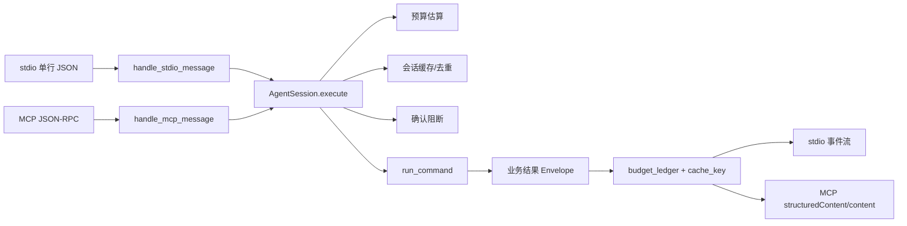
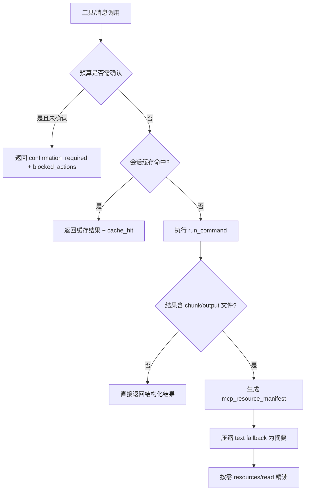

这一页只解释 **Keepa-cli 如何在 Agent 场景下支持“更长链路”的交互**：它并不靠把所有结果持续塞进上下文，而是把 **stdio JSON Lines** 与 **MCP JSON-RPC stdio server** 都统一到同一个 `AgentSession` 上，再用 **进程内缓存、预算账本、确认阻断、资源引用与结果压缩** 组合出可持续、多轮、低污染的会话行为。这里关注的是协议层与上下文治理，而不是工具注册表本身，也不是资源系统的完整资产目录。Sources: [keepa_cli/agent/session.py](keepa_cli/agent/session.py#L1-L221) [keepa_cli/agent/stdio.py](keepa_cli/agent/stdio.py#L1-L74) [keepa_cli/agent/mcp.py](keepa_cli/agent/mcp.py#L1-L169) [docs/architecture/mcp-agent-tools.md](docs/architecture/mcp-agent-tools.md#L5-L22)

## 先看核心判断：长会话不是“更长输出”，而是“更稳定的会话状态”

这个实现的第一原则非常清晰：**业务命令不直接挂在协议层上，而是先经过统一会话对象 `AgentSession`**。`stdio.py` 的每条输入消息、`mcp.py` 的每次 `tools/call`，最终都调用 `AgentSession.execute()`；而 `AgentSession` 又只委托 `run_command()` 执行业务命令，因此长会话能力不是额外的业务模式，而是对既有命令服务增加了一层 **会话级缓存、预算累计与确认控制**。Sources: [keepa_cli/agent/session.py](keepa_cli/agent/session.py#L105-L163) [keepa_cli/agent/stdio.py](keepa_cli/agent/stdio.py#L53-L73) [keepa_cli/agent/mcp.py](keepa_cli/agent/mcp.py#L134-L168) [docs/architecture/mcp-agent-tools.md](docs/architecture/mcp-agent-tools.md#L17-L22)

为了便于理解，下面这张图只看“会话状态如何穿过两种协议”。图中最关键的不是协议名字，而是 **两个入口都共享同一个 `AgentSession` 实例**，因此缓存命中、token 账本和阻断记录都能跨消息保留。Sources: [keepa_cli/agent/stdio.py](keepa_cli/agent/stdio.py#L57-L73) [keepa_cli/agent/mcp.py](keepa_cli/agent/mcp.py#L154-L168) [tests/test_stdio.py](tests/test_stdio.py#L117-L136) [tests/test_mcp.py](tests/test_mcp.py#L262-L291)

## 会话状态由三个对象语义组成：缓存键、预算账本、阻断记录

`AgentSession` 的状态核心是 `cache` 与 `ledger`。其中 `ledger` 由 `BudgetLedger` 表示，持续记录 `session_estimated`、`session_consumed`、`remaining_limit`、`blocked_actions`、`cache_hits` 与 `consumed_source`；这意味着会话不是只返回单次请求成本，而是对“本次会话已经累计做了什么”保持可审计视图。Sources: [keepa_cli/agent/session.py](keepa_cli/agent/session.py#L85-L103) [keepa_cli/agent/session.py](keepa_cli/agent/session.py#L186-L198)

缓存命中的前提是稳定 cache key。`build_cache_key()` 会先通过 `_safe_for_cache_key()` 归一化参数：移除 `from_cache`、`yes` 这类运行时键，按 key 排序，并把 `key`、`token`、`authorization`、`password` 等疑似秘密字段替换为 `[REDACTED]`，再做 SHA-256 截断摘要。因此，**同一业务请求在不同消息顺序或不同确认态下仍会落到同一缓存键上，同时避免把敏感值编码进 key**。Sources: [keepa_cli/agent/session.py](keepa_cli/agent/session.py#L24-L52) [tests/test_agent_session.py](tests/test_agent_session.py#L14-L20)

`execute()` 的流程也很有针对性：先处理显式 `from_cache`，再检查当前会话缓存；如果未命中，则先做预算估算并把估算值记入账本，再决定是否需要确认；只有通过确认门禁后才真正调用 runner，并在成功时写回缓存。这个顺序说明项目对长会话的定义不是“请求执行历史”，而是 **“已评估、已阻断、已消费”的完整会话轨迹**。Sources: [keepa_cli/agent/session.py](keepa_cli/agent/session.py#L117-L163)

## stdio 的长会话能力体现在“事件流 + 共享 Session”

`stdio` 协议很薄，但并不简单。`handle_stdio_message()` 会把一条原始 JSON 文本解析成统一事件流：先发 `started`，再发 `budget_estimated`，然后调用共享 `AgentSession` 执行命令，最后发 `response` 与 `done`。因此 stdio 的“长会话”不来自连接层协议特性，而来自 **多行输入复用同一个 session 实例**。Sources: [keepa_cli/agent/stdio.py](keepa_cli/agent/stdio.py#L19-L62)

`iter_stdio_output()` 明确展示了这种复用方式：它对整段输入文本逐行处理，但只创建一次 `AgentSession(env=env)`，随后把该 session 传给每一条消息。这使得连续两次相同请求在同一个 stdio 会话中会直接命中缓存，而不会重复估算和重复消耗。测试中连续两次 `categories.search` 调用，第一次 `cache_hit` 为 `False`，第二次变为 `True`，并且 `budget_ledger.cache_hits` 增加到 1。Sources: [keepa_cli/agent/stdio.py](keepa_cli/agent/stdio.py#L65-L73) [tests/test_stdio.py](tests/test_stdio.py#L117-L136)

stdio 还把高成本行为提前显式化。协议层总会先输出 `budget_estimated` 事件，而真正的执行结果可能是一个 `confirmation_required` 错误 envelope。测试对 `bestsellers.get` 的覆盖表明，即使请求没有被执行，协议也仍然返回结构化阻断结果，这样上层 Agent 可以把“需要确认”当成会话分支，而不是异常崩溃。Sources: [keepa_cli/agent/stdio.py](keepa_cli/agent/stdio.py#L53-L61) [tests/test_stdio.py](tests/test_stdio.py#L25-L38)

## MCP 的长会话能力体现在“工具调用复用 Session + 双通道结果”

MCP 侧采取相同的会话策略，但包装成 JSON-RPC。`handle_mcp_message()` 支持 `initialize`、`tools/list`、`tools/call`、`resources/list`、`resources/templates/list` 与 `resources/read`；真正与长会话直接相关的是 `tools/call` 分支，它在参数校验后把调用交给 `_handle_tools_call()`，再由该函数把结构化工具参数映射为 service command 参数，并复用 `AgentSession.execute()`。Sources: [keepa_cli/agent/mcp.py](keepa_cli/agent/mcp.py#L68-L131) [keepa_cli/agent/mcp.py](keepa_cli/agent/mcp.py#L134-L156)

MCP 的返回形状特意做了 **双通道设计**。`_tool_result()` 同时返回 `structuredContent` 与 `content[0].text`：前者保留完整 payload，后者则是 `compact_payload_for_mcp()` 处理后的紧凑 JSON 文本。这样做的意义不只是兼容不同客户端，更是上下文控制的关键：**结构化数据给机器精读，文本 fallback 给通用 MCP 客户端展示，但避免把完整大体积对象直接塞进聊天上下文**。Sources: [keepa_cli/agent/mcp.py](keepa_cli/agent/mcp.py#L47-L54) [keepa_cli/agent/resources.py](keepa_cli/agent/resources.py#L112-L140) [docs/architecture/mcp-agent-tools.md](docs/architecture/mcp-agent-tools.md#L103-L160)

与 stdio 一样，MCP 的多消息会话也依赖单个 session 实例。`iter_mcp_output()` 在处理多行 JSON-RPC 输入时只创建一次 `AgentSession`。测试中两次等价的 `keepa.categories_search` 工具调用共享同一 `cache_key`，第二次命中缓存，并且 `data.provenance.mcp.cache_hit` 为真，这说明缓存命中状态不仅进入账本，也被写入结果血缘信息。Sources: [keepa_cli/agent/mcp.py](keepa_cli/agent/mcp.py#L159-L168) [keepa_cli/agent/session.py](keepa_cli/agent/session.py#L200-L221) [tests/test_mcp.py](tests/test_mcp.py#L262-L291)

## 预算治理是长会话的“硬边界”，不是提示文案

`AgentSession.execute()` 会先调用 `estimate_request_budget()`，然后立即把估算值累加到 `ledger.session_estimated`。如果预算规则判定该命令需要确认，且参数中没有 `yes`、`dry_run`、`dry-run` 或 `fixture`，它就不会继续执行，而是返回 `confirmation_required` 错误，并把本次动作写入 `ledger.blocked_actions`。这意味着 **被阻断的高成本动作依旧属于会话历史的一部分**。Sources: [keepa_cli/agent/session.py](keepa_cli/agent/session.py#L54-L71) [keepa_cli/agent/session.py](keepa_cli/agent/session.py#L125-L151)

阻断结果还包含可恢复信息。`_confirmation_required()` 会给出 `resume_with: "--yes"`，如果调用来自 MCP 工具，则还会附带 `resume_with_tool`，把工具名和 `yes: true` 的恢复参数一起写回。这不是 UI 友好性的小优化，而是让长会话中的 Agent 能够 **把“确认”当成下一步可执行动作**。Sources: [keepa_cli/agent/session.py](keepa_cli/agent/session.py#L58-L71)

账本的“剩余额度”采用估算值而不是实际消耗值计算。`_refresh_remaining()` 在设置了 `max_tokens` 时，会用 `max_tokens - session_estimated` 计算 `remaining_limit`。测试中 `max_tokens=5` 且一次估算为 1 时，结果返回剩余 4，说明系统对会话长度的约束偏向保守治理：**先按估算扣减，再在实际结果中补记 consumed**。Sources: [keepa_cli/agent/session.py](keepa_cli/agent/session.py#L186-L198) [tests/test_agent_session.py](tests/test_agent_session.py#L73-L88)

## 资源分块的目标不是换一种输出，而是把“大对象”从即时上下文中拆出去

MCP 资源系统里的 `compact_payload_for_mcp()` 是本页最关键的上下文控制点。它会先调用 `build_resource_manifest()` 扫描 payload 中的文件型对象；只要发现 `path` 且伴随 `format` 或 `size_bytes` 的节点，就把它们整理成去重后的 `mcp_resource_manifest`，然后对 `data` 部分做压缩，仅保留少量高价值键、图谱摘要、产品摘要、比较行摘要以及 raw output 的局部信息。Sources: [keepa_cli/agent/resources.py](keepa_cli/agent/resources.py#L112-L140) [keepa_cli/agent/resources.py](keepa_cli/agent/resources.py#L190-L246)

这里的“分块”不是传输层分片，而是 **结果语义分层**。`_collect_file_resources()` 会根据路径位于 `chunks` 栈内还是普通输出，分别标记成 `chunk` 或 `output`，并记录 `uri`、`name`、`type`、`path`、`mimeType`、`size_bytes`、`asin`、`section` 与 `json_path`。换言之，分块后并没有丢失定位能力，反而为 Agent 提供了“先看摘要，再按 URI 精读局部”的访问路径。Sources: [keepa_cli/agent/resources.py](keepa_cli/agent/resources.py#L190-L213)

`path_to_resource_uri()` 把真实文件路径编码成 `keepa://chunk/<base64-path>` 或 `keepa://output/<base64-path>`。随后 `resources/read` 通过 `_read_path_resource()` 只允许读取 **项目根目录** 或 **系统临时目录** 下的文件，并将单个资源文本读取上限限制为 1 MB，超出后追加截断标记。也就是说，资源分块并不是开放式文件浏览，而是受根路径与体积上限双重约束的按需读取。Sources: [keepa_cli/agent/resources.py](keepa_cli/agent/resources.py#L143-L159) [keepa_cli/agent/resources.py](keepa_cli/agent/resources.py#L331-L361) [docs/architecture/mcp-agent-tools.md](docs/architecture/mcp-agent-tools.md#L162-L183)

从测试可以直接看到这种机制的效果：当 `keepa.products_get` 以 `agent_view` 与 `chunks_dir` 运行时，MCP 返回的 `structuredContent` 仍含完整 `data.products`，但 `content[0].text` 已带有 `mcp_resource_manifest`，资源数不少于 3，而且压缩文本里不再出现 `temporal_features` 这类更大字段；随后还可以通过 `resources/read` 读取某个 chunk URI 的具体内容。Sources: [tests/test_mcp.py](tests/test_mcp.py#L365-L406)

## 上下文控制并不只靠“截断”，还靠“摘要优先”和“血缘可追溯”

压缩后的 `data` 只保留 `view`、`profile`、`product_count`、`chunks`、`output`、`summary`、`sources`、`risk_summary`、`agent_brief`、`data_quality`、`selection_signals`、`evidence_index`、`provenance` 与 `next_actions` 等高信息密度字段；如果存在 `research_graph`，则进一步转换成 `research_graph_summary`。对单个产品，还会把 evidence index 缩成计数与资源提示，把图谱压成摘要。这说明上下文控制策略的重点不是简单删字段，而是 **保留决策信号，推迟细节装载**。Sources: [keepa_cli/agent/resources.py](keepa_cli/agent/resources.py#L215-L290)

MCP provenance 也属于上下文治理的一部分。只要请求是通过 MCP 工具发起，`_attach_mcp_provenance()` 就会在 `data.provenance.mcp` 中写入 `server`、`tool`、`transport`、`session_cache_key` 与 `cache_hit`。对于长链路 Agent，这让“这段摘要来自哪个工具、是否来自缓存、对应哪个会话键”都变成可见信息，避免多轮推理后结果失去来源。Sources: [keepa_cli/agent/session.py](keepa_cli/agent/session.py#L200-L221)

项目文档对这一思路的表述也一致：大响应应优先通过 Agent view、chunk manifest、evidence index 和 `--from-cache` 式引用来消费，以减少上下文污染；而本轮实现记录则明确说明，MCP text fallback 只返回摘要和资源引用。代码与文档在这里是同构的，不存在“文档说要压缩、实现却仍返回全量文本”的偏差。Sources: [docs/architecture/mcp-agent-tools.md](docs/architecture/mcp-agent-tools.md#L19-L22) [evidence/tasks/20260510-research-graph-merge-mcp-resources-chunks-agent-eval.md](evidence/tasks/20260510-research-graph-merge-mcp-resources-chunks-agent-eval.md#L24-L31)

## stdio 与 MCP 在长会话层面的差异

下面这张表只比较 **长会话语义**，不比较工具发现能力或资源目录完整性。可以看到，两者共享同一套会话中枢，但对外可见形态不同：stdio 更像事件流，MCP 更像结构化 RPC 加资源读取。Sources: [keepa_cli/agent/stdio.py](keepa_cli/agent/stdio.py#L25-L73) [keepa_cli/agent/mcp.py](keepa_cli/agent/mcp.py#L47-L168)

| 维度 | stdio JSON Lines | MCP JSON-RPC stdio |
| --- | --- | --- |
| 会话状态载体 | 复用单个 `AgentSession` | 复用单个 `AgentSession` |
| 单次调用反馈 | `started` → `budget_estimated` → `response` → `done` | 单个 JSON-RPC `result` 或 `error` |
| 预算表达 | 独立事件 + response payload 中账本 | `structuredContent.budget_ledger` |
| 缓存可见性 | `cache_hit`、`cache_key` 在 response 中 | `structuredContent` 中可见，且可带 MCP provenance |
| 大结果控制 | 依赖命令本身输出形状 | 额外通过 `compact_payload_for_mcp()` + resources manifest |
| 恢复高成本请求 | 上层根据 `confirmation_required` 重发 | 工具结果可带 `resume_with_tool` |

Sources: [keepa_cli/agent/session.py](keepa_cli/agent/session.py#L117-L163) [keepa_cli/agent/stdio.py](keepa_cli/agent/stdio.py#L53-L73) [keepa_cli/agent/mcp.py](keepa_cli/agent/mcp.py#L47-L54) [keepa_cli/agent/session.py](keepa_cli/agent/session.py#L200-L221)

## 可以把上下文控制看成四级漏斗

下面这张图适合把机制关系一次性看清：系统并不是把所有响应都立刻传给客户端，而是经过预算门禁、会话缓存、结果压缩和资源延迟读取四级漏斗。这样设计的直接收益，就是多轮研究可以维持上下文清洁，同时避免重复请求。Sources: [keepa_cli/agent/session.py](keepa_cli/agent/session.py#L125-L163) [keepa_cli/agent/resources.py](keepa_cli/agent/resources.py#L112-L140) [keepa_cli/agent/resources.py](keepa_cli/agent/resources.py#L153-L159)

## 哪些测试真正证明了“长会话”而不是“单次成功”

这部分最值得注意的是测试选择。`tests/test_agent_session.py` 验证了 cache key 稳定性、重复请求只执行一次、`from_cache` 能按 key 回放、`confirmation_required` 会更新 `blocked_actions`，以及 `remaining_limit` 会跟随估算值变化；这些都不是功能性 happy path，而是会话状态机的断言。Sources: [tests/test_agent_session.py](tests/test_agent_session.py#L13-L88)

`tests/test_stdio.py` 和 `tests/test_mcp.py` 则分别证明两种协议都会复用会话：stdio 连续消息能复用缓存，MCP 连续 JSON-RPC 行也能复用缓存；同时，MCP 侧还验证了资源列表、资源模板、chunk 资源读取和压缩文本清除大字段。这说明仓库对“长会话能力”的验收标准并不是“协议能跑起来”，而是 **缓存、账本、阻断、资源引用、压缩输出** 这些上下文治理特征都必须可观察。Sources: [tests/test_stdio.py](tests/test_stdio.py#L15-L136) [tests/test_mcp.py](tests/test_mcp.py#L239-L406)

实现记录中的任务总结也给出同样结论：本轮目标就是把 MCP resources、统一 chunk/output manifest 和 Agent eval 增强结合起来，支撑“更长的 Agent 选品研究链路”；并且明确把 text fallback 约束为“摘要加资源引用”。因此这套长会话能力不是后验附属优化，而是本轮架构工作的中心对象。Sources: [evidence/tasks/20260510-research-graph-merge-mcp-resources-chunks-agent-eval.md](evidence/tasks/20260510-research-graph-merge-mcp-resources-chunks-agent-eval.md#L3-L8) [evidence/tasks/20260510-research-graph-merge-mcp-resources-chunks-agent-eval.md](evidence/tasks/20260510-research-graph-merge-mcp-resources-chunks-agent-eval.md#L24-L31) [evidence/tasks/20260510-research-graph-merge-mcp-resources-chunks-agent-eval.md](evidence/tasks/20260510-research-graph-merge-mcp-resources-chunks-agent-eval.md#L87-L90)

## 边界：这页不讨论什么

这套长会话机制有几个明确边界。第一，缓存是 **进程内缓存**，默认不持久化；第二，会话层不直接访问 Keepa API，只调统一 service runner；第三，MCP 不解析 CLI 字符串，只接受结构化参数；第四，动态资源读取受到根路径与大小上限限制。这些边界共同保证长会话增强的是 **可控状态复用**，而不是引入一个无限制的持久 Agent 容器。Sources: [docs/architecture/mcp-agent-tools.md](docs/architecture/mcp-agent-tools.md#L23-L30) [keepa_cli/agent/session.py](keepa_cli/agent/session.py#L113-L115) [keepa_cli/agent/mcp.py](keepa_cli/agent/mcp.py#L141-L156) [keepa_cli/agent/resources.py](keepa_cli/agent/resources.py#L153-L159)

## 读完这一页后，下一步最合适看什么

如果你想继续理解 **MCP 里到底暴露了哪些工具以及它们如何映射到 service command**，下一页应读 [MCP 工具注册表：强类型工具面、toolset 分组与命令映射](22-mcp-gong-ju-zhu-ce-biao-qiang-lei-xing-gong-ju-mian-toolset-fen-zu-yu-ming-ling-ying-she)。如果你想把这里的“资源引用”和“chunk manifest”放回完整资源资产体系中理解，应回看 [MCP 资源系统：Schema、fixture、evidence 与大响应资源引用](23-mcp-zi-yuan-xi-tong-schema-fixture-evidence-yu-da-xiang-ying-zi-yuan-yin-yong)。如果你关心这套会话能力在 UI 侧如何被复用，则下一步适合读 [现代 TUI 设计：slash 命令、状态栏与服务复用](25-xian-dai-tui-she-ji-slash-ming-ling-zhuang-tai-lan-yu-fu-wu-fu-yong)。Sources: [docs/architecture/mcp-agent-tools.md](docs/architecture/mcp-agent-tools.md#L44-L52) [keepa_cli/agent/mcp.py](keepa_cli/agent/mcp.py#L88-L129) [keepa_cli/agent/resources.py](keepa_cli/agent/resources.py#L83-L109)