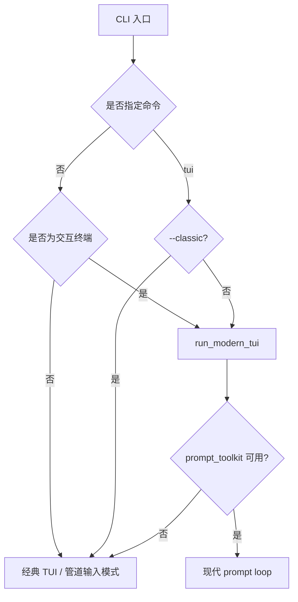
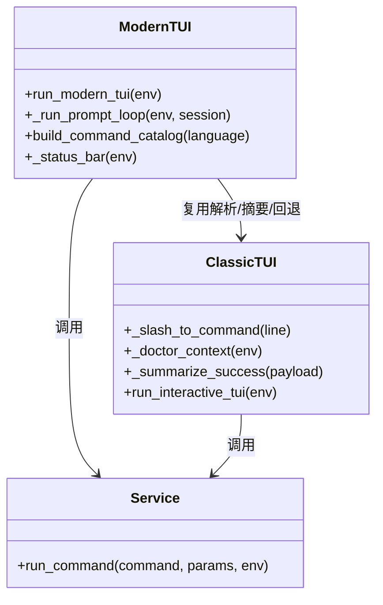

这一页只解释 Keepa CLI 的**现代 TUI 工作台**：它如何以 slash 命令为中心组织交互、如何用状态栏持续暴露运行上下文、以及为什么它能够在不复制业务逻辑的前提下复用统一的 command service。它不展开离线工作流细节，也不详细讨论 MCP/stdio 协议本身；这些内容分别属于 [离线工作流引擎：模板、批处理计划、报告与 HTML 浏览页生成](26-chi-xian-gong-zuo-li-yin-qing-mo-ban-pi-chu-li-ji-hua-bao-gao-yu-html-liu-lan-ye-sheng-cheng) 与 [JSON、stdio JSON Lines 与 MCP 三种 Agent 入口](12-json-stdio-json-lines-yu-mcp-san-chong-agent-ru-kou)。Sources: [modern_tui.py](keepa_cli/ui/modern_tui.py#L1-L5) [cli.py](keepa_cli/cli.py#L53-L63)

## 设计出发点：不是“终端里的 GUI”，而是“命令优先的低噪声 REPL”

这套现代 TUI 的第一原则不是做复杂的窗口布局，而是构建一个**命令优先、对 Agent-safe service 零侵入、对人类操作低摩擦**的 REPL。文件头直接说明它基于 `prompt_toolkit` 提供低噪声交互、slash 命令补全，并复用 command service；同时缺少依赖时自动回退到标准库 TUI。换言之，现代感主要来自输入体验、反馈密度和上下文可见性，而不是额外的业务分层。Sources: [modern_tui.py](keepa_cli/ui/modern_tui.py#L1-L5)

与经典 TUI 相比，现代 TUI 把“欢迎面板 + 结构化结果卡片”收敛成持续循环的提示符交互：启动时显示简短状态，执行命令后输出彩色摘要，并把完整 JSON 延迟到 `/json` 按需查看。这种设计减少了默认信息量，同时保留了 envelope 级别的完整可追溯性。测试也明确验证：默认执行 `/doctor` 时不会直接倾倒完整 JSON，但 `/json` 可以回看上一条响应。Sources: [modern_tui.py](keepa_cli/ui/modern_tui.py#L507-L521) [modern_tui.py](keepa_cli/ui/modern_tui.py#L593-L656) [test_modern_tui.py](tests/test_modern_tui.py#L174-L199)

## 运行时选择：优先 prompt_toolkit，失败时优雅回退

CLI 入口把 `tui` 视为一个显式子命令，同时在无子命令且处于交互终端时默认启动现代 TUI；如果用户传入 `tui --classic`，则强制使用标准库实现。这里的关键点不是“有两个 TUI”，而是**一个人机入口，两种运行时后端**：现代 TUI 负责增强交互体验，经典 TUI 负责最小依赖兜底。Sources: [cli.py](keepa_cli/cli.py#L59-L63) [cli.py](keepa_cli/cli.py#L441-L458)

`build_tui_metadata()` 还把这套运行时选择显式暴露为元数据：首选 `prompt_toolkit`、回退 `classic`、当前选中运行时、schema 版本以及命令目录。这样 TUI 不只是一个“界面动作”，还是一个**可被 CLI/Agent 查询的能力描述对象**。测试也验证了在 `prompt_toolkit` 可用时，元数据会标记 `selected_runtime=prompt_toolkit`。Sources: [modern_tui.py](keepa_cli/ui/modern_tui.py#L222-L238) [test_modern_tui.py](tests/test_modern_tui.py#L68-L76)

上图展示的是**运行时决策树**，重点在于：现代 TUI 从入口层就被设计成可降级能力，而不是硬依赖。Sources: [cli.py](keepa_cli/cli.py#L441-L458) [modern_tui.py](keepa_cli/ui/modern_tui.py#L118-L120) [modern_tui.py](keepa_cli/ui/modern_tui.py#L658-L662)

## slash 命令目录：把服务命令翻译成人类工作台

现代 TUI 的核心抽象是 `CommandItem`。每个条目同时拥有面向人的 `label`、用于分组展示的 `group`、用户输入的 `slash` 形式、真正调用 service 的 `service_command`，以及描述文本。也就是说，TUI 并不直接把业务能力散落在事件处理代码里，而是先构建一个**“可显示、可补全、可映射”的命令目录**。Sources: [modern_tui.py](keepa_cli/ui/modern_tui.py#L98-L116)

`build_command_catalog()` 进一步证明了现代 TUI 的组织方式：它把命令分成 `Inspect`、`Config`、`Local`、`Catalog`、`Operate` 等组，并且把 `/doctor`、`/login`、`/batch`、`/report`、`/product`、`/history`、`/finder`、`/bestsellers`、`/graph`、`/tracking-list` 等常用路径预制成 slash 模板。这里的现代感不是动态菜单，而是**可记忆的命令骨架 + 明确的业务分区**。Sources: [modern_tui.py](keepa_cli/ui/modern_tui.py#L136-L219)

测试对这个目录结构有直接约束：要求存在 `Product`、`Login` 等标签，要求包含 `/product ...`、`/batch ...`、`/report ...`、`/token ...` 等示例命令，并要求各条目都必须带有 `service_command`。这意味着 slash 目录不是装饰性帮助文本，而是被当作稳定接口的一部分维护。Sources: [test_modern_tui.py](tests/test_modern_tui.py#L42-L60)

| 维度 | 现代 TUI 的做法 | 代码证据 |
|---|---|---|
| 人类可读名称 | `label` | `CommandItem.label` |
| 业务分区 | `group` | `Inspect/Config/Local/Catalog/Operate` |
| 实际输入模板 | `slash` | 如 `/product ...` |
| 服务层映射 | `service_command` | 如 `products.get` |
| 补全文本控制 | `completion_text` / `insert` | 保证插入行为可预测 |

Sources: [modern_tui.py](keepa_cli/ui/modern_tui.py#L98-L116) [modern_tui.py](keepa_cli/ui/modern_tui.py#L136-L219)

## 补全策略：按 slash 前缀、命令名、标签与 service 名多路匹配

补全不是简单的前缀过滤。`_iter_completion_candidates()` 会先拒绝非 slash 输入；对 slash 输入则同时匹配完整 slash 前缀、去掉 `/` 的命令名、子序列模糊匹配、标签前缀以及 `service_command` 前缀。这让 `/pro` 能命中 product，`/prd` 这种子序列也能命中 product，而像 `/max`、`/rep` 这样的缩写也能稳定落到预算与报告命令。Sources: [modern_tui.py](keepa_cli/ui/modern_tui.py#L252-L277)

`prompt_toolkit` 的 completer 再把这些候选渲染成三段信息：命令名、面向人的标签、以及“分组 · 描述”的 meta 信息。于是补全列表不是纯文本提示，而是一个轻量命令面板。这种设计特别适合中级开发者：既能靠记忆快速输入，也能在遗忘时通过补全恢复上下文。Sources: [modern_tui.py](keepa_cli/ui/modern_tui.py#L540-L585)

测试覆盖了这套补全语义：`/` 能列出 `/doctor`、`/capabilities`；`/pro` 与 `/prd` 都会映射到 `products.get`；非 slash 文本如 `doctor` 则不会触发候选。可见这里强调的是**命令语言的一致性**，而不是自由文本聊天式输入。Sources: [test_modern_tui.py](tests/test_modern_tui.py#L77-L93)

## slash 解析：现代输入层，经典语义内核

一个非常关键的架构选择是：现代 TUI **没有自己重写 slash 解析器**，而是直接复用 `keepa_cli.ui.tui` 中的 `_slash_to_command()`。`modern_tui.py` 在导入时就从经典 TUI 拿到了 `_slash_to_command`、`_doctor_context`、`_summarize_success` 与 `run_interactive_tui`。这表明现代 TUI 的创新重点在交互壳层，而非命令语义层。Sources: [modern_tui.py](keepa_cli/ui/modern_tui.py#L18-L21)

`_slash_to_command()` 负责把 `/token`、`/login`、`/max-tokens`、`/language`、`/product`、`/history`、`/browse`、`/batch`、`/templates`、`/report`、`/cache`、`/cost` 等输入映射到统一的 service command，并解析位置参数、布尔开关、重复 `--param` 选项。对现代 TUI 来说，这种复用意味着**新界面不产生第二套命令方言**。Sources: [tui.py](keepa_cli/ui/tui.py#L176-L285)

测试同样把这层复用钉死了：它验证 `/token` 与 `/login` 都映射到 `config.set-token`，`/batch` 映射到 `batch.asins`，`/report` 到 `reports.build`，`/cache` 到 `cache.explain`，`/cost` 到 `audit.cost`，并确保登录命令在转录时会被打码。Sources: [test_modern_tui.py](tests/test_modern_tui.py#L94-L124) [modern_tui.py](keepa_cli/ui/modern_tui.py#L478-L483)

这个关系图强调：**现代 TUI 与经典 TUI 不是两套业务前端，而是同一个服务内核上的两个交互外壳**。Sources: [modern_tui.py](keepa_cli/ui/modern_tui.py#L18-L21) [tui.py](keepa_cli/ui/tui.py#L74-L87) [tui.py](keepa_cli/ui/tui.py#L210-L285) [service.py](keepa_cli/service.py#L1-L5)

## 状态栏：把运行上下文持续固定在视野底部

现代 TUI 的状态栏由 `_status_bar()` 生成。它每次都重新读取 doctor 上下文与当前配置，显示认证状态 `auth`、默认域名、单次请求 `max_tokens`、当前语言，以及固定会话命令 `/help /json /quit`。其中认证缺失时会高亮黄色，存在时显示绿色；整个底栏使用深色背景，形成稳定的“环境条”。Sources: [modern_tui.py](keepa_cli/ui/modern_tui.py#L486-L505)

这条状态栏的重要性在于，它把传统 CLI 里分散在文档、环境变量和一次性提示中的信息，压缩成**持续可见的操作上下文**。对于需要频繁切换离线/在线、中文/英文、不同 token 预算的使用者，这比每次运行 `config show` 更低摩擦。Sources: [modern_tui.py](keepa_cli/ui/modern_tui.py#L126-L134) [modern_tui.py](keepa_cli/ui/modern_tui.py#L486-L505)

测试专门验证了状态栏在缺少认证时不会错误转义 markup，并且会显示 `bg='#111315'`、黄色 `auth:missing` 片段。这说明状态栏不是纯字符串拼接，而是被当作交互契约测试。Sources: [test_modern_tui.py](tests/test_modern_tui.py#L157-L163)

## 启动提示与轻量语义色：默认少说，但说关键的事

`_startup_lines()` 只输出三类信息：品牌与认证/schema 概览、一个“输入 / 查看命令”的行动提示，以及在必要时才出现的 setup 提示——未配置 token 时提醒 `/login` 或环境变量，未自定义预算时提醒 `/max-tokens`。如果 token 已存在且预算已调整，这些 setup 噪声会自动消失。Sources: [modern_tui.py](keepa_cli/ui/modern_tui.py#L511-L521)

颜色策略也很克制：启动横幅首行青色、一般说明使用 dim、缺 token 或默认预算使用黄色；命令执行结果中，`[command] OK` 变绿色，`ERROR` 变红，预算/确认/token 类警告变黄色。更重要的是，颜色只作用于摘要文本，不污染 `/json` 输出；测试明确验证渲染后的 JSON 不包含 ANSI 序列。Sources: [modern_tui.py](keepa_cli/ui/modern_tui.py#L280-L307) [modern_tui.py](keepa_cli/ui/modern_tui.py#L507-L521) [test_modern_tui.py](tests/test_modern_tui.py#L143-L156)

这套取舍体现出一种很明确的 UI 哲学：**终端中的视觉增强只服务于决策，不服务于装饰**。因此彩色摘要负责“看一眼就知道是否成功、是否要注意预算”，完整结构化数据则继续保持纯净，便于复制、审计和二次处理。Sources: [modern_tui.py](keepa_cli/ui/modern_tui.py#L284-L295) [modern_tui.py](keepa_cli/ui/modern_tui.py#L636-L642)

## Prompt Loop：会话控制与结果查看的最短闭环

`_run_prompt_loop()` 是现代 TUI 的执行中心。它初始化语言、创建 `PromptSession`、打印启动提示，然后在循环中处理 `/quit`、`/clear`、`/help`、`/json` 与普通 slash 命令。普通命令会先经过 `_slash_to_command()` 解析，再调用 `run_command()`，随后把本次命令以转录样式打印，并输出彩色摘要与 `json: /json` 提示。Sources: [modern_tui.py](keepa_cli/ui/modern_tui.py#L593-L656)

这种循环里有三个非常“现代”的细节。第一，`/json` 不是重新执行命令，而是查看 `last_payload`；第二，执行完命令后会重新读取活动语言，因此 `/language zh` 这样的配置变更能在当前会话内生效；第三，转录前会调用 `_redact_transcript_command()`，自动遮蔽 `/token` 与 `/login` 的敏感值。Sources: [modern_tui.py](keepa_cli/ui/modern_tui.py#L478-L483) [modern_tui.py](keepa_cli/ui/modern_tui.py#L607-L656)

测试验证了这些闭环行为：`/json` 在首次调用前会提示“还没有可查看的命令响应”；输入 `/token <secret>` 会真正写入配置文件，但终端输出不包含真实 token；配置预算后会落盘并返回成功摘要；帮助命令会显示命令清单而不去调用真实服务。Sources: [test_modern_tui.py](tests/test_modern_tui.py#L201-L209) [test_modern_tui.py](tests/test_modern_tui.py#L227-L255) [test_modern_tui.py](tests/test_modern_tui.py#L256-L269)

## 服务复用：TUI 只负责交互，不负责业务

无论是现代 TUI 还是经典 TUI，真正执行业务的都是 `keepa_cli.service.run_command()`。`service.py` 文件头直接把它定义为 CLI、stdio 与 TUI 共用的 Agent-safe command service：负责把高层命令转换为 endpoint、参数、预算和 envelope，但不处理终端输入输出。这个边界让现代 TUI 可以放心做交互增强，而不会把业务逻辑卷入 UI 层。Sources: [service.py](keepa_cli/service.py#L1-L5)

现代 TUI 中真正触发执行的只有一行：`payload = run_command(command, params, env=env)`。经典 TUI 也是同样的调用。也就是说，两种 TUI 的核心差别只在“如何接收输入、如何显示摘要”，不在“如何取数、如何预算、如何封装错误”。这正是“服务复用”的实质。Sources: [modern_tui.py](keepa_cli/ui/modern_tui.py#L644-L652) [tui.py](keepa_cli/ui/tui.py#L442-L459) [tui.py](keepa_cli/ui/tui.py#L462-L490)

现代 TUI 甚至连成功摘要的部分语义都复用了经典 TUI 的 `_summarize_success()`，只是额外提供了英文版 `_summarize_success_english()`。这使得同一条业务响应在不同 UI 外壳中保持相近的语义压缩方式，例如 `doctor`、`batch.asins`、`reports.build`、`cache.explain`、`audit.cost` 都会被收敛为稳定的几行摘要。Sources: [modern_tui.py](keepa_cli/ui/modern_tui.py#L21-L21) [modern_tui.py](keepa_cli/ui/modern_tui.py#L314-L475) [tui.py](keepa_cli/ui/tui.py#L287-L421)

| 层次 | 现代 TUI 负责什么 | 不负责什么 |
|---|---|---|
| 输入层 | prompt、补全、slash 交互、会话命令 | Keepa 请求构造 |
| 展示层 | 状态栏、彩色摘要、`/json` 回看 | 业务数据判定规则的源头 |
| 语义层 | 复用 `_slash_to_command()` | 定义第二套命令协议 |
| 执行层 | 调用 `run_command()` | 网络访问、凭据保存策略、预算算法 |

Sources: [modern_tui.py](keepa_cli/ui/modern_tui.py#L593-L656) [tui.py](keepa_cli/ui/tui.py#L210-L285) [service.py](keepa_cli/service.py#L1-L5)

## 现代 TUI 与经典 TUI 的关系：增强，而不是替代架构

经典 TUI 仍然有自己的价值：它完全基于标准库，提供欢迎面板、命令面板、结果面板，且同样通过 `run_command()` 工作，因此在无 `prompt_toolkit` 环境、非交互 stdin 场景或显式 `--classic` 模式下仍是可靠后备。现代 TUI 继承了它的命令语义与部分摘要逻辑，但把整体体验收敛成更接近现代开发工具的命令提示式工作台。Sources: [tui.py](keepa_cli/ui/tui.py#L1-L5) [tui.py](keepa_cli/ui/tui.py#L89-L139) [modern_tui.py](keepa_cli/ui/modern_tui.py#L593-L662)

测试也同时覆盖了两条路径：`test_tui.py` 证明经典 TUI 的面板式信息流可以执行 `/doctor`、`/product`、`/history`、`/bestsellers` 等服务命令；`test_modern_tui.py` 则证明现代 TUI 能做补全、状态栏、彩色摘要、秘密打码、按需 JSON 查看以及缺依赖时回退。二者共同说明，项目并不是在“新 UI 替换旧 UI”，而是在**同一服务内核上提供不同交互密度的前端**。Sources: [test_tui.py](tests/test_tui.py#L16-L40) [test_tui.py](tests/test_tui.py#L60-L117) [test_modern_tui.py](tests/test_modern_tui.py#L164-L225)

## 你在这里之后该读什么

如果你已经理解了现代 TUI 如何通过 slash 命令、状态栏和 service 复用组织人类交互，下一步最自然的阅读路径有三条：想看统一执行内核，请转到 [服务层中枢：run_command 如何统一业务命令、配置命令与本地工具命令](16-fu-wu-ceng-zhong-shu-run_command-ru-he-tong-ye-wu-ming-ling-pei-zhi-ming-ling-yu-ben-di-gong-ju-ming-ling)；想看命令如何形成稳定结果模型，请读 [JSON Envelope 规范：稳定输出、错误模型与 Agent 友好响应](18-json-envelope-gui-fan-wen-ding-shu-chu-cuo-wu-mo-xing-yu-agent-you-hao-xiang-ying)；想看 TUI 中那些 `/batch`、`/report`、`/browse` 本地命令背后的完整离线链路，请继续到 [离线工作流引擎：模板、批处理计划、报告与 HTML 浏览页生成](26-chi-xian-gong-zuo-li-yin-qing-mo-ban-pi-chu-li-ji-hua-bao-gao-yu-html-liu-lan-ye-sheng-cheng)。Sources: [modern_tui.py](keepa_cli/ui/modern_tui.py#L136-L219) [modern_tui.py](keepa_cli/ui/modern_tui.py#L593-L656) [service.py](keepa_cli/service.py#L1-L5)