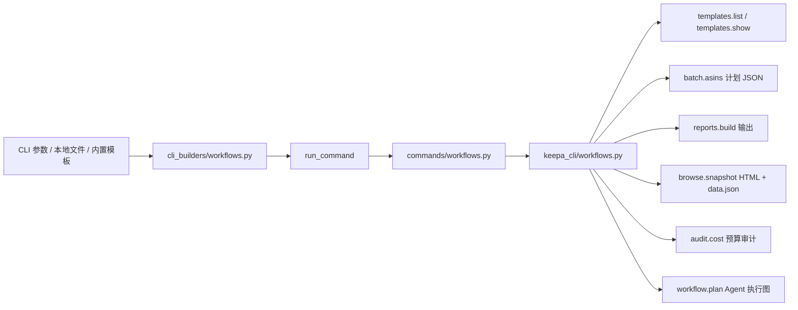
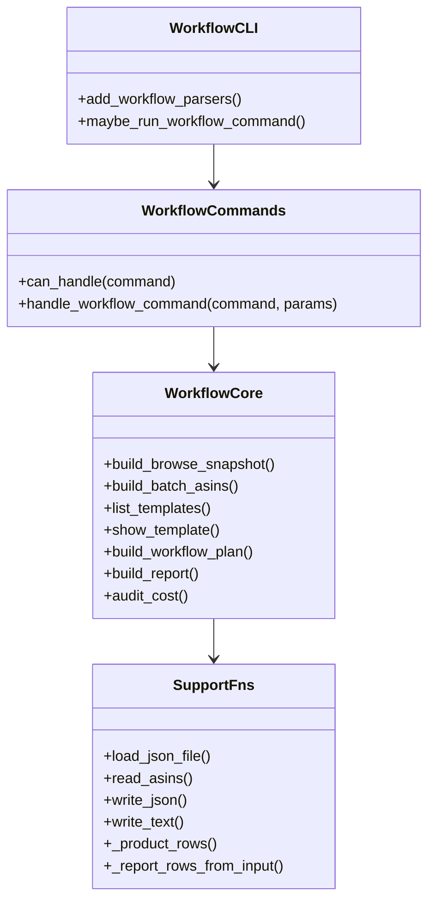
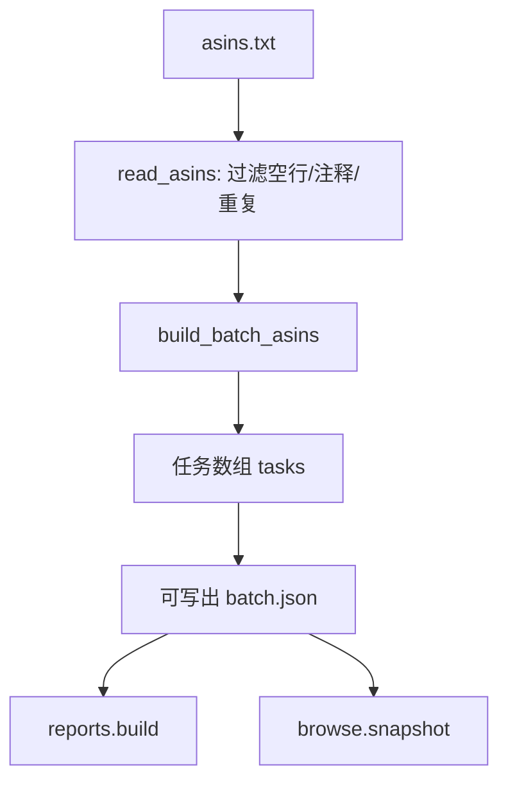
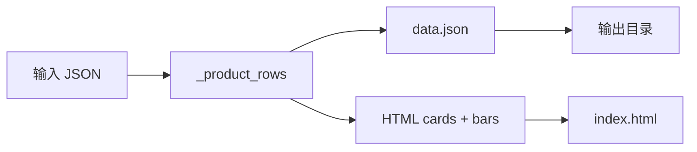
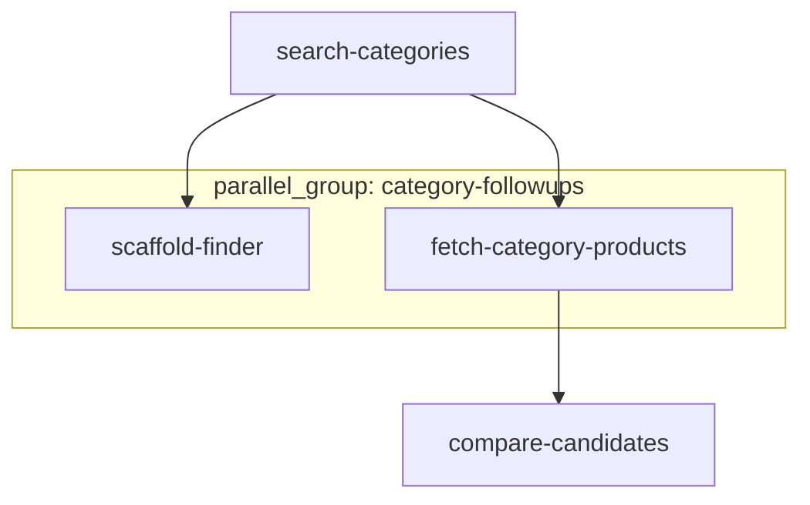

这一页只讨论 `workflow`/`browse`/`batch`/`templates`/`reports`/`audit` 这一组**完全离线优先**的本地工作流能力：它们负责生成模板、把 ASIN 文本转成批处理计划、把本地 JSON 转成 Markdown/JSON/CSV 报告、从离线数据生成静态 HTML 浏览页，以及为 Agent 生成不耗实际请求的执行计划。代码与测试都明确声明这组能力**不访问真实 Keepa API**，CLI 只做参数解析，命令服务再把结果封装为稳定 envelope。Sources: [workflows.py](keepa_cli/workflows.py#L1-L21), [workflows.py](keepa_cli/commands/workflows.py#L1-L24), [workflows.py](keepa_cli/cli_builders/workflows.py#L1-L18), [test_phase10_workflows.py](tests/test_phase10_workflows.py#L1-L6)

## 它在整体中的位置

从职责分层看，这个离线工作流引擎位于三层结构中：`cli_builders/workflows.py` 注册命令与参数；`commands/workflows.py` 根据逻辑命令名选择具体处理函数；`workflows.py` 提供真正的本地生成逻辑，如模板枚举、批处理计划构造、报告渲染、HTML 快照生成与工作流计划输出。这意味着页面关注点不是网络请求本身，而是**如何把已有输入组织成可执行、可审计、可浏览的本地工件**。Sources: [workflows.py](keepa_cli/cli_builders/workflows.py#L19-L67), [workflows.py](keepa_cli/cli_builders/workflows.py#L69-L137), [workflows.py](keepa_cli/commands/workflows.py#L25-L106), [workflows.py](keepa_cli/workflows.py#L22-L590)

在仓库导航中，这一页处在“用户界面与本地工作台”下，更具体地说，它承接了 [本地批处理、报告生成与浏览快照工作流](10-ben-di-pi-chu-li-bao-gao-sheng-cheng-yu-liu-lan-kuai-zhao-gong-zuo-liu) 的上手体验，并从实现层解释这些能力如何落地；如果你接下来想看这些离线工作流如何与共享命令内核汇合，可以继续阅读 [服务层中枢：run_command 如何统一业务命令、配置命令与本地工具命令](16-fu-wu-ceng-zhong-shu-run_command-ru-he-tong-ye-wu-ming-ling-pei-zhi-ming-ling-yu-ben-di-gong-ju-ming-ling)。Sources: [workflows.py](keepa_cli/cli_builders/workflows.py#L69-L137), [workflows.py](keepa_cli/commands/workflows.py#L52-L106)

## 代码版图：与本页直接相关的模块

下面这个结构只保留与离线工作流引擎直接相关的文件，可以把它看成“命令入口 → 服务路由 → 本地实现 → 回归测试”的最短路径。Sources: [workflows.py](keepa_cli/cli_builders/workflows.py#L19-L137), [workflows.py](keepa_cli/commands/workflows.py#L25-L106), [workflows.py](keepa_cli/workflows.py#L22-L590), [test_phase10_workflows.py](tests/test_phase10_workflows.py#L18-L158)

```text
keepa_cli/
├── cli_builders/
│   └── workflows.py        # argparse 子命令注册与 CLI → service 参数映射
├── commands/
│   └── workflows.py        # workflow 命令族路由与 success envelope 包装
└── workflows.py            # 模板、批处理、报告、HTML 浏览页、成本审计、workflow plan

tests/
└── test_phase10_workflows.py  # 离线工作流端到端回归测试
```

Sources: [workflows.py](keepa_cli/cli_builders/workflows.py#L19-L137), [workflows.py](keepa_cli/commands/workflows.py#L25-L106), [workflows.py](keepa_cli/workflows.py#L22-L590), [test_phase10_workflows.py](tests/test_phase10_workflows.py#L18-L158)

## 核心设计：离线工作流不是“假命令”，而是“本地工件生成器”

这一组能力的共同特征是：输入来自本地文件、命令参数或内置模板；输出则是 JSON、Markdown、CSV、HTML、计划步骤数组等本地工件；同时每个主要结果都会附带 `provenance`，其 `endpoint` 使用 `local://...` 形式，明确声明来源是本地而非远端接口。这种设计把“工作流执行前的规划”和“工作流执行后的整理”都压缩到本地可审计阶段。Sources: [workflows.py](keepa_cli/workflows.py#L113-L191), [workflows.py](keepa_cli/workflows.py#L194-L223), [workflows.py](keepa_cli/workflows.py#L356-L419), [workflows.py](keepa_cli/workflows.py#L461-L493), [workflows.py](keepa_cli/workflows.py#L569-L590)

为了更清楚地理解这条链路，可以先看下面的 Mermaid 图：它描述的不是网络调用流程，而是**本地输入如何被转换成不同种类的离线产物**。Sources: [workflows.py](keepa_cli/cli_builders/workflows.py#L19-L67), [workflows.py](keepa_cli/commands/workflows.py#L52-L106), [workflows.py](keepa_cli/workflows.py#L113-L223), [workflows.py](keepa_cli/workflows.py#L356-L493)



Sources: [workflows.py](keepa_cli/cli_builders/workflows.py#L69-L137), [workflows.py](keepa_cli/commands/workflows.py#L52-L106), [workflows.py](keepa_cli/workflows.py#L113-L223), [workflows.py](keepa_cli/workflows.py#L356-L590)

## 命令族总览

从 CLI 注册项可以看到，这个页面涉及六类入口：`browse snapshot`、`batch asins`、`templates list/show`、`reports build`、`audit cost`、`workflow plan`。它们的共同点是都进入同一个 `run_command` 入口，再交给 `handle_workflow_command` 分发。Sources: [workflows.py](keepa_cli/cli_builders/workflows.py#L19-L67), [workflows.py](keepa_cli/cli_builders/workflows.py#L74-L136), [workflows.py](keepa_cli/commands/workflows.py#L48-L106)

| CLI 子命令 | service 命令名 | 主要输入 | 主要输出 | 是否写文件 |
|---|---|---|---|---|
| `browse snapshot` | `browse.snapshot` | 本地 JSON 输入、标题、输出目录 | `index.html` + `data.json` + 元数据 | 是 |
| `batch asins` | `batch.asins` | ASIN 文本文件、域名、fixture、dry-run | 任务计划 JSON | 可选 |
| `templates list` | `templates.list` | 无 | 模板清单 | 否 |
| `templates show` | `templates.show` | 模板名 | 模板对象 | 可选 |
| `reports build` | `reports.build` | 本地 JSON、格式、标题 | Markdown/JSON/CSV 报告 | 可选 |
| `audit cost` | `audit.cost` | 单命令参数或 spec 文件 | token 预算清单与汇总 | 否 |
| `workflow plan` | `workflow.plan` | 工作流名、term/asin、goal、hydrate-top | Agent 执行图 | 否 |

Sources: [workflows.py](keepa_cli/cli_builders/workflows.py#L19-L67), [workflows.py](keepa_cli/cli_builders/workflows.py#L74-L136), [workflows.py](keepa_cli/commands/workflows.py#L52-L106)

## 模块交互：CLI、命令服务与本地实现如何配合

这里最关键的结构性特征是**参数标准化发生在 CLI builder，业务决策发生在 command handler，内容生成发生在 workflows 模块**。例如 `browse snapshot` 在 CLI 层只负责读取 `--input`、`--out-dir`、`--title`；命令层将它翻译为 `browse.snapshot`；最终由 `build_browse_snapshot()` 负责读取 JSON、抽取产品行、写入 `data.json` 与 `index.html`。同样的模式也适用于 batch、reports、audit 与 workflow plan。Sources: [workflows.py](keepa_cli/cli_builders/workflows.py#L20-L25), [workflows.py](keepa_cli/cli_builders/workflows.py#L74-L79), [workflows.py](keepa_cli/commands/workflows.py#L52-L58), [workflows.py](keepa_cli/workflows.py#L113-L191)

下面这张模块交互图展示的是实现关系，而不是用户视角操作顺序。Sources: [workflows.py](keepa_cli/cli_builders/workflows.py#L69-L137), [workflows.py](keepa_cli/commands/workflows.py#L52-L106), [workflows.py](keepa_cli/workflows.py#L113-L590)



Sources: [workflows.py](keepa_cli/cli_builders/workflows.py#L19-L137), [workflows.py](keepa_cli/commands/workflows.py#L25-L106), [workflows.py](keepa_cli/workflows.py#L58-L110), [workflows.py](keepa_cli/workflows.py#L113-L590)

## 模板系统：把常见离线任务变成可复用脚手架

模板能力由常量 `TEMPLATES` 提供，目前内置了四个模板：`finder-basic`、`deals-basic`、`tracking-add`、`batch-report`。每个模板都包含 `kind`、`description`，部分模板还携带 `selection` 或 `tracking` 这样的负载结构，以及一组推荐 CLI 命令。`list_templates()` 只返回名称、种类和描述；`show_template()` 则返回完整模板，并可通过 `--out` 写入 JSON 文件。Sources: [workflows.py](keepa_cli/workflows.py#L22-L55), [workflows.py](keepa_cli/workflows.py#L226-L242), [workflows.py](keepa_cli/cli_builders/workflows.py#L36-L41), [workflows.py](keepa_cli/commands/workflows.py#L67-L70)

| 模板名 | kind | 内含数据骨架 | 推荐用途 |
|---|---|---|---|
| `finder-basic` | `finder.selection` | `selection` | 生成 Product Finder 选择文件脚手架 |
| `deals-basic` | `deals.selection` | `selection` | 生成 Deals 选择文件脚手架 |
| `tracking-add` | `tracking.batch` | `tracking` | 生成 tracking 批量载荷脚手架 |
| `batch-report` | `batch.report` | `commands` | 批量 ASIN 检查后生成 Markdown 报告 |

Sources: [workflows.py](keepa_cli/workflows.py#L22-L55), [workflows.py](keepa_cli/workflows.py#L226-L242)

模板设计的重点不在“运行模板”，而在“**把常见输入文件形状直接固化进仓库代码**”。这使得开发者可以先通过 `templates show` 落地 JSON，再把该文件交给其它命令继续使用，而不是从零手写选择器或批处理负载。测试也验证了 `templates.list` 至少包含 `finder-basic`，并且 `templates.show tracking-add` 返回 `tracking.batch` 类型。Sources: [workflows.py](keepa_cli/workflows.py#L22-L55), [workflows.py](keepa_cli/workflows.py#L226-L242), [test_phase10_workflows.py](tests/test_phase10_workflows.py#L72-L80)

## 批处理计划：把 ASIN 文本转成显式任务图

`build_batch_asins()` 的输入是 ASIN 文件、域名、是否 dry-run、可选 fixture 和可选输出路径。它先通过 `read_asins()` 读取文本：忽略空行、忽略 `#` 注释、按逗号取首列、统一转大写，并做去重；然后为每个 ASIN 生成一个 `products.get` 任务，任务里显式保存 `params`、`estimated_tokens` 与 `worst_case_tokens`，最后汇总成 `task_count`、`estimated_tokens` 和 `provenance`。Sources: [workflows.py](keepa_cli/workflows.py#L66-L77), [workflows.py](keepa_cli/workflows.py#L194-L223)

这意味着 `batch asins` 生成的不是执行结果，而是**执行计划文件**。如果提供 `--out`，它会把整份任务计划写成 JSON；如果只在内存中使用，也能直接作为后续 `reports.build` 或 `browse.snapshot` 的输入。测试中构造了一个包含重复项与注释的 `asins.txt`，最终 `task_count` 被验证为 2，证明去重与注释过滤逻辑生效。Sources: [workflows.py](keepa_cli/workflows.py#L194-L223), [test_phase10_workflows.py](tests/test_phase10_workflows.py#L19-L35)

为了说明批处理计划在本地工作流中的位置，可以看这张顺序图。Sources: [workflows.py](keepa_cli/workflows.py#L66-L77), [workflows.py](keepa_cli/workflows.py#L194-L223), [workflows.py](keepa_cli/workflows.py#L461-L493), [workflows.py](keepa_cli/workflows.py#L113-L191)



Sources: [workflows.py](keepa_cli/workflows.py#L66-L77), [workflows.py](keepa_cli/workflows.py#L194-L223), [workflows.py](keepa_cli/workflows.py#L461-L493), [workflows.py](keepa_cli/workflows.py#L113-L191)

## 报告生成：统一输入、多格式渲染

报告生成的入口是 `build_report()`。它先读取 `--input` JSON，然后通过 `_report_rows_from_input()` 做三层兼容：如果顶层有 `tasks`，就把它们当作报告行；如果有 `rows`，就使用这些 `rows`；否则退回 `_product_rows()`，尝试从 `data.body.products` 或 `body.products` 中提取产品行。这使 `reports.build` 可以接受批处理计划、浏览数据、或者产品响应风格的输入。Sources: [workflows.py](keepa_cli/workflows.py#L422-L427), [workflows.py](keepa_cli/workflows.py#L461-L493)

输出格式由 `--format` 控制，只允许 `markdown`、`json`、`csv`。Markdown 版本固定生成标题、生成时间、来源路径、行数和表格；CSV 版本按所有行对象的键集合排序后输出表头；JSON 版本则保留 `title`、`source`、`generated_at` 与 `rows`。如果指定 `--out` 就落盘，否则把内容直接放回返回值中的 `content`。Sources: [workflows.py](keepa_cli/workflows.py#L430-L458), [workflows.py](keepa_cli/workflows.py#L461-L493), [workflows.py](keepa_cli/cli_builders/workflows.py#L43-L49)

| 格式 | 生成函数/结构 | 典型用途 | 文件写入行为 |
|---|---|---|---|
| `markdown` | `_report_markdown()` | 人类阅读、审计摘要 | 写文本 |
| `csv` | `_report_csv()` | 表格工具导入、二次分析 | 写文本 |
| `json` | 结构化对象 | 程序消费、后续串联 | 写 JSON |

Sources: [workflows.py](keepa_cli/workflows.py#L430-L458), [workflows.py](keepa_cli/workflows.py#L461-L493)

测试覆盖了一条典型链路：先用 `batch.asins` 生成 `batch.json`，再调用 `reports.build --format markdown --out report.md`，并验证输出文件以 `# Batch Audit` 开头。这说明报告阶段面向的是**本地已经整理好的 JSON 输入**，而不是重新发起查询。Sources: [test_phase10_workflows.py](tests/test_phase10_workflows.py#L28-L44), [workflows.py](keepa_cli/workflows.py#L461-L493)

## HTML 浏览页生成：从离线 JSON 到静态快照

`build_browse_snapshot()` 的目标是把离线 JSON 转成一个可直接打开的静态浏览目录。它会读取输入，调用 `_product_rows()` 抽取产品最小视图，只保留 `asin`、`title`、`brand` 和 `categoryTree`；然后写出 `data.json`，再拼接 HTML 文档写入 `index.html`。返回值中包含输出目录、两个文件路径、行数以及本地 provenance。Sources: [workflows.py](keepa_cli/workflows.py#L94-L110), [workflows.py](keepa_cli/workflows.py#L113-L191)

这个 HTML 页的内容是纯内联模板，不依赖前端构建。页面头部显示标题与生成时间，左侧面板展示产品总数、数据文件名以及基于标题长度计算出的条形图，右侧面板展示产品卡片；如果没有任何产品行，则渲染 “No product rows” 占位卡片。也就是说，这个浏览页更接近**离线结果浏览快照**，而不是完整交互式前端应用。Sources: [workflows.py](keepa_cli/workflows.py#L123-L179), [workflows.py](keepa_cli/workflows.py#L180-L191)

下面的图概括了浏览快照的本地转换逻辑。Sources: [workflows.py](keepa_cli/workflows.py#L94-L110), [workflows.py](keepa_cli/workflows.py#L113-L191)



Sources: [workflows.py](keepa_cli/workflows.py#L94-L110), [workflows.py](keepa_cli/workflows.py#L113-L191)

测试中，`browse.snapshot` 直接消费前一步生成的 `batch.json`，并断言输出目录下存在 `index.html`。这也揭示了一个实现事实：浏览页不要求输入一定是“真实产品响应”；只要 `_report_rows_from_input` 或 `_product_rows` 能从输入中抽出可用行，就能形成本地浏览工件。Sources: [test_phase10_workflows.py](tests/test_phase10_workflows.py#L45-L52), [workflows.py](keepa_cli/workflows.py#L94-L110), [workflows.py](keepa_cli/workflows.py#L113-L191)

## 工作流计划：给 Agent 的本地执行图，而不是直接执行器

`workflow plan` 是这个页面里最“规划型”的能力。CLI 只允许两种计划名：`category-research` 与 `product-research`；前者依赖 `--term`，后者依赖 `--asin`，并支持 `--goal` 与 `--hydrate-top`。命令最终进入 `build_workflow_plan()`，根据名称选择 `_category_research_plan()` 或 `_product_research_plan()` 生成步骤列表。Sources: [workflows.py](keepa_cli/cli_builders/workflows.py#L58-L66), [workflows.py](keepa_cli/commands/workflows.py#L88-L96), [workflows.py](keepa_cli/workflows.py#L272-L364)

每个步骤都由 `_plan_step()` 构造，它保留 `id`、`title`、`tool`、`params`、`cli`、`command`、`reason`、`depends_on`、`parallel_group`、`estimated_tokens`、`worst_case_tokens`、`requires_confirmation` 与 `fixture_replay`。换句话说，这份计划同时服务三类读者：命令行用户看 `cli`，服务调用者看 `tool/params`，审计者看预算与依赖关系。Sources: [workflows.py](keepa_cli/workflows.py#L245-L269)

`category-research` 计划固定包含四步：先 `categories.search` 寻找候选类目；再生成本地 Finder scaffold；然后获取该类目的 ASIN 候选；最后执行 `products.compare` 比较候选商品。第二步与第三步都依赖第一步，并共享 `parallel_group="category-followups"`；同时多步还带有 `fixture_replay`，例如 `category_search_home.json`、`bestsellers_home.json`、`product_agent_view_B0TEST.json`。Sources: [workflows.py](keepa_cli/workflows.py#L272-L324)

`product-research` 计划更短，只有两步：第一步拉取带 `agent_view` 的产品视图；第二步是“可选 offer 详情”，它依赖第一步，并且在原因说明中明确写出仅当 `data_quality` 显示 offers 缺失且需要卖家竞争细节时才执行。这个“可选性”并不是额外控制流结构，而是写在步骤的 `reason` 与预算信息里。Sources: [workflows.py](keepa_cli/workflows.py#L327-L353)

`build_workflow_plan()` 除了返回 `steps`，还会生成 `totals`、`parallel_groups`、`agent_brief`、`data_quality`、`selection_signals`、`next_actions`、`evidence_index` 与 `provenance`。其中 `next_actions` 只挑选无依赖的根步骤，这为 Agent 提供了“从哪一步先开始”的安全起点；而 `data_quality.notes` 明确写着“workflow plan is local-only and does not consume Keepa tokens”。Sources: [workflows.py](keepa_cli/workflows.py#L368-L419)

下面这张 Mermaid 图展示了 `category-research` 计划的依赖关系，因为这是该模块里最完整的执行图结构。Sources: [workflows.py](keepa_cli/workflows.py#L272-L324), [workflows.py](keepa_cli/workflows.py#L368-L419)



Sources: [workflows.py](keepa_cli/workflows.py#L272-L324), [workflows.py](keepa_cli/workflows.py#L368-L419)

测试验证了几个关键事实：`workflow.plan category-research` 的返回 `view` 为 `workflow_plan`；首步工具是 `categories.search`；第二步依赖包含 `search-categories`；总预计 token 为 55；并且 `requires_confirmation` 为真。另一个 CLI 测试则验证 `product-research --goal deal` 时第一步参数中的 `view` 为 `deal`。Sources: [test_phase10_workflows.py](tests/test_phase10_workflows.py#L82-L120)

## 成本审计：离线工作流中的预算侧视图

`audit.cost` 不是执行命令，而是对“准备执行的命令规格”做本地预算估算。CLI 支持两种输入方式：要么传一个 `target_command` 和若干 `--param`；要么提供一个 `--spec-file`，内容形如命令列表。命令层如果没有检测到 `commands` 数组，就会把单命令参数包装成统一规格后交给 `audit_cost()`。Sources: [workflows.py](keepa_cli/cli_builders/workflows.py#L51-L56), [workflows.py](keepa_cli/cli_builders/workflows.py#L109-L120), [workflows.py](keepa_cli/commands/workflows.py#L78-L87)

`audit_cost()` 会遍历每个命令规格，调用 `estimate_request_budget()` 生成 `estimated_tokens`、`worst_case_tokens` 和 `requires_confirmation`，再汇总到 `totals`。因此它承担的是“成本总览器”角色，经常与 `batch.asins` 或 `workflow.plan` 的输出信息形成互补：前者给出具体任务，后者给出执行图，而 `audit.cost` 给出预算聚合。Sources: [workflows.py](keepa_cli/workflows.py#L569-L590)

测试验证了一个具体案例：对 `products.get` 且只包含一个 ASIN 的规格进行审计时，总预计 token 为 1。这说明审计输出的数值不是文档描述，而是直接来自统一预算估算器。Sources: [test_phase10_workflows.py](tests/test_phase10_workflows.py#L68-L70), [workflows.py](keepa_cli/workflows.py#L569-L590)

## 数据形状比较：几类本地工件的差异

这一页的理解难点在于：这些命令都“离线”，但它们产出的对象形状完全不同。把它们并排放在一起看，会更容易分清“脚手架”“计划”“报告”“浏览快照”和“执行图”的边界。Sources: [workflows.py](keepa_cli/workflows.py#L22-L55), [workflows.py](keepa_cli/workflows.py#L194-L223), [workflows.py](keepa_cli/workflows.py#L356-L419), [workflows.py](keepa_cli/workflows.py#L461-L493), [workflows.py](keepa_cli/workflows.py#L113-L191)

| 能力 | 主要顶层字段/工件 | 面向对象 | 是否强调依赖关系 |
|---|---|---|---|
| 模板 | `name/kind/description/...` | 需要脚手架的开发者 | 否 |
| 批处理计划 | `task_count/tasks/estimated_tokens` | 后续批量执行或报告输入 | 否 |
| 报告 | `content` 或输出文件 | 人类阅读/表格分析/程序消费 | 否 |
| 浏览快照 | `index.html` + `data.json` | 本地结果浏览 | 否 |
| 工作流计划 | `steps/totals/next_actions/parallel_groups` | Agent 或高级用户 | 是 |
| 成本审计 | `items/totals/requires_confirmation` | 预算审计者 | 否 |

Sources: [workflows.py](keepa_cli/workflows.py#L22-L55), [workflows.py](keepa_cli/workflows.py#L194-L223), [workflows.py](keepa_cli/workflows.py#L356-L419), [workflows.py](keepa_cli/workflows.py#L461-L493), [workflows.py](keepa_cli/workflows.py#L569-L590), [workflows.py](keepa_cli/workflows.py#L113-L191)

## 测试证明了什么

`tests/test_phase10_workflows.py` 把这一页的能力串成了一条最小闭环：创建临时 `asins.txt` → 生成 `batch.json` → 生成 `report.md` → 生成浏览目录 → 做缓存解释与缓存统计/清理 dry-run → 执行成本审计；此外，它还独立覆盖了模板列举/展示、工作流计划结果结构，以及 CLI 下 JSON 输出的稳定性。这里最重要的结论不是“功能存在”，而是**这些功能被验证为可以在完全离线、临时目录、fixture/本地文件场景中工作**。Sources: [test_phase10_workflows.py](tests/test_phase10_workflows.py#L18-L158)

其中 CLI 级测试尤其说明了一个架构承诺：即使经过命令行入口，`batch asins` 与 `workflow plan` 仍然返回可 JSON 解析的稳定 envelope，调用者不需要为这组命令单独适配输出格式。Sources: [test_phase10_workflows.py](tests/test_phase10_workflows.py#L97-L154), [workflows.py](keepa_cli/commands/workflows.py#L100-L105)

## 适合理解这页的阅读顺序

如果你是第一次进入这一块代码，最顺的阅读路径通常是：先回到 [本地批处理、报告生成与浏览快照工作流](10-ben-di-pi-chu-li-bao-gao-sheng-cheng-yu-liu-lan-kuai-zhao-gong-zuo-liu) 看用户视角的最小用法，再读当前页理解模板、计划、报告与 HTML 快照的实现；接着如果你想知道这些离线命令如何统一接入服务内核，继续看 [服务层中枢：run_command 如何统一业务命令、配置命令与本地工具命令](16-fu-wu-ceng-zhong-shu-run_command-ru-he-tong-ye-wu-ming-ling-pei-zhi-ming-ling-yu-ben-di-gong-ju-ming-ling)；如果你更关心预算与确认门禁，则下一站是 [成本治理：Token 预算、确认门禁与高成本请求保护](20-cheng-ben-zhi-li-token-yu-suan-que-ren-men-jin-yu-gao-cheng-ben-qing-qiu-bao-hu)。Sources: [workflows.py](keepa_cli/cli_builders/workflows.py#L19-L67), [workflows.py](keepa_cli/commands/workflows.py#L52-L106), [workflows.py](keepa_cli/workflows.py#L194-L223), [workflows.py](keepa_cli/workflows.py#L356-L419), [workflows.py](keepa_cli/workflows.py#L461-L493)