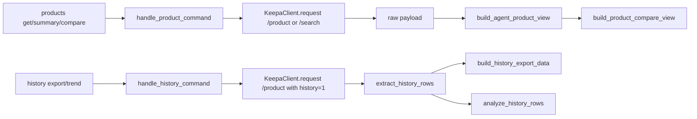

本页位于“深入解析 → 领域能力版图”中的当前节点，专门说明仓库里围绕**单商品研究**展开的四条能力：`products.get` 的原始/摘要详情、`products.compare` 的横向比较、`history.export` / `history.trend` 的历史序列加工，以及面向自动化消费的 Agent 视图契约。这里不展开搜索、类目、Deals、Seller 或研究图谱总线，只聚焦“拿到产品 → 压缩成可读结构 → 做对比或导出历史”的产品研究闭环。Sources: [products.py](keepa_cli/commands/products.py#L21-L35) [history.py](keepa_cli/commands/history.py#L21-L33)

## 这条主线解决的核心问题

从第一原则看，Keepa 的 `/product` 返回体信息密度很高，既包含原始 `products` 列表，也包含 `csv` 历史数组、`stats` 位置数组、媒体、A+、offers 等混合字段；这个仓库没有让调用方直接面对全部原始结构，而是在服务层上分成四种研究动作：**查一个产品**、**把多个产品压成可比较行**、**把 csv 历史展开成行式数据**、**把大而不稳定的原始对象变成稳定的 Agent 视图**。这也是 `keepa_cli/commands/products.py`、`keepa_cli/history_export.py` 与 `keepa_cli/product_view.py` 的职责分离依据。Sources: [product_view.py](keepa_cli/product_view.py#L1-L5) [history_export.py](keepa_cli/history_export.py#L1-L5) [products.py](keepa_cli/commands/products.py#L1-L5)

在入口层，CLI 已经把这四类动作明确暴露出来：`products get`、`products compare`、`products summary`、`history export`、`history trend`。其中 `products summary` 并不是独立后端命令，而是把 `products.get` 预置为 `agent_view=True` 的快捷入口；这意味着“产品详情”和“Agent 摘要”在服务层共享同一个请求主线，只是输出视图不同。Sources: [products.py](keepa_cli/cli_builders/products.py#L17-L24) [products.py](keepa_cli/cli_builders/products.py#L55-L68) [products.py](keepa_cli/cli_builders/products.py#L87-L97) [products.py](keepa_cli/cli_builders/products.py#L187-L206) [history.py](keepa_cli/cli_builders/history.py#L17-L39)

## 模块关系总览

下面这张图适合先建立心智模型：左侧是命令入口，中央是服务路由，右侧是两条本地转换分支。一条把 `/product` 响应压缩成 Agent 视图与比较视图，另一条把 `csv` 历史展开成导出行和趋势摘要。Mermaid 只是结构表达；真正的边界定义来自各模块的 docstring 与调用关系。Sources: [products.py](keepa_cli/cli_builders/products.py#L17-L24) [products.py](keepa_cli/commands/products.py#L28-L35) [history.py](keepa_cli/commands/history.py#L28-L33) [product_view.py](keepa_cli/product_view.py#L145-L199) [history_export.py](keepa_cli/history_export.py#L75-L172)

## 产品详情：一个命令，两种输出世界

`products.get` 在服务层要求**二选一**输入：要么提供 `asin/asins`，要么提供 `code/codes`，两者同时存在或同时缺失都会返回 `invalid_argument`。构造请求时，它统一把域名解析成 Keepa 的 `domain_id`，再把 `asin` 或 `code` 逗号拼接后发往 `/product`。这说明“产品详情”在网络层其实只有一条官方接口，而命令语义是在本地服务层收紧出来的。Sources: [products.py](keepa_cli/commands/products.py#L38-L63)

CLI 为 `products get` 暴露了非常宽的查询面，包括 `history`、`stats`、`days`、`update`、`offers`、`videos`、`aplus`、`rating`、`buybox`、`stock`、`historical-variations` 等参数；但仓库同时提供了一个更清晰的 `--full` 低成本完整详情预设，它自动设置 `history=1`、`stats=<窗口>`、`videos=1`、`aplus=1`。共享逻辑位于 `product_query_options()`，所以无论是产品详情还是产品比较，只要走 `/product`，都会复用这套参数折叠规则。Sources: [products.py](keepa_cli/cli_builders/products.py#L20-L53) [common.py](keepa_cli/commands/common.py#L56-L80)

测试明确冻结了这个预设行为：当 `full=True` 且 `dry_run=True` 时，请求参数中必须出现 `history=1`、`stats=0`、`videos=1`、`aplus=1`，同时不会自动加入 `rating` 或 `offers`。这表明“完整详情”在本项目里的定义是**低成本补足媒体与历史，不主动触发更昂贵的 rating/offers 分支**。Sources: [test_service_commands.py](tests/test_service_commands.py#L41-L58)

原始详情和 Agent 详情的分叉发生在 `product_get()` 返回后：如果 `agent_view` 为真，或者 `view == "agent"`，服务层会在保留请求元数据的同时，将大体量 `body` 改写为 `build_agent_product_view()` 的结果；否则只是在需要时把原始大响应写入 `--out` 指向的文件。也就是说，**网络请求只做一次，视图转换是本地后处理**。Sources: [products.py](keepa_cli/commands/products.py#L64-L88)

## Agent 视图：把原始 Keepa Product Object 压成稳定研究单元

`build_agent_product_view()` 是这条主线的核心。它从响应中的 `body.products` 取出商品列表，生成统一的 `view="agent_product"`、`profile`、`schema_version`、`product_count` 和 `products[]`，同时显式声明 `raw.body_omitted=True`。函数还保留 `offline`、`fixture`、`output` 与 `cache_provenance` 元数据，并用 `field_notes` 告知消费方：原始 body 被省略、csv/stats 已按 Keepa CsvType 名称映射、货币字段同时保留安全数值语义。Sources: [product_view.py](keepa_cli/product_view.py#L145-L199)

单个商品的 Agent 化步骤是固定流水线：先拆出 `identity`、`category`、`pricing`、`demand`、`rating`、`offers`、`media`、`aplus`、`content`、`compliance_and_logistics`、`variations`、`stats_summary`、`history_summary`、`raw_field_presence`，再推导 `temporal_features`、`data_quality`、`selection_signals`、`risk_taxonomy`、`research_graph`、`next_actions`、`agent_brief`、`evidence_index`，最后按 profile 和 fields 过滤输出。这条顺序很重要，因为后半段推导项显式依赖前半段的结构化字段。Sources: [product_view.py](keepa_cli/product_view.py#L358-L400)

例如 `pricing` 并不是简单透传，而是把 `stats.current/avg30/avg90/avg180` 里的价格索引映射成命名字段，再额外拼上 `buy_box`、`coupon_history`、`promotions` 等研究高频信息；`demand` 抽取了 `monthlySold`、`monthlySoldHistory`、`salesRankDrops30/90/180/365` 和时间锚点；`rating` 则把当前 rating 与 review_count 从 stats 位置数组里命名化。Agent 视图的价值，不在“更多字段”，而在**把位置数组与零散字段变成显式语义对象**。Sources: [product_view.py](keepa_cli/product_view.py#L440-L519)

时序特征窗口也被统一规范化。`_normalize_temporal_windows()` 会把字符串、列表、逗号分隔输入折叠为去重排序后的正整数元组，默认窗口为 `7/30/90/180/365` 天。测试进一步验证：当传入 `["30,180", "365"]` 时，最终窗口顺序为 `[30, 180, 365]`，并且 `temporal_features.series.new` 中会包含窗口分析、离散度、变化画像和形状特征。Sources: [product_view.py](keepa_cli/product_view.py#L2129-L2148) [test_service_commands.py](tests/test_service_commands.py#L59-L84)

## 视图 profile、字段裁剪与分块输出

Agent 视图不是单一模板，而是按 profile 裁剪。代码内置了 `summary`、`research`、`deal`、`audit` 四套字段集；其中 `summary` 更偏简报，`deal` 会保留 `offers/media/aplus/temporal_features/raw_field_presence` 等更接近选品判断的部分，`audit` 则更强调数据质量、风险和证据。`raw` 与 `agent` 两个别名最终都会归一化为 `research`。Sources: [product_view.py](keepa_cli/product_view.py#L46-L92) [product_view.py](keepa_cli/product_view.py#L2106-L2112)

除了 profile，调用者还可以通过 `fields` 做二次精裁。CLI 层允许逗号分隔传入字段名，服务层再把它交给 `_normalize_fields()` 清洗。测试显示，当 `view="summary"` 且 `fields` 显式指定 `agent_brief,identity,pricing,data_quality,next_actions,selection_signals,temporal_features,evidence_index` 时，输出确实只保留这些关心字段，而 `history_summary` 会被剔除。Sources: [products.py](keepa_cli/cli_builders/products.py#L46-L49) [product_view.py](keepa_cli/product_view.py#L2115-L2126) [test_service_commands.py](tests/test_service_commands.py#L177-L215)

大视图还可以落地成分块文件。`write_agent_view_chunks()` 会为每个商品的 `agent_brief`、`identity`、`pricing`、`demand`、`rating`、`offers`、`media`、`aplus`、`selection_signals`、`risk_taxonomy`、`research_graph`、`evidence_index`、`history_summary`、`temporal_features` 等 section 生成独立 JSON 文件，并把路径、大小与格式回填到 `chunks` 清单中。这不是另一个数据源，而是**同一 Agent 视图的磁盘切片形式**。Sources: [product_view.py](keepa_cli/product_view.py#L319-L355)

## 产品比较：先 Agent 化，再压成横向行

`products.compare` 并不直接比较原始 Keepa body。它先像 `products.get` 一样调用 `/product`，然后强制走 `build_agent_product_view()`，最后再进入 `build_product_compare_view()`。因此比较视图不是单独一套抓取逻辑，而是**建立在 Agent 详情视图之上的二次投影**。Sources: [products.py](keepa_cli/commands/products.py#L91-L127)

`build_product_compare_view()` 的做法很直接：从每个商品的 `identity/pricing/demand/rating/offers/media/aplus/category/risk_taxonomy/research_graph` 中抽取核心指标，压成 `rows[]`。每一行至少包含 `asin`、`title`、`brand`、`new_price`、`buy_box_price`、`sales_rank`、`monthly_sold`、`rating`、`review_count`、`coupon`、`total_offer_count`、`video_count`、`aplus_available`，并附带 `selection_signals`、`risk_taxonomy`、`research_graph` 与 `data_quality`。因此 compare 的本质是**面向比较的瘦行模型**，而不是原始对象并排摆放。Sources: [product_view.py](keepa_cli/product_view.py#L202-L258)

比较视图还会附带两个聚合层：`risk_summary` 统计各风险码与严重度分布，`research_graph` 则跨商品去重合并节点和边。这样，多商品比较不仅能看数值差异，还能保留“有哪些共同风险”“合并后图谱包含哪些实体”的机器可消费结构。Sources: [product_view.py](keepa_cli/product_view.py#L261-L317)

测试对 `products.compare` 的约束很克制但很关键：返回命令名必须是 `products.compare`，并且行视图里至少要能读到 `asin`、`new_price`、`monthly_sold` 与 `selection_signals`。这说明仓库把 compare 的稳定承诺放在“结构和核心研究字段存在”，而不是锁死每个派生细节。Sources: [test_service_commands.py](tests/test_service_commands.py#L216-L236)

## 历史导出：把 Keepa csv 数组变成行式数据

历史主线与详情主线共用 `/product`，但服务层在 `_history_product_payload()` 里强制加上 `history=1`，并要求**恰好一个 ASIN**。它不会直接把整个响应返回给用户，而是先在本地找到目标商品，再把其中的 `csv` 数组交给历史导出模块处理。Sources: [history.py](keepa_cli/commands/history.py#L59-L85)

`extract_history_rows()` 只支持四类序列：`amazon`、`new`、`used`、`sales_rank`，其中 `sales`、`rank`、`salesrank` 等别名会归一化为 `sales_rank`。函数逐个读取 `csv[index]` 的成对值，把 Keepa minute 转成 ISO 时间，把货币类值按 `/100` 缩放，并输出统一字段：`asin`、`series`、`timestamp`、`keepa_minute`、`value`、`raw_value`、`unit`。这一步把“位置数组”彻底改写为“事件行”。Sources: [history_export.py](keepa_cli/history_export.py#L19-L65) [history_export.py](keepa_cli/history_export.py#L75-L115)

导出层支持 `json`、`jsonl`、`csv` 三种格式。若指定 `--out`，`write_history_export()` 会写入磁盘并返回 `path/row_count/fields/format` 元数据；若不指定，`build_history_export_data()` 就把内容直接放入 envelope 的 `data.rows` 或 `data.content` 中。这意味着历史命令既能做离线分析输入，也能直接做 shell 管道输出。Sources: [history_export.py](keepa_cli/history_export.py#L118-L172)

服务层还对异常做了单独建模：找不到目标商品会返回 `product_not_found`，目标商品没有 `csv` 会返回 `history_unavailable`，选定序列没有任何点会返回 `history_empty`。因此历史导出不是“尽量返回空数组”，而是把不同缺失原因显式区分给调用方。Sources: [history.py](keepa_cli/commands/history.py#L88-L137)

测试确认了这一主线的基本语义：`history.export` 使用 fixture 时，请求端点仍是 `/product`，并且请求参数必须带 `history=1`；示例 fixture 在 `amazon,new` 两个序列下会展开出 6 行。底层单元测试也进一步冻结了行式导出的列头、JSONL 首行结构以及时间转换规则。Sources: [test_service_commands.py](tests/test_service_commands.py#L266-L287) [test_history_export.py](tests/test_history_export.py#L32-L66)

## 历史趋势：在行式历史之上做轻量分析

`history.trend` 与 `history.export` 的差别不在抓取阶段，而在后处理阶段。两者都先走 `_history_rows_from_payload()`，只是前者将行数据交给 `analyze_history_rows()`，后者交给 `build_history_export_data()`。默认窗口为 `30/90/180` 天，也可以通过 `window_days` 自定义。Sources: [history.py](keepa_cli/commands/history.py#L166-L189)

`analyze_history_rows()` 的统计模型是轻量且可解释的：按序列分组后，分别计算全历史与各窗口下的 `points`、`unit`、`oldest`、`latest`、`min`、`max`、`average`、`volatility` 以及 `change.absolute/change.percent`。它不做复杂预测，只做稳定摘要，因此很适合作为 Agent 或报表的中间层。Sources: [analysis.py](keepa_cli/analysis.py#L30-L78)

测试里对 `amazon` 价格序列的结果给出了明确基线：全历史点数为 3，最小值 10.99，最大值 12.99，最新值 10.99，绝对变化 -2.0，并且 `windows.30` 必须存在。这说明趋势分析的契约重点在**统计摘要稳定**，而不是图表渲染。Sources: [test_history_export.py](tests/test_history_export.py#L67-L79) [test_service_commands.py](tests/test_service_commands.py#L288-L307)

## 风险、下一步动作与证据索引：为什么 Agent 视图适合自动消费

Agent 视图不是简单的“摘要 JSON”，它还会补出研究辅助层。共享契约模块 `agent_contract.py` 提供了 `build_action()`、`build_agent_brief()`、`build_data_quality()` 与 `build_evidence_index()` 这类构造器，统一了下一步动作的 `tool/params/cli/reason/estimated_tokens/requires_confirmation` 结构，也统一了读序、证据索引和数据质量信号的表达方式。Sources: [agent_contract.py](keepa_cli/agent_contract.py#L16-L35) [agent_contract.py](keepa_cli/agent_contract.py#L38-L75)

风险分类在产品主线里是本地派生出来的。`_risk_taxonomy()` 会检查缺失关键字段、价格波动、销量排名走弱、评论量过低、竞争 offer 过多、Buy Box 缺失等情况，并输出标准化风险项、风险码集合和最高严重度。换句话说，`risk_taxonomy` 不是 Keepa 原生字段，而是本项目对产品研究数据的**可解释判定层**。Sources: [product_view.py](keepa_cli/product_view.py#L1814-L1915)

从已冻结的 schema snapshot 看，产品 Agent 视图中的 `agent_brief` 不仅包含 `one_line`、`key_facts`、`read_order`，还包含 `decision_context`、`temporal_by_window`、`risk_codes`、`recommended_next_actions` 等高度结构化信息；这些字段不是示例值，而是已提交契约的一部分。Sources: [products.agent-view.schema.json](docs/schema/products.agent-view.schema.json#L1-L126) [products.agent-view.schema.json](docs/schema/products.agent-view.schema.json#L127-L200)

测试进一步表明，这些辅助层不是装饰字段。`products.get` 的 Agent 视图用例中，测试验证了 `agent_brief.key_facts.asin`、`agent_brief.temporal_takeaways`、`agent_brief.decision_context.demand.monthly_sold`、`evidence_index.temporal_features.path`、`raw_field_presence.csv`，以及 `next_actions[0].estimated_tokens == 13`。这意味着产品研究主线已经把“读什么、缺什么、接下来查什么、成本大概多少”内嵌进了输出。Sources: [test_service_commands.py](tests/test_service_commands.py#L116-L176) [test_service_commands.py](tests/test_service_commands.py#L177-L215)

## 四条能力的边界对比

下表可以帮助你快速判断当前该用哪条主线能力。表里的差异全部来自 CLI 入口、服务路由和本地转换函数，而不是人为经验总结。Sources: [products.py](keepa_cli/cli_builders/products.py#L20-L53) [products.py](keepa_cli/cli_builders/products.py#L55-L68) [history.py](keepa_cli/cli_builders/history.py#L21-L39) [products.py](keepa_cli/commands/products.py#L38-L88) [products.py](keepa_cli/commands/products.py#L91-L127) [history.py](keepa_cli/commands/history.py#L139-L189)

| 能力 | 入口命令 | 上游接口 | 核心本地处理 | 主要输出形态 | 典型用途 |
|---|---|---|---|---|---|
| 产品详情 | `products get` | `/product` | 可选 `build_agent_product_view()` | 原始 Keepa body 或 Agent 产品视图 | 看单商品完整信息 |
| Agent 摘要 | `products summary` / `products get --agent-view` | `/product` | `build_agent_product_view()` | 稳定字段化研究对象 | 供脚本、Agent、审阅流消费 |
| 横向比较 | `products compare` | `/product` | Agent 视图后再 `build_product_compare_view()` | `rows[] + risk_summary + merged research_graph` | 多个 ASIN 并排研究 |
| 历史导出 | `history export` | `/product` with `history=1` | `extract_history_rows()` + 可选文件写出 | JSON / JSONL / CSV 行式数据 | 继续做 BI、脚本、表格分析 |
| 历史趋势 | `history trend` | `/product` with `history=1` | `extract_history_rows()` + `analyze_history_rows()` | 轻量统计摘要 | 看价格/排名变化方向 |

## 这条主线的实现特征总结

如果只用一句话概括这一页的设计，它不是“围绕 `/product` 堆参数”，而是围绕**产品研究对象的再建模**。`products.get` 负责取数，`build_agent_product_view()` 负责语义提升，`build_product_compare_view()` 负责多商品投影，`history_export`/`analysis` 负责把时序数组改造成可下游处理的数据面。这种拆分让“详情、比较、历史、Agent 视图”共享同一抓取主线，同时避免调用方直接绑定 Keepa 原始结构。Sources: [products.py](keepa_cli/commands/products.py#L38-L127) [product_view.py](keepa_cli/product_view.py#L145-L199) [product_view.py](keepa_cli/product_view.py#L202-L258) [history_export.py](keepa_cli/history_export.py#L75-L172) [analysis.py](keepa_cli/analysis.py#L61-L78)

继续阅读时，最自然的下一步有两条：如果你想看这些产品对象如何与类目、Deals、Seller 等能力并列组合，转到[搜索与发现主线：类目、Finder、Deals、Seller 与榜单查询](28-sou-suo-yu-fa-xian-zhu-xian-lei-mu-finder-deals-seller-yu-bang-dan-cha-xun)；如果你想看多次查询如何在更高层合并成跨命令实体图，转到[研究图谱能力：跨命令 research graph 合并、诊断与摘要](29-yan-jiu-tu-pu-neng-li-kua-ming-ling-research-graph-he-bing-zhen-duan-yu-zhai-yao)。Sources: [product_view.py](keepa_cli/product_view.py#L289-L317) [test_phase8_high_value_commands.py](tests/test_phase8_high_value_commands.py#L109-L149)