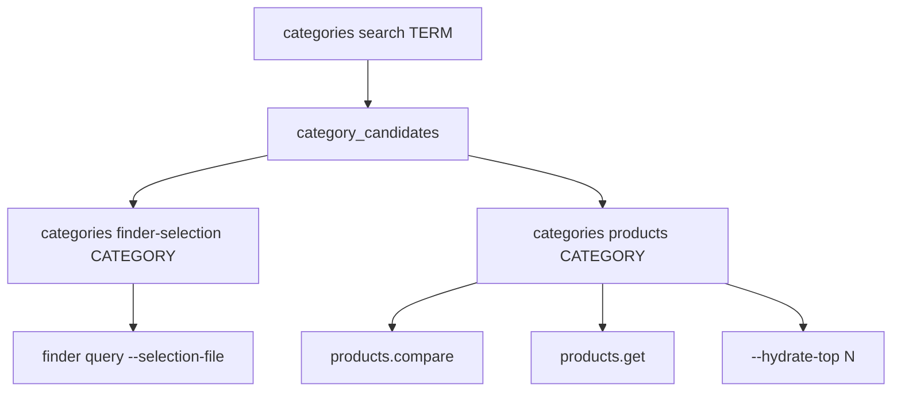
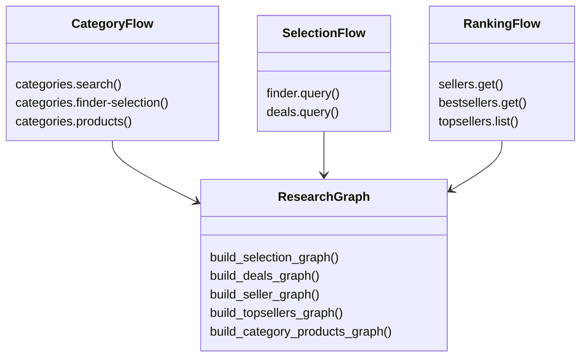

这一页位于“深入解析 → 领域能力版图”中的**搜索与发现主线**位置，关注的不是单个商品深挖，而是如何从**类目入口、筛选条件、促销集合、卖家实体、榜单结果**逐步收敛出可研究对象。代码上，这条主线由 `categories`、`finder`、`deals`、`sellers`、`bestsellers`、`topsellers` 六组命令共同组成，并且都通过统一的 service 内核暴露为 Agent-safe JSON envelope。Sources: [capabilities.py](keepa_cli/capabilities.py#L19-L55) [service.py](keepa_cli/service.py#L560-L589)

## 这条主线解决什么问题

如果说[产品研究主线：产品详情、比较视图、历史导出与 Agent 视图](27-chan-pin-yan-jiu-zhu-xian-chan-pin-xiang-qing-bi-jiao-shi-tu-li-shi-dao-chu-yu-agent-shi-tu)解决的是“**已知 ASIN 后如何分析**”，那么本页对应的是“**还不知道该看哪个 ASIN 时，如何发现候选目标**”。在仓库中，这种“发现”能力主要体现为：先通过 `categories.search` 找类目，再由 `categories.finder-selection` 生成本地筛选草稿，或直接由 `categories.products` / `bestsellers.get` 获取榜单候选；另一条分支则通过 `finder.query` 与 `deals.query` 运行 selection JSON，把条件表达转为结果集；卖家维度则由 `sellers.get` 与 `topsellers.list` 提供实体和排行入口。Sources: [commands/categories.py](keepa_cli/commands/categories.py#L37-L59) [commands/finder.py](keepa_cli/commands/finder.py#L17-L27) [commands/deals.py](keepa_cli/commands/deals.py#L17-L27) [service.py](keepa_cli/service.py#L171-L351)

## 模块关系总览

```mermaid
flowchart LR
    A[CLI builders / cli.py] --> B[run_command service]
    B --> C[categories 命令族]
    B --> D[finder / deals 共享 selection 引擎]
    B --> E[sellers / bestsellers / topsellers]
    C --> K[/category /search /bestsellers]
    D --> L[/query /deal]
    E --> M[/seller /bestsellers /topseller]

    C --> G[agent_profile]
    D --> G
    E --> G

    C --> H[research_graph]
    D --> H
    E --> H

    D --> F[selection JSON 读取与序列化]
```

这张图的关键点是：**命令入口很多，但执行骨架很少**。`cli_builders/*` 和 `cli.py` 负责收集参数，`run_command` 负责统一分派，而真正的发现语义主要集中在 `commands/categories.py`、`commands/selection.py` 与 `service.py` 中。这样做的直接结果是，CLI、TUI、stdio、MCP 在“发现类查询”上共享同一套响应形状、预算估算和图谱补充逻辑。Sources: [cli_builders/categories.py](keepa_cli/cli_builders/categories.py#L17-L119) [cli_builders/finder.py](keepa_cli/cli_builders/finder.py#L17-L47) [cli_builders/deals.py](keepa_cli/cli_builders/deals.py#L17-L45) [cli.py](keepa_cli/cli.py#L88-L162) [service.py](keepa_cli/service.py#L560-L589)

## 命令族能力地图

| 维度 | CLI 命令 | Service 命令 | Keepa 端点 | 输入核心 | 输出特点 |
|---|---|---|---|---|---|
| 类目定位 | `categories search` | `categories.search` | `/search` | `term` | 生成候选类目与后续动作 |
| 类目详情 | `categories get` | `categories.get` | `/category` | `category[]` | 原始类目树查询 |
| Finder 草稿 | `categories finder-selection` | `categories.finder-selection` | 无远程请求 | `category` | 本地生成 selection JSON |
| 类目候选商品 | `categories products` | `categories.products` | `/bestsellers` | `category` | 输出 ASIN 候选、next_actions、可选 hydrate |
| Product Finder | `finder query` | `finder.query` | `/query` | `selection-file` | 共享 selection 引擎 |
| Deals | `deals query` | `deals.query` | `/deal` | `selection-file` | 共享 selection 引擎，附 deal 图谱 |
| 卖家查询 | `sellers get` | `sellers.get` | `/seller` | `seller[]` | 卖家信息与 storefront ASIN |
| Best Sellers 榜单 | `bestsellers get` | `bestsellers.get` | `/bestsellers` | `category` | 榜单原始结果与图谱 |
| Top Sellers 榜单 | `topsellers list` | `topsellers.list` | `/topseller` | `domain`/`category?` | 卖家排行与类目关联 |

表里最值得注意的是两种复用：**`categories.products` 和 `bestsellers.get` 都打到 `/bestsellers`，但前者做候选归一化，后者保留榜单原貌；`finder.query` 与 `deals.query` 则共用同一个 selection 执行器，只是端点不同。**Sources: [cli_builders/categories.py](keepa_cli/cli_builders/categories.py#L20-L54) [cli_builders/finder.py](keepa_cli/cli_builders/finder.py#L17-L27) [cli_builders/deals.py](keepa_cli/cli_builders/deals.py#L17-L26) [commands/categories.py](keepa_cli/commands/categories.py#L62-L123) [commands/selection.py](keepa_cli/commands/selection.py#L56-L88) [service.py](keepa_cli/service.py#L225-L351)

## 类目主线：从搜索词到候选 ASIN

`categories.search` 的职责不是简单返回 `/search` 原始结果，而是把 `body.categories` 归一成 `category_candidates`，并为每个候选附加两类 `next_actions`：一类跳到 `categories.products` 预览 Best Sellers 候选，另一类跳到 `categories.finder-selection` 生成本地 Finder 草稿。这说明类目搜索在这里被设计成**工作流起点**，而不是终点。测试 fixture `category_search_home.json` 也验证了这一点：输入 `home kitchen` 时，会得到 `1055398` 类目，并自动生成两条后续命令建议。Sources: [commands/categories.py](keepa_cli/commands/categories.py#L93-L123) [commands/categories.py](keepa_cli/commands/categories.py#L126-L193) [tests/test_phase8_high_value_commands.py](tests/test_phase8_high_value_commands.py#L131-L149) [category_search_home.json](tests/fixtures/category_search_home.json#L1-L17)

`categories.finder-selection` 则把类目 id 转成一个**本地 selection scaffold**，默认包含 `categories_include`、销量范围、评论下限、排序、分页等字段，并明确在 `field_notes` 中提示：这个类目筛选字段是 Agent 侧草稿字段，实际发起 live Finder 查询前要确认账号对应的 Keepa 字段兼容性。这个命令**不调用远程 API，预算为 0 token**，但它会在 `--out` 时落盘 JSON，并把第一个 `next_action` 自动改写为可直接执行的 `finder query --selection-file <path>`。Sources: [commands/categories.py](keepa_cli/commands/categories.py#L195-L292) [tests/test_phase8_high_value_commands.py](tests/test_phase8_high_value_commands.py#L150-L169)

`categories.products` 是这条类目主线里最“面向下一步”的命令。它同样请求 `/bestsellers`，但不会停留在榜单原文，而是把 `bestSellersList.asinList` 切成 `asins` 与 `candidates`，再自动生成两个 follow-up：`products.compare` 比较前 10 个候选，和 `products.get` 深看头部候选。也就是说，**它把榜单查询改造成了产品研究的前置筛选器**。测试用例验证了这一层归一化：fixture 中只有两个 ASIN，但当 `limit=1` 时，输出会稳定收敛到第一个候选 `B001GZ6QEC`。Sources: [commands/categories.py](keepa_cli/commands/categories.py#L295-L423) [commands/categories.py](keepa_cli/commands/categories.py#L425-L472) [tests/test_phase8_high_value_commands.py](tests/test_phase8_high_value_commands.py#L109-L129) [bestsellers_home.json](tests/fixtures/bestsellers_home.json#L1-L11)

`categories.products` 还有一个非常刻意的设计：**hydrate 必须显式开启**。只有传入 `--hydrate-top N`，它才会把前 N 个候选再次送入 `product_get(..., agent_view=True)`，把候选列表提升为“候选 + 精简产品摘要”的混合视图；否则返回的 `hydration.enabled` 为 `False`，并在原因中提示要显式打开。这避免了榜单发现阶段意外滑入高成本的商品明细抓取。Sources: [commands/categories.py](keepa_cli/commands/categories.py#L311-L317) [commands/categories.py](keepa_cli/commands/categories.py#L475-L518) [tests/test_phase8_high_value_commands.py](tests/test_phase8_high_value_commands.py#L170-L191)

## 类目发现链路的交互图



这条链路体现了仓库中的一个核心判断：**类目不是结果，而是中间坐标**。因此 `categories.search`、`categories.finder-selection`、`categories.products` 三者并不是平级孤立命令，而是有明显的“搜索 → 草稿/候选 → 深入分析”顺序。对于第一次阅读这部分代码的人，先理解这个工作流，再去看参数细节，会更容易把握作者为什么在返回值中反复加入 `next_actions`。Sources: [commands/categories.py](keepa_cli/commands/categories.py#L141-L170) [commands/categories.py](keepa_cli/commands/categories.py#L227-L244) [commands/categories.py](keepa_cli/commands/categories.py#L449-L471)

## Finder 与 Deals：共享 selection 引擎，而不是各写一套请求逻辑

`finder.query` 与 `deals.query` 在命令层几乎是最薄的一层封装：它们都直接调用 `selection_query`，区别只在于 Finder 使用 `/query`，Deals 使用 `/deal`。这意味着仓库把“读取 selection JSON、转为请求参数、确认预算、执行请求、附加 Agent profile”的过程看作一种**通用请求模式**，而不是 Finder/Deals 各自独立的业务实现。Sources: [commands/finder.py](keepa_cli/commands/finder.py#L14-L27) [commands/deals.py](keepa_cli/commands/deals.py#L14-L27) [commands/selection.py](keepa_cli/commands/selection.py#L56-L88)

这个共享引擎先用 `load_selection` 从内联 JSON 或 `--selection-file` 读取对象，再用 `selection_to_query_value` 稳定序列化为紧凑 JSON 字符串塞进请求参数。随后它会根据 `max_tokens` 和命令类型执行 `confirmation_required` 判断，再统一交给 client 发请求。换句话说，Finder 与 Deals 的真正共同抽象不是“发现类命令”，而是**selection 驱动的查询命令**。Sources: [high_value.py](keepa_cli/high_value.py#L16-L45) [commands/selection.py](keepa_cli/commands/selection.py#L62-L88)

附加在 selection 响应上的 Agent profile 也遵循这一抽象。`attach_selection_profile` 会把 `selection`、`request`、可选的 `body` 作为基础证据；如果命令是 `deals.query` 且响应内存在 `deals`，就构建专用的 `build_deals_graph`，否则退回通用的 `build_selection_graph`。因此 Finder 偏向表达“**筛选条件与返回商品的关系**”，Deals 则额外表达“**deal 实体与 product 实体的关系**”。Sources: [commands/selection.py](keepa_cli/commands/selection.py#L21-L54) [research_graph.py](keepa_cli/research_graph.py#L243-L301)

仓库里的 fixture 也刻意展示了两者 selection 形状的差异。`finder_selection.json` 使用销量、评论数、排序和分页字段，更像“商品池筛选器”；`deals_selection.json` 则使用 `isLowest`、`deltaPercentRange`、`currentRange`、`salesRankRange` 等价格/折扣条件，更像“促销机会探测器”。代码并不试图统一这些业务字段，只统一其**传输与执行机制**。Sources: [finder_selection.json](tests/fixtures/finder_selection.json#L1-L9) [deals_selection.json](tests/fixtures/deals_selection.json#L1-L8) [commands/selection.py](keepa_cli/commands/selection.py#L66-L87)

## Seller 与榜单：面向实体和排行的另一条发现路径

`sellers.get` 是这条发现主线里唯一直接以“卖家 id”作为主键的命令。它把多个 `seller` 参数拼成 `/seller` 请求，可选附带 `storefront` 与 `update`，请求成功后会基于 `body.sellers` 构建 seller research graph：根节点是 `seller_request`，每个 seller 变成 `seller:<id>` 节点，如果响应里有 `asinList`，还会继续连出 `product:<asin>` 节点。也就是说，这个命令不只回答“卖家是谁”，也回答“**这个卖家卖哪些产品**”。Sources: [service.py](keepa_cli/service.py#L171-L222) [research_graph.py](keepa_cli/research_graph.py#L260-L284)

测试 fixture `seller_A2L77EE7U53NWQ.json` 清楚展示了这种建模方式：卖家对象里既有 `sellerName`、`rating`、`ratingCount`、`hasStorefront`，也有 `asinList`。对应测试断言不仅校验 `/seller` 端点与 seller 参数，也验证 research graph 同时包含 `seller` 与 `product` 两类实体。Sources: [seller_A2L77EE7U53NWQ.json](tests/fixtures/seller_A2L77EE7U53NWQ.json#L1-L16) [tests/test_phase8_high_value_commands.py](tests/test_phase8_high_value_commands.py#L71-L90)

`bestsellers.get` 与 `categories.products` 虽然同样访问 `/bestsellers`，但职责明显不同。`bestsellers.get` 保留的是**榜单查询语义**：它从 `bestSellersList` 中抽取前 25 个候选，仅用于构图与 Agent 摘要，不改变原始 `body` 的榜单中心地位；而 `categories.products` 则进一步压缩成“候选 ASIN 列表 + 后续产品命令”。如果你只想拿到榜单本身，选 `bestsellers.get`；如果你要把榜单转成产品研究入口，选 `categories.products`。Sources: [service.py](keepa_cli/service.py#L225-L285) [commands/categories.py](keepa_cli/commands/categories.py#L425-L472)

`topsellers.list` 则面向“卖家排行”而不是“商品排行”。它调用 `/topseller`，可选带 category，然后把 `body.topSellers` 归一为 seller items，再交给 `build_topsellers_graph`。该图谱以 `seller_ranking` 为根节点，能同时表达三类关系：排行集合包含哪些 seller、seller 属于哪个 category、以及整个排行是否带 category 过滤。这让 Top Sellers 不只是一个列表，而是一个**可合并进研究图谱的排行上下文**。Sources: [service.py](keepa_cli/service.py#L297-L351) [research_graph.py](keepa_cli/research_graph.py#L304-L333)

`topsellers_US.json` fixture 证明了这条路径的最小形态：一个 seller、一个 `categoryId`、一个 domain，就足以生成 seller ranking 图谱；测试则进一步验证 `--out` 可以把大响应落盘，而 research graph 至少包含一个 seller 实体。Sources: [topsellers_US.json](tests/fixtures/topsellers_US.json#L1-L15) [tests/test_phase8_high_value_commands.py](tests/test_phase8_high_value_commands.py#L192-L214)

## Seller / 榜单 / 类目三种发现入口的比较

| 入口 | 关注对象 | 是否直接返回 ASIN 候选 | 是否携带后续动作 | 典型用途 |
|---|---|---:|---:|---|
| `categories.search` | 类目候选 | 否 | 是 | 从关键词定位研究范围 |
| `categories.products` | 类目下商品候选 | 是 | 是 | 从类目直接抽样出可分析 ASIN |
| `bestsellers.get` | 商品榜单 | 间接 | 否 | 保留榜单原貌做审计或外部处理 |
| `finder.query` | 条件筛选后的商品集 | 取决于响应 | 否 | 用 selection 精确筛选商品池 |
| `deals.query` | 促销商品集 | 是，且有 deal 语义 | 否 | 发现折扣机会 |
| `sellers.get` | 卖家与 storefront | 间接 | 否 | 研究卖家及其商品覆盖 |
| `topsellers.list` | 卖家排行 | 否 | 否 | 观察卖家层级竞争格局 |

这里最大的模式差异是：**类目命令更像 workflow orchestrator，Seller/榜单命令更像事实提取器，Finder/Deals 则是 selection 执行器。** 这也是为什么只有 `categories.search` 和 `categories.products` 在返回值中系统化地产生 `next_actions`。Sources: [commands/categories.py](keepa_cli/commands/categories.py#L141-L170) [commands/categories.py](keepa_cli/commands/categories.py#L449-L471) [commands/selection.py](keepa_cli/commands/selection.py#L21-L54) [service.py](keepa_cli/service.py#L171-L351)

## 研究图谱如何把“发现”结果变成可连通证据



从图谱构造函数可以看出，这条主线并不是只关心“返回多少条数据”，而是始终尝试把结果投影成**category / selection / seller / product / deal / ranking**等实体关系。`build_selection_graph` 从 selection 条件和响应体中抽取类目与商品；`build_seller_graph` 把 seller 和 storefront 商品连起来；`build_deals_graph` 引入独立的 deal 节点；`build_topsellers_graph` 则引入 seller ranking 根节点。这种实体化设计让发现阶段的输出天然适合交给[研究图谱能力：跨命令 research graph 合并、诊断与摘要](29-yan-jiu-tu-pu-neng-li-kua-ming-ling-research-graph-he-bing-zhen-duan-yu-zhai-yao)继续处理。Sources: [research_graph.py](keepa_cli/research_graph.py#L243-L333)

## 成本模型：这条主线里哪些命令真正“贵”

这组命令的预算并不平均。`categories.search` / `categories.get` 预算很低；`categories.finder-selection` 为 0；`deals.query` 估算 5 token；`finder.query` 默认估算 10 token，最坏值由 `max_tokens` 决定，并且要求确认；`sellers.get` 按 seller 数量线性计费；`categories.products` 走专门的 `_category_products_budget`；`bestsellers.get` 与 `topsellers.list` 则固定估算为 50 token 且需要确认。也就是说，**榜单类调用是这条主线里成本最高的操作**。Sources: [token_budget.py](keepa_cli/token_budget.py#L186-L223)

测试用例把这种预算策略钉得很死：`finder.query --dry-run --max-tokens 25` 会得到 `estimated_tokens=10`、`worst_case_tokens=25`，且要求确认；`bestsellers.get --dry-run` 会得到固定 50 token 提示；`topsellers.list` 在没有明确确认时会直接返回 `confirmation_required` 错误。预算提示不是附属信息，而是命令语义的一部分。Sources: [tests/test_phase8_high_value_commands.py](tests/test_phase8_high_value_commands.py#L20-L44) [tests/test_phase8_high_value_commands.py](tests/test_phase8_high_value_commands.py#L92-L108) [tests/test_phase8_high_value_commands.py](tests/test_phase8_high_value_commands.py#L192-L198)

## 入口层组织：哪些命令拆成独立 builder，哪些仍在 cli.py 中

从入口组织上也能看出这条主线的演化痕迹。`categories`、`finder`、`deals` 已经拆到 `cli_builders/*` 中，说明它们被视为独立命令族；而 `sellers`、`bestsellers`、`topsellers` 仍直接定义在 `cli.py` 里，随后再进入 `run_command` 的专用分支。对阅读者来说，这意味着本页对应能力并不完全收敛在一个目录中：**类目与 selection 查询偏模块化，卖家与榜单仍偏中心化注册。**Sources: [cli_builders/categories.py](keepa_cli/cli_builders/categories.py#L17-L119) [cli_builders/finder.py](keepa_cli/cli_builders/finder.py#L17-L47) [cli_builders/deals.py](keepa_cli/cli_builders/deals.py#L17-L45) [cli.py](keepa_cli/cli.py#L96-L126) [cli.py](keepa_cli/cli.py#L286-L331)

同样的能力也被暴露给 Agent 发现协议与 MCP 工具注册表。`capabilities.py` 明确声明了这些命令都支持 fixture/live 与何种输出类型；`agent/tools.py` 则把 `deals.query`、`sellers.get`、`bestsellers.get`、`topsellers.list` 注册成 MCP 工具，并按 `research`、`finder`、`deals`、`seller`、`rankings` 等组别归档。这说明“搜索与发现”不仅是 CLI 的用户故事，也是 Agent 的一等能力面。Sources: [capabilities.py](keepa_cli/capabilities.py#L19-L55) [capabilities.py](keepa_cli/capabilities.py#L74-L101) [agent/tools.py](keepa_cli/agent/tools.py#L540-L573)

## 面向中级开发者的代码阅读顺序

如果你准备继续沿这条主线做代码考古，最有效的顺序通常是：先看 `keepa_cli/commands/selection.py` 理解 selection 共享骨架，再看 `keepa_cli/commands/categories.py` 理解类目工作流式封装，然后回到 `keepa_cli/service.py` 观察 seller/bestsellers/topsellers 如何接入统一分派。最后再补看 `keepa_cli/research_graph.py` 和 `keepa_cli/token_budget.py`，你会更容易区分“业务动作”“证据结构”“成本约束”三层责任。Sources: [commands/selection.py](keepa_cli/commands/selection.py#L1-L88) [commands/categories.py](keepa_cli/commands/categories.py#L1-L518) [service.py](keepa_cli/service.py#L171-L351) [research_graph.py](keepa_cli/research_graph.py#L243-L333) [token_budget.py](keepa_cli/token_budget.py#L186-L223)

## 下一步阅读建议

如果你想把这一页的“发现结果”继续串成跨命令知识网络，下一页应读[研究图谱能力：跨命令 research graph 合并、诊断与摘要](29-yan-jiu-tu-pu-neng-li-kua-ming-ling-research-graph-he-bing-zhen-duan-yu-zhai-yao)；如果你更关心这些候选 ASIN 最终如何被转成详细研究视图，则建议回到[产品研究主线：产品详情、比较视图、历史导出与 Agent 视图](27-chan-pin-yan-jiu-zhu-xian-chan-pin-xiang-qing-bi-jiao-shi-tu-li-shi-dao-chu-yu-agent-shi-tu)；若你想从更高层理解所有命令族如何共用 service 中枢，则可补读[服务层中枢：run_command 如何统一业务命令、配置命令与本地工具命令](16-fu-wu-ceng-zhong-shu-run_command-ru-he-tong-ye-wu-ming-ling-pei-zhi-ming-ling-yu-ben-di-gong-ju-ming-ling)。Sources: [service.py](keepa_cli/service.py#L560-L589) [research_graph.py](keepa_cli/research_graph.py#L348-L420)