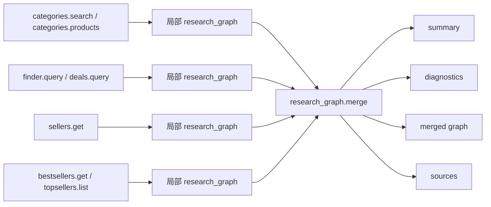
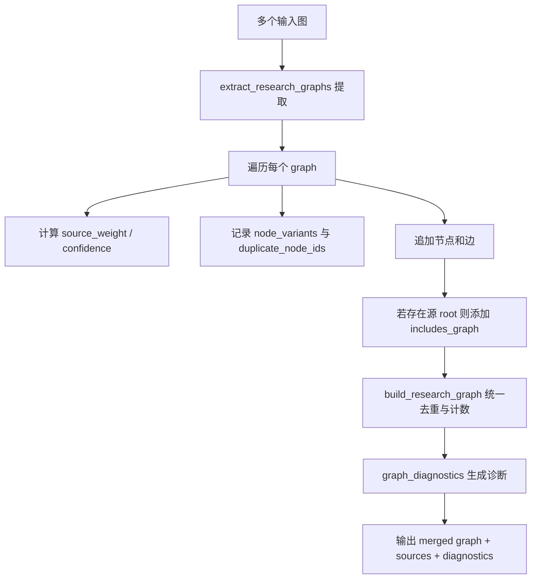
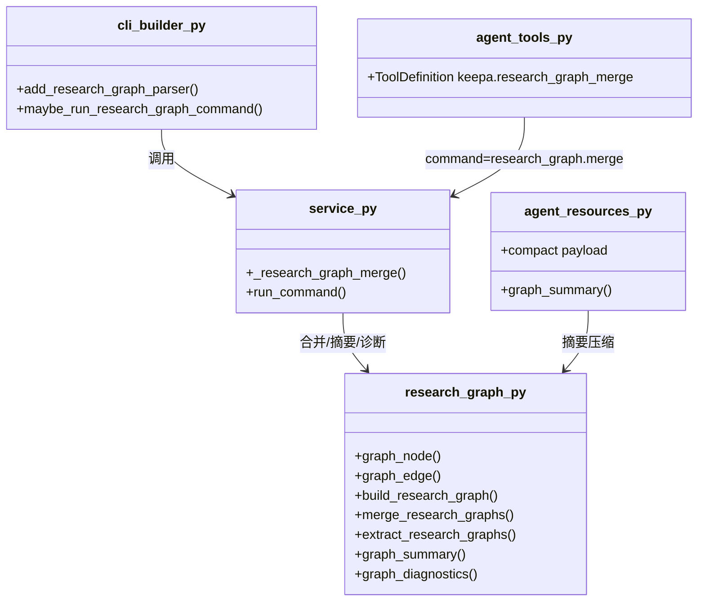

本页只讨论 **research graph** 这一条能力链：它如何把类目、选品、Deal、Seller、Top Sellers 等不同命令产出的结构化实体图统一抽取、合并、诊断并生成摘要，供 CLI、MCP 与 Agent 后续规划直接消费；不展开产品详情视图、MCP 资源总览或通用 service 机制的其他主题。Sources: [keepa_cli/research_graph.py](keepa_cli/research_graph.py#L32-L50) [keepa_cli/service.py](keepa_cli/service.py#L411-L477)

## 核心定位：为什么这里需要“图”而不是仅仅 JSON

这套实现把 `research_graph` 视为一种 **跨命令实体关系层**：节点统一承载 `id`、`type`、`label` 与 `attributes`，边统一承载 `source`、`target`、`type` 与 `evidence_path`；构建结果还会补充 `schema_version`、`root`、`node_count`、`edge_count` 与 `entity_counts`。因此它不是原始响应的镜像，而是面向 Agent 推理的、可合并的最小语义骨架。Sources: [keepa_cli/research_graph.py](keepa_cli/research_graph.py#L14-L29) [keepa_cli/research_graph.py](keepa_cli/research_graph.py#L32-L50)

更关键的是，这个图层被设计为 **纯本地 JSON 变换**：图构造函数本身不访问 Keepa API，`research_graph.merge` 的 token 预算为 0，能力表中也明确标记其 `supports_live=False`、输出类型为 `json-agent-graph`。这说明“研究图谱”在架构上被定义为一种离线后处理能力，而不是网络查询能力。Sources: [keepa_cli/research_graph.py](keepa_cli/research_graph.py#L1-L6) [keepa_cli/token_budget.py](keepa_cli/token_budget.py#L196-L197) [keepa_cli/capabilities.py](keepa_cli/capabilities.py#L19-L41)

## 图谱从哪里来：跨命令的实体图生产线

`keepa_cli/research_graph.py` 为多个非产品命令提供专门的图构造器。`build_category_graph` 建立类目父子关系，`build_category_candidates_graph` 把搜索词连接到候选类目，`build_category_products_graph` 把类目连接到候选商品，`build_selection_graph` 把 selection 条件连接到类目与返回商品，`build_seller_graph` 把 seller 请求连接到卖家和其商品，`build_deals_graph` 把 deal 集合连接到 deal 节点与商品，`build_topsellers_graph` 则把 seller 排名与类目关系串起来。它们共同复用同一套节点、边和计数规则，因此后续合并时不需要命令特判。Sources: [keepa_cli/research_graph.py](keepa_cli/research_graph.py#L188-L333)

服务层会在相应命令成功后把这些图挂到返回 `data["research_graph"]` 上。例如 Seller、Best Sellers、Top Sellers 都在服务实现里直接生成图，并把图中的 `entity_counts` 回写到 Agent brief 或证据索引可见字段中；Selection/Deals 相关逻辑也走同样模式。换言之，**merge 并不是从零建图，而是消费上游命令已经稳定产出的局部图**。Sources: [keepa_cli/service.py](keepa_cli/service.py#L201-L216) [keepa_cli/service.py](keepa_cli/service.py#L261-L279) [keepa_cli/service.py](keepa_cli/service.py#L323-L345)

下面这张图描述了 research graph 的生产与再利用关系。Sources: [keepa_cli/research_graph.py](keepa_cli/research_graph.py#L188-L333) [keepa_cli/service.py](keepa_cli/service.py#L411-L477)

## 合并机制：不是拼接，而是带溯源的归并

`merge_research_graphs()` 的第一步不是直接吞入所有节点，而是先创建一个新的根节点，类型固定为 `research_graph`，其 `attributes` 中写入 `graph_count`。随后每个输入图都会计算一个 `source_weight`，形成 `sources` 列表，并在源图根节点存在时补上一条 `includes_graph` 边，把 merged root 与原 root 串起来。这样合并后的图并不抹掉“图来自哪里”，而是把来源关系本身建模为一等结构。Sources: [keepa_cli/research_graph.py](keepa_cli/research_graph.py#L53-L115)

节点合并采取 **按 `id` 去重、保留变体信息做诊断** 的策略。实现里一边维护 `seen_node_ids` 和 `duplicate_node_ids`，一边把同 id 的不同版本收集到 `node_variants`；边则收集后交给统一去重逻辑。最终 `build_research_graph()` 会再次对节点和边做归一化去重，并重新计算节点数、边数和 `entity_counts`。这意味着图的主结果偏向“稳定唯一实体视图”，冲突细节则转移到诊断层表达。Sources: [keepa_cli/research_graph.py](keepa_cli/research_graph.py#L53-L115) [keepa_cli/research_graph.py](keepa_cli/research_graph.py#L386-L401)

源图权重是一个很直白的启发式：`node_count + edge_count + entity_type_count - index`，最小不低于 1；随后再映射成 `high / medium / low` 置信度。它不是概率模型，而是一个 **基于图丰富度和输入顺序的局部排序信号**，专门服务于 merged graph 的摘要与诊断。Sources: [keepa_cli/research_graph.py](keepa_cli/research_graph.py#L404-L419)

下面这张图展示 merge 的内部归并步骤。Sources: [keepa_cli/research_graph.py](keepa_cli/research_graph.py#L53-L115) [keepa_cli/research_graph.py](keepa_cli/research_graph.py#L386-L419)

## 诊断模型：合并结果是否“可信”，靠什么判断

`graph_diagnostics()` 当前输出四类核心信号：`duplicate_node_count`、`orphan_node_count`、`conflict_count` 与 `highest/lowest_source_weight`。其中 orphan 的判定并不是“没有父节点”，而是“节点 id 没有出现在任何边两端”，同时排除 merged root 与 source roots；duplicate 则来自 merge 过程中记录的同 id 重复出现次数；conflict 则来自节点变体差异分析。Sources: [keepa_cli/research_graph.py](keepa_cli/research_graph.py#L144-L185)

这种诊断设计的重点在于：**主图保持简洁，问题外溢到 diagnostics**。例如图中最终只保留一个 `product:B0TEST` 节点，但如果两个输入图对它给出不同 label，冲突不会污染主节点结构，而会记录为 `conflicts`。测试用例明确验证了这一点：重复节点计数为 1，冲突计数为 1，冲突 id 为 `product:B0TEST`。Sources: [tests/test_mcp.py](tests/test_mcp.py#L462-L493) [keepa_cli/research_graph.py](keepa_cli/research_graph.py#L109-L115)

下表总结了 merged diagnostics 的判定口径。Sources: [keepa_cli/research_graph.py](keepa_cli/research_graph.py#L144-L185)

| 诊断字段 | 计算基础 | 作用 |
|---|---|---|
| `duplicate_node_count` | merge 期间同 `id` 重复出现次数 | 判断实体是否被多图重复声明 |
| `orphan_node_count` | 节点未出现在任何边两端，且不是 root/source root | 发现未连通实体 |
| `conflict_count` | 同 `id` 节点变体存在差异 | 暴露标签或属性冲突 |
| `highest_source_weight` | 所有节点可见的最大来源权重 | 快速估计最强证据来源 |
| `lowest_source_weight` | 所有节点可见的最小来源权重 | 判断来源质量下界 |

## 摘要模型：把图缩成 Agent 可先读的一屏信息

`graph_summary()` 只提取合并图的高价值概况：`schema_version`、`root`、`node_count`、`edge_count`、`entity_counts`、`source_count`，以及诊断中的压缩字段 `duplicate_node_count`、`orphan_node_count`、`conflict_count`、`highest_source_weight`。它刻意不重复展开整张图内容，目的是让 Agent 或 MCP resource 阅读器先获得“是否值得继续深挖”的结论。Sources: [keepa_cli/research_graph.py](keepa_cli/research_graph.py#L124-L141)

服务层在 `_research_graph_merge()` 中把这个摘要提升为返回主体的一部分，同时再提供 `agent_brief.one_line`、`data_quality`、`evidence_index` 与 `provenance`。这里的 `agent_brief.read_order` 明确指定阅读顺序为 `summary → diagnostics → graph → sources`，说明该命令不是鼓励调用方先遍历全图，而是先看结论，再按需钻取。Sources: [keepa_cli/service.py](keepa_cli/service.py#L440-L477)

MCP 资源压缩逻辑也遵循同样原则。`agent/resources.py` 在检测到 `data` 中存在 `research_graph` 或 `graph` 时，不直接复制整张图，而是追加 `research_graph_summary`；对产品级和 compare row 级的图也是如此。也就是说，**summary 是跨 transport 的首屏载荷**，而完整图保留为结构化深度信息。Sources: [keepa_cli/agent/resources.py](keepa_cli/agent/resources.py#L233-L246) [keepa_cli/agent/resources.py](keepa_cli/agent/resources.py#L249-L290)

## 入口形态：CLI、service、MCP 共享同一命令语义

CLI 侧只暴露一个本地命令族：`research-graph merge`。参数很少，只有输入文件列表、可选 `--root`、`--label` 和 `--out`，随后转发为统一的 `run_command("research_graph.merge", ...)`。这说明页面标题中的“跨命令合并”不是多个子命令，而是一个专门消费已有 JSON 输出的后处理入口。Sources: [keepa_cli/cli_builders/research_graph.py](keepa_cli/cli_builders/research_graph.py#L16-L33)

service 侧的 `_research_graph_merge()` 同时支持两种输入通道：一是 `graph/graphs` 形式的内联对象，二是 `input/inputs` 形式的 JSON 文件路径。对每个输入对象或文件，它都会调用 `extract_research_graphs()` 递归提取嵌套图，因此输入不必把 graph 放在根层；只要 JSON 内部某处存在满足结构判定的图，就会被收集。Sources: [keepa_cli/service.py](keepa_cli/service.py#L411-L431) [keepa_cli/research_graph.py](keepa_cli/research_graph.py#L118-L121) [keepa_cli/research_graph.py](keepa_cli/research_graph.py#L344-L357)

MCP 侧则把它注册为 `keepa.research_graph_merge` 工具，分组为 `("research", "graph")`，描述中明确强调可从 category、product、compare、deal、seller 输出中合并图且 **without calling Keepa**。测试也验证了 MCP 工具可以直接接收两个内联 graph，并返回 `view = research_graph_merge`、`input_graph_count = 2` 与可用的诊断结果。Sources: [keepa_cli/agent/tools.py](keepa_cli/agent/tools.py#L583-L590) [tests/test_mcp.py](tests/test_mcp.py#L440-L460)

下表对三种入口的差异做一个聚焦对比。Sources: [keepa_cli/cli_builders/research_graph.py](keepa_cli/cli_builders/research_graph.py#L16-L33) [keepa_cli/service.py](keepa_cli/service.py#L411-L477) [keepa_cli/agent/tools.py](keepa_cli/agent/tools.py#L583-L590)

| 入口 | 暴露名称 | 主要输入 | 是否联网 | 典型输出 |
|---|---|---|---|---|
| CLI | `research-graph merge` | JSON 文件路径 | 否 | envelope 内 `data.graph` 或 `--out` 文件 |
| Service | `research_graph.merge` | 内联 `graph(s)` 或 `input(s)` | 否 | `summary`、`diagnostics`、`graph`、`sources` |
| MCP Tool | `keepa.research_graph_merge` | 结构化 arguments | 否 | `structuredContent` 中的 merge 结果 |

## 返回契约：合并结果里真正稳定的字段有哪些

`_research_graph_merge()` 返回的 `data` 结构不是只有一张图，而是一个面向 Agent 的小型报告：`view` 固定为 `research_graph_merge`，`graph` 是完整合并结果，`summary` 是压缩概览，`diagnostics` 是审计层，`input_graph_count` 记录实际提取到的图数量，`sources` 记录输入来源，`data_quality` 固定标记为高置信度本地处理，`evidence_index` 则提供路径级导航。这个设计让调用方不需要理解整个 schema，也能先消费稳定入口字段。Sources: [keepa_cli/service.py](keepa_cli/service.py#L440-L477)

测试夹具 `tests/agent_eval_fixtures/research_graph_merge.json` 进一步定义了这个契约的最低保证：必须成功、必须声明 `data.view = research_graph_merge`、输入图数至少为 3、合并结果中必须存在类目/商品/卖家/研究图根等实体计数、诊断里必须出现 `highest_source_weight`，证据索引中也必须存在 `diagnostics` 与 `graph` 的路径说明。Sources: [tests/agent_eval_fixtures/research_graph_merge.json](tests/agent_eval_fixtures/research_graph_merge.json#L1-L30)

下表列出合并结果中最值得直接依赖的字段。Sources: [keepa_cli/service.py](keepa_cli/service.py#L440-L477) [tests/agent_eval_fixtures/research_graph_merge.json](tests/agent_eval_fixtures/research_graph_merge.json#L13-L29)

| 字段 | 层级 | 含义 |
|---|---|---|
| `data.view` | 报告级 | 固定值 `research_graph_merge` |
| `data.summary` | 概览级 | 节点/边/实体类型计数与压缩诊断 |
| `data.diagnostics` | 审计级 | 重复、孤儿、冲突、source weight |
| `data.graph` | 全量级 | 合并后的完整图 |
| `data.sources` | 溯源级 | 输入文件或内联图的来源信息 |
| `data.evidence_index` | 导航级 | 指向 `graph` 与 `diagnostics` 的稳定路径 |

## 模块交互：这一能力在代码里的边界非常清晰

从模块职责看，这条能力链分得很干净：`research_graph.py` 只负责图结构与诊断算法；`service.py` 负责读取参数、文件、封装 envelope 与可选写出；`cli_builders/research_graph.py` 只注册命令行入口；`agent/tools.py` 只注册 MCP 工具定义；`agent/resources.py` 则在资源压缩阶段优先暴露 `research_graph_summary`。这是一种非常典型的 **算法层 / 服务层 / 协议层 / 展示层** 分离。Sources: [keepa_cli/research_graph.py](keepa_cli/research_graph.py#L1-L6) [keepa_cli/service.py](keepa_cli/service.py#L411-L477) [keepa_cli/cli_builders/research_graph.py](keepa_cli/cli_builders/research_graph.py#L1-L33) [keepa_cli/agent/tools.py](keepa_cli/agent/tools.py#L583-L590) [keepa_cli/agent/resources.py](keepa_cli/agent/resources.py#L233-L290)

下面这张类模块交互图可以帮助快速定位改动点：如果你要新增某个命令的局部图，应该改图构造器与上游命令挂载；如果你要改变 merge 输出契约，应改 service；如果你要改变 Agent 能看到的缩略信息，应改 resources 的 compact 逻辑。Sources: [keepa_cli/research_graph.py](keepa_cli/research_graph.py#L188-L333) [keepa_cli/service.py](keepa_cli/service.py#L411-L477) [keepa_cli/agent/resources.py](keepa_cli/agent/resources.py#L233-L290)

## 一个重要边界：merge 只合并“已存在图”，不会替你补全领域信息

`extract_research_graphs()` 的递归策略意味着 merge 能从复杂 JSON 中把图挖出来，但它**不会**回到原始业务字段里推导新实体；只有已经满足 `_is_research_graph()` 判定、含 `nodes`、`edges` 与 `entity_counts` 的结构才会被收集。换句话说，merge 的职责是图层整合，不是业务层再解释。Sources: [keepa_cli/research_graph.py](keepa_cli/research_graph.py#L118-L121) [keepa_cli/research_graph.py](keepa_cli/research_graph.py#L344-L357)

这也是为什么 schema snapshot 会单独把 `research_graph_merge` 当作一个稳定输出样本纳入快照：它的价值不在于某次请求查到了什么，而在于“不同命令图是否还能被统一整合成同一契约”。Sources: [tests/test_schema_snapshot.py](tests/test_schema_snapshot.py#L186-L197)

## 阅读下一步

如果你想继续看 **上游局部图是如何嵌入 Agent 视图与产品比较结果中的**，下一页最相关的是 [产品研究主线：产品详情、比较视图、历史导出与 Agent 视图](27-chan-pin-yan-jiu-zhu-xian-chan-pin-xiang-qing-bi-jiao-shi-tu-li-shi-dao-chu-yu-agent-shi-tu)。Sources: [keepa_cli/product_view.py](keepa_cli/product_view.py#L219-L252)

如果你想继续看 **这些 merged graph 如何通过 MCP resources 或紧凑载荷被消费**，下一页最相关的是 [MCP 资源系统：Schema、fixture、evidence 与大响应资源引用](23-mcp-zi-yuan-xi-tong-schema-fixture-evidence-yu-da-xiang-ying-zi-yuan-yin-yong)；如果你关心这项能力在工具发现面中的位置，则可继续读 [MCP 工具注册表：强类型工具面、toolset 分组与命令映射](22-mcp-gong-ju-zhu-ce-biao-qiang-lei-xing-gong-ju-mian-toolset-fen-zu-yu-ming-ling-ying-she)。Sources: [keepa_cli/agent/resources.py](keepa_cli/agent/resources.py#L233-L290) [keepa_cli/agent/tools.py](keepa_cli/agent/tools.py#L583-L590)