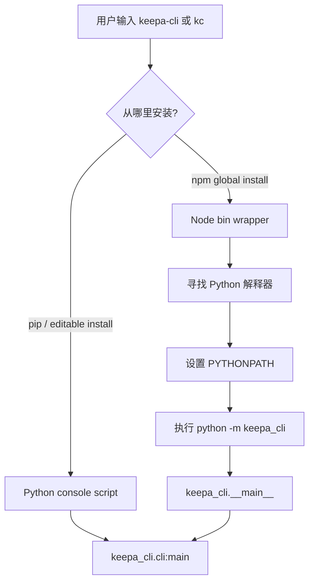

这一页只回答一个问题：**为什么这个项目既能作为 Python 包安装，也能作为 npm 包安装，而且两个入口最终表现一致**。对初学者来说，最重要的结论是：无论你通过 `pip install` 还是 `npm install -g @cunuo/keepa-cli` 安装，最终都会得到同名的 `keepa-cli` 和短命令 `kc`；差别只在于**入口是谁负责暴露**，而不是 CLI 业务逻辑写了两份。Sources: [pyproject.toml](pyproject.toml#L5-L50) [package.json](package.json#L1-L45)

从仓库结构看，这个双入口设计非常清晰：Python 生态负责真正的 CLI 模块，Node 生态只提供一层很薄的启动包装器。也就是说，**功能核心在 `keepa_cli/`，npm 只是把用户带到 Python 模块入口**，并不重新实现命令解析、配置读取或网络访问。Sources: [pyproject.toml](pyproject.toml#L40-L50) [bin/keepa-cli.js](bin/keepa-cli.js#L1-L45) [bin/kc.js](bin/kc.js#L1-L10) [keepa_cli/__main__.py](keepa_cli/__main__.py#L1-L15)

## 先看结论：两种安装方式分别适合谁

如果你本来就在 Python 环境里开发、测试或本地调试，这个项目原生支持 Python 安装，要求 **Python 3.11+**，并直接暴露 `keepa-cli` 与 `kc` 两个 console script。Sources: [pyproject.toml](pyproject.toml#L5-L10) [pyproject.toml](pyproject.toml#L40-L43)

如果你更习惯 Node 全局命令，或者希望像安装普通 npm CLI 一样安装它，那么可以使用 npm 包。这个 npm 包要求 **Node 18+**，但它并不是独立实现的 Node CLI；它会在运行时寻找本机 Python，再执行 `python -m keepa_cli`。Sources: [package.json](package.json#L21-L29) [bin/keepa-cli.js](bin/keepa-cli.js#L12-L27)

| 安装方式 | 用户看到的命令 | 真正执行者 | 适合场景 | 关键前提 |
|---|---|---|---|---|
| Python 包 | `keepa-cli` / `kc` | `keepa_cli.cli:main` | Python 开发、本地调试、虚拟环境使用 | Python 3.11+ |
| npm 包装器 | `keepa-cli` / `kc` | Node wrapper → `python -m keepa_cli` | 喜欢 npm 全局命令、跨生态分发 | Node 18+ 且机器上有 Python |

这个表格背后的重点是：**命令名相同，核心逻辑相同，入口链路不同**。因此文档、测试和后续使用体验都能尽量保持一致，不会出现“Python 版一个行为、npm 版另一个行为”的双份维护问题。Sources: [pyproject.toml](pyproject.toml#L40-L43) [package.json](package.json#L7-L10) [tests/test_npm_wrapper.py](tests/test_npm_wrapper.py#L21-L49)

## 架构总览：npm 不是第二套实现，而是转发层

下面这张图可以帮助你快速理解“双入口”真正的执行关系。Sources: [pyproject.toml](pyproject.toml#L40-L43) [package.json](package.json#L7-L10) [bin/keepa-cli.js](bin/keepa-cli.js#L12-L27) [keepa_cli/__main__.py](keepa_cli/__main__.py#L1-L15)



这个执行链说明了一个关键架构决策：**Node 入口只是“找到 Python 并转发”，Python 才是最终权威入口**。因此 npm 层不承担业务逻辑，也不读取 Keepa API key，更不直接访问网络；这让发布面更简单，也降低了两个生态实现漂移的风险。Sources: [bin/keepa-cli.js](bin/keepa-cli.js#L3-L7) [bin/keepa-cli.js](bin/keepa-cli.js#L19-L27) [keepa_cli/__main__.py](keepa_cli/__main__.py#L1-L15)

## Python 安装入口是怎样暴露出来的

在 Python 侧，`pyproject.toml` 明确声明了包名是 `keepa-cli`，要求 Python 版本为 `>=3.11`，并在 `[project.scripts]` 下把 `keepa-cli` 和 `kc` 都指向同一个函数 `keepa_cli.cli:main`。这意味着 Python 安装完成后，两个命令本质上是同一个程序的两个名字。Sources: [pyproject.toml](pyproject.toml#L5-L13) [pyproject.toml](pyproject.toml#L40-L43)

同时，仓库还提供了 `keepa_cli/__main__.py`，支持 `python -m keepa_cli` 这种模块方式启动。这个文件本身不包含业务逻辑，只是把执行权转发给 `keepa_cli.cli.main`。这让项目即使在没有生成 console script 的情况下，也能通过模块形式验证安装是否正常。Sources: [keepa_cli/__main__.py](keepa_cli/__main__.py#L1-L15)

对初学者来说，可以把这理解成两层保险：**一层是安装后可直接运行的命令入口，一层是始终可用的 Python 模块入口**。后者也是 npm 包装器最终调用的目标，因此整个系统的真实“单一入口内核”仍然是 Python 模块。Sources: [pyproject.toml](pyproject.toml#L40-L43) [keepa_cli/__main__.py](keepa_cli/__main__.py#L3-L15)

## npm 包装器到底做了什么

npm 侧的 `package.json` 也暴露了两个命令：`keepa-cli` 对应 `bin/keepa-cli.js`，`kc` 对应 `bin/kc.js`。这与 Python 侧的命令命名保持完全对齐，所以用户在两种安装方式下学到的命令名称是一致的。Sources: [package.json](package.json#L1-L10)

真正的关键在 `bin/keepa-cli.js`。这个脚本首先确定包根目录，然后选择 Python 解释器候选列表：如果环境变量 `KEEPA_CLI_PYTHON` 已设置，就优先使用它；否则在 Windows 上按 `python`、`py`、`python3` 的顺序尝试，在其他平台上按 `python3`、`python` 尝试。Sources: [bin/keepa-cli.js](bin/keepa-cli.js#L12-L18)

找到候选解释器后，包装器会构造执行环境：它设置 `PYTHONUTF8=1`，并把当前包根目录加入 `PYTHONPATH`，然后执行 `-m keepa_cli`。如果候选是 Windows 常见的 `py` 启动器，它会附带 `-3` 参数，明确请求 Python 3。Sources: [bin/keepa-cli.js](bin/keepa-cli.js#L19-L27)

如果某个候选解释器能正常启动，Node 进程会直接继承它的退出码；如果所有候选都不存在，就输出错误信息 `keepa-cli requires Python 3.11+ on PATH` 并以状态码 `127` 退出。也就是说，**npm 安装成功不代表你可以完全脱离 Python 运行**；npm 只是分发命令入口，运行时仍依赖 Python。Sources: [bin/keepa-cli.js](bin/keepa-cli.js#L29-L44)

而 `bin/kc.js` 更薄，它只是一句 `require("./keepa-cli.js")`。这表明短命令 `kc` 并不是单独实现的第二个包装器，而是**直接复用 `keepa-cli.js` 的全部转发逻辑**。Sources: [bin/kc.js](bin/kc.js#L1-L10)

## 两种入口如何保持“等价”

这个项目没有只在文档里声称“双入口等价”，而是通过测试来验证。`tests/test_npm_wrapper.py` 会在临时配置环境中分别运行 `node bin/keepa-cli.js --json doctor` 和 `node bin/kc.js --json doctor`，并断言它们都返回成功、且命令名是 `doctor`。Sources: [tests/test_npm_wrapper.py](tests/test_npm_wrapper.py#L21-L49)

同样，`tests/test_cli.py` 会通过 `python -m keepa_cli --json doctor` 验证 Python 模块入口能返回可机器读取的 JSON 输出。这说明 Python 模块入口与 npm 包装器入口最终都能抵达同一个 CLI 能力面。Sources: [tests/test_cli.py](tests/test_cli.py#L27-L45)

更进一步，`scripts/install_verify.py` 会在安装验证阶段同时检查三件事：Python 模块入口、`node bin/keepa-cli.js`、以及 `node bin/kc.js`。换句话说，**双入口不是“顺便支持”，而是发布验证的一部分**。Sources: [scripts/install_verify.py](scripts/install_verify.py#L27-L60)

## 你实际该怎么安装

对于本地开发，README 给出的最直接路径是使用虚拟环境中的 Python 做 editable install，然后直接运行 `kc` 验证。这种方式最适合你正在阅读源码、跑测试或本地迭代功能的时候。Sources: [README.zh-CN.md](README.zh-CN.md#L25-L33)

```powershell
.\.venv\Scripts\python.exe -m pip install -e .
.\.venv\Scripts\kc.exe --json doctor
```

如果你只是想把它当成一个全局 CLI 来用，README 给出的 npm 路径是安装 `@cunuo/keepa-cli`，然后运行 `kc --json doctor`。但要记住，npm 包装器运行时仍然需要本机能找到 Python。Sources: [README.zh-CN.md](README.zh-CN.md#L34-L39) [bin/keepa-cli.js](bin/keepa-cli.js#L13-L18)

```powershell
npm install -g @cunuo/keepa-cli
kc --json doctor
```

如果你的 Python 不在默认 PATH 上，README 还给出了明确做法：设置 `KEEPA_CLI_PYTHON` 指向你想使用的解释器。这个变量会覆盖包装器默认的候选列表，是 npm 安装模式下最直接的“桥接开关”。Sources: [README.zh-CN.md](README.zh-CN.md#L41-L46) [bin/keepa-cli.js](bin/keepa-cli.js#L13-L16)

```powershell
$env:KEEPA_CLI_PYTHON="D:\github\Keepa-cli\.venv\Scripts\python.exe"
kc --json doctor
```

## 初学者可以怎么判断该选哪一种

如果你已经有 Python 虚拟环境，或者你准备在这个仓库里做本地开发，那么优先选 **Python 安装**。因为它最接近源码真实入口，也最符合测试与开发脚本的验证路径。Sources: [pyproject.toml](pyproject.toml#L40-L43) [tests/test_cli.py](tests/test_cli.py#L27-L45) [README.zh-CN.md](README.zh-CN.md#L27-L33)

如果你更在意“全局命令体验”，或者团队里习惯通过 npm 发布和安装 CLI，那么可以选 **npm 安装**。但请牢记：这里的 npm 不是替代 Python，而是包装 Python；因此最稳妥的用法通常仍然是让它指向一个明确的 Python 解释器。Sources: [package.json](package.json#L7-L23) [bin/keepa-cli.js](bin/keepa-cli.js#L13-L27) [README.zh-CN.md](README.zh-CN.md#L41-L46)

| 你的情况 | 更推荐的安装方式 | 原因 |
|---|---|---|
| 正在阅读源码、跑测试、做贡献 | Python 包 | 直接进入真实 CLI 入口，最贴近开发流程 |
| 想像普通全局命令一样使用 | npm 包装器 | 命令安装体验更像 Node CLI |
| 机器上有多个 Python 版本 | npm 包装器 + `KEEPA_CLI_PYTHON` | 可显式绑定解释器，避免找错 |
| 不确定安装是否成功 | 任一方式后执行 `kc --json doctor` | README 与测试都用它做最小验证 |

这个选择表的核心不是“哪个更高级”，而是**哪个更适合你的环境和预期**。因为两条路径最终都会落到同一个 Python CLI，所以学习成本不会因为安装方式不同而分裂。Sources: [README.zh-CN.md](README.zh-CN.md#L25-L46) [tests/test_npm_wrapper.py](tests/test_npm_wrapper.py#L21-L49)

## 一个最小的项目结构视图

下面这段结构只保留与“双入口安装方式”直接相关的部分，帮助你把文件职责和安装路径对上。Sources: [pyproject.toml](pyproject.toml#L40-L50) [package.json](package.json#L7-L20) [bin/keepa-cli.js](bin/keepa-cli.js#L1-L45) [bin/kc.js](bin/kc.js#L1-L10) [keepa_cli/__main__.py](keepa_cli/__main__.py#L1-L15)

```text
.
├── pyproject.toml          # Python 包元数据，暴露 keepa-cli / kc
├── package.json            # npm 包元数据，暴露 keepa-cli / kc
├── bin
│   ├── keepa-cli.js        # Node 包装器：寻找 Python 并执行 -m keepa_cli
│   └── kc.js               # 复用 keepa-cli.js 的短命令入口
└── keepa_cli
    └── __main__.py         # Python 模块入口：转发到真实 CLI main
```

这个结构说明项目并没有把 Python 版和 Node 版拆成两套业务目录，而是刻意把 Node 端压缩成很小的 `bin/` 层。对维护者和初学者都更友好，因为你只需要记住：**功能在 `keepa_cli/`，入口在 `pyproject.toml` 和 `package.json` 暴露**。Sources: [pyproject.toml](pyproject.toml#L40-L50) [package.json](package.json#L7-L20)

## 常见安装疑问

| 问题 | 可验证结论 | 依据 |
|---|---|---|
| npm 安装后能否完全不装 Python？ | 不能，运行时仍要找到 Python | `bin/keepa-cli.js` 会查找 Python 并执行 `-m keepa_cli` |
| `keepa-cli` 和 `kc` 是两套不同程序吗？ | 不是，它们是同一能力面的两个名字 | Python 和 npm 两侧都把两个命令映射到同一逻辑链路 |
| npm 端会自己处理 Keepa 认证或请求吗？ | 不会，包装器只做转发 | 文件注释明确写了不读 API key、不访问网络 |
| 如何快速确认安装成功？ | 执行 `kc --json doctor` | README、测试、安装验证脚本都采用这个最小检查 |

这类问题的答案都能从代码直接验证，而不是靠猜测。尤其是“npm 是否独立实现”这一点，阅读 `bin/keepa-cli.js` 后会非常明确：它只是一个**解释器发现 + 模块转发**脚本。Sources: [bin/keepa-cli.js](bin/keepa-cli.js#L3-L7) [bin/keepa-cli.js](bin/keepa-cli.js#L12-L44) [README.zh-CN.md](README.zh-CN.md#L34-L46) [scripts/install_verify.py](scripts/install_verify.py#L38-L52)

## 推荐的阅读下一步

如果你已经理解了“双入口安装方式”，下一步最自然的是继续看 **入口之间怎么衔接到本地开发验证**，也就是 [模块入口、命令入口与本地开发验证](4-mo-kuai-ru-kou-ming-ling-ru-kou-yu-ben-di-kai-fa-yan-zheng)。Sources: [keepa_cli/__main__.py](keepa_cli/__main__.py#L1-L15) [scripts/install_verify.py](scripts/install_verify.py#L27-L60)

如果你接下来准备真正运行命令，那么应继续阅读 **首次配置链路**，尤其是 [Keepa Token 配置、环境变量优先级与本地配置文件位置](5-keepa-token-pei-zhi-huan-jing-bian-liang-you-xian-ji-yu-ben-di-pei-zhi-wen-jian-wei-zhi) 和 [使用 doctor 命令检查认证、离线能力与运行环境](7-shi-yong-doctor-ming-ling-jian-cha-ren-zheng-chi-xian-neng-li-yu-yun-xing-huan-jing)。Sources: [README.zh-CN.md](README.zh-CN.md#L48-L75)

如果你的目标是先体验而不消耗真实 Token，那么安装完成后也可以直接跳到 [fixture 与 dry-run：零成本试用真实工作流形状](8-fixture-yu-dry-run-ling-cheng-ben-shi-yong-zhen-shi-gong-zuo-liu-xing-zhuang)。这能把“安装成功”过渡到“第一次安全执行命令”。Sources: [README.zh-CN.md](README.zh-CN.md#L97-L115)