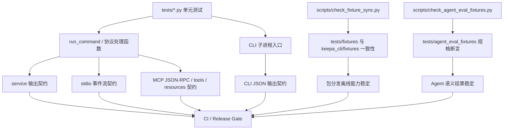
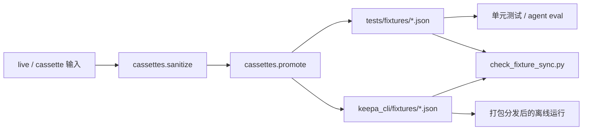
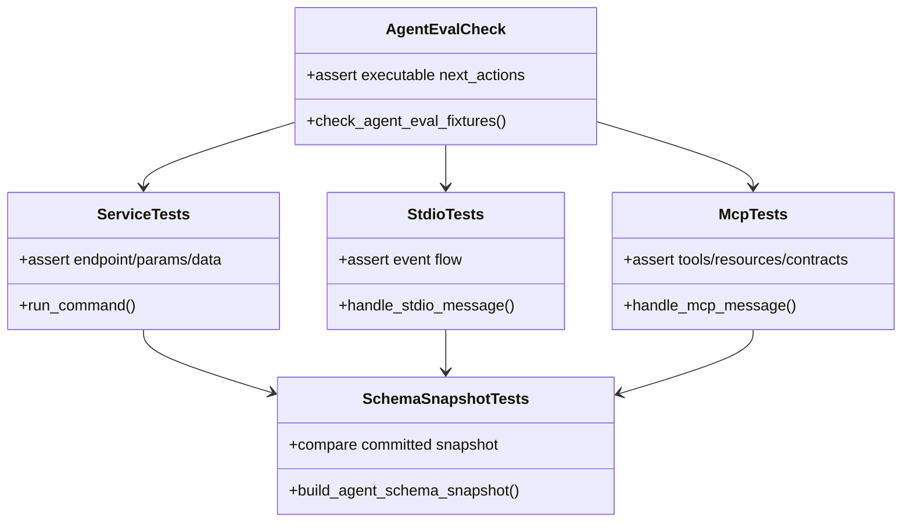

这一页位于“工程质量与发布体系”中的当前位置 **[测试版图：单元测试、fixture 双份同步与协议契约覆盖](30-ce-shi-ban-tu-dan-yuan-ce-shi-fixture-shuang-fen-tong-bu-yu-xie-yi-qi-yue-fu-gai)**，目标不是讲某一个命令怎么用，而是解释仓库如何把 **离线可回归**、**包内可分发**、**Agent 协议不漂移** 这三件事绑定为同一套测试策略。仓库的测试设计明显围绕 `unittest discover` 展开，再由独立脚本补上 fixture 同步检查与 Agent evaluation 规格检查，最后被 CI 与 release gate 同时调用，形成“单元测试 + 目录一致性 + 协议契约”三层门禁。Sources: [ci.yml](.github/workflows/ci.yml#L12-L36) [release_gate.py](scripts/release_gate.py#L31-L61) [pyproject.toml](pyproject.toml#L40-L50)

## 测试版图的核心判断：不是只测函数，而是测“可分发的离线协议系统”

从第一原则看，这个项目测试的对象不是单纯的 Python 业务函数，而是一个同时暴露 **CLI、service、stdio、MCP** 的 Agent-first 工具链。因此测试并未停在 `run_command()` 的返回值上，而是继续冻结 CLI 子进程输出、stdio 事件流、MCP JSON-RPC 响应，以及包内 fixture 是否与测试 fixture 完全一致。换言之，测试关注的是“接口形状是否稳定可复用”，而不只是“内部逻辑有没有跑通”。Sources: [test_cli.py](tests/test_cli.py#L17-L45) [test_stdio.py](tests/test_stdio.py#L15-L37) [test_mcp.py](tests/test_mcp.py#L18-L46) [test_project_tools.py](tests/test_project_tools.py#L19-L43)

上图的重点是：**测试入口很多，但验证目标收敛**。普通单元测试负责覆盖命令与协议处理函数；`check_fixture_sync.py` 保证测试数据与包内数据不漂移；`check_agent_eval_fixtures.py` 把若干高价值 Agent 任务写成 JSON 规格并离线重放；CI 与 release gate 再把这些门禁串起来，确保本地、仓库、分发产物遵守同一份质量约束。Sources: [check_fixture_sync.py](scripts/check_fixture_sync.py#L23-L63) [check_agent_eval_fixtures.py](scripts/check_agent_eval_fixtures.py#L83-L157) [ci.yml](.github/workflows/ci.yml#L24-L36) [release_gate.py](scripts/release_gate.py#L46-L60)

## 三层覆盖模型：业务命令、测试数据、协议契约

这个测试版图可以概括成三层。**第一层是业务命令层**，用 `tests/test_service_commands.py`、`tests/test_official_api_coverage.py`、`tests/test_cli.py` 之类的文件验证请求构造、dry-run、fixture 读取、输出字段和高成本门禁。**第二层是测试数据层**，用 `scripts/check_fixture_sync.py` 与对应测试确保 `tests/fixtures` 和 `keepa_cli/fixtures` 双份内容逐字节一致，使“测试能过”和“打包后能离线运行”不会分裂。**第三层是协议契约层**，用 `tests/test_stdio.py`、`tests/test_mcp.py`、`tests/test_schema_snapshot.py` 冻结 stdio、MCP 与 schema snapshot 的结构形状，阻止 Agent 集成面悄悄漂移。Sources: [test_service_commands.py](tests/test_service_commands.py#L18-L40) [test_official_api_coverage.py](tests/test_official_api_coverage.py#L24-L46) [test_cli.py](tests/test_cli.py#L107-L126) [check_fixture_sync.py](scripts/check_fixture_sync.py#L27-L59) [test_stdio.py](tests/test_stdio.py#L15-L37) [test_mcp.py](tests/test_mcp.py#L18-L46) [test_schema_snapshot.py](tests/test_schema_snapshot.py#L48-L75)

| 覆盖层 | 代表文件 | 主要验证对象 | 失败时说明什么 |
|---|---|---|---|
| 业务命令层 | `tests/test_service_commands.py`、`tests/test_official_api_coverage.py`、`tests/test_cli.py` | 命令参数、请求 endpoint、dry-run、fixture、CLI 输出 | 功能行为变了或命令面破坏了 |
| 测试数据层 | `scripts/check_fixture_sync.py`、`tests/test_project_tools.py`、`tests/test_agent_eval_fixtures.py` | 双份 fixture 是否一致、promote 后是否同步 | 包内离线数据与测试数据发生漂移 |
| 协议契约层 | `tests/test_stdio.py`、`tests/test_mcp.py`、`tests/test_schema_snapshot.py` | stdio 事件、MCP 工具/资源、schema snapshot | Agent 接口结构或协议语义发生变化 |

Sources: [test_service_commands.py](tests/test_service_commands.py#L18-L58) [test_official_api_coverage.py](tests/test_official_api_coverage.py#L120-L199) [test_cli.py](tests/test_cli.py#L38-L77) [test_project_tools.py](tests/test_project_tools.py#L23-L43) [test_agent_eval_fixtures.py](tests/test_agent_eval_fixtures.py#L33-L45) [test_stdio.py](tests/test_stdio.py#L16-L37) [test_mcp.py](tests/test_mcp.py#L28-L45) [test_schema_snapshot.py](tests/test_schema_snapshot.py#L49-L75)

## 单元测试如何围绕 service 内核展开

业务测试的中心仍然是 `run_command()`。例如 `tests/test_service_commands.py` 用 fixture 驱动 `products.get`，同时断言 endpoint、参数映射和 token 预算；同一文件也验证 full preset、输出落盘、agent view、chunks 等复杂返回形状。这说明测试并不是只看 `ok == True`，而是把 **请求描述、预算解释、数据裁剪方式** 都视为稳定 API 的一部分。Sources: [test_service_commands.py](tests/test_service_commands.py#L19-L57) [test_service_commands.py](tests/test_service_commands.py#L96-L176) [test_service_commands.py](tests/test_service_commands.py#L177-L200)

`tests/test_official_api_coverage.py` 则承担“补齐官方链路”的角色。这里专门冻结 `/token`、`/graphimage`、`/lightningdeal`、`/tracking` 等路径的请求与保护行为，例如 graph image 的 live 模式必须要求输出文件路径、tracking.add 在没有 `dry_run` 或 `yes` 时返回 `confirmation_required`。这类测试不是重复 service 测试，而是在高风险或较晚加入的链路上增加 **显式协议样板**，避免新增能力只在 happy path 下可用。Sources: [test_official_api_coverage.py](tests/test_official_api_coverage.py#L33-L45) [test_official_api_coverage.py](tests/test_official_api_coverage.py#L47-L85) [test_official_api_coverage.py](tests/test_official_api_coverage.py#L120-L199)

CLI 层没有重新实现业务，而是通过子进程回归命令入口本身。`tests/test_cli.py` 用 `python -m keepa_cli` 调用 `--json doctor`、`domains list`、`config` 命令和实际业务命令，验证返回码、JSON envelope、脱敏输出与参数透传。这样做的价值在于：即使 `run_command()` 本身没坏，若 argparse、模块入口或标准输出格式发生回归，CLI 测试仍会第一时间报错。Sources: [test_cli.py](tests/test_cli.py#L27-L45) [test_cli.py](tests/test_cli.py#L46-L77) [test_cli.py](tests/test_cli.py#L107-L165)

## fixture 双份同步：测试目录与包目录为什么必须同时存在

仓库同时维护 `tests/fixtures` 与 `keepa_cli/fixtures` 两份 JSON fixture，这不是冗余，而是有明确职责分离：前者供测试代码直接引用，后者通过 `pyproject.toml` 的 package data 声明打进分发包，保证安装后的 CLI 仍能使用这些离线样本。若只保留测试目录，测试会通过，但安装产物可能失去离线能力；若只保留包目录，测试组织与临时校验会变得不清晰。Sources: [pyproject.toml](pyproject.toml#L44-L50) [test_agent_eval_fixtures.py](tests/test_agent_eval_fixtures.py#L17-L18) [test_project_tools.py](tests/test_project_tools.py#L82-L116)

`scripts/check_fixture_sync.py` 把这种“双份存在”的约束硬编码为门禁：它枚举两个目录中的所有 `*.json`，分别找出 `missing_in_package`、`missing_in_tests` 与 `mismatched`，只有三者都为空时才返回成功。这里的比较是 **按文件名集合与字节内容** 执行，而不是按 JSON 语义归一化比较，因此它保护的是“可分发样本的精确副本”，不是“逻辑上差不多”。Sources: [check_fixture_sync.py](scripts/check_fixture_sync.py#L15-L40) [check_fixture_sync.py](scripts/check_fixture_sync.py#L43-L63)

`tests/test_project_tools.py` 进一步用临时目录构造出“左边缺文件、右边缺文件、同名内容不一致”三种场景，验证同步检查脚本能返回精确分类；同一文件也测试 `cassettes.promote` 会把清洗后的输入同时写入 `tests/fixtures` 与 `keepa_cli/fixtures`，并保证两边内容一致。这意味着 fixture 同步不只是被动 lint，还已经被吸收到样本晋升流程里。Sources: [test_project_tools.py](tests/test_project_tools.py#L23-L43) [test_project_tools.py](tests/test_project_tools.py#L82-L116)

这个流程图说明了 fixture 不是静态资源，而是从样本采集、脱敏、晋升、双写、验证一路闭环。尤其是 `cassettes.promote` 的测试明确断言生成的测试 fixture 与包 fixture 文本完全一致，因此“同步”不是维护约定，而是被工具与测试共同实施的发布约束。Sources: [test_project_tools.py](tests/test_project_tools.py#L44-L80) [test_project_tools.py](tests/test_project_tools.py#L82-L116) [check_fixture_sync.py](scripts/check_fixture_sync.py#L27-L59)

## Agent evaluation fixtures：把高价值任务写成可执行规格

与普通 fixture 测试相比，`tests/agent_eval_fixtures` 目录代表更高一层抽象：这里存放的不是原始 API 返回，而是 **任务规格**。`scripts/check_agent_eval_fixtures.py` 会读取这些 JSON 规格，根据 `kind` 决定是走 `service`、`mcp` 还是 `session` 执行路径，再对返回 payload 应用断言规则。也就是说，这一层测试验证的是“某类 Agent 任务能否稳定产出可用结果”，而不是“某个字段值是否碰巧存在”。Sources: [check_agent_eval_fixtures.py](scripts/check_agent_eval_fixtures.py#L83-L114) [check_agent_eval_fixtures.py](scripts/check_agent_eval_fixtures.py#L131-L157)

断言模型本身也很有代表性。脚本支持 `equals`、`min`、`contains`、`length`、`length_min`、`contains_any`、`not_contains` 等规则，还支持 `next_actions_executable` 这种带协议意识的检查：当返回值里出现下一步 action 时，脚本会验证该 tool 是否存在、参数是否合法、或至少能被 service 识别而不是 `unsupported_command`。这使 Agent eval 不只检查内容“像不像”，还检查结果“能不能继续驱动后续自动化”。Sources: [check_agent_eval_fixtures.py](scripts/check_agent_eval_fixtures.py#L39-L80)

`tests/test_agent_eval_fixtures.py` 对这套机制做了两层确认：第一，直接调用 `check_agent_eval_fixtures()`，要求至少检查到若干规格；第二，单独断言两个关键 Agent 评测产品 fixture 在 `tests/fixtures` 与 `keepa_cli/fixtures` 之间同步。可以看出，Agent evaluation 并没有脱离 fixture 双份策略，而是建立在其上。Sources: [test_agent_eval_fixtures.py](tests/test_agent_eval_fixtures.py#L33-L45)

| 机制 | 普通 fixture 单测 | Agent evaluation fixture |
|---|---|---|
| 输入 | 命令参数 + 指定 fixture | JSON 规格文件 |
| 执行入口 | `run_command()` 或协议函数 | `service` / `mcp` / `session` 多态执行 |
| 断言粒度 | 具体字段、endpoint、预算等 | 结果语义、长度、包含关系、next action 可执行性 |
| 目标 | 功能正确 | Agent 任务结果稳定且可继续操作 |

Sources: [test_service_commands.py](tests/test_service_commands.py#L19-L57) [check_agent_eval_fixtures.py](scripts/check_agent_eval_fixtures.py#L39-L80) [check_agent_eval_fixtures.py](scripts/check_agent_eval_fixtures.py#L90-L114)

## 协议契约覆盖：stdio、MCP 与 schema snapshot 三路冻结

stdio 契约由 `tests/test_stdio.py` 负责。测试不是启动真实子进程，而是直接调用 `handle_stdio_message()`，断言事件流一定包含 `started`、`response`、`done`，并验证高成本请求会在 response 里返回 `confirmation_required`。更重要的是，这里还测试 `AgentSession` 复用后第二次同请求会命中 cache，并在 `budget_ledger` 里体现 `cache_hits`。因此 stdio 覆盖的不只是传输格式，也包含 **长会话下的可审计行为**。Sources: [test_stdio.py](tests/test_stdio.py#L15-L37) [test_stdio.py](tests/test_stdio.py#L39-L76) [test_stdio.py](tests/test_stdio.py#L117-L136)

MCP 契约由 `tests/test_mcp.py` 冻结。文件覆盖 `initialize`、`tools/list`、具名 toolset、`tools/call` 的 fixture 路径，以及未知工具的 JSON-RPC 错误模式。测试还会断言 tool 定义里包含 `inputSchema`、`outputSchema` 和 `x-keepa.service_command`，说明 MCP 面向外部 Agent 的元数据也被纳入测试稳定面，而不是只检查调用结果。Sources: [test_mcp.py](tests/test_mcp.py#L18-L46) [test_mcp.py](tests/test_mcp.py#L47-L78) [test_mcp.py](tests/test_mcp.py#L79-L195)

schema snapshot 则是更强的“总契约冻结”。`tests/test_schema_snapshot.py` 会采集 capabilities、doctor、多个 service 命令、MCP resources/list、MCP chunk 模式以及 stdio products.get 的输出，再交给 `build_agent_schema_snapshot()` 生成结构快照，最后与提交到仓库的 `tests/snapshots/agent_schema_snapshot.json` 做整体比较。这里冻结的是 **字段形状和协议面集合**，不是业务值本身，因此非常适合捕捉“不经意新增字段、删字段、重命名字段”的兼容性回归。Sources: [test_schema_snapshot.py](tests/test_schema_snapshot.py#L48-L75) [test_schema_snapshot.py](tests/test_schema_snapshot.py#L85-L197) [test_schema_snapshot.py](tests/test_schema_snapshot.py#L198-L225)

这个类图表达的不是源码继承关系，而是测试层面的依赖关系：schema snapshot 聚合多路输出形成总契约，Agent eval 再在其上增加任务语义验证。两者结合后，仓库同时拥有 **结构冻结** 与 **任务可用性冻结** 两种不同强度的协议测试。Sources: [test_schema_snapshot.py](tests/test_schema_snapshot.py#L48-L75) [test_schema_snapshot.py](tests/test_schema_snapshot.py#L198-L225) [check_agent_eval_fixtures.py](scripts/check_agent_eval_fixtures.py#L131-L157)

## 会话、缓存与请求描述也被纳入测试稳定面

值得注意的是，这套测试并未把“辅助元数据”当成非关键实现细节。`tests/test_agent_session.py` 验证 cache key 生成对参数顺序稳定、忽略运行时 flag，并验证重复执行不会重复累计 token；`tests/test_cache.py` 则检查 cache provenance、SQLite cache 的 stats / clear / prune / inspect 行为，以及 cache key 解释结果中的密钥脱敏；`tests/test_request_spec.py` 还冻结了 dry-run 请求描述里的 `method`、`endpoint`、`dry_run` 与 `params_redacted`。这说明项目把 **可解释性元数据** 也视为面向 Agent 和调试者的正式契约。Sources: [test_agent_session.py](tests/test_agent_session.py#L13-L45) [test_agent_session.py](tests/test_agent_session.py#L64-L87) [test_cache.py](tests/test_cache.py#L21-L49) [test_cache.py](tests/test_cache.py#L164-L193) [test_request_spec.py](tests/test_request_spec.py#L13-L28)

这种做法的工程意义很直接：如果一个 CLI 面向 Agent 集成，返回值中的 cache provenance、预算账本、确认门禁、请求 redaction 其实与业务数据同样重要。测试把这些信息流都固定下来后，调用方才能稳定依赖“为什么命中缓存”“为什么被阻止”“请求将发往哪个 endpoint”这类解释性字段，而不必反复阅读源码。Sources: [test_stdio.py](tests/test_stdio.py#L25-L37) [test_agent_session.py](tests/test_agent_session.py#L21-L45) [test_cache.py](tests/test_cache.py#L36-L62) [test_request_spec.py](tests/test_request_spec.py#L15-L28)

## CI 与本地门禁如何把测试版图收束成一个质量入口

在自动化层面，GitHub Actions 的 CI 先跑 `python -m unittest discover -s tests -v`，再单独运行 `python scripts/check_fixture_sync.py`，最后执行 Node wrapper 的 smoke。这里的含义是：**unittest 负责主体验证，fixture sync 作为独立门禁提升可见性**，而 npm wrapper smoke 则确保跨入口的一致性。Sources: [ci.yml](.github/workflows/ci.yml#L12-L36)

本地 `scripts/release_gate.py` 比 CI 更完整。它在编译检查和 unittest 之后，继续串联 `check_live_cache_options.py`、`check_fixture_sync.py`、`check_agent_eval_fixtures.py`、安装验证脚本，以及 Python / Node 双入口的 doctor smoke；对应的 `tests/test_release_ecosystem.py` 还专门断言 release gate 源码确实包含 `scripts/check_agent_eval_fixtures.py`。因此 Agent eval 并不是“可选附加测试”，而是被提升到了发布前必须通过的正式门禁。Sources: [release_gate.py](scripts/release_gate.py#L31-L60) [test_release_ecosystem.py](tests/test_release_ecosystem.py#L40-L50)

| 执行场景 | 运行内容 | 关注点 |
|---|---|---|
| CI | unittest、fixture sync、Node wrapper smoke | 快速跨平台回归、分发入口不坏 |
| release gate | compileall、unittest、live cache lint、fixture sync、Agent eval、install verify、双入口 smoke、可选 npm pack dry-run | 发布前全链路自检 |

Sources: [ci.yml](.github/workflows/ci.yml#L24-L36) [release_gate.py](scripts/release_gate.py#L46-L60)

## 如何阅读这套测试代码

如果你是第一次读这部分代码，最有效的顺序不是从最长的测试文件开始，而是先看 `tests/test_project_tools.py` 和 `scripts/check_fixture_sync.py` 理解“双份 fixture 为什么存在”，再看 `tests/test_agent_eval_fixtures.py` 与 `scripts/check_agent_eval_fixtures.py` 理解“任务规格化测试”怎么工作，最后再读 `tests/test_stdio.py`、`tests/test_mcp.py`、`tests/test_schema_snapshot.py`，你会更容易把单元测试、协议测试和分发测试视为一个整体。Sources: [test_project_tools.py](tests/test_project_tools.py#L19-L43) [check_fixture_sync.py](scripts/check_fixture_sync.py#L27-L59) [test_agent_eval_fixtures.py](tests/test_agent_eval_fixtures.py#L33-L45) [check_agent_eval_fixtures.py](scripts/check_agent_eval_fixtures.py#L131-L157) [test_stdio.py](tests/test_stdio.py#L15-L37) [test_mcp.py](tests/test_mcp.py#L18-L46) [test_schema_snapshot.py](tests/test_schema_snapshot.py#L49-L75)

读完这一页后，下一步最自然的是进入 **[发布门禁：跨 Python/Node 生态的安装验证、smoke 与 release check](31-fa-bu-men-jin-kua-python-node-sheng-tai-de-an-zhuang-yan-zheng-smoke-yu-release-check)**，因为测试版图解释了“测什么”，而下一页会解释“这些检查如何被组织成真正的发布流程”。如果你更关心协议测试背后的接口面，则可以回看 **[MCP 工具注册表：强类型工具面、toolset 分组与命令映射](22-mcp-gong-ju-zhu-ce-biao-qiang-lei-xing-gong-ju-mian-toolset-fen-zu-yu-ming-ling-ying-she)** 与 **[长会话能力：stdio/MCP 会话、资源分块与上下文控制](24-chang-hui-hua-neng-li-stdio-mcp-hui-hua-zi-yuan-fen-kuai-yu-shang-xia-wen-kong-zhi)**。Sources: [ci.yml](.github/workflows/ci.yml#L24-L36) [release_gate.py](scripts/release_gate.py#L46-L60) [test_mcp.py](tests/test_mcp.py#L28-L78) [test_stdio.py](tests/test_stdio.py#L117-L136)