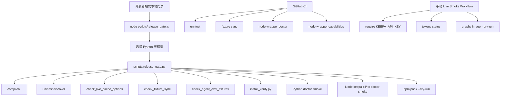
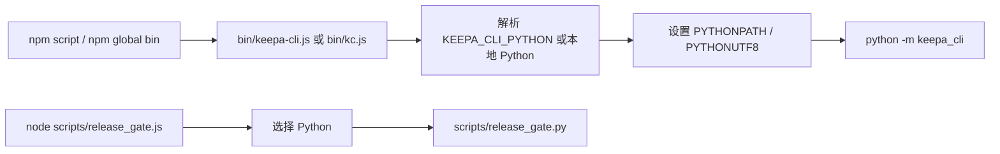

这一页只解释 **Keepa CLI 在发布前如何把 Python 包、npm 包装器、离线 fixture、命令入口和最小 smoke 串成一个统一门禁**。核心不是“怎么使用业务命令”，而是“一个改动在进入发布面前，必须同时证明：Python 入口可运行、Node 包装器不失真、包内容完整、离线契约稳定、默认 CI 不触网、真实链路单独隔离”。Sources: [release_gate.py](scripts/release_gate.py#L31-L61) [install_verify.py](scripts/install_verify.py#L27-L60) [ci.yml](.github/workflows/ci.yml#L1-L36) [live-keepa-smoke.yml](.github/workflows/live-keepa-smoke.yml#L1-L35)

## 先看总结构：发布门禁验证的不是“功能点”，而是“可发布形态”

这个仓库的发布门禁围绕三种可发布形态展开：**Python 包形态**由 `pyproject.toml` 中的 `project.scripts` 和 `python -m keepa_cli` 支撑，**npm 形态**由 `package.json` 的 `bin` 与 `scripts` 支撑，**远程回归形态**则由 GitHub Actions 中的无 secret CI 与手动 live smoke 分离承担。因此，发布检查不是单一测试命令，而是一组跨生态一致性验证。Sources: [pyproject.toml](pyproject.toml#L5-L13) [pyproject.toml](pyproject.toml#L40-L50) [package.json](package.json#L7-L29) [ci.yml](.github/workflows/ci.yml#L1-L36) [live-keepa-smoke.yml](.github/workflows/live-keepa-smoke.yml#L1-L35)

下面这张图展示的是**本地 release gate、npm 包装层、CI smoke、手动 live smoke** 之间的关系。它的重点在于：默认路径始终走离线或无 secret 验证，而真实 Keepa API 只进入单独工作流。Sources: [release_gate.py](scripts/release_gate.py#L42-L60) [release_gate.js](scripts/release_gate.js#L13-L52) [ci.yml](.github/workflows/ci.yml#L24-L35) [live-keepa-smoke.yml](.github/workflows/live-keepa-smoke.yml#L18-L35)



## 本地门禁的主控器：`release_gate.py` 是发布前的编排脚本

`release_gate.py` 是真正的本地门禁编排器。它先解析两个跳过开关：`--skip-npm-install` 只是兼容保留参数，`--skip-npm-pack` 用于避免 `prepack` 场景发生递归；随后强制解析 `node` 与 `npm` 可执行文件，构造一个临时配置路径作为 `KEEPA_CLI_CONFIG`，并且显式移除 `KEEPA_API_KEY`，从而把默认发布检查约束在**不依赖真实认证、可重复、离线优先**的轨道上。Sources: [release_gate.py](scripts/release_gate.py#L24-L45)

它执行的顺序也有明确意图：先做 `compileall` 与 `unittest`，再做三个项目级 lint/契约检查，接着调用 `install_verify.py` 验证安装入口，最后分别对 Python 主入口、Node `keepa-cli` 包装器和 `kc` 短命令做 `doctor` smoke，并在非跳过模式下追加 `npm pack --dry-run --json --ignore-scripts`。这说明“能通过测试”并不等于“能发布”，因为发布门禁还要证明**入口存在、包装层工作、打包元数据可被 npm 接受**。Sources: [release_gate.py](scripts/release_gate.py#L46-L60)

## Node 侧不是第二套逻辑，而是 Python 门禁的解释器选择器

`scripts/release_gate.js` 本身不实现任何发布逻辑，它只做一件事：**替 npm scripts 挑选一个可用 Python 解释器，然后把所有参数转交给 `scripts/release_gate.py`**。它的候选顺序是 `KEEPA_CLI_PYTHON`、项目 `.venv`、以及平台相关的 `python/python3/py`，并在 Windows 上对 `py` 特判为 `-3` 模式。这一层的意义是让 npm 用户不需要理解 Python 环境细节，也能从 `npm test`、`npm run release:check`、`npm prepack` 进入同一条发布门禁。Sources: [release_gate.js](scripts/release_gate.js#L13-L35)

如果所有候选解释器都不可用，Node 包装层会输出 `release gate requires Python 3.11+` 并返回 127。也就是说，npm 生态在这个仓库里不是独立实现，而是**一个转发层**；真正被发布验证的核心仍是 Python CLI 本体。Sources: [release_gate.js](scripts/release_gate.js#L37-L52) [pyproject.toml](pyproject.toml#L5-L13)

## `install_verify.py` 验证的是“安装后入口是否成立”，不是“测试是否通过”

`install_verify.py` 的设计目标比 `release_gate.py` 更聚焦：它单独检查 **Python 模块入口、Node wrapper、npm 打包元数据**。脚本在临时目录下重定向 `KEEPA_CLI_CONFIG`，移除 `KEEPA_API_KEY`，然后先执行 `python -m keepa_cli --json doctor`；若未跳过 Node 检查，则再以 `KEEPA_CLI_PYTHON=sys.executable` 运行 `node bin/keepa-cli.js --json doctor` 与 `node bin/kc.js --json doctor`；若未跳过 npm pack，则再执行 `npm pack --dry-run --json --ignore-scripts`。最后它把每个检查结果汇总成 JSON 输出。Sources: [install_verify.py](scripts/install_verify.py#L20-L24) [install_verify.py](scripts/install_verify.py#L27-L60)

这里的关键差异是：`install_verify.py` 不负责跑全量单元测试，而是验证“一个用户真正会接触到的安装入口是否都能工作”。因此它更像**发布形态验证器**，而不是普通测试运行器。`tests/test_release_ecosystem.py` 也明确用 `--skip-npm-pack` 调它，并断言结果中至少有一个检查项，说明该脚本被视为可测试、可复用的发布资产。Sources: [tests/test_release_ecosystem.py](tests/test_release_ecosystem.py#L17-L31) [install_verify.py](scripts/install_verify.py#L27-L60)

## 双入口一致性：Python `project.scripts` 与 npm `bin` 必须同时成立

Python 侧的入口在 `pyproject.toml` 中声明为 `keepa-cli = "keepa_cli.cli:main"` 与 `kc = "keepa_cli.cli:main"`，这意味着两个命令名在 Python 安装形态下应保持完全同构。npm 侧的 `package.json` 则把 `keepa-cli` 和 `kc` 绑定到 `bin/keepa-cli.js` 与 `bin/kc.js`，其中 `kc.js` 只是简单 `require("./keepa-cli.js")`，确保 Node 层双入口共享同一转发逻辑。Sources: [pyproject.toml](pyproject.toml#L40-L50) [package.json](package.json#L7-L20) [kc.js](bin/kc.js#L1-L10) [keepa-cli.js](bin/keepa-cli.js#L1-L45)

Node 包装器本身的职责也被压缩得很小：它只负责定位解释器、设置 `PYTHONUTF8` 与 `PYTHONPATH`，然后执行 `python -m keepa_cli`。因此发布门禁验证 `bin/keepa-cli.js` 和 `bin/kc.js` 的意义，并不是验证 Node 业务逻辑，而是验证 **npm 安装后是否还能无损进入 Python CLI 主体**。Sources: [keepa-cli.js](bin/keepa-cli.js#L12-L27) [kc.js](bin/kc.js#L1-L10)

下面这张交互图描述的是 **npm 用户入口如何最终收敛到 Python CLI**。Sources: [package.json](package.json#L24-L29) [keepa-cli.js](bin/keepa-cli.js#L12-L27) [release_gate.js](scripts/release_gate.js#L13-L35)



## 发布门禁中的三个项目级静态/离线检查，守的是“发布内容完整性”

`check_live_cache_options.py` 会遍历 CLI parser 与能力注册表，寻找所有支持 live 的缓存型命令，并检查它们是否都显式暴露了 `--cache-ttl` 与 `--no-cache`。这不是功能测试，而是一个**CLI 接口一致性 lint**：新增 live 命令时，如果忘了暴露缓存控制，门禁会失败。Sources: [check_live_cache_options.py](scripts/check_live_cache_options.py#L23-L30) [check_live_cache_options.py](scripts/check_live_cache_options.py#L44-L79)

`check_fixture_sync.py` 则比较 `tests/fixtures` 与 `keepa_cli/fixtures` 两份 JSON fixture，报告三类问题：包内缺失、测试侧缺失、内容不一致。由于 `package.json` 只会把 `keepa_cli/fixtures/*.json` 打进 npm 包，而测试很多时候读取 `tests/fixtures`，所以这个检查本质上是在阻止“测试通过但发布包缺资源”的情况。Sources: [check_fixture_sync.py](scripts/check_fixture_sync.py#L15-L40) [check_fixture_sync.py](scripts/check_fixture_sync.py#L43-L59) [package.json](package.json#L11-L20)

`check_agent_eval_fixtures.py` 更进一步，它会读取 `tests/agent_eval_fixtures/*.json` 中的评测规格，调用本地 `run_command`、MCP 处理器或 `AgentSession`，并按断言路径验证输出结构、长度、包含项乃至 `next_actions` 是否仍可执行。这意味着发布门禁不仅要求 fixture 文件存在，还要求它们对应的 **Agent 契约仍能离线重放并产出稳定 JSON**。Sources: [check_agent_eval_fixtures.py](scripts/check_agent_eval_fixtures.py#L16-L20) [check_agent_eval_fixtures.py](scripts/check_agent_eval_fixtures.py#L39-L80) [check_agent_eval_fixtures.py](scripts/check_agent_eval_fixtures.py#L131-L157)

## `doctor` 被选作 smoke 命令，是因为它覆盖入口但不依赖真实 API

无论是 `install_verify.py`、`release_gate.py`，还是 GitHub CI 中的 Node smoke，默认都倾向于调用 `--json doctor`。原因可以从 `keepa_cli/doctor.py` 直接验证：`doctor` 报告版本、认证来源、fixture/offline 状态以及双入口约束，但它只识别认证来源，不回传明文凭据，也不要求真实 Keepa 认证存在。Sources: [doctor.py](keepa_cli/doctor.py#L1-L6) [doctor.py](keepa_cli/doctor.py#L21-L31) [doctor.py](keepa_cli/doctor.py#L33-L54)

这让 `doctor` 成为一个非常理想的 smoke 命令：它足够接近真实 CLI 入口，又不会把默认 CI 绑到外部网络或 secret 上。因此，本页讨论的 smoke 并不是“业务 API 的成功调用”，而是“发布后用户至少能健康进入 CLI 并获得结构化状态报告”。Sources: [install_verify.py](scripts/install_verify.py#L35-L52) [release_gate.py](scripts/release_gate.py#L43-L59) [ci.yml](.github/workflows/ci.yml#L24-L35)

## CI 与 live smoke 被明确拆成两条轨道

`.github/workflows/ci.yml` 运行在 Windows、Ubuntu、macOS 三平台，以及 Python 3.11/3.12 矩阵上。它只做四类事情：单元测试、fixture sync、Node wrapper 的 `doctor` smoke，以及 `kc --json capabilities` smoke。工作流注释也写明这是 **无 secret 的基础验证**，不读取 `KEEPA_API_KEY`，不访问真实 Keepa API。Sources: [ci.yml](.github/workflows/ci.yml#L1-L4) [ci.yml](.github/workflows/ci.yml#L12-L35)

与之相对，`live-keepa-smoke.yml` 只在 `workflow_dispatch` 下手动触发，并且第一步就强制要求 `KEEPA_API_KEY` secret 存在。它只执行两个低成本真实链路：`tokens status` 与 `graphs image ... --dry-run`。这说明仓库把“默认可回归的发布门禁”与“需要真实凭据的线上链路确认”严格分层，避免把日常发布检查变成依赖外部服务的脆弱流程。Sources: [live-keepa-smoke.yml](.github/workflows/live-keepa-smoke.yml#L1-L4) [live-keepa-smoke.yml](.github/workflows/live-keepa-smoke.yml#L7-L35)

## 组成部件对照表

| 组件 | 所在文件 | 主要职责 | 是否触网 | 失败时代表什么 |
|---|---|---|---|---|
| 本地发布编排器 | `scripts/release_gate.py` | 串联编译、测试、fixture 检查、安装验证、smoke、npm pack dry-run | 否 | 发布前基本门禁未通过 |
| npm 发布门禁入口 | `scripts/release_gate.js` | 为 npm scripts 选择 Python 并转发到 Python 门禁 | 否 | npm 侧无法稳定进入 Python 门禁 |
| 安装验证器 | `scripts/install_verify.py` | 验证 Python 模块入口、Node wrapper、npm 打包元数据 | 否 | 安装后入口或打包形态不可靠 |
| Python 双入口声明 | `pyproject.toml` | 声明 `keepa-cli` 与 `kc` console scripts | 否 | Python 安装形态缺入口 |
| npm 双入口声明 | `package.json` | 声明 `keepa-cli` 与 `kc` bin、test/release/prepack scripts | 否 | npm 安装形态缺入口或脚本未走统一门禁 |
| CI 工作流 | `.github/workflows/ci.yml` | 三平台、双 Python 版本下的无 secret 验证 | 否 | 远程回归不稳定 |
| Live smoke 工作流 | `.github/workflows/live-keepa-smoke.yml` | 手动触发的真实 Keepa 低成本链路确认 | 是 | 真实环境或凭据链路存在问题 |

Sources: [release_gate.py](scripts/release_gate.py#L31-L61) [release_gate.js](scripts/release_gate.js#L1-L52) [install_verify.py](scripts/install_verify.py#L27-L60) [pyproject.toml](pyproject.toml#L40-L50) [package.json](package.json#L7-L29) [ci.yml](.github/workflows/ci.yml#L1-L36) [live-keepa-smoke.yml](.github/workflows/live-keepa-smoke.yml#L1-L35)

## npm scripts 的发布语义也被门禁测试覆盖

`package.json` 中的 `test`、`release:check` 与 `prepack` 都统一走 `node scripts/release_gate.js`，差别只在是否跳过 npm pack。`test` 会跳过 npm pack，适合作为日常校验；`release:check` 会保留 npm pack dry-run，接近正式发布；`prepack` 再次跳过 npm pack，是为了避免 prepack 触发自身递归。这个脚本布局不是约定俗成，而是被 `tests/test_release_ecosystem.py` 明确断言的。Sources: [package.json](package.json#L24-L29) [tests/test_release_ecosystem.py](tests/test_release_ecosystem.py#L40-L50)

这意味着发布门禁的一部分不是“脚本存在”，而是“脚本路由必须继续经过 Node 包装层”。如果未来有人把 `npm test` 改成直接跑某个 Python 命令，相关测试就会失败，从而保护跨生态入口的一致性。Sources: [tests/test_release_ecosystem.py](tests/test_release_ecosystem.py#L40-L50) [release_gate.js](scripts/release_gate.js#L13-L35)

## 常见失败信号与定位方式

| 失败信号 | 首先检查什么 | 典型根因 |
|---|---|---|
| `required tool not found on PATH: node/npm` | `release_gate.py` 的 `_tool()` | 本机缺少 Node 或 npm，导致跨生态门禁无法执行 |
| `release gate requires Python 3.11+` | `scripts/release_gate.js` 的候选解释器顺序 | npm 侧找不到可用 Python，或版本不满足要求 |
| `keepa-cli requires Python 3.11+ on PATH` | `bin/keepa-cli.js` | npm bin wrapper 可执行，但找不到 Python CLI 运行时 |
| `fixture sync` 失败 | `tests/fixtures` 与 `keepa_cli/fixtures` 是否同时更新 | 测试 fixture 与发布包 fixture 漂移 |
| `agent eval fixtures` 失败 | `tests/agent_eval_fixtures` 的断言路径与命令输出 | 离线 Agent 契约或 JSON 结构发生破坏性变化 |
| `npm pack --dry-run` 失败 | `package.json` 的 `files` 与仓库实际文件 | 即将发布的 npm 包内容不完整或脚本配置异常 |

Sources: [release_gate.py](scripts/release_gate.py#L24-L28) [release_gate.js](scripts/release_gate.js#L37-L52) [keepa-cli.js](bin/keepa-cli.js#L29-L45) [check_fixture_sync.py](scripts/check_fixture_sync.py#L27-L59) [check_agent_eval_fixtures.py](scripts/check_agent_eval_fixtures.py#L131-L157) [package.json](package.json#L11-L29)

## 一个重要边界：默认发布门禁不验证真实业务成功，只验证“可发布且可回归”

从代码证据看，默认门禁显式移除了 `KEEPA_API_KEY`，CI 注释也强调不访问真实 Keepa API；只有手动 live smoke workflow 才要求 secret 并执行真实命令。因此，这套发布体系的目标不是在每次发布前重跑完整线上业务，而是先稳定证明：**代码可编译、契约未坏、入口可用、包可打、默认 smoke 可回归**，再把真实链路检查留给隔离工作流。Sources: [release_gate.py](scripts/release_gate.py#L42-L45) [install_verify.py](scripts/install_verify.py#L35-L37) [ci.yml](.github/workflows/ci.yml#L1-L4) [live-keepa-smoke.yml](.github/workflows/live-keepa-smoke.yml#L18-L35)

这种分层对中级开发者的实际意义是：如果你改动的是 CLI 参数、fixture、wrapper、打包清单或 Agent 输出结构，你应该先把注意力放在本页描述的门禁链；如果你要确认真实 Keepa 账户、token 或线上响应，则继续阅读 [使用 doctor 命令检查认证、离线能力与运行环境](7-shi-yong-doctor-ming-ling-jian-cha-ren-zheng-chi-xian-neng-li-yu-yun-jing) 与 [测试版图：单元测试、fixture 双份同步与协议契约覆盖](30-ce-shi-ban-tu-dan-yuan-ce-shi-fixture-shuang-fen-tong-bu-yu-xie-yi-qi-yue-fu-gai)，再按需查看 [双入口安装方式：Python 包与 npm 包装器](3-shuang-ru-kou-an-zhuang-fang-shi-python-bao-yu-npm-bao-zhuang-qi)。Sources: [doctor.py](keepa_cli/doctor.py#L33-L54) [check_fixture_sync.py](scripts/check_fixture_sync.py#L43-L59) [check_agent_eval_fixtures.py](scripts/check_agent_eval_fixtures.py#L145-L157) [package.json](package.json#L24-L29)

## 相关文件的最小结构视图

下面这个结构只保留与发布门禁直接相关的文件，便于你在仓库里快速定位。Sources: [package.json](package.json#L1-L45) [pyproject.toml](pyproject.toml#L1-L50) [ci.yml](.github/workflows/ci.yml#L1-L36) [live-keepa-smoke.yml](.github/workflows/live-keepa-smoke.yml#L1-L35)

```text
.
├── .github/workflows/
│   ├── ci.yml
│   └── live-keepa-smoke.yml
├── bin/
│   ├── keepa-cli.js
│   └── kc.js
├── scripts/
│   ├── install_verify.py
│   ├── release_gate.js
│   ├── release_gate.py
│   ├── check_fixture_sync.py
│   ├── check_agent_eval_fixtures.py
│   └── check_live_cache_options.py
├── tests/
│   ├── test_npm_wrapper.py
│   ├── test_project_tools.py
│   └── test_release_ecosystem.py
├── package.json
└── pyproject.toml
```

## 接下来该读什么

如果你想理解**为什么 fixture、Agent eval 和缓存选项也会进入发布门禁**，下一页最合适的是 [测试版图：单元测试、fixture 双份同步与协议契约覆盖](30-ce-shi-ban-tu-dan-yuan-ce-shi-fixture-shuang-fen-tong-bu-yu-xie-yi-qi-yue-fu-gai)。如果你更关心**双入口安装后用户实际执行到了哪一层**，请回看 [双入口安装方式：Python 包与 npm 包装器](3-shuang-ru-kou-an-zhuang-fang-shi-python-bao-yu-npm-bao-zhuang-qi) 与 [模块入口、命令入口与本地开发验证](4-mo-kuai-ru-kou-ming-ling-ru-kou-yu-ben-di-kai-fa-yan-zheng)。Sources: [package.json](package.json#L7-L29) [pyproject.toml](pyproject.toml#L40-L50) [tests/test_release_ecosystem.py](tests/test_release_ecosystem.py#L40-L50)