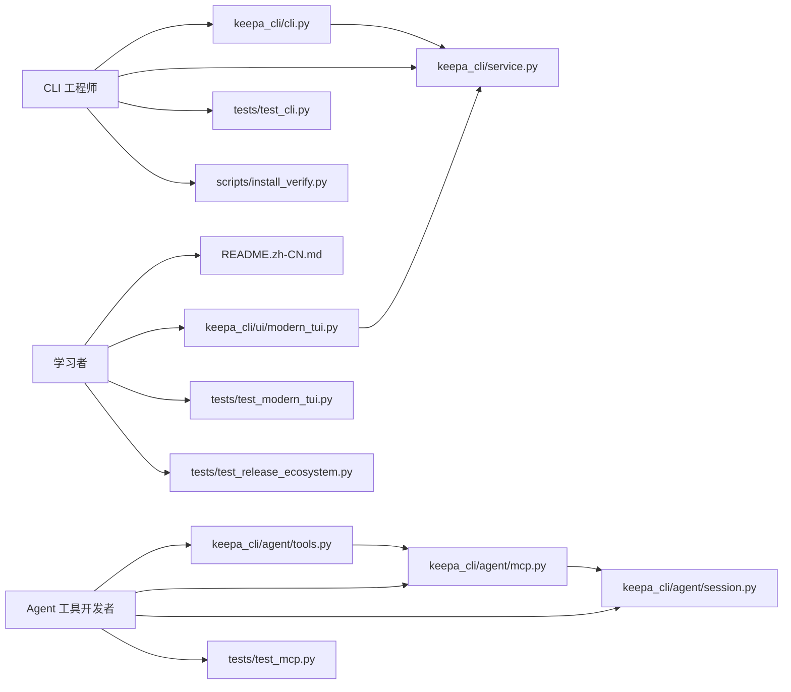

这页不是讲“怎么安装”或“某个命令怎么用”，而是回答一个更关键的问题：**这套代码最值得谁读，以及不同背景的开发者应当从哪里切入，才能最快拿到可迁移的工程经验**。从仓库公开描述、入口定义、MCP 设计文档、TUI 代码与测试分布来看，Keepa CLI 不是单一命令行小工具，而是一套围绕 **统一 service 内核、Agent 兼容协议、离线优先验证、双生态发布** 组织起来的中型工程，因此它对 CLI 工程师、Agent 工具开发者，以及希望通过真实项目建立系统感的学习者，都有明确且不同的阅读价值。Sources: [README.zh-CN.md](README.zh-CN.md#L14-L23) [pyproject.toml](pyproject.toml#L40-L50) [package.json](package.json#L7-L29) [docs/architecture/mcp-agent-tools.md](docs/architecture/mcp-agent-tools.md#L15-L22)

## 你现在所处的位置，以及这页该怎样使用

你当前位于整套文档的最后一页：**[适合谁阅读这套代码：CLI 工程师、Agent 工具开发者与学习者的收获路径](32-gua-he-shui-yue-du-zhe-tao-dai-ma-cli-gong-cheng-shi-agent-gong-ju-kai-fa-zhe-yu-xue-xi-zhe-de-shou-huo-lu-jing)**。这意味着前面的页面已经按“从上手到架构、从执行链到协议层、从能力版图到测试发布”的顺序解释了系统本身；而本页只做一件事：**把这些材料重新按读者类型重排为阅读路线图**，帮助你决定接下来最该深入哪一组页面，而不是把整套 wiki 从头到尾平均阅读。Sources: [README.zh-CN.md](README.zh-CN.md#L16-L23) [docs/reports/2026-05-09-keepa-cli-implementation-report.md](docs/reports/2026-05-09-keepa-cli-implementation-report.md#L8-L23)

## 为什么这套代码值得“按角色”阅读，而不是“按功能”阅读

这套项目的设计重心很鲜明：命令入口只是外壳，核心价值在于把 Keepa API 的成本、缓存、确认门禁、离线 fixture、Agent 协议与本地工具链收敛为**可复用的 command service**。这一点既出现在设计文档中“继续保持 `run_command` 作为唯一业务入口”的目标，也直接体现在 CLI 入口代码对 `run_command`、MCP、stdio、现代 TUI 的统一接入方式里。因此，阅读它时如果只按“products、finder、deals”这种功能域切入，很容易只看到表面命令；而按“CLI 架构”“Agent 协议”“工程学习”三种角色去读，才更容易抓住真正可迁移的骨架。Sources: [docs/architecture/mcp-agent-tools.md](docs/architecture/mcp-agent-tools.md#L17-L22) [keepa_cli/cli.py](keepa_cli/cli.py#L17-L35) [keepa_cli/service.py](keepa_cli/service.py#L1-L6)

## 读者类型总览

下表概括了三类读者最适合关注的对象、能直接迁移的经验，以及最推荐的起始页。

| 读者类型 | 你最该看什么 | 你能带走什么 | 建议起点 |
| --- | --- | --- | --- |
| CLI 工程师 | 入口组织、参数层与 service 分层、双入口发布与测试 | 如何避免 CLI 逻辑分叉，如何让 Python/Node 双入口共享同一能力面 | [高层架构总览：CLI、TUI、stdio、MCP 共用同一命令服务](14-gao-ceng-jia-gou-zong-lan-cli-tui-stdio-mcp-gong-yong-tong-ming-ling-fu-wu) |
| Agent 工具开发者 | MCP tool registry、stdio/MCP 会话、结构化输出与资源系统 | 如何把已有 CLI 提炼成强类型 Agent 工具，而不是让 Agent 拼命令字符串 | [MCP 工具注册表：强类型工具面、toolset 分组与命令映射](22-mcp-gong-ju-zhu-ce-biao-qiang-lei-xing-gong-ju-mian-toolset-fen-zu-yu-ming-ling-ying-she) |
| 学习者 | 测试、fixture、dry-run、TUI 到服务复用、发布门禁 | 如何从真实代码里理解“工程化完成度”而不仅是功能实现 | [fixture 与 dry-run：零成本试用真实工作流形状](8-fixture-yu-dry-run-ling-cheng-ben-shi-yong-zhen-shi-gong-zuo-liu-xing-zhuang) |

这个划分不是抽象建议，而是与仓库真实形态一致：项目同时维护 Python console script、Node wrapper、现代 TUI、stdio 协议、MCP server，以及成体系测试与安装校验，因此它天然对应三种不同的阅读收益模型。Sources: [pyproject.toml](pyproject.toml#L5-L13) [pyproject.toml](pyproject.toml#L40-L50) [package.json](package.json#L7-L29) [scripts/install_verify.py](scripts/install_verify.py#L27-L60)

## 三类读者与代码模块的关系图

下面这张图适合先建立“读者—模块—收益”的映射，再决定自己的阅读顺序。



图里的关键关系有两个。第一，**CLI/TUI/MCP 都不是各写一套业务逻辑，而是汇聚到 `service.py`**；第二，**测试文件不是附属品，而是阅读导航**，因为它们直接告诉你项目作者认为哪些行为属于稳定契约。对中级开发者来说，这种“实现文件 + 契约测试”并读的方法，比单看源码更高效。Sources: [keepa_cli/cli.py](keepa_cli/cli.py#L17-L35) [keepa_cli/service.py](keepa_cli/service.py#L16-L59) [keepa_cli/agent/mcp.py](keepa_cli/agent/mcp.py#L15-L25) [keepa_cli/ui/modern_tui.py](keepa_cli/ui/modern_tui.py#L18-L22) [tests/test_cli.py](tests/test_cli.py#L38-L61) [tests/test_mcp.py](tests/test_mcp.py#L18-L45) [tests/test_modern_tui.py](tests/test_modern_tui.py#L41-L60)

## 如果你是 CLI 工程师：你会看到一套“入口很多，但核心只有一个”的实现方式

对 CLI 工程师来说，这套代码最值得看的，不是某个子命令支持了多少 Keepa 参数，而是**如何把“参数解析层”和“业务执行层”硬分开**。`keepa_cli/cli.py` 负责搭建 argparse 树、组织 `--json`、`--stdio`、`--mcp`、`tui` 等入口，并把真正业务执行委托给 `run_command`；而 `service.py` 再把命令路由到各个 `commands/*` 模块或本地工具命令。这个结构使得“入口增长”不会等价于“业务分叉”，对任何正在做中大型 CLI 的开发者都很有参考价值。Sources: [keepa_cli/cli.py](keepa_cli/cli.py#L47-L90) [keepa_cli/cli.py](keepa_cli/cli.py#L164-L190) [keepa_cli/service.py](keepa_cli/service.py#L16-L47)

## CLI 工程师真正能迁移的，不是 argparse 技巧，而是“稳定契约”的工程思维

项目 README 把 `keepa-cli` 与 `kc` 定义为等价双入口，`pyproject.toml` 与 `package.json` 也分别把 Python console script 和 Node bin 明确映射出来；与之对应，安装验证脚本会同时检查 Python 模块入口和 Node wrapper，测试也会约束 npm scripts 必须经过 release gate。这说明作者并不把“多入口”当成文档承诺，而是做成了**可被自动验证的发布契约**。如果你平时做 CLI 工具，经常遇到“README 说支持，实际某入口坏了”的问题，这里最有价值的收获就是：**入口一致性必须进入测试与发布门禁，而不是靠人工记忆维护**。Sources: [README.zh-CN.md](README.zh-CN.md#L18-L24) [pyproject.toml](pyproject.toml#L40-L50) [package.json](package.json#L7-L29) [scripts/install_verify.py](scripts/install_verify.py#L33-L52) [tests/test_release_ecosystem.py](tests/test_release_ecosystem.py#L17-L50)

## 适合 CLI 工程师的阅读顺序

对于 CLI 工程师，最优路线不是先读全部命令，而是先抓住“骨架”，再下探“族群”，最后回到“验证”。建议顺序是：[高层架构总览：CLI、TUI、stdio、MCP 共用同一命令服务](14-gao-ceng-jia-gou-zong-lan-cli-tui-stdio-mcp-gong-yong-tong-ming-ling-fu-wu) → [命令解析层：参数构建器与命令分发表的职责分离](15-ming-ling-jie-xi-ceng-can-shu-gou-jian-qi-yu-ming-ling-fen-fa-biao-de-zhi-ze-fen-chi) → [服务层中枢：run_command 如何统一业务命令、配置命令与本地工具命令](16-fu-wu-ceng-zhong-shu-run_command-ru-he-tong-ye-wu-ming-ling-pei-zhi-ming-ling-yu-ben-di-gong-ju-ming-ling) → [测试版图：单元测试、fixture 双份同步与协议契约覆盖](30-ce-shi-ban-tu-dan-yuan-ce-shi-fixture-shuang-fen-tong-bu-yu-xie-yi-qi-yue-fu-gai) → [发布门禁：跨 Python/Node 生态的安装验证、smoke 与 release check](31-fa-bu-men-jin-kua-python-node-sheng-tai-de-an-zhuang-yan-zheng-smoke-yu-release-check)。这条路线最适合已经做过工具、但想把“可维护 CLI”做得更像产品的人。Sources: [keepa_cli/cli.py](keepa_cli/cli.py#L47-L90) [keepa_cli/service.py](keepa_cli/service.py#L44-L59) [tests/test_cli.py](tests/test_cli.py#L38-L61) [scripts/install_verify.py](scripts/install_verify.py#L27-L60)

## 如果你是 Agent 工具开发者：这套代码最大的价值是“不要让 Agent 学 CLI 字符串”

Agent 开发者最该关注的是，这个项目并没有把 MCP 设计成“远程执行 CLI 文本”的壳，而是单独维护了 `ToolDefinition`、`inputSchema`、`outputSchema`、toolset 分组、参数归一化与 JSON-RPC 处理流程。设计文档明确写到“不让 MCP server 解析或执行 CLI 字符串”，实现代码也确实要求 `tools/call` 的 `arguments` 必须是结构化对象。换句话说，这里展示的是一种非常实用的升级路径：**先有可用 CLI，再把高价值子集抽成强类型工具，而不是把整套命令行习惯强塞给 Agent**。Sources: [docs/architecture/mcp-agent-tools.md](docs/architecture/mcp-agent-tools.md#L23-L30) [docs/architecture/mcp-agent-tools.md](docs/architecture/mcp-agent-tools.md#L82-L102) [keepa_cli/agent/tools.py](keepa_cli/agent/tools.py#L30-L58) [keepa_cli/agent/mcp.py](keepa_cli/agent/mcp.py#L134-L156)

## 对 Agent 工具开发者而言，最值得抄作业的是三层分离

第一层是 `tools.py`，负责定义工具面、schema 和命令映射；第二层是 `mcp.py`，只处理 JSON-RPC 协议方法，如 `initialize`、`tools/list`、`tools/call`、`resources/*`；第三层是 `session.py`，处理长会话里的 cache、budget ledger、confirmation gate。这样做的意义在于，**协议、会话、业务三件事被拆开了**：MCP 可以演进，session 可以控成本，而业务仍然走同一个 `run_command`。对于正在做 Codex、Claude Code、MCP server 或内部 AI 工具平台的人，这比单纯学会 JSON-RPC 更重要，因为它回答的是“怎样让 Agent 接入后不破坏原系统边界”。Sources: [docs/architecture/mcp-agent-tools.md](docs/architecture/mcp-agent-tools.md#L31-L52) [keepa_cli/agent/mcp.py](keepa_cli/agent/mcp.py#L56-L66) [keepa_cli/agent/session.py](keepa_cli/agent/session.py#L105-L163)

## Agent 路径里最成熟的地方，是把“成本与确认”提升到了协议层

`AgentSession.execute()` 会先估算预算、累计 session ledger、判断是否需要确认；若请求高成本且没有 `yes`、`dry_run` 或 `fixture`，它不会等待交互输入，而是返回结构化的 `confirmation_required` 错误，并附带如何恢复执行的提示。测试同样覆盖了这种策略。这意味着项目真正实现了“Agent-safe”而不是只在文档里宣称安全：**会话环境中不允许模糊确认，不允许靠终端 prompt 阻塞 Agent**。如果你正在设计 Agent 工具，这是最值得优先研究的一段思路。Sources: [keepa_cli/agent/session.py](keepa_cli/agent/session.py#L54-L71) [keepa_cli/agent/session.py](keepa_cli/agent/session.py#L117-L163) [tests/test_mcp.py](tests/test_mcp.py#L79-L110)

## 适合 Agent 工具开发者的阅读顺序

如果你的目标是做“可被 LLM 稳定调用”的工具面，建议顺序是：[JSON、stdio JSON Lines 与 MCP 三种 Agent 入口](12-json-stdio-json-lines-yu-mcp-san-chong-agent-ru-kou) → [JSON Envelope 规范：稳定输出、错误模型与 Agent 友好响应](18-json-envelope-gui-fan-wen-ding-shu-chu-cuo-wu-mo-xing-yu-agent-you-hao-xiang-ying) → [MCP 工具注册表：强类型工具面、toolset 分组与命令映射](22-mcp-gong-ju-zhu-ce-biao-qiang-lei-xing-gong-ju-mian-toolset-fen-zu-yu-ming-ling-ying-she) → [MCP 资源系统：Schema、fixture、evidence 与大响应资源引用](23-mcp-zi-yuan-xi-tong-schema-fixture-evidence-yu-da-xiang-ying-zi-yuan-yin-yong) → [长会话能力：stdio/MCP 会话、资源分块与上下文控制](24-chang-hui-hua-neng-li-stdio-mcp-hui-hua-zi-yuan-fen-kuai-yu-shang-xia-wen-kong-zhi)。这条路径不要求你先理解全部 Keepa 领域细节，因为它关注的是**协议抽象与调用稳定性**。Sources: [README.zh-CN.md](README.zh-CN.md#L176-L198) [docs/architecture/mcp-agent-tools.md](docs/architecture/mcp-agent-tools.md#L53-L80) [keepa_cli/agent/mcp.py](keepa_cli/agent/mcp.py#L88-L131) [keepa_cli/agent/tools.py](keepa_cli/agent/tools.py#L16-L27)

## 如果你是学习者：这套项目适合拿来建立“完整工程感”

对学习者来说，这个仓库的优势不在于代码量小，而在于**每个层次都有可观测锚点**。README 给出 fixture、dry-run、TUI、Agent 模式的可运行入口；测试覆盖 CLI、MCP、TUI、发布生态；现代 TUI 还专门为缺失 `prompt_toolkit` 的场景提供回退路径。也就是说，这不是一份“只能读、难以跑”的架构样例，而是一份可以边跑边对照测试、边看边验证的真实工程样本。对于已具备基础 Python 能力、想从脚本式开发跨到产品式开发的中级学习者，它非常合适。Sources: [README.zh-CN.md](README.zh-CN.md#L97-L123) [README.zh-CN.md](README.zh-CN.md#L154-L185) [tests/test_cli.py](tests/test_cli.py#L107-L126) [tests/test_modern_tui.py](tests/test_modern_tui.py#L164-L200)

## 学习者最该观察的，不是“功能多”，而是“如何渐进增加复杂度”

从项目实现调研报告可以看出，作者从一开始就把目标定为 Agent-first、只读、安全优先，并强调先稳定 `--json`、`--stdio`、结构化错误、token 预算和 fixture/offline，再逐步叠加 TUI 与更丰富的能力面。这个顺序非常值得学习，因为它说明复杂产品不是靠一次性堆功能成型，而是**先把自动化消费面与验证面做稳，再增加交互层和生态层**。如果你以前的学习路径总是停在“写完功能就结束”，这里能帮你看见后续那 70% 的工程工作长什么样。Sources: [docs/reports/2026-05-09-keepa-cli-implementation-report.md](docs/reports/2026-05-09-keepa-cli-implementation-report.md#L8-L23) [docs/reports/2026-05-09-keepa-cli-implementation-report.md](docs/reports/2026-05-09-keepa-cli-implementation-report.md#L149-L169)

## 学习者的最佳收获路径，是“先验证，再理解，再抽象”

最适合学习者的路线通常不是直接啃 `service.py`，而是先通过 [快速上手](2-kuai-su-shang-shou)、[fixture 与 dry-run：零成本试用真实工作流形状](8-fixture-yu-dry-run-ling-cheng-ben-shi-yong-zhen-shi-gong-zuo-liu-xing-zhuang)、[JSON、stdio JSON Lines 与 MCP 三种 Agent 入口](12-json-stdio-json-lines-yu-mcp-san-chong-agent-ru-kou) 跑通不同交互面；再去看 [整体设计哲学：面向 Agent、离线优先、统一服务内核](13-zheng-ti-she-ji-zhe-xue-mian-xiang-agent-chi-xian-you-xian-tong-fu-wu-nei-he) 与 [高层架构总览：CLI、TUI、stdio、MCP 共用同一命令服务](14-gao-ceng-jia-gou-zong-lan-cli-tui-stdio-mcp-gong-yong-tong-ming-ling-fu-wu)；最后用 [测试版图：单元测试、fixture 双份同步与协议契约覆盖](30-ce-shi-ban-tu-dan-yuan-ce-shi-fixture-shuang-fen-tong-bu-yu-xie-yi-qi-yue-fu-gai) 和 [发布门禁：跨 Python/Node 生态的安装验证、smoke 与 release check](31-fa-bu-men-jin-kua-python-node-sheng-tai-de-an-zhuang-yan-zheng-smoke-yu-release-check) 反过来理解作者如何保证这些抽象不失真。Sources: [README.zh-CN.md](README.zh-CN.md#L97-L123) [README.zh-CN.md](README.zh-CN.md#L176-L198) [tests/test_release_ecosystem.py](tests/test_release_ecosystem.py#L17-L50)

## 一个适合学习者和工程师共用的“项目结构观”

下面这个精简结构不是仓库全景，而是从“读者收益”角度重排后的关键阅读区。

```text
keepa_cli/
├── cli.py                # 所有入口汇入点
├── service.py            # 统一 command service
├── commands/             # 领域命令处理
├── cli_builders/         # argparse 组织层
├── agent/
│   ├── tools.py          # MCP 工具定义与 schema
│   ├── mcp.py            # JSON-RPC 协议适配
│   └── session.py        # 长会话缓存与预算账本
└── ui/
    └── modern_tui.py     # 人类交互层，仍复用 service

tests/
├── test_cli.py           # 入口契约
├── test_mcp.py           # Agent 协议契约
├── test_modern_tui.py    # 交互层契约
└── test_release_ecosystem.py  # 发布生态契约

scripts/
└── install_verify.py     # Python/Node 双生态安装校验
```

这个结构之所以适合作为阅读地图，是因为它恰好对应了工程里的四条稳定边界：**入口、服务、协议、验证**。只要你能看懂这四层如何互相约束，就已经读懂了这个项目大半的设计价值。Sources: [keepa_cli/cli.py](keepa_cli/cli.py#L47-L90) [keepa_cli/service.py](keepa_cli/service.py#L16-L59) [keepa_cli/agent/tools.py](keepa_cli/agent/tools.py#L30-L58) [keepa_cli/agent/mcp.py](keepa_cli/agent/mcp.py#L68-L131) [keepa_cli/agent/session.py](keepa_cli/agent/session.py#L105-L163) [scripts/install_verify.py](scripts/install_verify.py#L27-L60)

## 三种读者路径的差异，不在“看多少”，而在“先看哪一层”

下面这张表可以帮助你快速决定自己的第一站。

| 你的当前目标 | 最先读的代码 | 最先读的 wiki 页面 | 最可能得到的能力 |
| --- | --- | --- | --- |
| 我想做更稳的 CLI | `keepa_cli/cli.py`、`keepa_cli/service.py` | [命令解析层：参数构建器与命令分发表的职责分离](15-ming-ling-jie-xi-ceng-can-shu-gou-jian-qi-yu-ming-ling-fen-fa-biao-de-zhi-ze-fen-chi) | 理解入口与业务解耦 |
| 我想让 LLM 调我的工具 | `keepa_cli/agent/tools.py`、`keepa_cli/agent/mcp.py`、`keepa_cli/agent/session.py` | [MCP 工具注册表：强类型工具面、toolset 分组与命令映射](22-mcp-gong-ju-zhu-ce-biao-qiang-lei-xing-gong-ju-mian-toolset-fen-zu-yu-ming-ling-ying-she) | 理解 schema 化工具面与确认门禁 |
| 我想系统提升工程能力 | `README.zh-CN.md`、`tests/test_cli.py`、`tests/test_release_ecosystem.py` | [概览](1-gai-lan) | 建立“功能—测试—发布”全链路视角 |

这张表的核心判断依据是：该项目把不同关注点已经自然分层了，读者不必从同一个入口开始。成熟阅读不是“全都看”，而是先找到与你当前问题最同构的那一层。Sources: [README.zh-CN.md](README.zh-CN.md#L16-L23) [tests/test_cli.py](tests/test_cli.py#L17-L37) [tests/test_release_ecosystem.py](tests/test_release_ecosystem.py#L17-L50)

## 如果你时间有限，只读这套代码的哪一部分最值

如果你只能投入半天时间，**CLI 工程师**优先看 `cli.py`、`service.py` 和 `test_cli.py`；**Agent 开发者**优先看 `agent/tools.py`、`agent/mcp.py`、`agent/session.py` 和 `test_mcp.py`；**学习者**优先看 README 的离线体验部分、`modern_tui.py` 的目录构造方式，以及 `test_release_ecosystem.py` 与 `install_verify.py`。这不是主观偏好，而是因为这些文件最集中地暴露了项目的“稳定承诺”：入口怎么统一、协议怎么收敛、安全怎么前置、发布怎么验证。Sources: [README.zh-CN.md](README.zh-CN.md#L97-L145) [keepa_cli/ui/modern_tui.py](keepa_cli/ui/modern_tui.py#L136-L176) [tests/test_mcp.py](tests/test_mcp.py#L28-L63) [scripts/install_verify.py](scripts/install_verify.py#L33-L59)

## 结论：这套代码最适合三类“已经会写代码，但想把代码做成系统”的人

最终可以把这页收束成一句话：**如果你只想学某个 Keepa API 调用，这个仓库可能太完整；但如果你想学如何把 API 能力做成可测试、可发布、可被 Agent 消费、又能服务人类交互的工程系统，这个仓库就非常值得读。** CLI 工程师会从中看到统一 service 内核与双生态发布的一致性设计，Agent 工具开发者会看到强类型工具面与会话成本治理，而学习者会看到一份从 README、实现、测试到 release gate 都能相互印证的真实项目样本。接下来最合理的行动，不是重复浏览目录，而是根据你的身份回到对应页面链路做定向深读。Sources: [README.zh-CN.md](README.zh-CN.md#L14-L23) [docs/architecture/mcp-agent-tools.md](docs/architecture/mcp-agent-tools.md#L15-L22) [tests/test_release_ecosystem.py](tests/test_release_ecosystem.py#L33-L50)