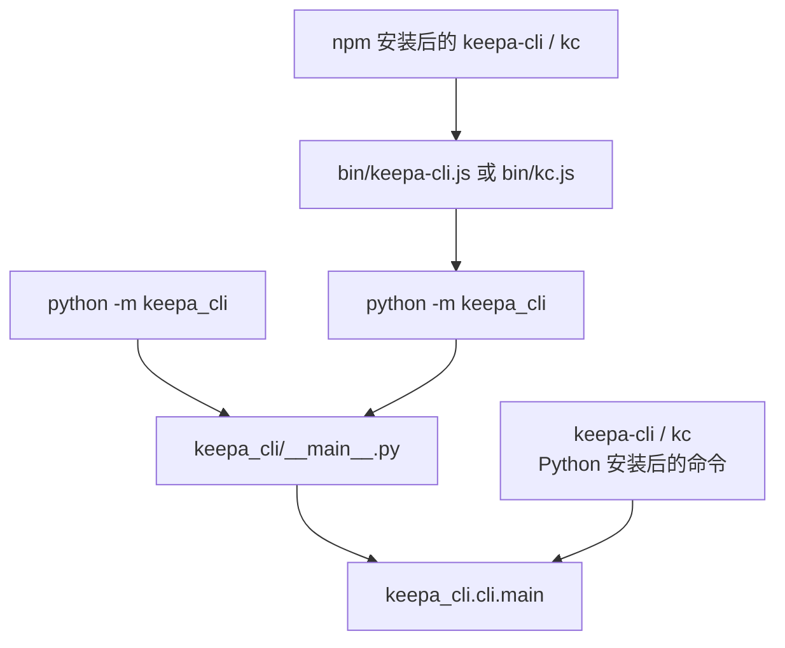
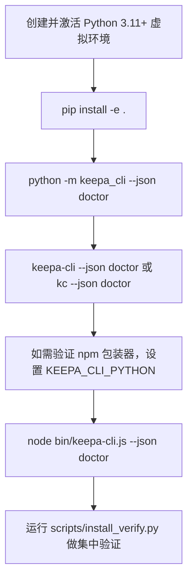

这一页只回答三个初学者最常问的问题：**这个项目到底从哪里启动**、**`keepa-cli` 与 `kc` 为什么是等价入口**、以及**在本地开发时如何用最低成本验证入口是否正常**。这里不展开 token 配置、业务命令细节、TUI 交互或 Agent 协议，只聚焦“怎么进来、怎么跑通、怎么确认入口没坏”。Sources: [keepa_cli/__main__.py](keepa_cli/__main__.py#L1-L15), [keepa_cli/cli.py](keepa_cli/cli.py#L47-L58), [pyproject.toml](pyproject.toml#L40-L43), [package.json](package.json#L7-L10)

如果你是顺着“快速开始”阅读，建议当前页读完后按顺序继续到 [Keepa Token 配置、环境变量优先级与本地配置文件位置](5-keepa-token-pei-zhi-huan-jing-bian-liang-you-xian-ji-yu-ben-di-pei-zhi-wen-jian-jian-wei-zhi)（用于真正配置认证），再到 [使用 doctor 命令检查认证、离线能力与运行环境](7-shi-yong-doctor-ming-ling-jian-cha-ren-zheng-chi-xian-neng-li-yu-yun-xing-huan-jing)（用于系统性检查运行状态）。如果你只想先确认“代码能不能跑”，本页的本地验证步骤已经足够。Sources: [README.md](README.md#L35-L56), [keepa_cli/cli.py](keepa_cli/cli.py#L203-L223)

## 先建立一个正确心智模型：三层入口，但只有一个真正的 CLI 核心

从第一性原理看，这个仓库虽然同时暴露了 **Python 模块入口**、**Python console script 入口** 和 **npm 包装器入口**，但它们最终都会汇聚到同一个 Python 函数：`keepa_cli.cli:main`。这意味着对初学者来说，记住“**最终执行核心只有一个**”就够了，其他入口只是为了适配不同安装方式与开发场景。Sources: [keepa_cli/__main__.py](keepa_cli/__main__.py#L8-L15), [pyproject.toml](pyproject.toml#L40-L43), [bin/keepa-cli.js](bin/keepa-cli.js#L4-L6)



上图表达的是一个非常稳定的架构事实：**所有人类和自动化调用都尽量复用同一条主线**。Python 侧的脚本入口与 Node 侧的包装器都不承载业务逻辑，因此当你调试参数解析、输出格式或命令行为时，通常只需要看 `keepa_cli/cli.py`，而不是分别研究三个完全不同的启动程序。Sources: [keepa_cli/cli.py](keepa_cli/cli.py#L1-L6), [bin/kc.js](bin/kc.js#L3-L9), [bin/keepa-cli.js](bin/keepa-cli.js#L3-L6)

## 三种入口分别解决什么问题

下面这张表适合初学者快速分辨：**什么时候该用 `python -m`，什么时候该用 `keepa-cli`/`kc`，什么时候是 npm 包装器在工作**。Sources: [keepa_cli/__main__.py](keepa_cli/__main__.py#L1-L15), [pyproject.toml](pyproject.toml#L40-L43), [package.json](package.json#L7-L10), [bin/keepa-cli.js](bin/keepa-cli.js#L12-L26)

| 入口形式 | 典型命令 | 适用场景 | 最终落点 | 是否直接包含业务逻辑 |
|---|---|---|---|---|
| Python 模块入口 | `python -m keepa_cli --json doctor` | 本地开发、未安装 console script 时验证 | `keepa_cli.cli.main` | 否 |
| Python 命令入口 | `keepa-cli --json doctor` / `kc --json doctor` | 已通过 Python 安装包，日常使用 | `keepa_cli.cli.main` | 否 |
| npm 包装器入口 | `keepa-cli --json doctor` / `kc --json doctor` | 通过 npm 安装，希望沿用 Node 生态命令分发 | 先转发到 `python -m keepa_cli`，再进入 `keepa_cli.cli.main` | 否 |

其中最值得注意的是：`pyproject.toml` 明确把 `keepa-cli` 和 `kc` 两个 console script 都绑定到同一个目标 `keepa_cli.cli:main`；而 `package.json` 也把两个 npm bin 分别映射到 `bin/keepa-cli.js` 与 `bin/kc.js`。因此“双入口”不是两套实现，而是**同一实现的两个别名**。Sources: [pyproject.toml](pyproject.toml#L40-L43), [package.json](package.json#L7-L10), [bin/kc.js](bin/kc.js#L1-L10)

## 模块入口：为什么 `python -m keepa_cli` 是本地开发最稳的起点

`keepa_cli/__main__.py` 非常薄，只做一件事：导入 `keepa_cli.cli.main` 并以 `SystemExit(main())` 方式退出。文件头注释已经写明，这个入口的目的就是**支持 `python -m keepa_cli` 验证**，特别适合“代码刚拉下来、还没装好脚本命令”的阶段。Sources: [keepa_cli/__main__.py](keepa_cli/__main__.py#L1-L15)

这类模块入口对初学者最大的价值是：**它绕过了命令安装层的不确定性**。只要你的 Python 环境能导入当前仓库包，就可以立刻验证 CLI 是否能解析参数、输出 JSON、运行 `doctor`，因此它通常是排查问题时的第一检查点。Sources: [keepa_cli/__main__.py](keepa_cli/__main__.py#L3-L5), [tests/test_cli.py](tests/test_cli.py#L27-L45)

## 命令入口：`keepa-cli` 和 `kc` 为什么等价

Python 包的 `pyproject.toml` 在 `[project.scripts]` 下定义了两个脚本名：`keepa-cli` 和 `kc`，并且二者都指向 `keepa_cli.cli:main`。这说明在 Python 安装路径下生成的两个可执行命令，本质上只是**两个名字不同、行为完全一致的启动器**。Sources: [pyproject.toml](pyproject.toml#L40-L43)

CLI 自身也把这一点写进了帮助描述里：`prog="keepa-cli"`，并在 description 中明确说明 **`kc` is an equivalent short entry point**。换句话说，`kc` 不是“简化版 CLI”，而只是更短的输入方式。文档、脚本和测试可以任选其一，但理解上应把它们视作同一个命令面。Sources: [keepa_cli/cli.py](keepa_cli/cli.py#L47-L52)

## npm 包装器入口：Node 不执行业务，只负责找到 Python

如果你通过 npm 使用这个项目，真正执行逻辑的仍然不是 Node。`bin/keepa-cli.js` 的职责写得很明确：**定位可用 Python 解释器，设置 `PYTHONPATH`，然后执行 `python -m keepa_cli`**。这意味着 npm 侧只是一个跨生态“转发层”。Sources: [bin/keepa-cli.js](bin/keepa-cli.js#L3-L6), [bin/keepa-cli.js](bin/keepa-cli.js#L19-L26)

在 Windows 上，它默认尝试的 Python 候选顺序是 `python`、`py`、`python3`；如果设置了 `KEEPA_CLI_PYTHON`，则优先使用这个环境变量指定的解释器。对本地开发者而言，这很重要，因为你可以把 npm 包装器**强制绑定到当前虚拟环境**，避免系统 Python 与项目虚拟环境不一致。Sources: [bin/keepa-cli.js](bin/keepa-cli.js#L12-L18), [bin/keepa-cli.js](bin/keepa-cli.js#L20-L26), [README.md](README.md#L51-L56)

`bin/kc.js` 更简单，它没有独立逻辑，只是 `require("./keepa-cli.js")`。因此 npm 生态中的 `kc` 和 `keepa-cli` 依然是等价关系，区别只在命令名字更短。Sources: [bin/kc.js](bin/kc.js#L1-L10)

## 入口后的第一站：`keepa_cli.cli.main`

无论从哪个入口进来，CLI 核心都会先做几件通用工作：启用 UTF-8 标准输出、构造参数解析器、解析命令行参数，然后根据 `--stdio`、`--mcp`、普通子命令或无命令场景进入不同分支。对于当前页面来说，你只需要理解：**入口已经统一，后续分流也都发生在同一个文件里**。Sources: [keepa_cli/cli.py](keepa_cli/cli.py#L41-L45), [keepa_cli/cli.py](keepa_cli/cli.py#L424-L439)

这个解析器本身就是命令入口的“总目录”。它注册了全局参数如 `--version`、`--json`、`--stdio`、`--mcp`、`--yes`，并把 `doctor`、`capabilities`、`tui`、`config`、`domains` 等顶层命令挂到同一个 `argparse` 子解析器体系下。初学者可以把它理解为：**所有命令入口最后都先进入这一张总路由表**。Sources: [keepa_cli/cli.py](keepa_cli/cli.py#L47-L58), [keepa_cli/cli.py](keepa_cli/cli.py#L59-L89)

## 命令入口和命令执行不是一回事

`keepa_cli/cli.py` 的职责是**解析命令并把它们翻译成标准化调用**，而不是自己实现业务。比如 `doctor` 会转成 `run_command("doctor")`，`domains list` 会转成 `run_command("domains.list")`，其他命令家族则先经过 `maybe_run_*_command` 这一层进行参数组装和分派。Sources: [keepa_cli/cli.py](keepa_cli/cli.py#L203-L245)

对新手来说，这个分层很关键：当你看到 `kc --json doctor` 成功时，说明至少有三层都工作正常——**入口可达、参数解析正常、命令分发正常**。但它还不等于你已经理解了后面的服务层或 API 交互；那些内容应继续阅读 [命令解析层：参数构建器与命令分发表的职责分离](15-ming-ling-jie-xi-ceng-can-shu-gou-jian-qi-yu-ming-ling-fen-fa-biao-de-zhi-ze-fen-chi) 与 [服务层中枢：run_command 如何统一业务命令、配置命令与本地工具命令](16-fu-wu-ceng-zhong-shu-run_command-ru-he-tong-ye-wu-ming-ling-pei-zhi-ming-ling-yu-ben-di-gong-ju-ming-ling)。Sources: [keepa_cli/cli.py](keepa_cli/cli.py#L203-L231), [keepa_cli/cli.py](keepa_cli/cli.py#L257-L417)

## 一个适合初学者记忆的项目结构视图

如果你只关心当前页面的主题，可以先记住下面这几个文件的职责边界。Sources: [keepa_cli/__main__.py](keepa_cli/__main__.py#L1-L15), [keepa_cli/cli.py](keepa_cli/cli.py#L1-L6), [bin/keepa-cli.js](bin/keepa-cli.js#L3-L6), [bin/kc.js](bin/kc.js#L3-L9), [scripts/install_verify.py](scripts/install_verify.py#L1-L6)

```text
Keepa-cli
├─ keepa_cli/
│  ├─ __main__.py        # python -m keepa_cli 的模块入口
│  └─ cli.py             # 所有入口最终汇聚的 CLI 核心
├─ bin/
│  ├─ keepa-cli.js       # npm 的主包装器，转发到 Python
│  └─ kc.js              # npm 的短命令包装器，复用 keepa-cli.js
├─ pyproject.toml        # Python console script: keepa-cli / kc
├─ package.json          # npm bin: keepa-cli / kc
└─ scripts/
   └─ install_verify.py  # 本地与发布前的安装/入口验证脚本
```

这个结构有一个非常清晰的设计目标：**把“安装方式差异”限制在外围，把“命令行为一致性”集中在核心**。因此在本地开发时，只要 `keepa_cli/cli.py` 的行为正确，Python 入口与 npm 入口就更容易保持一致。Sources: [pyproject.toml](pyproject.toml#L40-L43), [package.json](package.json#L7-L10), [bin/keepa-cli.js](bin/keepa-cli.js#L19-L26)

## 本地开发验证的最小路径：先用 `doctor`

README 给出的本地开发起步方式非常直接：先用虚拟环境执行 `pip install -e .`，再运行 `kc --json doctor`。这里的核心不是 `kc` 这个名字本身，而是 **`doctor` 被当作最低成本、最稳定的入口健康检查命令**。Sources: [README.md](README.md#L35-L42)

`doctor` 适合作为第一验证命令，是因为测试和安装验证脚本都拿它做基线：`tests/test_cli.py` 用 `python -m keepa_cli --json doctor` 断言模块入口可用，`tests/test_npm_wrapper.py` 用 Node 包装器运行 `--json doctor` 断言 npm 入口可用，而 `scripts/install_verify.py` 也用同一个命令串联 Python 与 Node 两条验证路径。Sources: [tests/test_cli.py](tests/test_cli.py#L38-L45), [tests/test_npm_wrapper.py](tests/test_npm_wrapper.py#L22-L48), [scripts/install_verify.py](scripts/install_verify.py#L33-L58)

## 推荐的本地验证顺序

对于 Beginner 读者，建议按下面顺序逐步验证，而不是一开始就跑真实 API 请求。这样你可以把问题范围从“环境启动失败”逐步缩小到“安装层、入口层、命令层”。Sources: [keepa_cli/__main__.py](keepa_cli/__main__.py#L3-L5), [README.md](README.md#L35-L56), [scripts/install_verify.py](scripts/install_verify.py#L27-L58)



上面这条路径的思想是：**先验证最内层，再验证最外层**。`python -m keepa_cli` 成功，说明模块入口没问题；`keepa-cli`/`kc` 成功，说明 Python 安装脚本没问题；Node 包装器成功，才说明跨生态转发也没问题。Sources: [keepa_cli/__main__.py](keepa_cli/__main__.py#L10-L15), [pyproject.toml](pyproject.toml#L40-L43), [bin/keepa-cli.js](bin/keepa-cli.js#L29-L44)

## 三种本地验证方式对比

如果你不确定该先跑哪一种，可以用下面这个判断表。Sources: [README.md](README.md#L35-L56), [tests/test_cli.py](tests/test_cli.py#L27-L36), [tests/test_npm_wrapper.py](tests/test_npm_wrapper.py#L26-L42), [scripts/install_verify.py](scripts/install_verify.py#L28-L31)

| 验证方式 | 示例命令 | 验证目标 | 适合什么时候用 |
|---|---|---|---|
| 模块入口验证 | `python -m keepa_cli --json doctor` | 包可导入、CLI 主函数可执行 | 刚拉代码、怀疑安装脚本未生效时 |
| Python 命令入口验证 | `keepa-cli --json doctor` 或 `kc --json doctor` | console script 已正确安装 | 已执行 `pip install -e .` 后 |
| npm 包装器验证 | `node bin/keepa-cli.js --json doctor` | Node 能找到并转发到 Python | 检查 npm 发布物或跨生态入口时 |
| 集成验证脚本 | `python scripts/install_verify.py` | Python/Node/pack 元数据整体正常 | 提交前或发布前 |

## 你实际会输入的命令

下面这些命令都直接来自仓库里已经存在的使用方式或验证脚本，适合原样照抄。Sources: [README.md](README.md#L37-L56), [scripts/install_verify.py](scripts/install_verify.py#L38-L51)

```powershell
# 1) 本地开发安装
.\.venv\Scripts\python.exe -m pip install -e .

# 2) 最稳的模块入口验证
.\.venv\Scripts\python.exe -m keepa_cli --json doctor

# 3) Python 命令入口验证
.\.venv\Scripts\kc.exe --json doctor

# 4) 如需检查 npm 包装器，把它绑定到当前虚拟环境 Python
$env:KEEPA_CLI_PYTHON="D:\github\Keepa-cli\.venv\Scripts\python.exe"
node .\bin\keepa-cli.js --json doctor
node .\bin\kc.js --json doctor

# 5) 一次性跑集中验证
.\.venv\Scripts\python.exe .\scripts\install_verify.py
```

这些命令有一个共同点：它们都使用 `doctor`，并且优先配合 `--json`。这样输出更稳定，也与仓库里的自动化测试和验证脚本保持一致，更容易排查问题。Sources: [keepa_cli/cli.py](keepa_cli/cli.py#L52-L60), [tests/test_cli.py](tests/test_cli.py#L38-L45), [tests/test_npm_wrapper.py](tests/test_npm_wrapper.py#L33-L48)

## `--json doctor` 为什么是最适合自动验证的入口命令

CLI 在 `--json` 模式下会输出稳定的 JSON envelope，而不是面向人类随意排版的文本；测试也正是通过 `json.loads(result.stdout)` 来断言 `payload["ok"]` 和 `payload["command"] == "doctor"`。这使得 `doctor` 成为一种非常适合脚本、CI 和本地 smoke test 的统一探针。Sources: [keepa_cli/cli.py](keepa_cli/cli.py#L37-L39), [keepa_cli/cli.py](keepa_cli/cli.py#L460-L473), [tests/test_cli.py](tests/test_cli.py#L38-L45)

从入口验证角度看，`--json doctor` 的价值不在于“功能复杂”，恰恰在于“**简单、稳定、无需真实 API 调用**”。安装验证脚本还会主动清除 `KEEPA_API_KEY`，并把 `KEEPA_CLI_CONFIG` 指向临时目录，以避免本地真实配置影响结果，这进一步说明它被设计成一个**低副作用的验证基线**。Sources: [scripts/install_verify.py](scripts/install_verify.py#L35-L38), [tests/test_cli.py](tests/test_cli.py#L18-L23), [tests/test_npm_wrapper.py](tests/test_npm_wrapper.py#L26-L32)

## npm 包装器本地调试时最关键的环境变量

如果你是 Windows 本地开发者，调试 npm 包装器时最重要的变量是 `KEEPA_CLI_PYTHON`。`bin/keepa-cli.js` 会优先读取它，把它当作唯一候选解释器；README 也专门给出了把它指向项目虚拟环境 Python 的示例。Sources: [bin/keepa-cli.js](bin/keepa-cli.js#L12-L18), [README.md](README.md#L51-L56)

第二个关键点是 `PYTHONPATH`。包装器会把仓库根目录插入 `PYTHONPATH`，这样它执行 `python -m keepa_cli` 时能正确找到当前包代码。这也是为什么 npm 包装器本质上仍然是“在运行这份 Python 项目”，而不是一个独立的 Node 程序。Sources: [bin/keepa-cli.js](bin/keepa-cli.js#L20-L26)

## 仓库如何保证双入口不会悄悄失效

这个项目不仅“声明了”双入口，还用测试和脚本去“守护”它。`tests/test_npm_wrapper.py` 会逐个验证 `keepa-cli.js` 与 `kc.js`；`tests/test_cli.py` 会验证 `python -m keepa_cli`；`scripts/install_verify.py` 则把 Python 模块入口、Node 包装器入口和 `npm pack --dry-run` 打包元数据检查放到同一条验证链中。Sources: [tests/test_npm_wrapper.py](tests/test_npm_wrapper.py#L21-L48), [tests/test_cli.py](tests/test_cli.py#L17-L45), [scripts/install_verify.py](scripts/install_verify.py#L38-L58)

这意味着当你在本地修改入口相关代码时，最应该优先跑的不是业务大测试，而是这些**入口保真**测试。因为一旦入口损坏，后面的所有命令能力都会失去访问路径。Sources: [scripts/install_verify.py](scripts/install_verify.py#L3-L5), [tests/test_npm_wrapper.py](tests/test_npm_wrapper.py#L3-L5)

## 常见验证问题与定位方法

下面这张表只覆盖“入口与本地验证”范围内的问题，不涉及 token、真实 API 或业务命令参数。Sources: [bin/keepa-cli.js](bin/keepa-cli.js#L29-L44), [keepa_cli/cli.py](keepa_cli/cli.py#L441-L453), [scripts/install_verify.py](scripts/install_verify.py#L40-L51)

| 现象 | 最可能的层级 | 先检查什么 | 对应依据 |
|---|---|---|---|
| `python -m keepa_cli --json doctor` 失败 | Python 包导入/模块入口 | 是否已在正确虚拟环境中执行、是否已 `pip install -e .` | `__main__.py` 直接转发到 `cli.main` |
| `kc --json doctor` 找不到命令 | Python console script 安装层 | 是否完成 Python 安装、当前 shell 是否在该环境下 | `pyproject.toml` 定义了 `keepa-cli`/`kc` |
| `node bin/keepa-cli.js --json doctor` 报找不到 Python | npm 包装层 | 设置 `KEEPA_CLI_PYTHON` 指向虚拟环境解释器 | 包装器会按候选解释器顺序尝试 |
| 运行后不是 JSON | CLI 输出模式 | 是否加了 `--json` | `cli.py` 里 `--json` 决定 envelope 输出 |
| 无命令直接运行进入 TUI | CLI 默认分支 | 这不是错误；无命令时会进入 TUI 分支 | `args.command is None` 时走 TUI |

## 记住这一页最重要的结论

如果只保留一句话，请记住：**Keepa CLI 有多个安装入口，但只有一个真正的命令核心 `keepa_cli.cli:main`；本地开发验证的最小闭环是 `python -m keepa_cli --json doctor`。** 先用这个最内层入口跑通，再逐层验证 `kc`、`keepa-cli` 和 npm 包装器，你会更快定位问题。Sources: [keepa_cli/__main__.py](keepa_cli/__main__.py#L10-L15), [pyproject.toml](pyproject.toml#L40-L43), [bin/keepa-cli.js](bin/keepa-cli.js#L25-L26), [tests/test_cli.py](tests/test_cli.py#L38-L45)

如果你下一步准备真正开始使用项目，建议继续阅读 [Keepa Token 配置、环境变量优先级与本地配置文件位置](5-keepa-token-pei-zhi-huan-jing-bian-liang-you-xian-ji-yu-ben-di-pei-zhi-wen-jian-wei-zhi)；如果你想系统检查当前环境是否满足要求，继续到 [使用 doctor 命令检查认证、离线能力与运行环境](7-shi-yong-doctor-ming-ling-jian-cha-ren-zheng-chi-xian-neng-li-yu-yun-xing-huan-jing)。Sources: [README.md](README.md#L58-L93), [keepa_cli/cli.py](keepa_cli/cli.py#L59-L67)