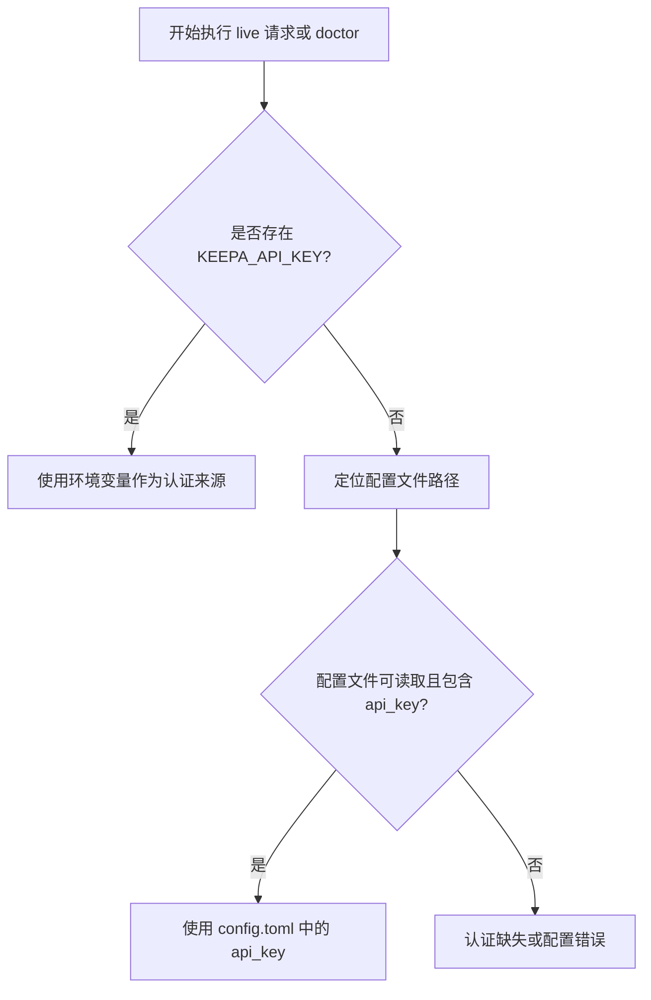
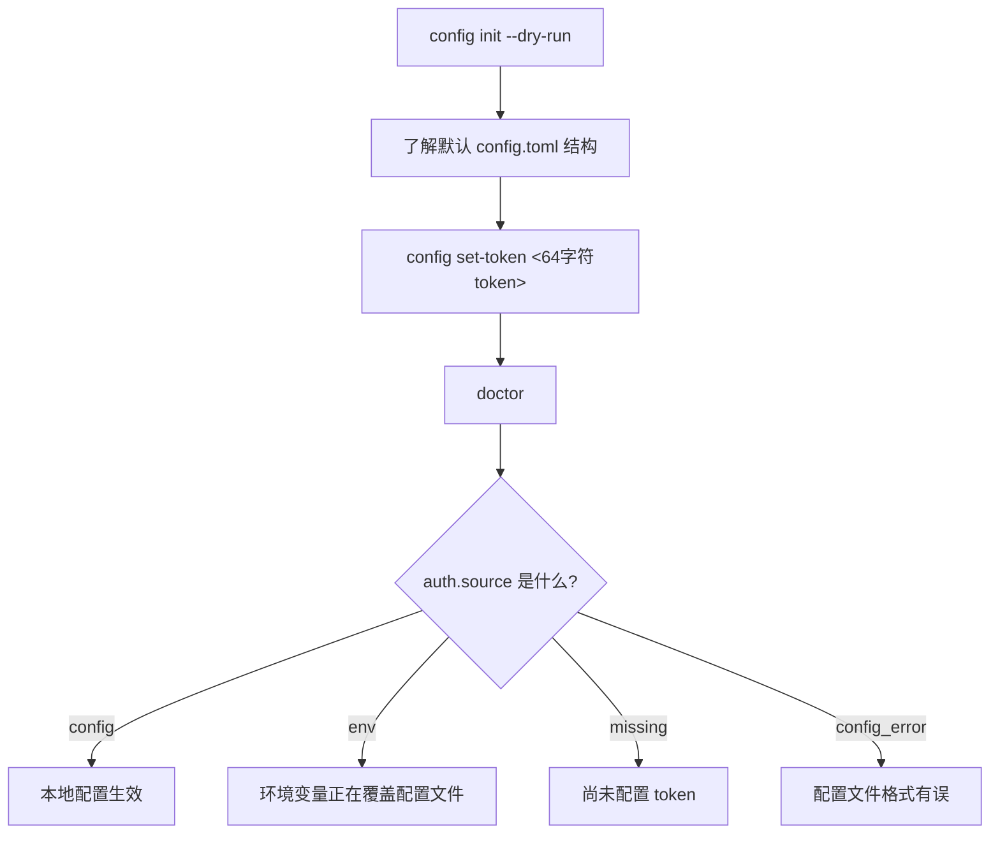

这一页只解决**首次认证配置**的三个基础问题：**Token 放哪里**、**程序按什么顺序找 Token**、以及**本地配置文件默认会落到哪个路径**。对初学者来说，理解这三件事后，你就能判断“为什么 `doctor` 说没认证”“为什么刚写入的配置没有生效”“什么时候该用环境变量，什么时候该写入本地文件”。Sources: [README.zh-CN.md](README.zh-CN.md#L48-L75) [keepa_cli/client.py](keepa_cli/client.py#L108-L118) [keepa_cli/doctor.py](keepa_cli/doctor.py#L21-L30)

## 先记结论：Keepa Token 有两种来源

这个项目支持两种认证来源：**环境变量 `KEEPA_API_KEY`**，或者**本地配置文件中的 `api_key`**。真实 live 请求时，客户端会按顺序尝试读取 `params["key"]`、`KEEPA_API_KEY`、再到配置文件里的 `api_key`；而 `doctor` 命令也会先检查 `KEEPA_API_KEY`，再检查配置文件。因此，对大多数 CLI 用户来说，可以把规则简化成一句话：**环境变量优先，本地配置文件兜底**。Sources: [keepa_cli/client.py](keepa_cli/client.py#L108-L121) [keepa_cli/doctor.py](keepa_cli/doctor.py#L21-L30) [tests/test_doctor.py](tests/test_doctor.py#L64-L77)



上面的流程图对应的是项目里真实实现的认证决策路径，而不是文档约定。`doctor` 会把结果标记成 `env`、`config`、`missing` 或 `config_error`；客户端在缺少认证时会返回 `auth_missing` 错误，并明确提示可以改用 `fixture` 或 `--dry-run`。Sources: [keepa_cli/doctor.py](keepa_cli/doctor.py#L21-L30) [keepa_cli/client.py](keepa_cli/client.py#L110-L118)

## 推荐起步方式：先写入本地配置文件

对于初学者，最简单的方式是直接执行 `config set-token`，把 Keepa access key 写入本地配置文件。README 明确说明，CLI 在保存前会先做本地校验，而且输出会自动打码；`service` 层也把这个命令统一映射到 `set_api_token`，因此无论你从 CLI、TUI 还是其他复用服务入口触发，本质上走的是同一条配置写入逻辑。Sources: [README.zh-CN.md](README.zh-CN.md#L48-L55) [keepa_cli/cli.py](keepa_cli/cli.py#L71-L74) [keepa_cli/service.py](keepa_cli/service.py#L536-L547)

```powershell
kc --json config set-token YOUR_KEEPA_64_CHARACTER_ACCESS_KEY
kc --json doctor
```

`set_api_token()` 会先调用 `validate_api_token()` 做格式校验，然后把 `api_key` 写进配置对象，再生成 TOML 内容并落盘。返回结果中的 `auth_source` 会标记为 `config`，同时 `config` 字段会经过脱敏处理，不会把明文 token 回显到输出里。测试也专门验证了：配置报告里只会看到 `[REDACTED]`，不会泄露真实密钥。Sources: [keepa_cli/config.py](keepa_cli/config.py#L122-L146) [keepa_cli/config.py](keepa_cli/config.py#L149-L155) [tests/test_config.py](tests/test_config.py#L63-L77)

## Token 的格式要求是什么

Keepa token 不是“随便一段字符串”。项目里的校验规则非常明确：**必须正好 64 个字符**，并且每个字符都必须是**可见 ASCII 字符**，不能包含空格、换行或其他不可见字符。只要长度不对，或者字符串里混入空白字符，`config set-token` 就会直接报错，而不会写入文件。Sources: [keepa_cli/config.py](keepa_cli/config.py#L149-L155) [tests/test_config.py](tests/test_config.py#L78-L88)

| 校验项 | 要求 | 不符合时结果 |
|---|---|---|
| 长度 | 必须是 64 个字符 | 抛出 `ValueError` |
| 字符范围 | 必须是可见 ASCII | 抛出 `ValueError` |
| 空白字符 | 不能包含空格、换行、制表符 | 抛出 `ValueError` |
| 保存前校验 | 先校验，再写文件 | 无效 token 不会落盘 |

这个表不是推测，而是直接来自 `validate_api_token()` 的实现与对应测试。因此如果你复制 token 后遇到失败，最常见原因通常不是“权限问题”，而是**复制时多带了空格或换行**。Sources: [keepa_cli/config.py](keepa_cli/config.py#L149-L155) [tests/test_config.py](tests/test_config.py#L82-L88)

## 默认配置文件会写到哪里

配置文件路径由 `default_config_path()` 决定，而且顺序是固定的。它会先检查 `KEEPA_CLI_CONFIG`，如果没有，再看 `APPDATA`，然后看 `XDG_CONFIG_HOME`，最后才回退到 `Path.home() / ".config" / "keepa-cli" / "config.toml"`。这意味着“默认路径”其实不是单一值，而是一个**按优先级解析出来的结果**。Sources: [keepa_cli/config.py](keepa_cli/config.py#L29-L43)

| 优先级 | 条件 | 最终路径 |
|---|---|---|
| 1 | 设置了 `KEEPA_CLI_CONFIG` | `KEEPA_CLI_CONFIG` 指向的文件 |
| 2 | 未设置 `KEEPA_CLI_CONFIG`，但存在 `APPDATA` | `%APPDATA%\keepa-cli\config.toml` |
| 3 | 前两者都没有，但存在 `XDG_CONFIG_HOME` | `$XDG_CONFIG_HOME/keepa-cli/config.toml` |
| 4 | 以上都没有 | `~/.config/keepa-cli/config.toml` |

README 给了用户视角下最常见的默认位置：Windows 是 `%APPDATA%\keepa-cli\config.toml`，macOS / Linux 是 `~/.config/keepa-cli/config.toml`。但从代码角度看，还额外支持用 `KEEPA_CLI_CONFIG` 显式覆盖，以及在某些环境下使用 `XDG_CONFIG_HOME`。如果你在 CI、便携目录或多配置切换场景里工作，这两个覆盖入口非常重要。Sources: [README.zh-CN.md](README.zh-CN.md#L57-L67) [keepa_cli/config.py](keepa_cli/config.py#L29-L43)

```text
配置定位相关文件
.
├── keepa_cli/
│   ├── config.py      # 决定默认配置路径、读写 config.toml、校验 token
│   ├── doctor.py      # 报告当前认证来源：env / config / missing / config_error
│   ├── client.py      # live 请求时真正解析 KEEPA_API_KEY 或 api_key
│   └── cli.py         # 暴露 config show / init / set-token 等命令
├── tests/
│   ├── test_config.py # 验证路径、脱敏、校验、写入行为
│   └── test_doctor.py # 验证优先级与认证来源判定
└── README.zh-CN.md    # 给用户的配置示例
```

这个结构图的重点是帮助你建立一个最小心智模型：**`config.py` 负责配置本身，`doctor.py` 负责解释状态，`client.py` 负责真正消费配置**。如果你以后排查“为什么 token 不生效”，基本就从这三个模块入手。Sources: [keepa_cli/config.py](keepa_cli/config.py#L29-L43) [keepa_cli/doctor.py](keepa_cli/doctor.py#L21-L30) [keepa_cli/client.py](keepa_cli/client.py#L108-L121) [keepa_cli/cli.py](keepa_cli/cli.py#L64-L82)

## 环境变量为什么优先于配置文件

这是项目显式设计出来的行为，不是偶然结果。`doctor` 的测试专门验证了：当 `KEEPA_API_KEY` 和配置文件里的 `api_key` 同时存在时，认证来源应当报告为 `env`；客户端真实请求时也先读环境变量，再读配置文件。这种设计让临时覆盖更方便，比如你可以在当前终端会话里切换到另一套 token，而不用改动本地持久化文件。Sources: [keepa_cli/client.py](keepa_cli/client.py#L108-L121) [tests/test_doctor.py](tests/test_doctor.py#L64-L77)

```powershell
$env:KEEPA_API_KEY="YOUR_KEEPA_TOKEN"
kc --json doctor
```

如果你看到 `doctor` 返回的认证来源是 `env`，这并不表示配置文件无效，只表示**当前会话里环境变量把它盖过去了**。这对临时测试很方便，但也意味着排查问题时要先确认终端里有没有遗留的 `KEEPA_API_KEY`。Sources: [README.zh-CN.md](README.zh-CN.md#L70-L75) [keepa_cli/doctor.py](keepa_cli/doctor.py#L21-L30) [tests/test_doctor.py](tests/test_doctor.py#L34-L40)

## `--path` 和 `KEEPA_CLI_CONFIG` 不是一回事

这是最容易让新手困惑的地方。`config set-token --path ...`、`config show --path ...`、`config init --path ...` 里的 `--path`，只是**这次配置命令操作哪个文件**；它不会自动让后续所有 live 请求都改用这个文件。真正影响“默认读哪个配置文件”的，是环境变量 `KEEPA_CLI_CONFIG`，因为 `default_config_path()` 就是先看它。Sources: [keepa_cli/cli.py](keepa_cli/cli.py#L66-L82) [keepa_cli/cli.py](keepa_cli/cli.py#L257-L283) [keepa_cli/config.py](keepa_cli/config.py#L29-L43)

README 里的示例也体现了这个差别：先用 `--path` 把 token 写入 `.\config.local.toml`，再把 `KEEPA_CLI_CONFIG` 指向那个文件，最后执行 `doctor`。这三步连起来，才构成“写到自定义路径并让程序以后默认使用它”的完整流程。Sources: [README.zh-CN.md](README.zh-CN.md#L62-L68)

| 场景 | 用什么 | 作用范围 |
|---|---|---|
| 只想把 token 写进某个指定文件 | `config set-token --path <file>` | 仅本次写入命令 |
| 只想查看某个指定配置文件 | `config show --path <file>` | 仅本次查看命令 |
| 想让程序以后默认都读某个配置文件 | `KEEPA_CLI_CONFIG=<file>` | 当前环境中的默认配置定位 |
| 想临时完全绕过配置文件 | `KEEPA_API_KEY=<token>` | 当前环境中的认证来源覆盖 |

理解这个区别后，你就能避免一个典型误区：**“我已经 `set-token --path` 成功了，为什么普通命令还是提示缺少认证？”** 原因通常不是写入失败，而是**后续运行时并没有通过 `KEEPA_CLI_CONFIG` 指向同一个文件**。Sources: [README.zh-CN.md](README.zh-CN.md#L62-L75) [keepa_cli/config.py](keepa_cli/config.py#L29-L43) [keepa_cli/client.py](keepa_cli/client.py#L108-L118)

## 如何安全查看当前配置

`config show` 最适合做“我现在到底在用哪份配置”的确认。服务层会调用 `build_config_report()`，返回内容包括：配置路径、文件是否存在、配置是否有效、是否有解析错误，以及一份**经过脱敏的配置对象**。这意味着你可以安全地把它用于终端检查或自动化诊断，而不必担心把明文 token 打出来。Sources: [keepa_cli/service.py](keepa_cli/service.py#L522-L528) [keepa_cli/config.py](keepa_cli/config.py#L86-L100)

```powershell
kc --json config show
kc --json config show --path .\config.local.toml
```

如果配置文件不存在，`load_config()` 会直接回退到默认配置值；如果文件存在但 TOML 解析失败，报告会显示 `valid: false` 和结构化错误信息。测试还验证了：一旦配置解析失败，报告中不会携带潜在敏感字段，避免把坏配置里的内容继续暴露出去。Sources: [keepa_cli/config.py](keepa_cli/config.py#L60-L83) [keepa_cli/config.py](keepa_cli/config.py#L86-L100) [tests/test_config.py](tests/test_config.py#L35-L47)

## 如何初始化一个默认配置文件

如果你还没准备好真实 token，`config init` 可以先生成一份默认 `config.toml` 模板。它会写入 `default_domain`、`language`、`cache_ttl_seconds` 和 `max_tokens_per_request`，但默认**不会包含 `api_key`**。这说明项目把 token 视为后续显式注入的敏感配置，而不是初始化时自动占位的普通字段。Sources: [keepa_cli/config.py](keepa_cli/config.py#L18-L23) [keepa_cli/config.py](keepa_cli/config.py#L46-L57) [keepa_cli/config.py](keepa_cli/config.py#L103-L119)

```powershell
kc --json config init --dry-run
kc --json config init
```

`--dry-run` 很适合先看“将要写入什么内容”。测试里也明确验证了默认模板包含 `default_domain = "US"`、`language = "en"`、`max_tokens_per_request = 20`，并且不包含 `KEEPA_API_KEY` 这类环境变量痕迹。这让初始化模板保持稳定、可预测，也避免把认证方式和配置模板混在一起。Sources: [README.md](README.md#L87-L93) [tests/test_config.py](tests/test_config.py#L55-L62)

## 一个适合新手的推荐操作顺序

如果你只是想尽快把认证配好，建议按下面的顺序来：先用 `config init --dry-run` 认识默认配置形状；然后执行 `config set-token` 保存 token；最后运行 `doctor` 确认认证来源显示为 `config` 或 `env`。这样做的好处是每一步都有反馈，而且不会一上来就把“路径覆盖”和“环境变量覆盖”混在一起。Sources: [README.md](README.md#L87-L93) [README.zh-CN.md](README.zh-CN.md#L48-L75) [keepa_cli/doctor.py](keepa_cli/doctor.py#L33-L53)



这个流程的目标不是覆盖所有高级场景，而是让你先拥有一条**可重复、可诊断、可解释**的最小配置路径。等你已经理解了 token 从哪里来，再去看语言、域名和预算等其他配置会更轻松。下一步建议阅读 [语言切换、默认域名与单次请求 Token 预算设置](6-yu-yan-qie-huan-mo-ren-yu-ming-yu-dan-ci-qing-qiu-token-yu-suan-she-zhi) 或 [使用 doctor 命令检查认证、离线能力与运行环境](7-shi-yong-doctor-ming-ling-jian-cha-ren-zheng-chi-xian-neng-li-yu-yun-xing-huan-jing)。Sources: [keepa_cli/doctor.py](keepa_cli/doctor.py#L33-L53) [README.zh-CN.md](README.zh-CN.md#L83-L95)

## 常见问题排查

| 现象 | 最可能原因 | 先做什么检查 |
|---|---|---|
| `doctor` 显示 `missing` | 既没有 `KEEPA_API_KEY`，配置文件里也没有 `api_key` | 运行 `kc --json config show` |
| `doctor` 显示 `env`，但你以为在用配置文件 | 当前终端设置了 `KEEPA_API_KEY` | 检查环境变量 |
| `doctor` 显示 `config_error` | `config.toml` 语法错误，无法解析 | 检查 TOML 内容是否被误写 |
| `set-token` 失败 | token 不是 64 个可见 ASCII 字符 | 检查是否多复制了空格或换行 |
| `set-token --path` 成功，但 live 请求仍提示缺认证 | 运行时没有通过 `KEEPA_CLI_CONFIG` 指向该文件 | 设置 `KEEPA_CLI_CONFIG` 后再试 |

这些排查结论都能在测试中找到直接依据：有专门测试覆盖了环境变量优先级、空环境不读取真实系统变量、配置解析失败回退默认值并报告错误，以及 token 格式校验失败场景。也就是说，当你按上表排查时，实际上是在沿着项目作者已经验证过的行为模型前进。Sources: [tests/test_doctor.py](tests/test_doctor.py#L18-L31) [tests/test_doctor.py](tests/test_doctor.py#L34-L77) [tests/test_config.py](tests/test_config.py#L35-L47) [tests/test_config.py](tests/test_config.py#L78-L88)