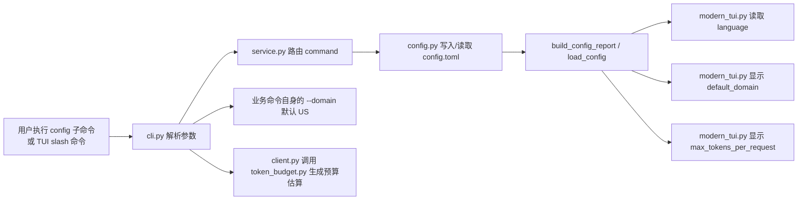
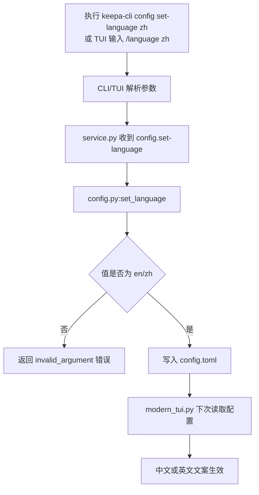
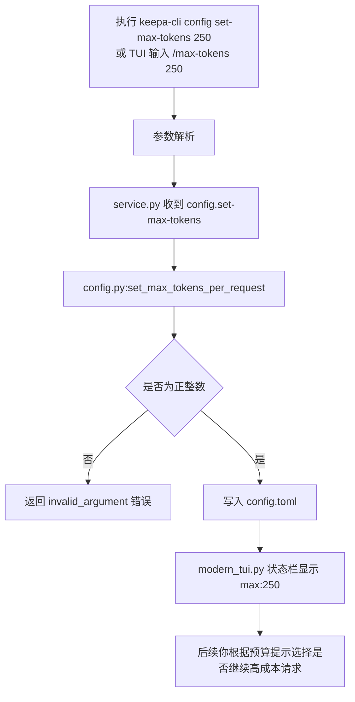

这一页只讲三个“首次配置后的微调项”：**界面语言**、**默认域名**、**单次请求 Token 预算上限**。对初学者来说，可以把它们理解为三类不同层级的设置：语言影响 TUI 文案显示；默认域名是配置文件中的默认站点值；`max_tokens_per_request` 是本地保存的预算阈值，用来表达你愿意接受的单次请求成本范围。它们都属于本地配置文件内容，并由 `config` 子命令写入或读取。Sources: [config.py](keepa_cli/config.py#L18-L24) [cli.py](keepa_cli/cli.py#L64-L82) [service.py](keepa_cli/service.py#L522-L571)

如果你还没完成 Token 基础配置，建议先读 [Keepa Token 配置、环境变量优先级与本地配置文件位置](5-keepa-token-pei-zhi-huan-jing-bian-liang-you-xian-ji-yu-ben-di-pei-zhi-wen-jian-wei-zhi)；配置完成后，下一步最自然的是继续读 [使用 doctor 命令检查认证、离线能力与运行环境](7-shi-yong-doctor-ming-ling-jian-cha-ren-zheng-chi-xian-neng-li-yu-yun-xing-huan-jing)。Sources: [cli.py](keepa_cli/cli.py#L59-L82)

## 先建立一个正确心智模型

这三个设置并不是同一种东西。`language` 只接受 `en` 或 `zh`，它直接决定现代 TUI 的文案语言和命令目录标签。`default_domain` 在默认配置里是 `US`，并且会被写进 `config.toml`。`max_tokens_per_request` 默认是 `20`，要求为正整数，也会被写进配置文件。Sources: [config.py](keepa_cli/config.py#L18-L24) [config.py](keepa_cli/config.py#L46-L57) [config.py](keepa_cli/config.py#L158-L216)

从代码职责上看，配置模块只负责**保存与加载**，服务层负责把 `config.set-language`、`config.set-max-tokens` 之类命令路由到对应函数，TUI 再消费这些配置值来改变显示行为。也就是说，这一页讨论的是“本地配置如何被读取和使用”，不是 Keepa 远端 API 本身的行为。Sources: [config.py](keepa_cli/config.py#L60-L100) [service.py](keepa_cli/service.py#L548-L571) [modern_tui.py](keepa_cli/ui/modern_tui.py#L126-L146)

## 三个设置分别解决什么问题

| 设置项 | 默认值 | 合法值/格式 | 主要作用 | 当前已验证的直接使用位置 |
|---|---:|---|---|---|
| `language` | `en` | `en` / `zh` | 切换现代 TUI 文案语言 | 启动提示、命令目录、状态栏语言显示 |
| `default_domain` | `US` | 配置默认写入为 `US` | 表示默认站点配置值 | 配置报告、TUI 状态栏显示 |
| `max_tokens_per_request` | `20` | 正整数 | 表示单次请求预算上限提示值 | 配置保存、TUI 启动提示、状态栏显示 |

Sources: [config.py](keepa_cli/config.py#L18-L24) [config.py](keepa_cli/config.py#L158-L216) [modern_tui.py](keepa_cli/ui/modern_tui.py#L32-L95) [modern_tui.py](keepa_cli/ui/modern_tui.py#L486-L521)

有一个对新手很重要的边界：仓库当前明确提供了 `config set-language` 和 `config set-max-tokens` 两个写入命令，但**没有同级的 `config set-domain` 命令**。同时，CLI 中大量业务命令自身把 `--domain` 的默认值直接定义为 `US`。因此，`default_domain` 目前是一个可持久化、可展示的配置值，但你不应把它理解成“所有命令都会自动从配置里继承域名”。这一点从配置模块、TUI 状态栏读取位置，以及 CLI 参数默认值可以直接验证。Sources: [cli.py](keepa_cli/cli.py#L96-L162) [config.py](keepa_cli/config.py#L18-L24) [modern_tui.py](keepa_cli/ui/modern_tui.py#L486-L504)

## 相关代码在项目中的位置

```text
keepa_cli/
├── config.py          # 默认配置、配置文件加载、set-language、set-max-tokens
├── domains.py         # Keepa/Amazon 域名别名与归一化表
├── token_budget.py    # 本地 token 预算估算器
├── service.py         # config.* 命令的统一路由入口
├── cli.py             # config 子命令与业务命令 --domain 默认值
└── ui/
    ├── modern_tui.py  # 语言文本、状态栏、启动提示
    └── tui.py         # /language 与 /max-tokens slash 命令映射
```

这个结构说明了一件事：**配置值、域名映射、预算估算是分开的**。`config.py` 不懂 Keepa API 细节，`domains.py` 不读配置文件，`token_budget.py` 只做本地估算；真正把它们串起来的是 CLI、service 和 TUI。Sources: [config.py](keepa_cli/config.py#L1-L5) [domains.py](keepa_cli/domains.py#L1-L5) [token_budget.py](keepa_cli/token_budget.py#L1-L6) [service.py](keepa_cli/service.py#L522-L571) [tui.py](keepa_cli/ui/tui.py#L223-L230)

## 配置是如何流动的

先看整体关系图。阅读这个 Mermaid 图时，可以把左边当作“你输入的命令”，中间当作“本地配置存取”，右边当作“界面显示与请求预算表现”。



这个图里最关键的结论是：**语言和预算上限的“可见效果”主要发生在 TUI；真实请求的预算估算则由 `client.py` 调用 `token_budget.py` 生成**。而 `default_domain` 目前的可验证用途主要是配置默认值和 TUI 状态栏展示，不是统一替换所有命令的 `--domain` 默认参数。Sources: [cli.py](keepa_cli/cli.py#L64-L82) [service.py](keepa_cli/service.py#L522-L571) [modern_tui.py](keepa_cli/ui/modern_tui.py#L132-L146) [modern_tui.py](keepa_cli/ui/modern_tui.py#L486-L521) [client.py](keepa_cli/client.py#L80-L89)

## 语言切换：你实际会看到什么变化

语言切换通过 `config set-language` 实现，CLI 参数被限制为 `en` 或 `zh`。服务层接到 `config.set-language` 后，会调用 `set_language()`；该函数会先把输入转成小写，再校验是否属于 `{"en", "zh"}`，最后写回配置文件。非法值会抛出 `ValueError`。Sources: [cli.py](keepa_cli/cli.py#L75-L78) [service.py](keepa_cli/service.py#L548-L559) [config.py](keepa_cli/config.py#L158-L184)

现代 TUI 并不会读取系统语言，而是读取配置报告中的 `language` 字段，并通过 `_language()` 规范成 `en` 或 `zh`。随后，`TEXT` 字典中的文案会切换成英文或中文，包括欢迎语、提示语、命令标签和配置分组名称。Sources: [modern_tui.py](keepa_cli/ui/modern_tui.py#L32-L95) [modern_tui.py](keepa_cli/ui/modern_tui.py#L122-L138) [modern_tui.py](keepa_cli/ui/modern_tui.py#L511-L537)

在交互层里，`/language zh` 这样的 slash 命令会被经典 TUI 解析器 `_slash_to_command()` 映射为 `config.set-language`，所以无论你从 CLI 还是 TUI 入口改语言，落点都是同一个服务命令。这保证了配置行为的一致性。Sources: [tui.py](keepa_cli/ui/tui.py#L223-L230) [service.py](keepa_cli/service.py#L548-L559) [tests/test_modern_tui.py](tests/test_modern_tui.py#L94-L109)

### 语言切换流程图



这个流程适合新手记忆：**先写配置，后由 TUI 读取并生效**。它不是“运行时即时翻译器”，而是“持久化配置 + 启动/刷新时读取”。Sources: [config.py](keepa_cli/config.py#L158-L184) [service.py](keepa_cli/service.py#L548-L559) [modern_tui.py](keepa_cli/ui/modern_tui.py#L126-L138) [modern_tui.py](keepa_cli/ui/modern_tui.py#L511-L521)

## 默认域名：当前代码里它是什么，不是什么

`default_domain` 在默认配置里固定为 `"US"`，`render_config_toml()` 也总会把它写进 TOML 内容。因此，执行 `config init` 后，你会在生成的配置文件中看到 `default_domain = "US"`。Sources: [config.py](keepa_cli/config.py#L18-L24) [config.py](keepa_cli/config.py#L46-L57) [config.py](keepa_cli/config.py#L103-L119)

域名本身的可选值并不是随意字符串，而是由 `domains.py` 中的静态表维护。每个域名都有 `code`、`domain_id`、`locale` 和 `amazon_host`，例如 `US` 对应 `1`、`com` 和 `amazon.com`。`resolve_domain()` 支持把 `US`、`1`、`com`、`amazon.com` 这样的输入归一化成同一个 `DomainInfo`。Sources: [domains.py](keepa_cli/domains.py#L13-L25) [domains.py](keepa_cli/domains.py#L39-L60)

但就当前已验证代码而言，`default_domain` 的直接消费位置主要是现代 TUI 的状态栏显示：状态栏会显示认证状态、`default_domain`、`max_tokens_per_request` 和语言。与此同时，很多业务命令在 CLI 解析层直接把 `--domain` 的默认值写成了 `"US"`。这意味着你在阅读代码时，应把“配置里的默认域名”和“命令参数默认值”分开看。Sources: [modern_tui.py](keepa_cli/ui/modern_tui.py#L486-L504) [cli.py](keepa_cli/cli.py#L96-L162)

下面这张表可以帮助你避免误解：

| 你看到的东西 | 当前代码中的含义 |
|---|---|
| `default_domain = "US"` 出现在 `config.toml` | 本地配置默认值，会进入配置报告，也会出现在现代 TUI 状态栏 |
| `domains list` | 列出受支持的 Keepa/Amazon 域名映射 |
| 业务命令的 `--domain` 默认值 | 在 CLI 解析器中逐个定义，已验证示例大量使用 `US` |
| `resolve_domain("com")` 之类能力 | 域名归一化工具能力，不等于自动读取配置默认域名 |

Sources: [config.py](keepa_cli/config.py#L18-L24) [service.py](keepa_cli/service.py#L505-L511) [domains.py](keepa_cli/domains.py#L52-L64) [cli.py](keepa_cli/cli.py#L96-L162)

## 单次请求 Token 预算：它保存的是什么

`max_tokens_per_request` 是默认配置的一部分，默认值是 `20`。`set_max_tokens_per_request()` 会把输入转成整数，并要求它必须大于 `0`，否则抛出 `ValueError`。所以这是一个**本地预算阈值配置**，不是从 Keepa 服务器读取出来的实时 token bucket。Sources: [config.py](keepa_cli/config.py#L18-L24) [config.py](keepa_cli/config.py#L187-L216)

真正的请求成本估算由 `token_budget.py` 完成。它根据命令类型和参数生成 `estimated_tokens`、`worst_case_tokens`、`requires_confirmation` 等字段；`client.py` 在构建请求规格后立即调用这个估算器，并把结果放进 JSON envelope 的 `token_bucket.estimated` 里，即使是 `--dry-run` 也会包含这份估算。Sources: [token_budget.py](keepa_cli/token_budget.py#L25-L37) [token_budget.py](keepa_cli/token_budget.py#L176-L231) [client.py](keepa_cli/client.py#L80-L103)

对初学者最实用的理解是：`max_tokens_per_request` 代表“你希望单次请求别太贵”，而 `token_budget.py` 代表“系统对当前命令实际会有多贵的本地估算”。二者相关，但不是同一个字段，也不是同一个模块负责。Sources: [config.py](keepa_cli/config.py#L187-L216) [token_budget.py](keepa_cli/token_budget.py#L61-L143) [client.py](keepa_cli/client.py#L80-L89)

### 常见命令的本地预算估算示例

| 命令 | 估算规则摘要 | 何时需要确认 |
|---|---|---|
| `products.get` | 每个产品基础 1 token | 默认不需要 |
| `products.get --offers 20` | 在基础成本上叠加 offer page 成本，每页 6 token | 需要 |
| `products.get --update 0` | `estimated` 不加，但 `worst_case` 可能多出每产品 1 token | 需要 |
| `bestsellers.get` | 固定估算 50 token | 需要 |
| `history.trend` | 按 ASIN 数计数 | 默认不需要 |

Sources: [token_budget.py](keepa_cli/token_budget.py#L61-L143) [token_budget.py](keepa_cli/token_budget.py#L189-L223) [tests/test_token_budget.py](tests/test_token_budget.py#L14-L70)

### 预算设置流程图



这张图有一个刻意保留的边界：它没有声称这个值会直接修改 `token_budget.py` 的计算公式，因为当前可验证代码并没有这样做。已验证的是它会被保存、显示，并作为“预算提示”的配置值存在。Sources: [config.py](keepa_cli/config.py#L187-L216) [service.py](keepa_cli/service.py#L560-L571) [modern_tui.py](keepa_cli/ui/modern_tui.py#L486-L504)

## 你可以直接使用的命令

下面是这一页对应的最小命令集，全部来自当前 CLI 解析器定义：

| 目标 | 命令 |
|---|---|
| 查看当前有效配置 | `keepa-cli config show --json` |
| 生成默认配置文件 | `keepa-cli config init --dry-run` |
| 切换到中文界面 | `keepa-cli config set-language zh` |
| 切回英文界面 | `keepa-cli config set-language en` |
| 设置单次请求预算为 250 | `keepa-cli config set-max-tokens 250` |
| 查看支持的域名映射 | `keepa-cli domains list --json` |

Sources: [cli.py](keepa_cli/cli.py#L64-L86) [service.py](keepa_cli/service.py#L505-L571)

如果你使用的是现代 TUI，对应的 slash 命令更短：`/language zh`、`/max-tokens 250`、`/domains`、`/config`。测试已经验证这些快捷命令会映射到正确的服务命令。Sources: [tui.py](keepa_cli/ui/tui.py#L221-L230) [tests/test_modern_tui.py](tests/test_modern_tui.py#L77-L109)

## 配置文件前后对比

下面这个对比最适合第一次配置的人。左边是默认生成内容，右边是你切换中文并把预算调到 250 之后的典型结果。

| 场景 | `config.toml` 片段 |
|---|---|
| 初始默认 | `default_domain = "US"`<br>`language = "en"`<br>`cache_ttl_seconds = 3600`<br>`max_tokens_per_request = 20` |
| 调整后 | `default_domain = "US"`<br>`language = "zh"`<br>`cache_ttl_seconds = 3600`<br>`max_tokens_per_request = 250` |

Sources: [config.py](keepa_cli/config.py#L46-L57) [tests/test_config.py](tests/test_config.py#L55-L62) [tests/test_cli.py](tests/test_cli.py#L79-L105)

## 常见报错与排查

| 现象 | 原因 | 处理方式 |
|---|---|---|
| `language must be one of: en, zh` | 语言值不是 `en` 或 `zh` | 只使用 `en` / `zh` |
| `max_tokens_per_request must be a positive integer` | 预算值为 `0`、负数或非数字 | 改成正整数，如 `250` |
| 你改了 `default_domain`，但命令仍按 `US` 跑 | 当前可验证代码里，业务命令大量直接把 `--domain` 默认值设为 `US` | 显式传 `--domain`，并结合 `domains list` 查看支持值 |

Sources: [config.py](keepa_cli/config.py#L165-L167) [config.py](keepa_cli/config.py#L194-L199) [cli.py](keepa_cli/cli.py#L96-L162) [domains.py](keepa_cli/domains.py#L63-L64)

## 测试已经验证了哪些行为

测试明确覆盖了四类关键事实：默认配置报告里 `language` 是 `en`、`default_domain` 是 `US`；`set_language("zh")` 会持久化；`set_max_tokens_per_request("250")` 会持久化；CLI 层的 `config set-language zh` 与 `config set-max-tokens 250` 都会把对应值写入文件。对初学者来说，这意味着这页讲到的核心行为都不是猜测，而是有测试支撑的。Sources: [tests/test_config.py](tests/test_config.py#L24-L120) [tests/test_cli.py](tests/test_cli.py#L79-L105)

## 推荐的下一步阅读

如果你刚完成这些细化设置，下一步最合理的是运行健康检查，因此建议继续读 [使用 doctor 命令检查认证、离线能力与运行环境](7-shi-yong-doctor-ming-ling-jian-cha-ren-zheng-chi-xian-neng-li-yu-yun-xing-huan-jing)。如果你想马上在不消耗真实成本的前提下体验命令形状，则接着读 [fixture 与 dry-run：零成本试用真实工作流形状](8-fixture-yu-dry-run-ling-cheng-ben-shi-yong-zhen-shi-gong-zuo-liu-xing-zhuang)。Sources: [cli.py](keepa_cli/cli.py#L59-L82) [client.py](keepa_cli/client.py#L90-L118)