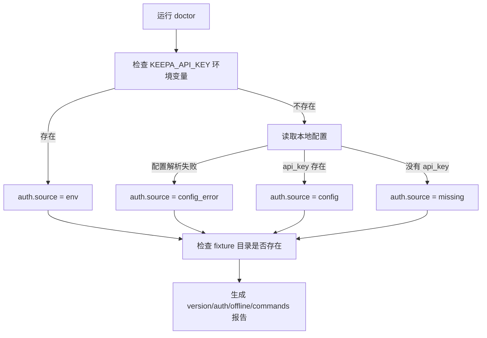
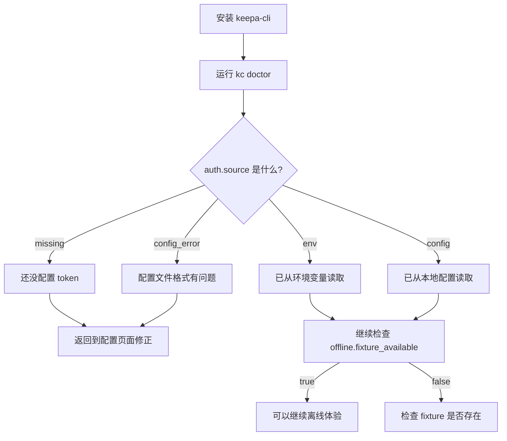

`doctor` 是 keepa-cli 中最轻量的自检入口：它**不访问 Keepa API**，只汇总当前版本、认证来源、离线 fixture 是否可用，以及命令入口是否要求保持一致，适合在你第一次安装、第一次配置 token、或准备进入离线演练前先跑一遍。对于初学者，它的价值不是“修复问题”，而是**先把当前环境状态说清楚**。Sources: [keepa_cli/doctor.py](keepa_cli/doctor.py#L1-L54) [keepa_cli/capabilities.py](keepa_cli/capabilities.py#L19-L21) [keepa_cli/service.py](keepa_cli/service.py#L480-L497)

## 这个页面在文档体系中的位置

你现在位于“首次配置”中的最后一步：在完成 [Keepa Token 配置、环境变量优先级与本地配置文件位置](5-keepa-token-pei-zhi-huan-jing-bian-liang-you-xian-ji-yu-ben-di-pei-zhi-wen-jian-wei-zhi) 与 [语言切换、默认域名与单次请求 Token 预算设置](6-yu-yan-qie-huan-mo-ren-yu-ming-yu-dan-ci-qing-qiu-token-yu-suan-she-zhi) 之后，用 `doctor` 验证配置是否“被系统看见”；接下来如果你想零成本体验命令形状，最自然的下一页是 [fixture 与 dry-run：零成本试用真实工作流形状](8-fixture-yu-dry-run-ling-cheng-ben-shi-yong-zhen-shi-gong-zuo-liu-xing-zhuang)。Sources: [keepa_cli/doctor.py](keepa_cli/doctor.py#L33-L53) [keepa_cli/config.py](keepa_cli/config.py#L29-L43)

## 先理解：doctor 实际检查了什么

`doctor` 返回的数据结构很小，核心只有四块：`version`、`auth`、`offline`、`commands`。其中 `auth` 只报告“有没有凭据、来自哪里”；`offline` 只报告 fixture 是否可用以及离线模式是否需要认证；`commands` 则声明主命令是 `keepa-cli`、别名是 `kc`，并明确两者需要保持行为一致。它不会回显 token，也不会尝试发起真实请求。Sources: [keepa_cli/doctor.py](keepa_cli/doctor.py#L21-L53)



上面的流程图对应 `doctor` 的真实判断顺序：**先看环境变量，再看配置文件，最后判断 fixture 是否存在**。这意味着如果你同时配置了环境变量和本地配置，`doctor` 会把认证来源判定为 `env`，不会继续把配置文件当作最终来源。Sources: [keepa_cli/doctor.py](keepa_cli/doctor.py#L21-L30) [tests/test_doctor.py](tests/test_doctor.py#L64-L77)

## 最常用的运行方式

对初学者来说，最直接的入口就是下面三种：`keepa-cli doctor`、`kc doctor`，以及给 Agent 或脚本使用的 `kc --json doctor`。CLI 解析器把 `doctor` 注册成独立子命令，而服务层会把结果包进统一的 JSON envelope 中返回。Sources: [keepa_cli/cli.py](keepa_cli/cli.py#L47-L60) [keepa_cli/cli.py](keepa_cli/cli.py#L203-L210) [keepa_cli/service.py](keepa_cli/service.py#L490-L497) [keepa_cli/envelope.py](keepa_cli/envelope.py#L15-L28)

| 入口方式 | 适合谁 | 结果形态 | 是否访问 Keepa API |
|---|---|---|---|
| `keepa-cli doctor` | 终端用户 | 普通 CLI 输出或内部统一结果 | 否 |
| `kc doctor` | 想用短命令的用户 | 与 `keepa-cli doctor` 等价 | 否 |
| `kc --json doctor` | 脚本、自动化、Agent | 稳定 JSON envelope | 否 |
| `{"id":"1","method":"doctor","params":{}} \| kc --stdio` | 长会话 Agent | JSON Lines 响应 | 否 |

Sources: [keepa_cli/doctor.py](keepa_cli/doctor.py#L33-L53) [keepa_cli/cli.py](keepa_cli/cli.py#L47-L60) [README.zh-CN.md](README.zh-CN.md#L176-L185)

## 一步一步：如何用 doctor 做首次环境核对

第一次运行 `doctor` 时，你可以把它当成一个“三问清单”：**版本对不对、认证有没有、离线资源在不在**。如果这三项都符合预期，你后面再去跑 fixture 或 live 命令时，排错成本会低很多。Sources: [keepa_cli/doctor.py](keepa_cli/doctor.py#L41-L53)



### 第 1 步：直接运行 doctor

如果你刚装完工具，先运行 `kc doctor` 或 `keepa-cli doctor`。这个命令本身不需要 token，也不要求网络，因此你可以在“完全离线”的状态下安全执行。Sources: [keepa_cli/capabilities.py](keepa_cli/capabilities.py#L19-L21) [keepa_cli/doctor.py](keepa_cli/doctor.py#L33-L53)

### 第 2 步：看 `auth.source`

`auth.source` 是最关键的字段。它有四种可验证状态：`env` 表示来自 `KEEPA_API_KEY` 环境变量；`config` 表示来自本地配置文件中的 `api_key`；`missing` 表示两边都没有；`config_error` 表示配置文件存在但解析失败。Sources: [keepa_cli/doctor.py](keepa_cli/doctor.py#L21-L30) [tests/test_doctor.py](tests/test_doctor.py#L18-L23) [tests/test_doctor.py](tests/test_doctor.py#L42-L63)

### 第 3 步：看 `offline.fixture_available`

`offline.fixture_available` 反映的是本地是否存在可用于离线体验的 fixture 目录。`doctor` 的判断规则非常直接：只要包内 `keepa_cli/fixtures` 存在，或者工作目录下的 `tests/fixtures` 存在，就会标记为 `true`。Sources: [keepa_cli/doctor.py](keepa_cli/doctor.py#L18-L20) [keepa_cli/doctor.py](keepa_cli/doctor.py#L38-L47)

### 第 4 步：看 `commands` 是否正常

`doctor` 还会返回一个固定的命令入口说明：主入口是 `keepa-cli`，别名是 `kc`，并且 `parity_required` 为 `True`。这不是运行时探测 PATH 的结果，而是工具明确公开的入口约定，方便你确认文档、脚本和团队说明是否使用了同一套命名。Sources: [keepa_cli/doctor.py](keepa_cli/doctor.py#L48-L52)

## doctor 返回值怎么读

下面这张表可以把 `doctor` 的输出字段和你的行动对应起来。Sources: [keepa_cli/doctor.py](keepa_cli/doctor.py#L41-L53) [tests/test_doctor.py](tests/test_doctor.py#L18-L77)

| 字段 | 含义 | 常见值 | 你应该怎么理解 |
|---|---|---|---|
| `version` | 当前 keepa-cli 版本 | 版本字符串 | 先确认你运行的是预期版本 |
| `auth.available` | 是否找到可用认证 | `true` / `false` | 仅说明“有无”，不说明是否真的能成功访问 API |
| `auth.source` | 认证来源 | `env` / `config` / `missing` / `config_error` | 最常用的排错入口 |
| `auth.error` | 配置文件错误详情 | 错误对象或不存在 | 只在 `config_error` 时出现 |
| `offline.fixture_available` | 是否有离线 fixture | `true` / `false` | 决定你能否直接进入离线示例 |
| `offline.auth_required` | 离线是否需要认证 | `false` | 说明离线体验不依赖 token |
| `commands.primary` | 主命令入口 | `keepa-cli` | 文档与脚本优先使用它 |
| `commands.alias` | 短别名 | `kc` | 日常手输更方便 |
| `commands.parity_required` | 两入口是否要求一致 | `true` | 两个入口应视作等价 |

Sources: [keepa_cli/doctor.py](keepa_cli/doctor.py#L41-L53)

## 认证来源的优先级：为什么 doctor 很适合排错

`doctor` 的认证判断顺序与 live 请求取 key 的优先级保持一致：**环境变量优先，其次配置文件**。因此，当你觉得“明明写了配置，为什么运行结果不像预期”时，先看 `doctor` 的 `auth.source`，往往就能判断是不是环境变量覆盖了本地配置。Sources: [keepa_cli/doctor.py](keepa_cli/doctor.py#L21-L30) [keepa_cli/client.py](keepa_cli/client.py#L108-L118) [tests/test_doctor.py](tests/test_doctor.py#L64-L77)

## 它检查认证，但不会泄露认证

`doctor` 的一个重要安全特征是：**它只报告来源，不报告明文值**。测试明确覆盖了环境变量和配置文件两种场景，并验证返回结果中不会出现真实 secret；即使配置文件损坏，它也只返回结构化错误信息，而不是把敏感内容原样抛出。Sources: [tests/test_doctor.py](tests/test_doctor.py#L26-L40) [tests/test_doctor.py](tests/test_doctor.py#L42-L77) [keepa_cli/config.py](keepa_cli/config.py#L86-L100) [keepa_cli/envelope.py](keepa_cli/envelope.py#L31-L55)

## 配置文件损坏时，doctor 会告诉你“错在哪里”

如果本地配置文件无法被 TOML 解析，`doctor` 不会崩溃，而是把 `auth.source` 标记为 `config_error`，并在 `auth.error.kind` 中给出 `toml_decode_error`。这对初学者很实用，因为你不需要先去理解整个配置系统，只要看到这个字段，就知道问题在“配置文件格式”而不是“网络”或“API 权限”。Sources: [keepa_cli/doctor.py](keepa_cli/doctor.py#L25-L30) [keepa_cli/config.py](keepa_cli/config.py#L60-L83) [tests/test_doctor.py](tests/test_doctor.py#L53-L63)

## doctor 与离线体验的关系

`doctor` 虽然不直接运行 fixture，但它专门暴露了 `offline.fixture_available` 和 `offline.auth_required = false`，这等于在告诉你：**即使还没拿到 token，也可以先走离线路径**。这也是为什么它特别适合作为“首次配置”阶段的收尾命令。Sources: [keepa_cli/doctor.py](keepa_cli/doctor.py#L41-L47) [keepa_cli/capabilities.py](keepa_cli/capabilities.py#L19-L21)

## 在 TUI 里，doctor 也是第一层状态面板的一部分

经典 TUI 启动时会主动调用 `run_command("doctor")`，把 `auth`、`fixture` 和 `version` 做成欢迎面板；现代 TUI 也把 `/doctor` 作为命令目录中的“Inspect”入口。换句话说，`doctor` 不只是一个 CLI 子命令，还是界面层用来建立“当前环境感知”的基础数据源。Sources: [keepa_cli/ui/tui.py](keepa_cli/ui/tui.py#L74-L87) [keepa_cli/ui/tui.py](keepa_cli/ui/tui.py#L89-L139) [keepa_cli/ui/modern_tui.py](keepa_cli/ui/modern_tui.py#L136-L146) [keepa_cli/ui/modern_tui.py](keepa_cli/ui/modern_tui.py#L341-L353)

## 一个最小的项目结构视图：doctor 依赖哪些模块

从代码依赖上看，`doctor` 很克制：它只依赖版本号、配置读取和路径判断，然后由服务层统一包成成功 envelope。没有 HTTP 客户端、没有网络请求、也没有缓存参与。Sources: [keepa_cli/doctor.py](keepa_cli/doctor.py#L8-L18) [keepa_cli/service.py](keepa_cli/service.py#L490-L497) [keepa_cli/envelope.py](keepa_cli/envelope.py#L15-L28)

```text
keepa_cli/
├── doctor.py          # 生成 doctor 报告
├── config.py          # 读取配置、处理配置错误
├── service.py         # run_command("doctor") 的统一入口
├── cli.py             # 注册 doctor 子命令
├── ui/
│   ├── tui.py         # 启动时显示 doctor 摘要
│   └── modern_tui.py  # /doctor 命令与摘要展示
└── fixtures/          # doctor 用于判断离线资源是否存在
```

Sources: [keepa_cli/doctor.py](keepa_cli/doctor.py#L18-L20) [keepa_cli/cli.py](keepa_cli/cli.py#L47-L60) [keepa_cli/service.py](keepa_cli/service.py#L490-L497) [keepa_cli/ui/tui.py](keepa_cli/ui/tui.py#L74-L87) [keepa_cli/ui/modern_tui.py](keepa_cli/ui/modern_tui.py#L136-L146)

## 常见结果与处理建议

对新手来说，`doctor` 的结果通常可以直接映射成行动，不需要先读完整源码。Sources: [keepa_cli/doctor.py](keepa_cli/doctor.py#L21-L53) [tests/test_doctor.py](tests/test_doctor.py#L18-L77)

| 看到的结果 | 说明 | 下一步 |
|---|---|---|
| `auth.source = missing` | 还没有可用认证 | 回到 [Keepa Token 配置、环境变量优先级与本地配置文件位置](5-keepa-token-pei-zhi-huan-jing-bian-liang-you-xian-ji-yu-ben-di-pei-zhi-wen-jian-wei-zhi) |
| `auth.source = env` | 正在使用环境变量中的 key | 如果这是你的预期，就可以继续 |
| `auth.source = config` | 正在使用本地配置文件中的 key | 如果你希望长期本机使用，这是正常状态 |
| `auth.source = config_error` | 配置文件无法解析 | 先修配置格式，再重新运行 `doctor` |
| `offline.fixture_available = true` | 可以直接做离线体验 | 继续看 [fixture 与 dry-run：零成本试用真实工作流形状](8-fixture-yu-dry-run-ling-cheng-ben-shi-yong-zhen-shi-gong-zuo-liu-xing-zhuang) |
| `offline.fixture_available = false` | 当前环境没有可识别 fixture | 如果你只想验证安装，这不是致命问题；如果你想离线演练，就先准备 fixture |

Sources: [keepa_cli/doctor.py](keepa_cli/doctor.py#L21-L53) [tests/test_doctor.py](tests/test_doctor.py#L18-L63)

## 一组“运行前 / 运行后”的理解对照

很多初学者在跑 `doctor` 前会把它想成“联网测试”或“账号有效性检测”，但这并不是它的职责。更准确地说，它是**本地运行环境感知器**。Sources: [keepa_cli/doctor.py](keepa_cli/doctor.py#L1-L6) [keepa_cli/capabilities.py](keepa_cli/capabilities.py#L19-L21)

| 运行前的误解 | 运行后的正确理解 |
|---|---|
| “doctor 会帮我验证 Keepa API 是否可用” | `doctor` 只检查本地认证来源和离线资源，不发真实请求 |
| “doctor 会把 token 打出来给我确认” | `doctor` 故意不回显密钥，测试也验证了这一点 |
| “没有 token 就不能运行 doctor” | `doctor` 不需要 token，缺失认证也会正常返回报告 |
| “doctor 失败说明程序坏了” | 更多时候只是说明认证缺失或配置格式错误 |

Sources: [tests/test_doctor.py](tests/test_doctor.py#L18-L40) [tests/test_doctor.py](tests/test_doctor.py#L53-L63) [keepa_cli/client.py](keepa_cli/client.py#L108-L118)

## 推荐阅读顺序

如果你刚完成这一步，下一条最顺的路径是先去 [fixture 与 dry-run：零成本试用真实工作流形状](8-fixture-yu-dry-run-ling-cheng-ben-shi-yong-zhen-shi-gong-zuo-liu-xing-zhuang)，因为 `doctor` 已经帮你确认了是否具备离线演练条件；如果你想立刻跑几个真实但低风险的示例，则继续看 [产品、历史、榜单与 Finder 的最小可运行示例](9-chan-pin-li-shi-bang-dan-yu-finder-de-zui-xiao-ke-yun-xing-shi-li)。若你关心 `doctor` 为什么能被 CLI、TUI、stdio 共用，再回头看 [高层架构总览：CLI、TUI、stdio、MCP 共用同一命令服务](14-gao-ceng-jia-gou-zong-lan-cli-tui-stdio-mcp-gong-yong-tong-ming-ling-fu-wu)。Sources: [keepa_cli/service.py](keepa_cli/service.py#L480-L497) [keepa_cli/ui/tui.py](keepa_cli/ui/tui.py#L74-L87) [README.zh-CN.md](README.zh-CN.md#L176-L185)