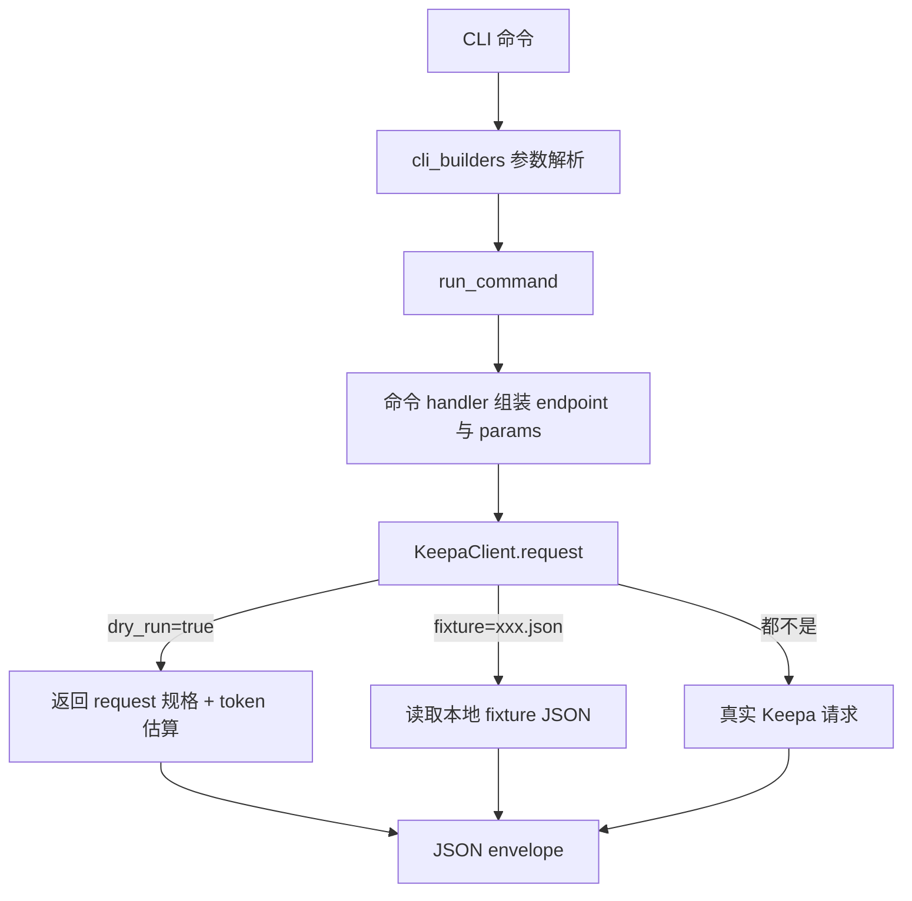
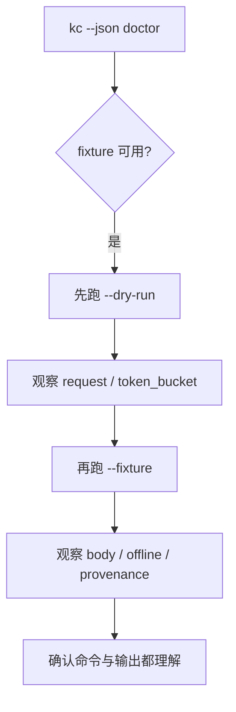

这一页只回答一个初学者最关心的问题：**在还没有配置 Keepa Token，或者暂时不想花任何真实 token 的前提下，怎样先把 Keepa CLI 的命令形状、输出结构和工作流节奏跑通一遍。**这个仓库明确把 `dry-run` 和 `fixture` 作为离线优先能力：前者只生成“将要发出的请求规格”，后者直接重放本地 JSON 响应，两者都不会访问 Keepa，也不会消耗 token。Sources: [README.zh-CN.md](README.zh-CN.md#L14-L15), [keepa_cli/client.py](keepa_cli/client.py#L62-L107)

## 先抓住区别：dry-run 看“请求长什么样”，fixture 看“响应长什么样”

如果把一次 Keepa 命令想成“准备请求 → 发请求 → 拿响应”三步，那么 **`dry-run` 停在第一步**，返回一个成功 envelope，里面有 `request` 和估算出来的 `token_bucket`，并明确标记 `data.dry_run = true`；而 **`fixture` 直接跳到第三步**，从本地 fixture 文件读取 JSON，返回 `data.offline = true`、`data.fixture = <文件名>` 以及本地重放出来的 `body`。对新手来说，这意味着：想先确认“命令参数有没有拼对”，用 `dry-run`；想先体验“真实结果字段会长什么样”，用 `fixture`。Sources: [keepa_cli/client.py](keepa_cli/client.py#L80-L107), [keepa_cli/client.py](keepa_cli/client.py#L148-L189)

| 方式 | 是否访问 Keepa | 是否需要 Token | 主要看到什么 | 最适合的阶段 |
|---|---|---:|---|---|
| `--dry-run` | 否 | 否 | 请求规格、估算 token、provenance | 刚学命令、检查参数 |
| `--fixture <file>` | 否 | 否 | 本地重放的响应 body、offline 标记 | 学输出结构、写脚本、做演示 |
| 真实 live 请求 | 是 | 是 | 实时 Keepa 数据 | 已确认参数与流程后 |

Sources: [README.zh-CN.md](README.zh-CN.md#L99-L114), [keepa_cli/client.py](keepa_cli/client.py#L90-L107), [keepa_cli/client.py](keepa_cli/client.py#L148-L189)

## 它在系统里的位置：两条离线路径都走同一个服务内核

先看图，再看结论。下面这张图展示的是：**CLI 输入并不会直接决定网络行为，而是统一进入 `run_command`，最后由 `KeepaClient.request()` 根据 `dry_run` 或 `fixture` 分流。**这也是为什么你可以先用离线方式把命令练熟，之后再无缝切换到真实请求。Sources: [keepa_cli/service.py](keepa_cli/service.py#L572-L599), [keepa_cli/client.py](keepa_cli/client.py#L62-L107)



从代码上看，命令行层会把 `--dry-run` 和 `--fixture` 透传到 service；service 再把这些参数交给 `KeepaClient.request()`；客户端内部先构造统一的 request spec 和预算估算，然后优先判断 `dry_run`，其次判断 `fixture`，最后才进入真实网络请求路径。这种顺序说明：**离线体验不是测试旁路，而是正式执行链中的一等公民。**Sources: [keepa_cli/cli_builders/products.py](keepa_cli/cli_builders/products.py#L20-L53), [keepa_cli/service.py](keepa_cli/service.py#L64-L74), [keepa_cli/client.py](keepa_cli/client.py#L78-L107)

## 3 分钟上手路径：建议你按这个顺序试

下面这个流程适合第一次接触项目的人：先用 `doctor` 确认离线条件，再用 `dry-run` 理解请求，再用 `fixture` 理解返回体，最后再决定要不要进入真实请求。这个顺序和仓库“离线优先”的设计是一致的。Sources: [keepa_cli/doctor.py](keepa_cli/doctor.py#L33-L53), [README.zh-CN.md](README.zh-CN.md#L99-L114)



第 1 步，先执行 `kc --json doctor`。`doctor` 报告会同时告诉你认证来源和 `offline.fixture_available`，而且明确标记离线模式 `auth_required = false`。也就是说，即使完全没有 Token，只要 fixture 可用，你仍然可以开始体验命令。Sources: [keepa_cli/doctor.py](keepa_cli/doctor.py#L33-L53), [tests/test_doctor.py](tests/test_doctor.py#L18-L25)

第 2 步，用 `--dry-run` 先看“这条命令究竟要请求哪个 Keepa endpoint、会带哪些参数、预算估算是多少”。例如 README 就建议把高成本请求先 dry-run，像 `bestsellers get` 和 `finder query` 都可以先只看请求规格，不真正发出请求。Sources: [README.zh-CN.md](README.zh-CN.md#L109-L114), [keepa_cli/client.py](keepa_cli/client.py#L90-L103)

第 3 步，再换成 `--fixture` 看“如果真的拿到结果，响应体字段会是什么样”。README 已经给出产品、摘要、历史、token 状态等多个离线例子，适合直接复制。Sources: [README.zh-CN.md](README.zh-CN.md#L99-L107)

## 你可以直接复制的最小示例

下面这张表只选当前页面最有代表性的离线命令：它们都来自项目 README 或 argparse 定义，适合新手先跑通心智模型，再进入后续页面的更完整示例。Sources: [README.zh-CN.md](README.zh-CN.md#L99-L114), [keepa_cli/cli_builders/products.py](keepa_cli/cli_builders/products.py#L20-L52), [keepa_cli/cli_builders/history.py](keepa_cli/cli_builders/history.py#L21-L39), [keepa_cli/cli_builders/finder.py](keepa_cli/cli_builders/finder.py#L20-L27)

| 目标 | 命令 | 你会学到什么 |
|---|---|---|
| 看产品请求形状 | `kc --json products by-code 9780786222728 --domain US --code-limit 5 --dry-run` | `products.get` 的请求参数如何生成 |
| 看真实产品响应形状 | `kc --json products get B001GZ6QEC --domain US --history 0 --fixture product_B001GZ6QEC.json` | `/product` 响应 body 长什么样 |
| 看 Agent 摘要形状 | `kc --json products summary B0D8W1YVBX --domain US --fixture product_agent_view_B0TEST.json` | 原始大对象如何收敛成稳定摘要 |
| 看历史趋势输出 | `kc --json history trend B001GZ6QEC --series amazon --fixture product_history_B001GZ6QEC.json` | 历史数据如何被解析成趋势 |
| 看 token 状态输出 | `kc --json tokens status --fixture token_status.json` | 非产品接口也能离线重放 |
| 先演练高成本 Finder | `kc --json finder query --selection-file keepa_cli/fixtures/finder_selection.json --domain US --dry-run --max-tokens 25` | 先确认高成本命令的预算与参数 |

Sources: [README.zh-CN.md](README.zh-CN.md#L99-L114)

## 一个命令，两种看法：先 dry-run，再 fixture

对初学者最有效的学习法，不是一次性读很多说明，而是把同一类命令连跑两次：**第一次用 `--dry-run` 看 request，第二次用 `--fixture` 看 body。**这样你会自然建立“输入参数如何映射到输出结构”的联系。Sources: [keepa_cli/client.py](keepa_cli/client.py#L80-L107), [keepa_cli/client.py](keepa_cli/client.py#L148-L189)

| 阶段 | 命令写法 | 重点字段 |
|---|---|---|
| Before：只看请求 | `kc --json products get B001GZ6QEC --domain US --history 0 --dry-run` | `request.endpoint`、`request.params_redacted`、`token_bucket.estimated` |
| After：看离线响应 | `kc --json products get B001GZ6QEC --domain US --history 0 --fixture product_B001GZ6QEC.json` | `data.offline`、`data.fixture`、`data.body`、`data.cache_provenance` |

Sources: [keepa_cli/client.py](keepa_cli/client.py#L90-L103), [keepa_cli/client.py](keepa_cli/client.py#L173-L189)

以 `products.get` 为例，测试已经验证：当传入 `fixture` 时，请求仍然会被规范化成正式的 `/product` endpoint，请求参数中的 `domain` 会被转换成 Keepa 所需的 `"1"`，同时响应里仍然保留预算估算和产品结果。换句话说，**fixture 不是随便打印一个假 JSON，而是在真实命令路径上重放本地结果。**Sources: [tests/test_service_commands.py](tests/test_service_commands.py#L19-L40)

## 你在输出里最该看的 4 个位置

第一，`request`。这是 `dry-run` 最核心的价值，因为它让你在不联网的情况下看到 endpoint、参数和脱敏后的请求内容。若你正在学习 CLI 语法，这一段比最终业务字段更重要。Sources: [keepa_cli/client.py](keepa_cli/client.py#L80-L103)

第二，`token_bucket.estimated`。客户端在进入任何路径前都会先做预算估算，所以即便只是 dry-run 或 fixture，你也能先知道这类请求大概属于低成本还是高成本。README 也明确建议把高成本请求先 dry-run。Sources: [keepa_cli/client.py](keepa_cli/client.py#L87-L103), [README.zh-CN.md](README.zh-CN.md#L109-L114)

第三，`data.offline` / `data.dry_run` / `data.fixture`。它们分别告诉你这次结果到底是离线重放、请求预演，还是来自某个具体 fixture 文件。这些标记非常适合脚本自动判断当前结果能不能被当作真实数据继续向后处理。Sources: [keepa_cli/client.py](keepa_cli/client.py#L90-L103), [keepa_cli/client.py](keepa_cli/client.py#L175-L186)

第四，`data.cache_provenance`。无论是 dry-run 还是 fixture，系统都会附带 provenance，明确标出来源是 `"dry-run"` 还是 `"fixture"`，并在 fixture 场景下记录具体文件名。这让离线演示、测试和后续审计都更稳定。Sources: [keepa_cli/client.py](keepa_cli/client.py#L95-L100), [keepa_cli/client.py](keepa_cli/client.py#L180-L185)

## 为什么高成本命令更应该先 dry-run

项目里有一个很实用的保护逻辑：当请求预算被判断为“需要显式确认”时，只要你用了 `dry_run`、`fixture` 或显式 `yes`，就不会被确认门禁拦住；否则会返回 `confirmation_required` 错误，并提示用 `--yes` 继续。这个设计的初心非常直接：**先让你离线审阅成本，再决定是否真的花 token。**Sources: [keepa_cli/commands/common.py](keepa_cli/commands/common.py#L98-L115)

这也是为什么像 Finder、Deals、榜单这类更容易被拿去做批量研究的命令，CLI 都显式支持 `--dry-run` 和 `--fixture`。也就是说，仓库并不是只给“简单命令”做离线体验，而是把离线演练推广到了真正有成本风险的工作流入口。Sources: [keepa_cli/cli_builders/finder.py](keepa_cli/cli_builders/finder.py#L20-L27), [keepa_cli/cli_builders/deals.py](keepa_cli/cli_builders/deals.py#L20-L26), [keepa_cli/cli_builders/categories.py](keepa_cli/cli_builders/categories.py#L43-L54)

## fixture 文件放在哪里，为什么有两份

对使用者来说，最重要的事实是：默认 fixture 目录位于包内 `keepa_cli/fixtures`，而 `doctor` 会检查包内目录或 `tests/fixtures` 是否存在，从而判断离线能力是否可用。Sources: [keepa_cli/service.py](keepa_cli/service.py#L61-L61), [keepa_cli/doctor.py](keepa_cli/doctor.py#L18-L19), [keepa_cli/doctor.py](keepa_cli/doctor.py#L38-L46)

对项目维护来说，fixture 之所以常见为两份，是因为仓库有一个专门的同步检查脚本，会比较 `tests/fixtures` 与 `keepa_cli/fixtures` 中的 JSON 文件是否缺失或内容不一致。这样做的意义是：**测试用到的离线数据，必须和最终打包进 CLI 的离线数据保持一致。**Sources: [scripts/check_fixture_sync.py](scripts/check_fixture_sync.py#L23-L40), [scripts/check_fixture_sync.py](scripts/check_fixture_sync.py#L43-L59)

下面这个结构图只强调当前页面相关的离线资产，不扩展到别的主题。你不需要先理解全部代码，只要知道：**包内有可分发 fixture，测试里有校验 fixture，一旦两边漂移就有工具兜底。**Sources: [scripts/check_fixture_sync.py](scripts/check_fixture_sync.py#L43-L59), [tests/test_project_tools.py](tests/test_project_tools.py#L23-L42)

```text
keepa_cli/
└── fixtures/        # CLI 运行时默认离线 fixture

tests/
└── fixtures/        # 测试使用并校验同步的 fixture
```

## fixture 不只是“样例数据”，而是可重复的工作流素材

`build_batch_asins()` 这类本地工作流函数会把 `fixture` 和 `dry_run` 继续写入任务参数中，说明它们不仅服务于单条命令，也服务于更大一点的批处理计划。也就是说，你可以先离线生成一个“长得像真实任务”的计划文件，再把整条工作流理解清楚。Sources: [keepa_cli/workflows.py](keepa_cli/workflows.py#L194-L223)

如果你是第一次接触这套工具，这一点很关键：**fixture 的价值不是“替代真实数据做玩具演示”，而是“让你在零成本条件下，先摸清真实工作流会传什么参数、产出什么结构、如何串联下一步”。**这正对应 README 里“dry-run 和 fixture 不访问 Keepa，也不消耗 token”的定位。Sources: [README.zh-CN.md](README.zh-CN.md#L14-L15), [keepa_cli/workflows.py](keepa_cli/workflows.py#L194-L223)

## 常见问题速查

| 现象 | 说明 | 你该怎么做 |
|---|---|---|
| `doctor` 显示没有认证 | 正常，离线模式不要求 Token | 继续使用 `--dry-run` 或 `--fixture` |
| `fixture_not_found` | 指定的 fixture 文件不存在 | 检查文件名是否与内置 JSON 一致 |
| 高成本命令提示确认 | 你在走真实请求路径 | 先改成 `--dry-run`，确认后再决定是否 `--yes` |
| 想看二进制图像却报输出路径错误 | live 图像下载要求 `--out` | 当前页先用 `--dry-run` 或 `--fixture` 学流程 |

Sources: [keepa_cli/doctor.py](keepa_cli/doctor.py#L41-L47), [keepa_cli/client.py](keepa_cli/client.py#L163-L171), [keepa_cli/commands/common.py](keepa_cli/commands/common.py#L98-L115), [keepa_cli/service.py](keepa_cli/service.py#L116-L135)

再补一个容易忽略的点：`doctor` 的测试明确保证，当你传入显式空环境时，它不会偷偷读取真实系统里的 `KEEPA_API_KEY`；而检测到环境变量或配置文件认证时，也不会泄露明文密钥。所以即便你现在是在“离线练手”阶段，也可以放心先用 `doctor` 观察环境状态。Sources: [tests/test_doctor.py](tests/test_doctor.py#L26-L40), [tests/test_doctor.py](tests/test_doctor.py#L42-L77)

## 这一页学完后，下一步看哪里

如果你已经会用 fixture 和 dry-run 试跑命令，最顺的下一步是去看 [产品、历史、榜单与 Finder 的最小可运行示例](9-chan-pin-li-shi-bang-dan-yu-finder-de-zui-xiao-ke-yun-xing-shi-li)，因为那一页会把这一页讲清楚的离线机制，扩展成更具体的命令组合。Sources: [README.zh-CN.md](README.zh-CN.md#L99-L114)

如果你已经想把多个离线结果串成本地批处理或报告，再继续阅读 [本地批处理、报告生成与浏览快照工作流](10-ben-di-pi-chu-li-bao-gao-sheng-cheng-yu-liu-lan-kuai-zhao-gong-zuo-liu)。若你还没跑过环境自检，则建议先回看 [使用 doctor 命令检查认证、离线能力与运行环境](7-shi-yong-doctor-ming-ling-jian-cha-ren-zheng-chi-xian-neng-li-yu-yun-xing-huan-jing)。Sources: [keepa_cli/doctor.py](keepa_cli/doctor.py#L33-L53), [keepa_cli/workflows.py](keepa_cli/workflows.py#L194-L223)