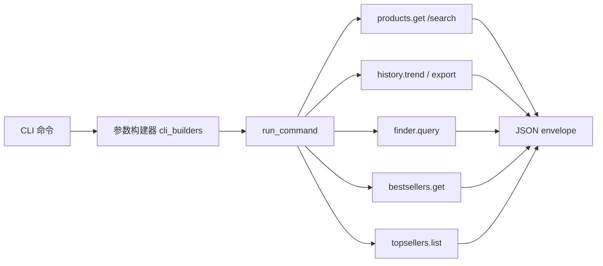
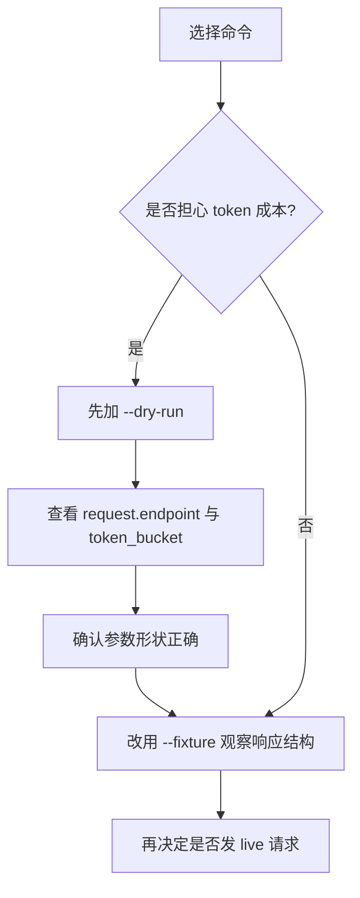
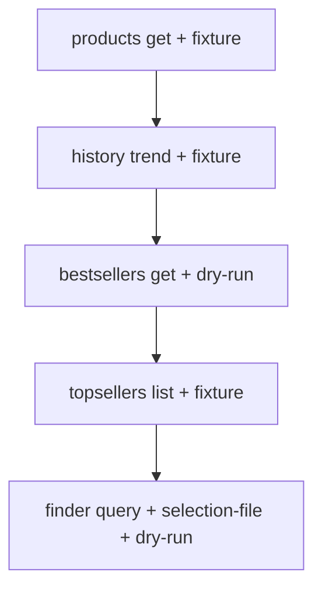

这一页只做一件事：用**最小命令**带你跑通 Keepa CLI 中最常见的四类离线或低风险体验——**产品详情**、**历史趋势**、**榜单查询**与 **Finder 选品**。这些例子都已经在 README、CLI 参数层、服务层或测试中出现，因此你看到的不是“建议写法”，而是仓库里已经被代码和测试验证过的可运行形状。读完后，你应该能迅速判断：什么时候用 fixture，什么时候先 dry-run，哪些命令只是生成请求规格，哪些命令会返回稳定的 JSON envelope。 Sources: [README.zh-CN.md](README.zh-CN.md#L97-L115) [keepa_cli/cli_builders/products.py](keepa_cli/cli_builders/products.py#L17-L53) [keepa_cli/cli_builders/history.py](keepa_cli/cli_builders/history.py#L17-L40) [keepa_cli/cli_builders/finder.py](keepa_cli/cli_builders/finder.py#L17-L27) [keepa_cli/cli.py](keepa_cli/cli.py#L108-L126)

## 你现在处在什么位置

你当前位于“立即可用的离线体验”这一组页面中的第 9 页，目标不是解释底层架构，而是给出**立刻能复制执行**的命令模板。如果你还没完成安装、Token 配置或 doctor 检查，建议先回到 [双入口安装方式：Python 包与 npm 包装器](3-shuang-ru-kou-an-zhuang-fang-shi-python-bao-yu-npm-bao-zhuang-qi)、[Keepa Token 配置、环境变量优先级与本地配置文件位置](5-keepa-token-pei-zhi-huan-jing-bian-liang-you-xian-ji-yu-ben-di-pei-zhi-wen-jian-wei-zhi) 与 [使用 doctor 命令检查认证、离线能力与运行环境](7-shi-yong-doctor-ming-ling-jian-cha-ren-zheng-chi-xian-neng-li-yu-yun-xing-huan-jing)。如果你已经理解 fixture 与 dry-run 的总体思路，这一页就是把它们落到四种典型命令上。 Sources: [README.zh-CN.md](README.zh-CN.md#L25-L55) [README.zh-CN.md](README.zh-CN.md#L97-L115)

## 先建立一个最小心智模型

这四类示例虽然看起来不同，但执行路径很一致：**CLI 解析参数 → 调用统一的 `run_command` → 进入具体命令处理器 → 选择 fixture / dry-run / live 请求 → 返回 JSON envelope**。你可以把它理解成“同一个外壳，包住不同的 Keepa endpoint 和本地后处理逻辑”。产品命令最终走 `/product` 或 `/search`，历史命令先走 `/product` 再做本地分析，Finder 走 `/query`，Best Sellers 走 `/bestsellers`，Top Sellers 走 `/topseller`。 Sources: [keepa_cli/cli_builders/products.py](keepa_cli/cli_builders/products.py#L100-L200) [keepa_cli/commands/products.py](keepa_cli/commands/products.py#L38-L152) [keepa_cli/commands/history.py](keepa_cli/commands/history.py#L59-L189) [keepa_cli/commands/finder.py](keepa_cli/commands/finder.py#L17-L27) [keepa_cli/service.py](keepa_cli/service.py#L242-L351)


Sources: [keepa_cli/cli_builders/products.py](keepa_cli/cli_builders/products.py#L17-L99) [keepa_cli/cli_builders/history.py](keepa_cli/cli_builders/history.py#L17-L42) [keepa_cli/cli_builders/finder.py](keepa_cli/cli_builders/finder.py#L17-L29) [keepa_cli/cli.py](keepa_cli/cli.py#L203-L331)

## 这页会用到的最小文件集合

为了跑通这页中的示例，你实际上只需要几个 fixture 文件和一个 Finder selection 文件。产品详情使用 `product_B001GZ6QEC.json`，历史趋势使用 `product_history_B001GZ6QEC.json`，Best Sellers 使用 `bestsellers_home.json`，Top Sellers 使用 `topsellers_US.json`，Finder 则读取 `finder_selection.json`。这些文件在 `tests/fixtures` 与包内 `keepa_cli/fixtures` 中都有对应版本，测试也直接消费它们。 Sources: [tests/fixtures/product_B001GZ6QEC.json](tests/fixtures/product_B001GZ6QEC.json#L1-L14) [tests/fixtures/product_history_B001GZ6QEC.json](tests/fixtures/product_history_B001GZ6QEC.json#L1-L20) [tests/fixtures/bestsellers_home.json](tests/fixtures/bestsellers_home.json#L1-L11) [tests/fixtures/topsellers_US.json](tests/fixtures/topsellers_US.json#L1-L15) [tests/fixtures/finder_selection.json](tests/fixtures/finder_selection.json#L1-L9)

```text
最小示例文件
.
├─ tests/
│  └─ fixtures/
│     ├─ product_B001GZ6QEC.json
│     ├─ product_history_B001GZ6QEC.json
│     ├─ bestsellers_home.json
│     ├─ topsellers_US.json
│     └─ finder_selection.json
└─ keepa_cli/
   └─ fixtures/
      ├─ bestsellers_home.json
      ├─ topsellers_US.json
      └─ finder_selection.json
```
Sources: [tests/fixtures/product_B001GZ6QEC.json](tests/fixtures/product_B001GZ6QEC.json#L1-L14) [tests/fixtures/product_history_B001GZ6QEC.json](tests/fixtures/product_history_B001GZ6QEC.json#L1-L20) [tests/fixtures/bestsellers_home.json](tests/fixtures/bestsellers_home.json#L1-L11) [tests/fixtures/topsellers_US.json](tests/fixtures/topsellers_US.json#L1-L15) [keepa_cli/fixtures/finder_selection.json](keepa_cli/fixtures/finder_selection.json#L1-L9)

## 四类最小示例一览

下面这张表先帮你选命令。核心区别只有两个：**输入是什么**，以及**返回的是原始 Keepa 数据还是本地分析结果**。产品详情和榜单更偏“查看响应”；历史趋势更偏“从响应中做分析”；Finder 更偏“把 selection 变成查询请求”。 Sources: [keepa_cli/commands/products.py](keepa_cli/commands/products.py#L38-L152) [keepa_cli/commands/history.py](keepa_cli/commands/history.py#L139-L189) [keepa_cli/commands/selection.py](keepa_cli/commands/selection.py#L56-L88) [keepa_cli/service.py](keepa_cli/service.py#L242-L351)

| 场景 | 最小命令 | 输入核心 | 主要 endpoint | 离线方式 | 输出重点 |
|---|---|---|---|---|---|
| 产品详情 | `products get B001GZ6QEC --fixture product_B001GZ6QEC.json` | ASIN | `/product` | fixture | `data.body.products` |
| 历史趋势 | `history trend B001GZ6QEC --fixture product_history_B001GZ6QEC.json` | ASIN + series | `/product` + 本地分析 | fixture | `data.analysis` |
| Best Sellers | `bestsellers get 172282 --dry-run` 或 `--fixture bestsellers_home.json` | category id | `/bestsellers` | dry-run / fixture | 请求规格或 `bestSellersList` |
| Top Sellers | `topsellers list --fixture topsellers_US.json` | domain / category | `/topseller` | fixture | `data.body.topSellers` |
| Finder | `finder query --selection-file tests/fixtures/finder_selection.json --dry-run --max-tokens 25` | selection JSON | `/query` | dry-run | 请求规格 + token 估算 |

Sources: [README.zh-CN.md](README.zh-CN.md#L99-L115) [tests/test_cli.py](tests/test_cli.py#L107-L127) [tests/test_cli.py](tests/test_cli.py#L334-L375) [tests/test_cli.py](tests/test_cli.py#L440-L456) [tests/test_phase8_high_value_commands.py](tests/test_phase8_high_value_commands.py#L199-L214)

## 从“只看请求规格”到“读取 fixture 响应”的最短路径

如果你不确定某个命令是否昂贵，最稳妥的顺序永远是：**先 dry-run 看请求和预算，再切到 fixture 看响应形状，最后才考虑 live**。这一点在 README 的 Best Sellers 和 Finder 示例里写得非常直接；测试里也验证了 dry-run 会返回 endpoint 与 token 估算，而 fixture 则能返回结构化 body。 Sources: [README.zh-CN.md](README.zh-CN.md#L109-L115) [tests/test_cli.py](tests/test_cli.py#L355-L375) [tests/test_cli.py](tests/test_cli.py#L440-L456) [tests/test_phase8_high_value_commands.py](tests/test_phase8_high_value_commands.py#L92-L108)


Sources: [README.zh-CN.md](README.zh-CN.md#L99-L115) [keepa_cli/commands/selection.py](keepa_cli/commands/selection.py#L66-L87) [keepa_cli/service.py](keepa_cli/service.py#L242-L351)

## 示例 1：产品详情的最小可运行命令

最小产品示例直接来自 README 和 CLI 测试：它使用一个离线 fixture 模拟 `/product` 返回。命令中的 `--history 0` 说明这次只要产品主体信息，不需要历史 csv，因此更适合第一次确认 envelope 结构。测试验证了这个命令会成功返回 `products.get`，endpoint 为 `/product`，并且第一条产品的 ASIN 确实是 `B001GZ6QEC`。 Sources: [README.zh-CN.md](README.zh-CN.md#L101-L106) [tests/test_cli.py](tests/test_cli.py#L107-L127) [tests/fixtures/product_B001GZ6QEC.json](tests/fixtures/product_B001GZ6QEC.json#L1-L14)

```powershell
kc --json products get B001GZ6QEC --domain US --history 0 --fixture product_B001GZ6QEC.json
```
Sources: [README.zh-CN.md](README.zh-CN.md#L101-L106) [tests/test_cli.py](tests/test_cli.py#L107-L127)

`products get` 的关键点是：CLI 层只负责收集 `asin`、`domain`、`history` 等参数，真正的请求在命令处理器中被转换成 `/product` 请求；如果你不启用 `--agent-view` 或 `--view agent`，默认看到的是原始响应包裹后的 body。也就是说，这个最小示例最适合用来学习 **envelope 外层字段** 和 **Keepa 原始 product body 的位置**。 Sources: [keepa_cli/cli_builders/products.py](keepa_cli/cli_builders/products.py#L20-L53) [keepa_cli/commands/products.py](keepa_cli/commands/products.py#L38-L88)

## 示例 2：产品摘要模式与原始模式的最小差异

如果你已经确认 `/product` 的响应存在，下一步常常不是继续看原始 body，而是切换到更稳定的 Agent 视图。仓库同时提供了 `products summary` 子命令，它本质上仍然调用 `products.get`，但会强制 `agent_view=True`，再用 `build_agent_product_view` 生成摘要结构。README 已给出最小命令。 Sources: [README.zh-CN.md](README.zh-CN.md#L101-L106) [keepa_cli/cli_builders/products.py](keepa_cli/cli_builders/products.py#L87-L97) [keepa_cli/cli_builders/products.py](keepa_cli/cli_builders/products.py#L187-L205) [keepa_cli/commands/products.py](keepa_cli/commands/products.py#L64-L88)

```powershell
kc --json products summary B0D8W1YVBX --domain US --fixture product_agent_view_B0TEST.json
```
Sources: [README.zh-CN.md](README.zh-CN.md#L101-L106)

| 对比项 | 原始产品模式 | 摘要模式 |
|---|---|---|
| 命令 | `products get` | `products summary` |
| 请求核心 | `/product` | 仍然是 `/product` |
| 默认关注点 | `data.body.products` | Agent-safe 摘要 |
| 适合用途 | 校验原始字段、排查接口形状 | 做后续程序消费、降低大 body 复杂度 |

Sources: [keepa_cli/cli_builders/products.py](keepa_cli/cli_builders/products.py#L20-L53) [keepa_cli/cli_builders/products.py](keepa_cli/cli_builders/products.py#L87-L97) [keepa_cli/commands/products.py](keepa_cli/commands/products.py#L64-L88)

## 示例 3：历史趋势的最小可运行命令

历史趋势命令与产品详情的差异在于：它不会直接把 `/product` body 原样交给你，而是先强制请求 `history=1`，然后从产品中的 `csv` 字段提取历史序列，再调用本地分析函数生成 `data.analysis`。因此，历史命令最小示例必须使用包含 `csv` 的 fixture，这就是 `product_history_B001GZ6QEC.json` 的作用。 Sources: [README.zh-CN.md](README.zh-CN.md#L103-L106) [keepa_cli/commands/history.py](keepa_cli/commands/history.py#L59-L85) [keepa_cli/commands/history.py](keepa_cli/commands/history.py#L166-L189) [tests/fixtures/product_history_B001GZ6QEC.json](tests/fixtures/product_history_B001GZ6QEC.json#L1-L20)

```powershell
kc --json history trend B001GZ6QEC --series amazon --fixture product_history_B001GZ6QEC.json
```
Sources: [README.zh-CN.md](README.zh-CN.md#L103-L106)

测试验证了更完整的版本：传入 `--window-days 30` 后，命令返回成功，且 `analysis.series.amazon.all_time.points` 为 3。这说明最小历史示例不仅能跑通，而且确实完成了“读取 csv → 展开点序列 → 做趋势分析”的整条本地处理链。 Sources: [tests/test_cli.py](tests/test_cli.py#L334-L353) [keepa_cli/commands/history.py](keepa_cli/commands/history.py#L88-L136) [keepa_cli/commands/history.py](keepa_cli/commands/history.py#L177-L189)

## 产品详情与历史趋势：运行前后差异

很多初次使用者会把 `products get --history 1` 和 `history trend` 混在一起。两者都能接触历史数据，但职责不同：前者是“请求更多原始字段”，后者是“对历史字段做本地解读”。这个区分非常重要，因为它决定你是想看原始 Keepa 结构，还是想直接拿分析结论。 Sources: [keepa_cli/commands/products.py](keepa_cli/commands/products.py#L54-L88) [keepa_cli/commands/history.py](keepa_cli/commands/history.py#L139-L189)

| 目的 | 更适合的命令 | 输出特征 |
|---|---|---|
| 看商品主体字段 | `products get ... --history 0` | 原始 `body.products` |
| 看商品带历史的原始响应 | `products get ... --history 1` | 原始 `body.products[*].csv` |
| 直接拿趋势分析 | `history trend ...` | `data.analysis` |
| 导出行级历史 | `history export ...` | `data.rows` 或文件输出 |

Sources: [keepa_cli/cli_builders/products.py](keepa_cli/cli_builders/products.py#L20-L53) [keepa_cli/cli_builders/history.py](keepa_cli/cli_builders/history.py#L21-L40) [keepa_cli/commands/history.py](keepa_cli/commands/history.py#L139-L189)

## 示例 4：Best Sellers 榜单，先从 dry-run 开始

榜单命令里，Best Sellers 是最适合演示“先看预算再决定是否执行”的例子。README 明确给出 `bestsellers get 172282 --dry-run`，而测试进一步验证这个命令的 endpoint 是 `/bestsellers`，估算 token 为 50。也就是说，即使你没有 Token，或者暂时不想真正访问 Keepa，仍然可以先确认 category id、endpoint 和成本提示是否符合预期。 Sources: [README.zh-CN.md](README.zh-CN.md#L109-L115) [tests/test_cli.py](tests/test_cli.py#L440-L456) [tests/test_phase8_high_value_commands.py](tests/test_phase8_high_value_commands.py#L92-L108)

```powershell
kc --json bestsellers get 172282 --domain US --dry-run
```
Sources: [README.zh-CN.md](README.zh-CN.md#L109-L115)

如果你想继续看离线响应形状，可以改用榜单 fixture。CLI 里 `bestsellers get` 会把参数交给 `run_command("bestsellers.get", ...)`，服务层最终调用 `/bestsellers`，并在成功时从 `bestSellersList.asinList` 派生出候选 ASIN 和一个 research graph。fixture 文件中就包含 category `172282` 和两个示例 ASIN。 Sources: [keepa_cli/cli.py](keepa_cli/cli.py#L303-L316) [keepa_cli/service.py](keepa_cli/service.py#L242-L285) [tests/fixtures/bestsellers_home.json](tests/fixtures/bestsellers_home.json#L1-L11)

```powershell
kc --json bestsellers get 172282 --domain US --fixture bestsellers_home.json
```
Sources: [keepa_cli/cli.py](keepa_cli/cli.py#L303-L316) [tests/fixtures/bestsellers_home.json](tests/fixtures/bestsellers_home.json#L1-L11)

## 示例 5：Top Sellers 榜单，最小离线方式是 fixture

Top Sellers 的模式与 Best Sellers 类似，但 endpoint 不同，响应主体也不同。它走的是 `/topseller`，返回的是 `topSellers` 列表。测试显示：不带确认直接发 live 时，会得到 `confirmation_required`；而使用 `topsellers_US.json` fixture 时，则可以成功写出离线结果，并生成 seller 维度的 research graph。 Sources: [keepa_cli/service.py](keepa_cli/service.py#L297-L351) [tests/test_phase8_high_value_commands.py](tests/test_phase8_high_value_commands.py#L192-L214) [tests/fixtures/topsellers_US.json](tests/fixtures/topsellers_US.json#L1-L15)

```powershell
kc --json topsellers list --domain US --fixture topsellers_US.json
```
Sources: [keepa_cli/cli.py](keepa_cli/cli.py#L318-L331) [tests/fixtures/topsellers_US.json](tests/fixtures/topsellers_US.json#L1-L15)

| 榜单类型 | 命令 | endpoint | fixture 文件 | 最小观察点 |
|---|---|---|---|---|
| Best Sellers | `bestsellers get 172282` | `/bestsellers` | `bestsellers_home.json` | `bestSellersList.asinList` |
| Top Sellers | `topsellers list` | `/topseller` | `topsellers_US.json` | `topSellers[*].sellerId` |

Sources: [keepa_cli/service.py](keepa_cli/service.py#L242-L351) [tests/fixtures/bestsellers_home.json](tests/fixtures/bestsellers_home.json#L1-L11) [tests/fixtures/topsellers_US.json](tests/fixtures/topsellers_US.json#L1-L15)

## 示例 6：Finder 的最小可运行命令

Finder 的最小示例不是传 ASIN，也不是传 category id，而是传一个 **selection JSON 文件**。CLI 构建器要求 `--selection-file` 必填，处理器会读取这个 JSON，序列化后作为 `/query` 的 `selection` 参数发送；如果你传了 `--max-tokens`，它也会进入请求参数并影响预算提示。 Sources: [keepa_cli/cli_builders/finder.py](keepa_cli/cli_builders/finder.py#L17-L27) [keepa_cli/commands/selection.py](keepa_cli/commands/selection.py#L56-L87)

```powershell
kc --json finder query --selection-file tests/fixtures/finder_selection.json --domain US --dry-run --max-tokens 25
```
Sources: [tests/test_cli.py](tests/test_cli.py#L355-L375) [README.zh-CN.md](README.zh-CN.md#L109-L115)

这个 selection 文件本身非常小，只包含销量区间、评论数下限、排序方式、分页大小与页码。因此它非常适合作为你自己的 Finder 模板起点。测试还验证了：此 dry-run 命令返回的 endpoint 是 `/query`，最坏 token 预算是 25，而默认估算值是 10，并且会标记 `requires_confirmation`。 Sources: [tests/fixtures/finder_selection.json](tests/fixtures/finder_selection.json#L1-L9) [tests/test_cli.py](tests/test_cli.py#L369-L375) [tests/test_phase8_high_value_commands.py](tests/test_phase8_high_value_commands.py#L20-L44)

## Finder 的“前后对比”：命令字符串其实只是在包装 selection JSON

Finder 最容易让人误解的一点是：看起来你执行的是一个 CLI 命令，实际上真正的业务输入是那个 selection 文件。换句话说，CLI 只是帮你把 JSON 文件加载出来，再转成请求参数。理解这一点后，你调试 Finder 的重点就不再是“命令有没有敲对”，而是“selection JSON 是否满足我的筛选意图”。 Sources: [keepa_cli/commands/selection.py](keepa_cli/commands/selection.py#L62-L87) [tests/fixtures/finder_selection.json](tests/fixtures/finder_selection.json#L1-L9)

| Before：你手里有什么 | After：CLI 实际做了什么 |
|---|---|
| `finder_selection.json` | 读取 JSON 文件 |
| `--selection-file ...` | 注入 `selection` 请求参数 |
| `--domain US` | 转换成 Keepa domain id |
| `--max-tokens 25` | 进入预算和确认逻辑 |
| `--dry-run` | 只返回请求规格，不访问 Keepa |

Sources: [keepa_cli/commands/selection.py](keepa_cli/commands/selection.py#L62-L87) [keepa_cli/cli_builders/finder.py](keepa_cli/cli_builders/finder.py#L20-L27)

## 一条从产品到历史到榜单到 Finder 的练习路线

如果你想把这一页当成 10 分钟上手练习，最顺的顺序是：**先产品，再历史，再榜单，最后 Finder**。原因很简单：产品与历史使用单个 ASIN，更容易观察 envelope 结构；榜单引入 category id 和成本提示；Finder 最后再引入 selection JSON 和确认门禁。这个顺序与 README 的“先 fixture、再 dry-run”的教学节奏是一致的。 Sources: [README.zh-CN.md](README.zh-CN.md#L97-L115) [tests/test_cli.py](tests/test_cli.py#L107-L127) [tests/test_cli.py](tests/test_cli.py#L334-L375) [tests/test_cli.py](tests/test_cli.py#L440-L456)


Sources: [README.zh-CN.md](README.zh-CN.md#L101-L115) [tests/test_phase8_high_value_commands.py](tests/test_phase8_high_value_commands.py#L20-L44) [tests/test_phase8_high_value_commands.py](tests/test_phase8_high_value_commands.py#L92-L108) [tests/test_phase8_high_value_commands.py](tests/test_phase8_high_value_commands.py#L199-L214)

## 常见问题：为什么有些命令返回 body，有些返回 analysis？

这不是风格不统一，而是命令职责不同。`products get` 的目标是“取产品”；`history trend` 的目标是“分析历史”；`finder query` 的目标是“把 selection 转成请求并返回结构化 envelope”；榜单命令则处于中间状态——既保留原始 body，又附带 research graph 和 Agent profile。只要你记住**产品偏原始、历史偏分析、Finder 偏请求、榜单偏候选列表**，就不容易迷路。 Sources: [keepa_cli/commands/products.py](keepa_cli/commands/products.py#L38-L152) [keepa_cli/commands/history.py](keepa_cli/commands/history.py#L139-L189) [keepa_cli/commands/selection.py](keepa_cli/commands/selection.py#L21-L87) [keepa_cli/service.py](keepa_cli/service.py#L252-L351)

## 最小排错表

以下问题都能在现有代码和测试里找到原因，因此排查时优先看参数而不是怀疑网络。 Sources: [keepa_cli/commands/products.py](keepa_cli/commands/products.py#L39-L47) [keepa_cli/commands/history.py](keepa_cli/commands/history.py#L64-L70) [keepa_cli/commands/history.py](keepa_cli/commands/history.py#L96-L135) [keepa_cli/cli_builders/finder.py](keepa_cli/cli_builders/finder.py#L20-L27)

| 现象 | 已验证原因 | 应对方式 |
|---|---|---|
| `products.get` 报参数错误 | `asin` 与 `code` 必须二选一 | 只传 ASIN 或只传 code |
| `history.trend` 报缺少产品或历史为空 | fixture 中没有对应产品，或选定 series 没有点 | 换成 `product_history_B001GZ6QEC.json`，并确认 `--series` |
| `finder query` 无法启动 | `--selection-file` 是必填 | 传入现成的 `tests/fixtures/finder_selection.json` |
| `topsellers.list` live 失败 | 需要显式确认高成本请求 | 先用 fixture，或先 dry-run/确认 |
| `bestsellers.get` 不想消耗 token | 榜单预算较高 | 先 `--dry-run` 看 50 token 提示 |

Sources: [keepa_cli/commands/products.py](keepa_cli/commands/products.py#L39-L47) [keepa_cli/commands/history.py](keepa_cli/commands/history.py#L96-L135) [tests/test_phase8_high_value_commands.py](tests/test_phase8_high_value_commands.py#L192-L198) [tests/test_cli.py](tests/test_cli.py#L440-L456)

## 你接下来应该读什么

如果你已经能跑通这一页的四类最小示例，下一步最自然的是两条路线。想继续停留在“离线可操作”层面，请读 [本地批处理、报告生成与浏览快照工作流](10-ben-di-pi-chu-li-bao-gao-sheng-cheng-yu-liu-lan-kuai-zhao-gong-zuo-liu)；想理解这些命令为什么能共用同一套执行内核，请继续到 [整体设计哲学：面向 Agent、离线优先、统一服务内核](13-zheng-ti-she-ji-zhe-xue-mian-xiang-agent-chi-xian-you-xian-tong-fu-wu-nei-he) 与 [高层架构总览：CLI、TUI、stdio、MCP 共用同一命令服务](14-gao-ceng-jia-gou-zong-lan-cli-tui-stdio-mcp-gong-yong-tong-ming-ling-fu-wu)。 Sources: [README.zh-CN.md](README.zh-CN.md#L116-L143) [keepa_cli/cli.py](keepa_cli/cli.py#L203-L331)